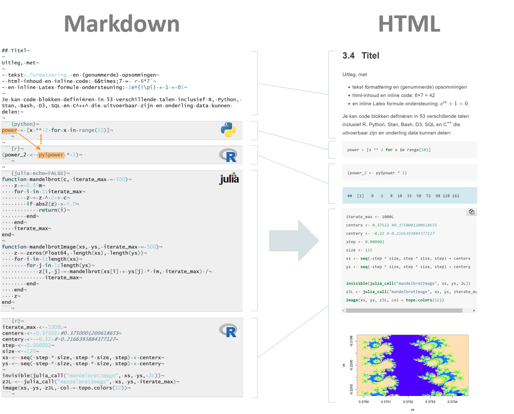

```{r include=FALSE}
library(knitr)
library(reticulate)
library(JuliaCall)

opts_chunk$set(echo = TRUE)
```

# Inleiding tot de cursus

## In een notedop

In deze cursus zullen we het erg breed domein van machinaal leren (ML; eng: _machine learning_) aansnijden. Omdat de discipline zo breed is, kunnen onmogelijk alle topics aan bod komen. In plaats daarvan is er gekozen om eerst een brede basis te verschaffen rond de begrippen en principes die belangrijk zijn voor ML om ons daarna specifiek te richten op deep learning. We gaan leren hoe computers beelden kunnen herkennen en gaan zelf aan de slag om zulke algoritmes te configureren en te gebruiken. Deze aangeleerde vaardigheid maakt van een doorsnee IT-er een beginnende datawetenschapper. Gaandeweg zullen we ons echter van bewust moeten maken dat deze vaardigheid ook een aantal verantwoordelijkheden met zich meebrengt. Het gaat dan voornamelijk rond ethisch ML en ethische artificiële intelligentie (AI).

## Leerdoelen

Hieronder, in Tabel \@ref(tab:leerdoelen),  staan de leerdoelen opgesomd zoals ze vermeld staan in de ECTS fiches voor dit opleidingsonderdeel. In de cursus zal er naar deze leerdoelen verwezen worden met vermelding van de bijhorende code.

Table: (\#tab:leerdoelen) Leerdoelen voor deze cursus

|Code|Omschrijving|
|-|-|
|EA_LD751|Begrijpt de basis principes van machine learning|
|EA_LD752|Herkent de verschillen tussen supervised, unsupervised en reinforcement learning|
|EA_LD753|Begrijpt de fundamenten achter deep learning|
|EA_LD754|Onderkent de basisprincipes van data training & Cross-validatie|
|EA_LD755|Ontwikkelt het vermogen om zelfstandig technisch-uitdagende online workshops uit te voeren|
|EA_LD756|Analyseert zelfstandig een probleemstelling met het oog op het bieden van een AI-gerelateerde oplossing|
|EA_LD757|Ontwikkelt de correcte AI strategie op basis van een probleemstelling|
|EA_LD758|Past de juiste principes toe tijdens het exploreren, hanteren en opkuisen van data|
|EA_LD759|Herkent de risico's van onvolledige en inaccurate data|
|EA_LD760|Gebruikt een diagnostische toolset om de performantie van ML modellen te meten|
|EA_LD761|Beeld complexe data uit door middel van hedendaagse visualisatie tools|
|EA_LD762|Evalueert op gepaste wijze de performantie van een algoritme.|
|EA_LD763|Rapporteert op correcte wijze de resultaten van een ML analyse|

## Cursus vorm

Deze cursus is geschreven in een versie van Markdown. Markdown is een familie van zogenaamde opmaaktalen (eng: _mark-up languages_) die ervoor zorgen dat inhoud van het document in verscheidene formaten weergegeven kan worden: PDF, HTML, &hellip;. Het loskoppelen van inhoud betekent enerzijds dat de auteur zich kan focusseren op de inhoud in plaats van de vorm. Anderzijds betekent het dat de lezer in staat is zijn de vorm van de uitvoer te bepalen, bijvoorbeeld, beter leesbaarheid, donkere achtergrond, &hellip;. Voor meer technische documenten biedt Markdown nog veel belangrijkere voordelen. Het maakt het mogelijk om code in de ene of andere taal tussen de lyrische tekst te plaatsen en uit te voeren. Met de juiste IDE (Integrated Development Environment), betekent dit dat de auteur én de lezer in staat zijn om in meerdere programmeertalen tegelijkertijd te werken! 

```{r markdown, echo=FALSE, fig.cap="(ref:markdown)"}

```

(ref:markdown) Werking van Markdown. De platte tekst (links) wordt omgezet naar een ander formaat (rechts; hier HTML) door een externe tool als [Pandoc](https://pandoc.org/). Stijl-regels worden hier automatisch uitgevoerd maar de auteur heeft de mogelijkheid ook deze in detail te configureren. Naast het scheiden van vormgeving en inhoud (hetgeen een merkelijke efficiëntie verbetering met zich meebrengt) ondersteund [R Markdown](https://rmarkdown.rstudio.com/) ook meertaligheid, i.e. meerdere programmeertalen in één document. Tussen een aantal talen is er zelfs wederzijdse uitwisseling mogelijk van de actieve variabelen (zie oranje markeringen met pijl). Het voorbeeld met de Mandelbrot fractaal is afkomstig van @mandelbrotjulia, waarvan de GitHub repository een bondige beschrijving geeft van de Mandelbrot verzameling (eng: _Mandelbrot set_) met een test die de performantie-winst van Julia t.o.v. R onderzoekt.

## Verwijzen naar deze cursus

In Bibtex-formaat:

<code>
&#64;online{dhaese2020machine-learning,<br>
&nbsp;&nbsp;&nbsp;&nbsp;author = {D'Haese, David},<br>
&nbsp;&nbsp;&nbsp;&nbsp;title = "Machine Learning",<br>
&nbsp;&nbsp;&nbsp;&nbsp;year = "2020",<br>
&nbsp;&nbsp;&nbsp;&nbsp;url = "https://ddhaese.github.io/machine-learning/",<br>
&nbsp;&nbsp;&nbsp;&nbsp;note = "[Online; accessed <span>
<script> document.write(new Date().toISOString().substring(0, 10) + ']"');</script></span>&nbsp;&nbsp;}
</code>

APA-formaat:

D’Haese, D., 2020. Machine learning [WWW Document] [Online; accessed 2020-09-14]. URL https://ddhaese.github.io/machine-learning/