```{r include=FALSE}
library(knitr)
library(data.table)
library(magrittr)
library(reticulate)

opts_chunk$set(echo = TRUE, cache = TRUE, message = FALSE, warning = FALSE)

dyad <- readRDS("r/Palette_5YR_5B_Dyad.RDS")
palette(dyad[c(9, 20, 66)])
```

# Leren uit data

## Het leerproces

```{lemma leerdoel-basisprincipes}
Begrijpt de basisprincipes van machine learning ([_EA_LD751_](#leerdoelen)).
```

```{lemma begel-vs-onbegeid}
Herkent de verschillen tussen supervised, unsupervised en reinforcement learning ([_EA_LD752_](#leerdoelen)).
```

```{lemma strategie}
Ontwikkelt de correcte AI strategie op basis van een probleemstelling ([_EA_LD757_](#leerdoelen)).
```

Machine learning (ML) is het vermogen van een algoritme om te _leren uit data_. In deze inleiding zullen we leren dat, hoewel dit een eenvoudige definitie lijkt, hier toch héél wat achter schuilt. Dus om deze definitie wat kracht bij te zetten, maken we hier meteen ons eerst kadertje voor:

```{definition def-ml}
Machine learning (ML) is het vermogen van een algoritme om te <b>leren uit data</b>.
```

De term word ook ruimer geïnterpreteerd als de discipline die zich bezighoud met het creëren van zulke algoritmen. Laten we eens filosoferen over de term _leren_ in deze stelling. Wat betekent het in feite om iets te leren? Prof. Abu-Mostafa, een gerenommeerde didacticus in deze discipline legt het in zijn boek _Learning from data_ (@learningfromdata, p.1) ongeveer zo uit:

<q>Laat een foto aan een driejarige zien en vraag de kleuter of er een boom te zien is en je krijgt bijna zeker het juiste antwoord. Vraag nu aan een dertig-jarige persoon om de definitie van een boom te geven en je krijgt vermoedelijk een onduidelijk of toch onvolledig antwoord.</q>

Hoe komt dit? Een mens leert niet wat een boom is door de wiskundige beschrijving van een boom te memoriseren maar door het beeld te associëren met het woord en de klank en door gecorrigeerd te worden telkens wanneer we een fout maken. De foto's en tekeningen, de geur, het geritsel van de bladeren, de juf die 'boom' zegt, de ouder die wijst, de vier letters op het schoolbord: dat zijn de data. Het verzamelen van al die data en classificeren ervan onder de noemer 'boom' gebeurt door onze hersenen en dat proces noemen we _leren_. Laten we dit schematisch voorstellen:

```{r leren-uit-data, fig.cap="(ref:leren-uit-data)", echo=FALSE}
include_graphics("img/leren_uit_data.png")
```

(ref:leren-uit-data) Het centraal zenuwstelsel van een mens kan leren uit data. Het concept 'boom' wordt hier met een 'gedachten-wolk' voorgesteld en komt overeen met een model van de realiteit.

Het eindpunt van het leerproces is het model. In het voorbeeld van de boom is dit model het concept of mentaal 'beeld' van een boom dat in onze hersenen achterblijft ook wanneer we niet naar een boom kijken. Dit model is een _vereenvoudigde versie_ van de werkelijkheid. Het bevat zeker naar alle wiskundige verhoudingen noch alle biologische details van één boom, laat staan van alle bomen op aarde. Toch slagen de meesten onder ons een onderscheid te maken tussen een boom en een niet-boom.

```{definition def-model}
Het eindpunt van het leerproces is een model dat een vereenvoudigde versie van de werkelijkheid kan weergeven
```

```{theorem, abumostafa, name="Yaser Abu-Mostafa"}
<br/>

_Yaser Abu-Mostafa_ is a professor Computer Science at the California Institute of Technology mentioned here for his memorable online courses on ML. See [here](https://en.wikipedia.org/wiki/Yaser_Abu-Mostafa) for more details.
```

## De evolutie van het machinaal leren

De mens is al eeuwenlang bezig met het bouwen van automaten (zogenaamde [automata](https://en.wikipedia.org/wiki/Automaton)). Een prachtig voorbeeld hiervan is de geautomatisserde [tekenaar-schrijver](https://en.wikipedia.org/wiki/Maillardet%27s_automaton) die de Zwitserse mechanieker [Henri Maillardet](https://en.wikipedia.org/wiki/Henri_Maillardet) bouwde rond 1800:

<iframe width="566" height="318" src="https://www.youtube.com/embed/C7oSFNKIlaM" frameborder="0" allow="accelerometer; autoplay; encrypted-media; gyroscope; picture-in-picture" allowfullscreen></iframe>

Hierbij ging het meestal om voorgeprogrammeerde robotten zonder enige vorm van intelligentie. Eén van de eerste vormen van meer 'intelligente' robotten waren de _machina speculatrix_ van [Grey Walters](https://en.wikipedia.org/wiki/William_Grey_Walter):

<iframe width="566" height="318[(https://en.wikipedia.org/wiki/William_Grey_Walter" src="https://www.youtube.com/embed/lLULRlmXkKo" frameborder="0" allow="accelerometer; autoplay; encrypted-media; gyroscope; picture-in-picture" allowfullscreen></iframe>

Ondertussen weten we dat er zelf-rijdende wagens, zelf-vliegende drones en zelf-varende boten bestaan:

<iframe width="566" height="318" src="https://www.youtube.com/embed/6BqY9QvFNwA" frameborder="0" allow="accelerometer; autoplay; encrypted-media; gyroscope; picture-in-picture" allowfullscreen></iframe>

## Intelligentie

ML is een onderdeel van artificiële intelligentie (AI). Er bestaan vele definities voor deze term, maar het VLEVA (Vlaams–Europees Verbindingsagentschap) maakt een duidelijk onderscheid. Zij spreken van ML wanneer patronen in data, al dan niet rechtstreeks afkomstig van sensoren, worden omgezet naar een model, zoals eerder reeds aangehaald. AI gaat een stap verder. Hier wordt er, op basis van het model en nieuwe data, werkelijk ook actie ondernomen en keuzes gemaakt. Bij ML wordt deze fase nog aan de mens overgelaten. Dus zelf-rijdende wagens behoren duidelijk tot het domein van AI, terwijl een applicatie die op basis van een paar fluittonen een melodie kan herkennen eerder thuishoort onder ML. Andere voorbeelden van ML toepassingen zijn het voorspellen van de financiële markten, beeldherkenning, geautomatiseerde medische diagnoses, enz&hellip; Dit onderscheid blijft natuurlijk erg artificieel en in sommige gevallen zal deze classificatie niet opgaan. Maar we kunnen wel zeggen:

```{definition def-ai}
De huidige vormen van artifiële intelligentie baseren bijna uitsluitend op machinaal aangeleerde modellen Dus geen AI zonder ML.
```

Maar wat betekent _intelligentie_ in feite? Volgens [Wikipedia](https://en.wikipedia.org/wiki/Intelligence) bestaat intelligentie uit meerdere capaciteiten zoals (logisch) _redeneren_, _begrijpen_, _zelfbewustzijn_, _aanleren_, _emotionele intelligentie_, _plannen_, _creatief zijn_, _kritisch denken_ en _probleemoplossing_. Voorlopig ligt de focus bij ML voornamelijk op het _aanleren_ al wordt ook op alle andere aspecten heel wat onderzoek verricht. We moeten voorlopig dus best nog bescheiden blijven met het gebruik van de term _artificiële intelligentie_. Het is ook heel belangrijk om te realiseren dat er vormen van intelligentie bestaan die erg verschillen van de menselijke intelligentie. Uiteraard wist je dat vele andere dieren aspecten van intelligentie kunnen bezitten. maar wist je ook dat er bij planten vormen van intelligentie werden vastgesteld en dit maakt het des te merkwaardiger gezien zij niet over een centraal zenuwstelsel beschikken.

<iframe  width="566" height="318" src="https://www.youtube.com/embed/MPql1VHbYl4?t=57" frameborder="0" allow="accelerometer; autoplay; clipboard-write; encrypted-media; gyroscope; picture-in-picture" allowfullscreen></iframe>

## Het model

Laten we beginnen met het eindproduct van ML. We zagen dat het eindpunt van ML het _model_ is. In tegenstelling tot wat deze term in bijvoorbeeld database management betekent, kan je het model het best beschouwen als een _functie_ $g$, ook wel de finale hypothese genoemd (final hypothesis; @learningfromdata):

$$g: \mathcal{X} \to \mathcal{Y}$$

Proberen we nu ons boom-herkenning oefening te vertalen van de menselijke wereld naar de ML wereld, kan bestaat het model uit een _functie_ die een antwoord biedt op de vraag:

<q>Wordt op deze digitale foto een boom afgebeeld?</q>

Nadat de digitale afbeelding een zekere voorbereiding (eng: _pre-processing_) doorlopen heeft, zal het bestaan uit mogelijk een set van variabelen zoals voorgesteld in figuur \@ref(fig:leren-uit-data-ml).

```{r leren-uit-data-ml, fig.cap="(ref:leren-uit-data-ml)", echo=FALSE}
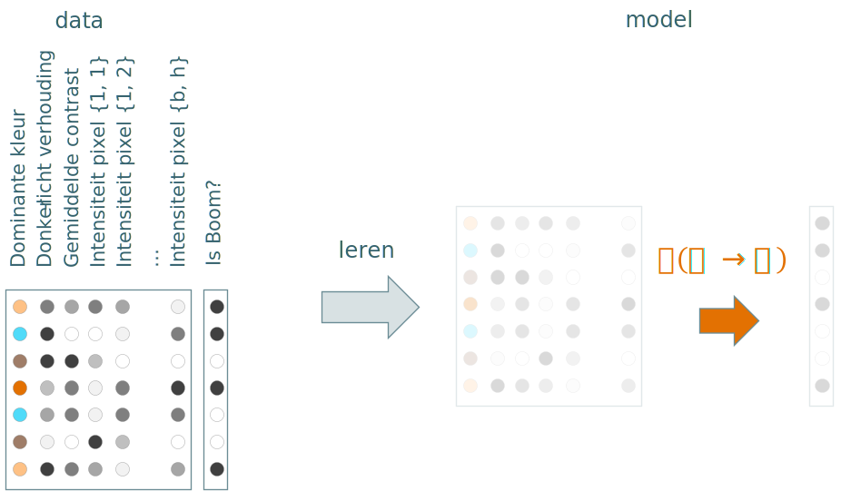
```

(ref:leren-uit-data-ml) Als we de oefening om een boom te herkennen uit figuur \@ref(fig:leren-uit-data) vertalen naar de machinale wereld krijgen we data van waaruit het algoritme een model heeft aangeleerd. Het model kunnen we hier voorstellen door middel van een functie $\hat{g}$.

$\mathcal{X}$ is hier de input en bestaat in dit voorbeeld uit allerhande variabelen die betrekking hebben op gedigitaliseerde afbeeldingen. Bijvoorbeeld, de variabele `Dominante kleur` stelt de meest frequente kleur-groep die op de afbeelding voorkomt.

$\mathcal{Y}$ is de output, de variabele die het antwoord bevat op de vraag of er al dan niet een boom wordt afgebeeld waarbij de witte en zwarte bollen overeenkomen met `ja`/`neen` of `true`/`false`.

In python zal het model dus ongeveer de volgende vereenvoudigde vorm kunnen aannemen:

```python
def model(x):
  # Some code goes here
  return y
```

en het equivalent in R is als volgt:

```r
model <- function(x_test){
  # Some code goes here
  return(y_predicted)
}
```

## Doelfunctie

Het is je misschien opgevallen dat het symbool voor het model een hoedje draagt: $\hat{g}$. Dat is geen toeval. Dat wil in feite zeggen dat het om een _geschatte_ functie gaat. Daartegenover staat de werkelijke functie $f$, de zogenaamde _doelfunctie_ (@learningfromdata). Het is belangrijk om te beseffen dat de doelfunctie $f$ in de meeste gevallen onbekend blijft! Tijdens simulaties of binnen de wetenschappelijke disciplines gebeurt het wel eens dat de $f$ gekend is, maar in de meeste gevallen waar een datawetenschapper mee te maken krijgt is dat niet het geval. Het doel is uiteraard om te proberen om met het model $\hat{g}$ de doelfunctie $f$ zo goed mogelijk te benaderen, het dat valt niet mee als $f$ onbekend is. Er zijn verscheidene optie op deze benadering tot een succes te maken. Één van deze benaderingen, diegene die we in dit hoofdstuk toepassen, noemt men het begeleid leren (eng: _supervised learning_).

```{definition def-doelfunctie}
Het doel van begeleid ML is om een model $\hat{g}$ te vinden dat de werkelijke doelfunctie $f$, die meestal onbekend blijft, zo goed mogelijk tracht te benaderen.
```


## MNIST dataset

_We gaan nu trachten de eerste ideeën rond ML te vertalen naar de praktijk. Om dit mogelijk te maken, wordt er een nieuwe probleem met bijhorende dataset voorgesteld._

Behalve het begrip 'boom' zullen de meeste peuters ook één of ander schrift aangeleerd krijgen. Hoewel gedrukte letters tegenwoordig natuurlijk domineren, wordt er nog steeds het handschrift aangeleerd (figuur \@ref(fig:alfabet)). Behalve mensen is het natuurlijk interessant mocht een computer ook handgeschreven teksten kunnen lezen zodat bijvoorbeeld historische werken gedigitaliseerd kunnen worden.

```{r alfabet, fig.cap="(ref:alfabet)", out.width="318px", echo=FALSE}

```

(ref:alfabet) Het handgeschreven alfabet zoals voorgesteld met de schrijfmethode D'Haese (geen familie).

Om dit mogelijk te maken kan men een model creëren dat in staat is om de handgeschreven karakters te herkennen. Het Amerikaanse _Modified National Institute of Standards and Technology_ biedt een [dataset](http://yann.lecun.com/exdb/mnist/) aan met foto's van handgeschreven letters en cijfers in allerlei varianten. Om de zaak te vereenvoudigen gaan we ons in dit voorbeeld beperken tot de handgeschreven cijfers (figuur \@ref(fig:mnist)). De cijfers (in de training set) zijn afkomstige van 250 schrijvers, zowel werknemers van de [Census Bureau](https://www.census.gov/) als studenten van het hoger middelbaar onderwijs.

```{r mnist, fig.cap="(ref:mnist)", echo=FALSE}
include_graphics("https://upload.wikimedia.org/wikipedia/commons/2/27/MnistExamples.png")
```

(ref:mnist) Subset van de MNIST dataset met afbeeldingen van handgeschreven cijfers. Elke geschreven karakter is een afzonderlijke afbeelding van $28\times28$ pixels. Elke afbeeldingen werd uitgeknipt uit een groter gescand document met geschreven tekst, gecentreerd en teruggebracht naar een grootte van $28\times28$. Kijk eens goed naar de variaties voor de verscheidene cijfers. Valt je iets op?

Elke afbeelding in de MNIST dataset wordt voorgesteld als een $28\times28$-matrix. Elke element van deze matrix stelt een grijswaarde voor van een pixel uit de afbeelding. Stel dat de afbeeldingen in de RGB kleurruimte zouden zijn opgeslagen, dan zou er voor elke pixel niet één maar drie waarden beschikbaar worden gemaakt.

```{r mnist-cijfer, fig.cap="(ref:mnist-cijfer)", echo=FALSE}
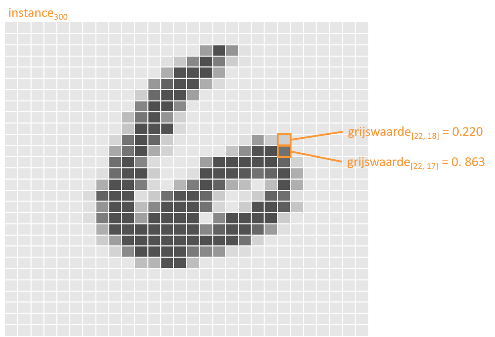
```

(ref:mnist-cijfer) Het 300^ste^ cijfer het de MNIST training-set.

Elke instantie van de input dataset (eng: _instance_) wordt dus voorgesteld door een $1\times784$-vector en de ganse input dataset kan worden voorgesteld als een $n\times784$-matrix, waarbij $n=60\,000$ de grootte van de (training-) dataset is zoals beschikbaar gemaakt door [MNIST](http://yann.lecun.com/exdb/mnist/). 

## Het resultaat van MNIST analyse

We gaan later in detail onderzoeken hoe we precies de beeldherkenning kunnen uitvoeren. Nu nemen we eerst een kortere weg naar het resultaat. Kijk even terug naar figuur \@ref(fig:leren-uit-data-ml) en herinner je dat het resultaat van een ML process een model was dat wiskundig als functie $\hat{g}$ kan worden voorgesteld. Schematisch zal onze analyse er nu uitzien zoals voorgesteld in figuur \@ref(fig:leren-uit-data-mnist). Merk hier wel op dat de cijfer-varianten in werkelijkheid bevat zitten in een 'platte' matrix is met dimensies $60\,000\times784$, een matrix dus met méér dan 47 miljoen zwevende kommagetallen (eng: _floating point_).

```{r leren-uit-data-mnist, fig.cap="(ref:leren-uit-data-mnist)", echo=FALSE}
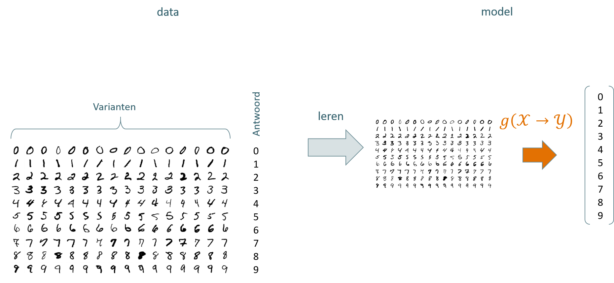
```

(ref:leren-uit-data-mnist) De schematische weergave van het leerproces voor het herkennen van handgeschreven cijfers uit de MNIST dataset.

Stellen we het model voor met de Python functie `model`, kan kunnen we dit aanroepen met één of meerdere afbeeldingen van handgeschreven cijfers:

```{python mnist-eval, eval=FALSE}
y_prd_300 = model(x_trn[299:300])
```

Hier roepen we het model aan met de 300^ste^ afbeelding uit de training-set (zie figuur \@ref(fig:mnist-cijfer)), hier voorgesteld als `x_trn[299:300]`. Het resultaat van deze oproep wordt in variabele `y_prd_300` bewaard. In wiskundige termen schrijven we $\hat{y}_{300}$, waarbij het hoedje aangeeft dat het niet de werkelijk $y$-waarde is maar de geschatte of voorspelde $y$-waarde. In theorie zou men verwachten dat de inhoud `y_prd_300` gelijk is aan `6`. Het is zeker mogelijk om `model` zo te schrijven dat dit inderdaad het geval is, maar meestal wordt er de voorkeur aan gegeven om naast de eigenlijke voorspelling ook een maat van de betrouwbaarheid van deze schatting mee te laten geven. In dit geval ziet `y_prd_300` er zo uit:

```
[[1.3147994e-08 4.3827520e-12 5.0856454e-07 1.3127689e-09 4.5237027e-07
  5.3989115e-09 9.9999893e-01 5.3377733e-09 1.6693608e-07 3.1370115e-09]]
```

Dit is iets heel anders dan `6`, wat is hier gaande? In feite bestaat het model uit de kans dat de aangeleverde afbeelding overeenkomt met één van de 10 mogelijke uitkomsten, namelijk de cijfers 0 tot en met 9:

|Cijfer|$p(instantie=cijfer|beeld)$|
|-|-|
|0|1.3147994e-08|
|1|4.3827520e-12|
|2|5.0856454e-07|
|3|1.3127689e-09|
|4|4.5237027e-07|
|5|5.3989115e-09|
|6|9.9999893e-01|
|7|5.3377733e-09|
|8|1.6693608e-07|
|9|3.1370115e-09|

We zien nu ogenblikkelijk dat $p(\hat{y}_{300}=6|x_{300}) = 99.99\%$. Dus in plaats dat het model ons het cijfer `6` teruggeeft, geeft het een schatting van de _kansverdeling_ over alle mogelijke uitkomsten $P(cijfer|beeld)$. Het is dan aan de datawetenschapper om, binnen de discipline van ML, de drempelwaarde (eng: _threshold_) te bepalen tussen wat voldoende zeker is en wat niet. Stel dat we in dit geval de drempelwaarde $\tau=0.99=99\%$ aannemen, dan vertaalt dit inderdaad naar het (in dit geval correcte) antwoord $\hat{y}_{300}=\hat{g}(x_{300}, \tau=0.99)=6$.

## Het MNIST model

We weten nog steeds niet hoe het model voor het herkennen van de MNIST cijfers eruit ziet, laat staan hoe het tot stand is gekomen. Laten we eerst eens proberen na te gaan hoe het model er van binnen uitziet. In dit geval bestaat het model uit een complex netwerk van _gewichten_ $\mathscr{v}_{j}$ die in lagen verdeeld zijn (zie figuur \@ref(fig:mnist-model)).

```{r mnist-model, fig.cap="(ref:mnist-model)", echo=FALSE}
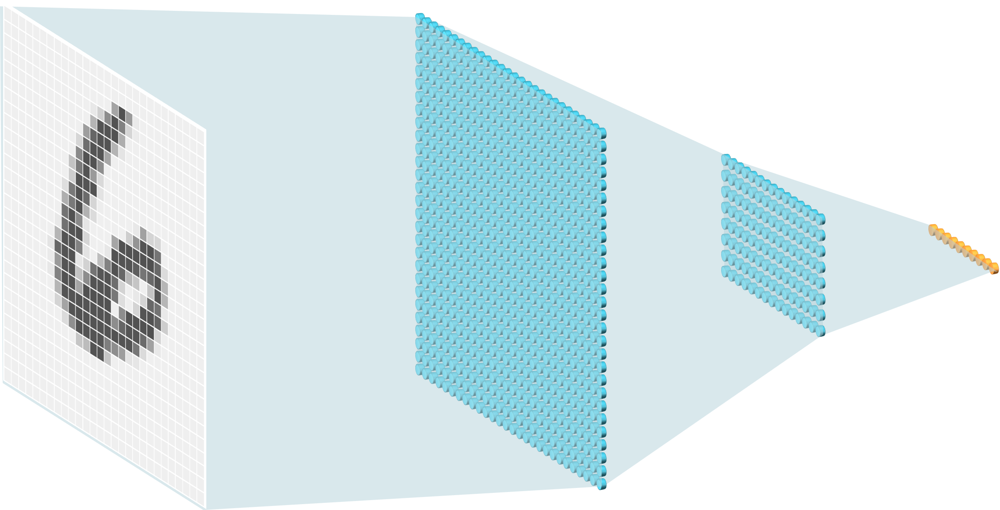
```

(ref:mnist-model) Schematische voorstelling van het MNIST model. Elke grijswaarde (uiterst links) in een afbeelding is verbonden met allerlei noden van de eerste laag in het netwerk (groot blauw raster links) en elke node uit de eerste laag is verbonden met de noden uit de tweede laag (kleiner blauw raster rechts). De oranje blak uiterst rechts stelt het antwoord voor, de kansverdeling over alle mogelijke uitkomsten, zoals uitgelegd in [vorige paragraaf](#het-resultaat-van-mnist-analyse).

We kunnen de gewichten uit het model opvragen:

```
<tf.Variable 'dense_4/kernel:0' shape=(784, 128) dtype=float32, numpy=
array([[ 0.08104221, -0.03245814,  0.05782456, ...,  0.01628028,
         0.01527335, -0.0621725 ],
       [-0.02486849, -0.05942973, -0.05000503, ...,  0.05511766,
         0.01111819, -0.01273195],
       ...,
       [-0.03103521,  0.04082336, -0.03615728, ..., -0.07942228,
         0.05170608, -0.04771789],
       [-0.08011643, -0.02025594,  0.07396395, ..., -0.04995897,
         0.04946151,  0.0736245 ]], dtype=float32)>

[[2]]
<tf.Variable 'dense_4/bias:0' shape=(128,) dtype=float32, numpy=
array([ 0.1288752 ,  0.12100432, -0.00982326,  0.1232934 ,  0.02084712,
        0.01321915, -0.01993161,  0.0420486 , -0.08715703,  0.06092769,
       ...,
        0.11226735, -0.06676487, -0.03609373, -0.05284352, -0.07687864,
        0.16832131,  0.08192852, -0.07676063,  0.03645244, -0.04636759,
        0.05661207,  0.13083224,  0.02666049], dtype=float32)>
```

In het totaal bestaat deze specifieke versie van het MNIST model dus uit $784\times128 + 128 = 100\,480$ gewichten. Deze gewichten worden op een nog nader te begrijpen manier gebruikt om $\hat{y}$ te berekenen uit $x$. Het model zou er dus ongeveer als volgt kunnen uitzien in Python:

```python
def model(x, tau = 0.99):
  weights_0 = array([[ 0.08104221, -0.03245814, ..., 0.04946151,  0.0736245 ]]
  weights_1 = array([ 0.1288752, 0.12100432, ...,  0.13083224,  0.02666049]
  
  y_dist = predict(x, weights_0, weights_1)
  y_hat_prob = max(y_dist)
  y_hat = y_dist.index(y_hat_prob)
  
  if(y_hat_prob < tau):
    y_hat = None
  
  return y_hat
```

In ons voorbeeld zou, indien `x` overeenkomt met $x_{300}$ uit \@ref(fig:mnist-cijfer), `y_dist` overeenkomen met $P(\hat{y}_{300}|x_{300})$, `y_hat_prob` met $99.999893\%$ en `y_hat` met $6$. Indien de berekende distributie 10 waarden zou bevatten die allen kleiner zijn dan $\tau$, zou dit model aangeven dat er te weinig zekerheid is door `None` terug te geven.

## Het leerproces voor begeleid ML

Zoals gezegd gaan we nog niet volledig in detail onderzoeken _hoe_ een ML model tot stand komt, maar laten we toch al trachten het ML proces te schematisch reconstrueren, specifiek voor wanneer het gaat om begeleid leren. Wat weten we tot nu toe? We weten dat we vertrekken met training data $\left(\mathcal{X}_{trn},\mathcal{Y}_{trn}\right)$ en eindigen met een model $\hat{g}$. We weten ook al dat het model een functie is die test data $\mathcal{X}_{tst}$ als invoer heeft en een voorspelling (eng: _prediction_) $\hat{y}$ als uitvoer (zie Figuur \@ref(fig:proces-1)).

```{r proces-1, fig.cap="(ref:proces-1)", echo=FALSE}
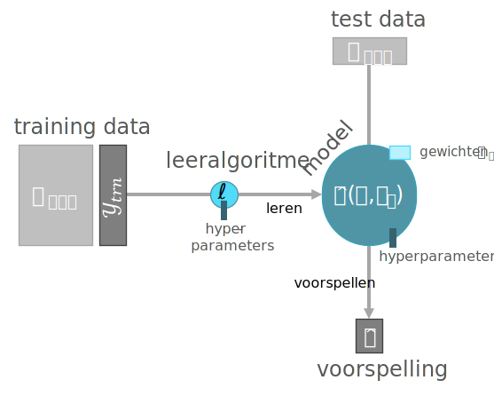
```

(ref:proces-1) Eerste overzicht van het leerproces voor begeleid ML. Ronde vormen staan voor acties of functies, rechthoekige vormen geven objecten weer. Met andere woorden, het proces voor ML kan gecodeerd worden als $\hat{g}=\ell(\mathcal{X}, \mathcal{Y})$.

## De onderdelen van een model

Het _model_ is dus een functie met daarin de gewichten $\mathscr{v}_j$ alsook de nodige logica om de invoer op de juiste manier te bewerken met de gewichten. Dit laatste wordt in tekstboeken vaak over het hoofd gezien omdat het in de praktijk vaak neerkomt op een eenvoudige matrix vermenigvuldiging. Hier wordt ervoor gekozen om dit een beetje explicieter te maken. In het MNIST model uit vorige paragraaf zien we nog een derde element, het argument `tau`. Dit is een _hyperparameter_. Hyperparameters die gekoppeld zijn aan een model dienen vaak, net als bij `tau`, om een grenswaarde te bepalen tussen wat een goede voorspelling is en wat niet. We zullen in volgende paragraaf zien dat er ook hyperparameters gekoppeld kunnen worden aan het leeralgoritme, waar ze gewoonlijk een heel andere rol gaan spelen.

```{definition ml-output}
Het model dat het resultaat is van begeleid machinaal leren bestaat uit minstens 2 onderdelen:

- de gewichten $\mathscr{\theta}_j$
- de modellogica

maar is vaak pas bruikbaar mits het definiëren van nog een derde onderdeel:

- de hyperparameters $\mathscr{v}_k$
```

## Hyperparameters

Hyperparameters worden zo genoemd om ze duidelijk te onderscheiden van gewichten, die in de literatuur ook vaak _parameters_ worden genoemd. Het onderscheid is belangrijk omdat hyperparameters het proces zelf beïnvloeden (e.g. waar moet je de lijn trekken, hoeveel getallen na de komma moet genereren, &hellip;) terwijl conventionele parameters het onderwerp zijn van de wiskundige bewerking waarmee invoer wordt omgezet naar een voorspelling.

```{definition def-hyperparams}
Hyperparameters geven aan _hoe_ een proces moet verlopen. Parameters dienen als invoer voor een functie.
```

De manier waarop parameters tot stand komen worden bepaald door het leeralgoritme (zie volgende §). Hyperparameters, daarentegen worden door de datawetenschapper gekozen ofwel in een afzonderlijk  proces automatisch geoptimaliseerd. De keuze voor de waarde van een hyperparameter zoals `tau` kan gemaakt worden door de datawetenschapper op basis van ervaring ofwel omdat het door de omgeving wordt opgelegd. Laten we twee voorbeelden bekijken die aangeven hoe de omgeving een drempelwaarde kan opleggen.

```{example drempel-kat-hond}
Stel, er wordt de datawetenschapper gevraagd om een algoritme te ontwikkelen om afbeeldingen van katten en honden (en telkens exact één kat of één hond) te onderscheiden, gewoon voor het plezier. Stel dat het algoritme slechts één waarde uitvoert, namelijk de probabiliteit $p_{kat}$ dat de afbeelding een kat laat zien. De probabiliteit dat het een hond is ($p_{niet kat}$), kan hieruit berekend worden met de formule $p_{niet kat}=1-p_{kat}$. Een logische drempelwaarde op deze probabiliteiten is $0.5$. Vanaf dat $p_{kat}$ zakt onder deze waarde, gaan we ervan uit dat het om een hond gaat.

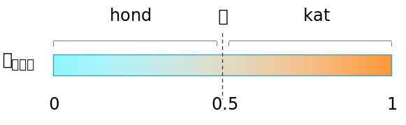
```

```{example drempel-gezond-ziek}
De datawetenschapper wordt nu gevraagd om een algoritme te ontwikkelen om op basis van tal van bloedwaarden van een patiënt te bepalen of deze ziek is of niet. Het algoritme voert weer slechts één waarde uit, ditmaal de kans om ziek te zijn $p_{ziek}$. De drempelwaarde mag nu niet meer zo maar op $0.5$ worden geplaatst. Waarom niet? ML algoritmen maken fouten maar niet alle fouten zijn even erg. Het foutief aanduiden van een gezonde persoon als `ziek` is niet zo erg als het foutief aanduiden van een zieke patiënt als persoon. Maar hoe weet de datawetenschapper dan welke drempelwaarde er gekozen moet worden? Nu komt het: in dit geval mag de datawetenschapper in geen geval een drempelwaarde zelf bepalen. De arsten die de opdracht geven dragen de verantwoordelijkheid om de ideale drempelwaarde te bepalen

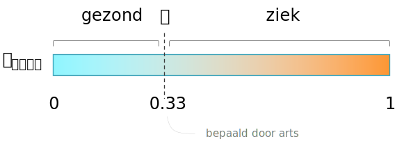
```

```{definition def-determine-hyperparams}
Hyperparameters _moeten_ vaak door andere mensen dan de datawetenschapper worden bepaald (ook als ze dat niet willen).
```

## Het leeralgoritme

Om van de training data naar het model te gaan heb je een _leeralgoritme_ $\ell$ nodig. Voorbeelden hiervan zien support vector machines (SVM), neuraal netwerk (NN), naïef Bayes algoritme (NB), enzovoort&hellip; Er zijn wel honderden algoritmen waaruit een datawetenschapper kan kiezen, en voor elk algoritme zijn er gewoonlijk oneindig veel mogelijke instellingen[^1] (lett.). We begrijpen uit vorige paragraaf dat parameters en hyperparameters verschillend zijn maar puur wiskundig beschouwd, dienen ze allebei gewoon als invoer voor de ene of ander functie. Noteren we de hyperparameters bij het leeralgoritme nu als $\mathscr{l}_k$, dan krijgen we het volgende:

$$\hat{g}=\ell\left(\{\mathcal{X}, \mathcal{Y}\}, \mathscr{l}_k\right)$$

Hier staat: het ML model wordt, in het geval van begeleid ML, gevormd door een leeralgoritme dat zowel data als invoer heeft ($\{\mathcal{X}, \mathcal{Y}\}$) als hyperparameters die het leerproces kunnen beïnvloeden. Wat is dan de rol van de hyperparameters die op het leeralgoritme inwerken? Zonder nu al te veel in gaan op het intern mechanisme van de leeralgoritmen, is één van de veel voorkomende functies van $\mathscr{l}_k$ om te bepalen hoe snel het leeralgoritme te werk moet gaan.

Ik wil hier nog even benadrukken dat het resultaat van het leeralgoritme moet bestaan uit een set van parameters én een functie-logica. Deze functie-logica ligt voor een bepaald leeralgoritme vast. Bijvoorbeeld, voor een logistische regressie, bestaat deze logica uit een logit-transformatie en een matrix vermenigvuldiging. Deze logica plus de parameters $\mathscr{\theta}_j$ vormen samen het model. De hyperparameters die op het model inwerken worden, zoals uitgelegd in vorige §, meestal _achteraf_ bepaald door de datawetenschapper of opgelegd door de omgeving.

## Model complexiteit

Merk op dat een ML model niet zo complex hoeft te zijn als dit MNIST model. Het kan best dat een model bestaat uit slecht een handvol parameters. Zo zullen nog zien dat je met de [iris dataset](https://en.wikipedia.org/wiki/Iris_flower_data_set) drie sterk gelijkende bloemensoorten onderscheiden op basis van slechts 2 variabelen (de lengte van het kroonblad $p$ en de lengte van het kelkblad $s$) en 3 parameters die hierop inwerken ($\theta_1 = 2.5$, $\theta_2 = 1.2$ en $\theta_3=0.3$):

$$species=\begin{cases}\text{setosa als }p<\theta_1\\\text{versicolor als }s>\theta_2p+\theta_3\\\text{virginica anders}\end{cases}$$
In dit geval ziet ons model er dan zo uit (Python):

```python
def model(x):
  if x.p < 2.5:
    return "setosa"

  if x.s > 1.2 * x.p + .3:
    return "versicolor"

  return "virginica"
```

Deze versie van het iris-model met slechts 3 gewichten (te vergelijken met gewichten) is wel erg eenvoudig maar er bestaan ook andere ML modellen die in productie gebruikt worden en niet veel complexer zijn. Complexiteit is trouwens geen goede maatstaf voor de 'kwaliteit' van een model. Aan de andere kant bestaan er ook modellen die nog véél complexer zijn dan het MNIST model met honderden miljarden gewichten ($J > 10^{11}$; @shazeer2017).

## Comprimeren door middel van een ML model

Uit de vorige paragraaf leren we dat modellen zeer eenvoudig of zeer complex kunnen zijn. Meestal bevat het model inclusief de gewichten weliswaar véél minder informatie dan de oorspronkelijk data waarop getraind werd. In deze gevallen kan je het model beschouwen als een vereenvoudigde voorstelling van de werkelijkheid of nog als een geavanceerde 'Zip-functie', hetzij eentje die niet volmaakt is (eng: _lossless_). Het zou ons te ver leiden om de compressie-factor (eng: _compression ratio_) te berekenen op basis van de [Informatietheorie](https://nl.wikipedia.org/wiki/Informatietheorie), maar misschien kunnen we een grove schatting maken van de compressie-factor voor ons MNIST-model (zie Voorbeeld \@ref(exm:mnist-compression)).

```{example mnist-compression}

De training set bestaat uit 60\ 000 afbeeldingen van 28 &times; 28 pixels. Met de grijswaarden in enkelprecisievariant (eng: _single precision_) van de zwevendekomma getallen komt de grootte van de training set op:

$$60\,000\times28\times28\times32\approx1.5\cdot10^9 bits$$

Daartegenover bestond het MNIST-model uit $100\,480$ gewichten:

$$100\,480\times32\approx3.2\cdot10^6 bits$$

Dit brengt ons op een compressie-factor van:

$$\frac{1.5\cdot10^9 bits}{3.2\cdot10^6 bits} > 450$$
```

## Leren versus ontwerp

We hebben al heel wat woorden vuil gemaakt om te begrijpen wat ML eigenlijk inhoud. Laten we nu even stilstaan bij wat ML _niet_ is. Om te beginnen is ML niet ontwerpen. Wat is het verschil? Ook hier is het gemakkelijkste om het verschil aan te tonen aan de hand van twee voorbeelden. De probleemstelling is als volgt:

<q>Maak een verkoopautomaat die op basis van de massa en de diameter de 4 verschillende Indiase muntstukken (0.5, 1, 2 en 5 Rs) zo goed mogelijk kan onderscheiden.</q>

```{example verkoopautomaat-ontwerp}
__Ontwerp-benadering van het verkoopsautomaat probleem__: zoek naar de specificaties die gebruikt worden tijdens het ontwerpen van de munstukken. Op de [webpagina van Takashi Shimazaki](http://www.tadopika.net/en/14currency/worldcoins.htm) vind je een samenvatting:

| Waarde (Rs) | Massa ($g$) | Diameter ($mm$) |
| ----------- | --------- | ------------- |
| 0.5         | 3.79      | 22.0          |
| 1           | 4.85      | 25.0          |
| 2           | 5.62      | 27.0          |
| 5           | 6.00      | 23.0          |

We veronderstellen verder een standaardafwijking op de metingen van $0.09g$ en $0.1 mm$ en een fouttolerantie van maximaal 0.1%. Op basis van deze gegevens stellen we een grafiek op en beslissen we 'met de hand' waar de grenswaarden worden gedefiniëerd:

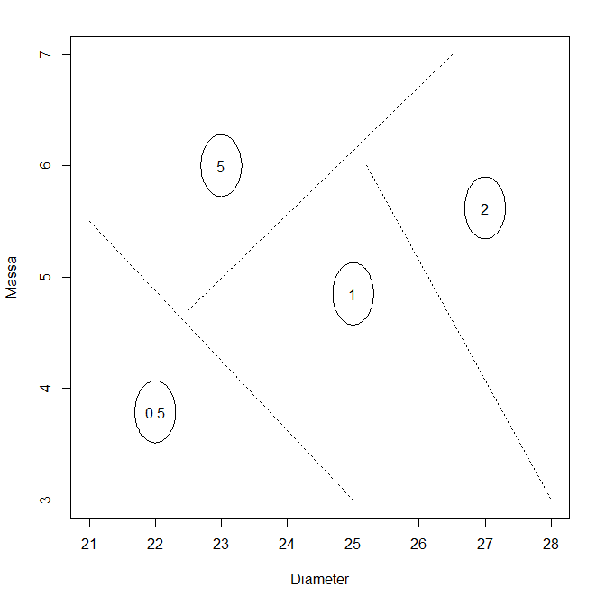
```

```{example verkoopautomaat-ml}
__ML-benadering van het verkoopsautomaat probleem__: zoek naar _data_ met werkelijke metingen van de massa's en diameters van de verscheidene Indiase munstukken. Bij gebrek aan zulke data zit er niets anders op dan een random steekproef te nemen van de munstukken en ze zelf te meten (of door iemand betrouwbaar te laten meten). Hier is het resultaat van de metingen:

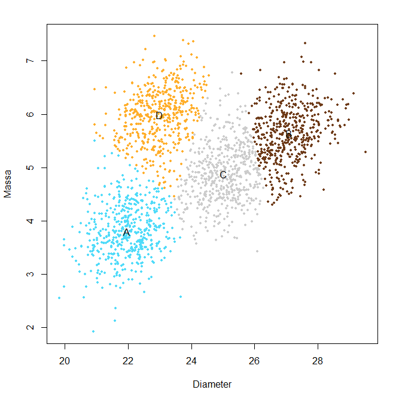

De kleuren stellen het resultaat voor van een clusteralgoritme (k-means), dit is trouwens een type algoritme dat onbegeleid tewerk gaat en verschilt dus fundamenteel van het begeleid ML dat we tot hiertoe bespraken. Uit deze data lijkt het of de spreiding veel groter is dan aangenomen in vorig Voorbeeld. Daardoor maakt het model hier vermodelijk een aantal fouten in de classificatie. Het model 'weet' hier ook niet welke _cluster_ overeenkomt met bijvoorbeeld 2 roepie. De enige input, naast de diameters en de massa's van de muntstukken is dat er 4 clusters in het totaal moeten zijn. De data in dit voorbeeld werden gesimuleerd, zie hieronder voor meer detail.
```

De grafiek voor __ontwerp benadering__ kan je genereren met de onderstaande R code:

```{r eval=FALSE}
library(data.table)
library(plotrix)

coins <- fread("
  Waarde\tMassa\tDiameter
  0.5\t3.79\t22.0
  1\t4.85\t25.0
  2\t5.62\t27.0
  5\t6.00\t23.0")

plot(0, type = "n",
  xlim = c(21, 28), ylim = c(3, 7),
  xlab = "Diameter", ylab = "Massa")

alpha <- .001
dummy <- coins[, draw.ellipse(Diameter, Massa,
  qnorm(1 - alpha, 0, 0.1), qnorm(1 - alpha, 0, 0.09))]
segments(c(25, 22.5, 25.2), c(3, 4.7, 6),
  c(21, 26.5, 28), c(5.5, 7, 3), lty = 3)
dummy <- coins[, text(Diameter, Massa, Waarde)]
```

Hieronder vind je de code terug voor de ML-benadering uit Voorbeeld \@ref(exm:verkoopautomaat-ml). Merk op dat ik hier, omdat er niet direct data voorhanden was, de data zelf heb gesimuleerd.

```{r eval=FALSE}
library(data.table)
library(magrittr)
library(MASS)

set.seed(42)

# Generating data

copula <- function(lab, n, rho, mu1, mu2, sd1, sd2){
  mu <- c(mu1,mu2)
  sigma <- matrix(c(sd1 ^ 2, sd1 * sd2 * rho, sd1 * sd2 * rho, sd2 ^ 2),2)
  mvrnorm(n, mu, sigma) %>% as.data.table %>%
    set_names(c("Diameter", "Mass")) %>%
    cbind(Label = lab)
}

coins_meas <-
        coins[1, copula("0.5", 500, .3, Diameter, Massa, .8, .5)] %>%
  rbind(coins[2, copula("0.5", 500, .3, Diameter, Massa, .8, .5)]) %>%
  rbind(coins[3, copula("0.5", 500, .3, Diameter, Massa, .8, .5)]) %>%
  rbind(coins[4, copula("0.5", 500, .3, Diameter, Massa, .8, .5)])

# Analyzing data
model <- kmeans(coins_meas, centers = 4, iter.max = 1000)

plot(coins_meas$Diameter, coins_meas$Mass,
  xlab = "Diameter", ylab = "Massa",
  pch = 19, col = model$cluster, cex = .6)

text(model$centers[,"Diameter"], model$centers[,"Mass"],
  LETTERS[1:4])
```

## Leren versus onthouden

De moeilijkste te onderscheiden begrippen in de wereld van ML zijn _leren_ versus _onthouden_. Dit probleem komt trouwens deels overeen met het onderscheid tussen respectievelijk _ML_ en _regressie_. Zich de moeite getroosten om een model te ontwikkelen heeft alleen maar nut indien het ook achteraf gebruikt zal worden om voorspellingen mee te doen. Met andere woorden om dingen te ontdekken die men (t.t.z. de computer) nog niet wist. Laten we onderstaand voorbeeld onderzoeken om te begrijpen wat het precies betekent om niets nieuw te leren.

```{example cars-regressie}
__MT cars relatie__: De Motor Trend Car Road Tests dataset bevat 10 standaard eigenschappen voor de motoren van 32 automerken zoals verbruik, cilinderinhoud en dergelijke. Deze data zijn net als iris dataset en sommige anderen een waarde geworden in de wereld van de statistiek. De data werd oorspronkelijk verzameld uit het Motor Trend US magazine van 1974 (zie @henderson1981). Geef `?mtcars` in R om meer te weten te komen. Stel nu dat er een theorie bestaat die de cilinderinhoud $c$ in verband brengt met de massa $w$ van de wagen door middel van een variant van de zogenaamde hill-functie:

$$c=\theta_1+\frac{\theta_2-(w-\theta_3)^2}{\theta_4^2+(w-\theta_3)^2}$$

De datawetenschapper zal trachten deze vraag te beantwoorden. Hij voert een niet-lineare regressie analyse uit. Hierbij zal een zogenaamd _optimalisatie-algoritme_ de 4 parameters wijzigen totdat de functie die zo ontstaat zo goed mogelijk overeenkomt met de aangeleverde dataset. De onderstaande clip brengt dit proces tot leven:

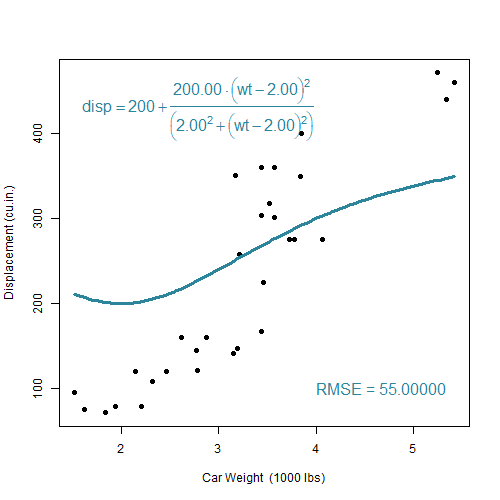

Naarmate dat de optimalisatie vordert (zie @nelder1965), verkleint de afwijking tussen voorspelde curve met de datapunten, zoals te zien is aan de zogenaamde _Root mean squared Error_ (RMSE). Op het einde van de optimlisatie, bij een RMSE van 52.527, komt het algoritme tot stilstand met de volgende parameter-waarden:

$$\theta_1=78, \theta_2=517.47, \theta_3=1.87, \theta_4=2.10$$
```

Wat het Voorbeeld \@ref(exm:cars-regressie) laat zien is dat gebaseerd op een vooraf bepaald model, waarvan wel de parameters maar niet de complexiteit gewijzigd mag worden er inderdaad een ideale parameterset gevonden kan worden die bij deze 32 datapunten past. Maar wat als dezelfde opdrachtgever nu tegen de datawetenschapper zegt dat die zich vergist had. Het zou beter zijn om te de puntenwolk te beschrijven door middel van een polynoom van de vijfde graad. De datawetenschapper zet zich eraan en schrijft de volgende R code:

```r
rmse <- function(y, x){
  sqrt(mean((y - x) ^ 2))
}

model <- lm(disp ~ poly(wt, 5), data = mtcars)
rmse(model$fitted.values, mtcars$disp)
```

Het resultaat is nu een RMSE van 52.492, beter dan het vorige resultaat, alleen ziet de resulterende curve er nu een beetje vreemd uit:

```{r cars-regressie-2-res, out.width="318px", echo=FALSE}
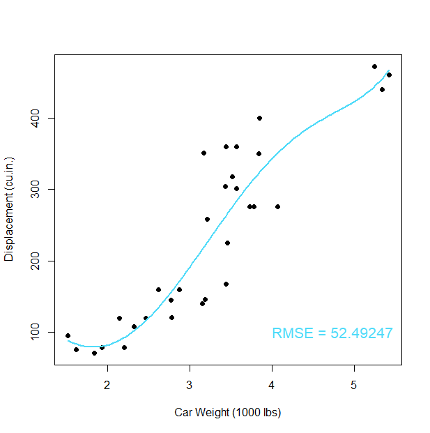
```

Het probleem is natuurlijk dat hoe hoger de graad van de polynoom, hoe beter de fit zal zijn (is een wiskundige zekerheid) maar ook hoe 'lelijker' de curve zal worden:

```{r cars-regressie-3-res, out.width="318px", echo=FALSE}
include_graphics("img/regressie3.png")
```

Wat hier aan het gebeuren is noemt met _overfit_. Een polynoom met zulke hoge graad is veel te complex voor het onderliggend patroon. We voelen dit ergens wel aan maar kunnen we dit ook formaliseren of zelfs bewijzen? Het antwoord is ja en ja. Het eerste (het formaliseren) zou ons te ver leiden, maar voor de geïnteresseerden raad ik aan om de term [_VC dimension_](https://en.wikipedia.org/wiki/Vapnik%E2%80%93Chervonenkis_dimension) op te zoeken, genoemd naar twee grondleggers van de ML theorie: Vladimir Vapnik en Alexey Chervonenkis en het boek (of online lezingen) van Yaser Abu-Mostafa te bekijken (@learningfromdata). Het tweede aspect (het bewijzen) is eenvoudiger. We moeten gewoon op zoek gaan naar nieuwe data:

```{r cars-regressie-4-res, out.width="318px", echo=FALSE}
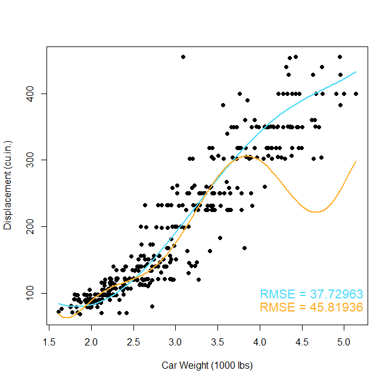
```

We zien nu het gevolg van overfitting. Wanneer we het model blootstellen aan nieuwe data zien we dat het eenvoudige model (polynoom van graad 5) veel beter presteert dan het complexere model (polynoom van graad 7). En dat is het hem nu net allemaal om te doen! Leren om voorspellingen te maken, niet leren om de training dataset nauwkeurig te beschrijven, want dat is gewoon onthouden of hoogstens comprimeren zoals we [eerder zagen](#comprimeren-door-middel-van-een-ml). Daarom is ML veel interessanter dan regressieanalyse. Je kan stellen dat regressie (zoals de naam het eigenlijk al aangeeft) gaat over 'achterom kijken', terwijl ML gaat over 'naar de toekomst' kijken.

## Onbegeleid ML

Tot hier toe werd er voornamelijk gesproken rond begeleid ML (eng: _supervised machine learning_). Er zijn nog twee andere vormen die binnen sommige disciplines erg populair zijn, maar minder in deze cursus aan bod zullen komen. In Voorbeeld \@ref(exm:verkoopautomaat-ml) werd wel gesproken van clusters, en dat is een voorbeeld van onbegeleid ML (eng: _unsupervised machine learning_ of _self-organization_). Het verschil tussen begeleid en onbegeleid is het gebruik van de uitkomsten ($y$) als invoer voor het leeralgoritme.

```{definition def-vergelijk-begeleid}
Bij __begeleid ML__ wordt het leeralgoritme getraind op invoer data ($\mathbf{x}$; de onafhankelijke variabelen) die paarsgewijs gekoppeld zijn met uitvoer data ($\mathbf{y}$; de afhankelijke variabele of uitkomst). Het algoritmeUit leert de verbanden tussen  $\mathbf{x}$ en $\mathbf{y}$.

Bij __onbegeleid__ ML is er geen sprake van een uitkomst en leert het algoritme gewoon patronen te herkennen in de invoer data.
```

```{r begeleid-vs-onbegeleid, fig.cap="(ref:begeleid-vs-onbegeleid)", echo=FALSE}
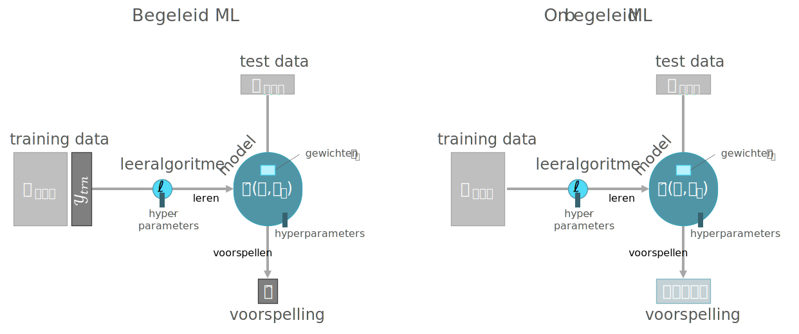
```

(ref:begeleid-vs-onbegeleid) Vergelijking tussen het proces van begeleid L en het proces van onbegeleid 'leren'.

Welke van beide moet je nu gebruiken? Heel simpel: als je een betrouwbare uitkomst in je bezit hebt, dan kies je best begeleid ML, omdat deze altijd beter zal presteren. Heb je geen uitkomsten of twijfel je aan de authenticiteit of accuraatheid, dan kan je overstappen onbegeleid leren.

Binnen onbegeleid leren, zijn er twee families aan onbegeleid ML die veel gebruikt worden. Eentje is de principale componenten analyse (PCA; eng: _principal component analysis_), de ander is cluster analyse (eng: _cluster analysis_). In beide gevallen is het resultaat een categorisatie van de instanties (zoals bijvoorbeeld een clustering) of een associatie (zoals bijvoorbeeld aanbevelingen, eng: _customer recommendations_). Met andere woorden, een onbegeleid ML algoritme vertelt je of twee instanties bij elkaar horen (grote kans op associatie, zelfde cluster, &hellip;) of niet.

Laten we de discussie van onbegeleid ML afsluiten met een voorbeeld:

```{example}
Stel, een klant wil een geautomatiseerd systeem ontwikkelen om de scherpte meten van microtoommessen. De klant hoopt dit te kunnen doen a.d.h.v. microscopische opnamen van de snede van het mes, waarvan hieronder een voorbeeld:

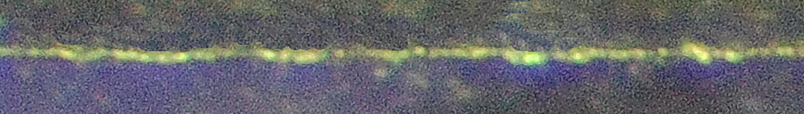

Het doel is om de oppervlakte te bepalen van de fellere horizontale lijn (de messnede), maar om dit te kunnen doen moet er een duidelijk onderscheid worden gemaakt tussen fellere pixels en donkere pixels. M.a.w., elke pixel moet gecategoriseerd worden als 'messnede' of 'achtergrond'. Een begeleid ML aanpak zou inhouden dat een mens heel wat afbeeldingen manueel beoordeeld en dat er een classificatie algoritme gevoed zou worden met deze uitkomst data. Alleen is dat hier niet erg praktisch en bovendien erg onbetrouwbaar. Vandaar de keuze voor onbegeleid leren.
```

Elke pixel in bovenstaande afbeelding bevat een R, een G en een B waarde. Het doel is om de afbeelding om te zetten naar een grijswaarde afbeelding, maar dan wel met de optimale gewichten voor de afzonderlijke R, G en B kleur-kanalen zodat er een maximaal contrast ontstaat. We zien immers dat de snede van het mes groen-achtig en niet wit is en we kunnen dus vermoeden dat de drie kleuren een verschillend gewicht gaan krijgen bij het zoeken naar het hoogste mogelijk contrast. Hieronder wordt de code getoond (imports en een aantal helperfuncties weggelaten):

```{r demo-pca-helper, echo = FALSE}
library(imager)
library(abind)

img_to_dt <- function(x) {
  x %>%
    as.data.frame %>%
    as.data.table %>%
    data.table::dcast(... ~ cc, value = "value") %>%
    extract(, .(x, y, R = `1`, G = `2`, B = `3`)) %>%
    extract(order(y, x))
}

dt_to_img <- function(x, dims) {
  abind(array(x$R, dims[1:3]),
    array(x$G, dims[1:3]),
    array(x$B, dims[1:3]),
    along = 4) %>% normalize %>% as.cimg
}

normalize <- function(x) {
  x_min <- min(x, na.rm = TRUE)
  x_max <- max(x, na.rm = TRUE)
  
  (x - x_min) / (x_max - x_min)
}
```

```{r demo-pca, fig.asp=652/4575}
predict_pca <- function(x, n) {
  x$x[, 1:n] %*% t(x$rotation[, 1:n]) %>%
    scale(scale = FALSE, center = -1 * x$center) %>%
    as.data.table
}

contrast <- function(img) {
  img %>%
    img_to_dt %>%
    prcomp( ~ R + G + B, data = .) %>%
    predict_pca(1) %>%
    dt_to_img(dim(img)) %>%
    grayscale %>%
    normalize
}

par(mar = rep(0, 4))

img <- "img/Microtome_knife_5.0_5.0_0097.JPG" %>%
  load.image %>%
  contrast %>%
  plot(axes = FALSE)
```

De code leest als volgt: Laad de afbeelding `Microtome_knife_5.0_5.0_0097.JPG` en in de `contrast` functie: zet je het beeld eerst om naar een `data.table` met de helper-functie `img_to_dt` (niet getoond). Start daarna de principale componenten analyse op met de ingebakken `stats::prcomp` functie. Geef hierbij mee dat de drie kleur-kanalen moeten gebruikt wordt om het grootste contrast te vinden. Neem het resultaat van de analyse en neem de eerste component (de combinatie van R, G, en B-waarden die het meeste variantie verklaart) en voer daarmee de omgekeerde bewerking uit met de `predict-pca` functie. Het resultaat is dat er een iets beter drempel-waarde (eng: _threshold_) gevonden kan woorden waarme de messnede geïdentificeerd kan worden:

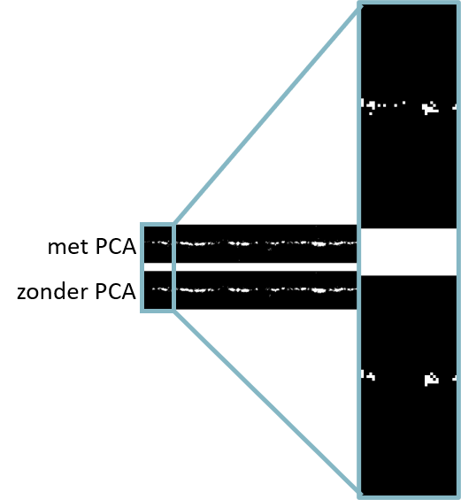

Het probleem met onbegeleid ML is dat je nooit zeker weet dat je echt iets geleerd hebt. Bijvoorbeeld, indien een onbegeleid model een nieuwe instantie onderbrengt in een welbepaalde cluster, hoe weet je dan of het juist is of fout? Daarom is die term "onbegeleid leren" mogelijk nogal verwarrend en is het vaak veiliger om gewoon te spreken van clustering (bijv. k-means) of eigen-decompositie (bijv PCA.).

## Conditionering

Er is nog een derde soort ML, namelijk de conditionering (eng: _reinforcement learning_). In plaats van een afhankelijke variabele, wordt de uitkomst aangeleverd als een functie die, gegeven een bepaalde input, de uitkomst zal teruggeven. Het grootste verschil met de twee eerder besproken vormen van ML is dat er voor conditionering geen nood is aan historische data.

```{definition reinforcement-learning}
Voor conditionering (reinforcement learning) heb je geen historische data nodig. Enkel een _tolk_ die in staat is een actie van een _agent_ te beoordelen.
```

Conditionering kent toepassingen in erg veel verschillende disciplines waaronder de statistiek, maar ook de speltheorie, [meet- en regeltechniek](https://nl.wikipedia.org/wiki/Meet-_en_regeltechniek), [operationeel onderzoek](https://nl.wikipedia.org/wiki/Operationeel_onderzoek), de [informatietheorie](https://nl.wikipedia.org/wiki/Informatietheorie), enzovoort&hellip;. Het werkt zo. Een _software-agent_ (eng: _agent_) krijgt de keuze uit een aantal _acties_ (eng: _actions_) die het kan uitvoeren op een _omgeving_ (eng: _environment_). Het (voorlopig immatuur) model (een _tolk_; eng: _interpreter_) vertaalt de gekozen actie naar enerzijds een toestand-wijziging (eng: _state change_) en anderzijds een beloning (eng: _reward_).

```{r conditionering, fig.cap="(ref:conditionering)"}
include_graphics("img/conditionering.svg")
```

(ref:conditionering) Overzicht proces voor conditionering. Een toestand ruimte wordt gedefinieerd of er wordt een functie voorzien die kan meegeven of een toestand mogelijk is of niet. Daarnaast moet er een beloning systeem worden meegegeven zodat de tolk voor elke mogelijke handeling een beloning kan bepalen (of bestraffing door middel van een negatieve beloning).

We komen later meer uitgebreid terug op conditionering, maar nu houden we het bij een minimalistische implementatie van een soort conditionering, genaamd _Q-learning_, dit maal in Python. Het voorbeeld is afkomstig van de blog ["The Beginner Programmer" van Mic](http://firsttimeprogrammer.blogspot.com/2016/09/getting-ai-smarter-with-q-learning.html) en hetgeen op zijn beurt gebaseerd is op een Q-learning handleiding op de [Mnemosyne_Studio blog](http://mnemstudio.org/path-finding-q-learning-tutorial.htm) van John McCullock.

```{example escape-room-ex}
Gegeven onderstaande plattegrond van een huis met vijf kamers, vind het korst mogelijke pad naar buiten als je je in kamer 2 bevindt.
```

```{r escape-room, fig.cap="(ref:escape-room)", echo=FALSE}
include_graphics("http://mnemstudio.org/ai/path/images/modeling_environment_clip_image002a.gif")
```

(ref:escape-room) De plattegrond. ([bron](http://mnemstudio.org/path-finding-q-learning-tutorial.htm))

De belonging kan voorgesteld worden als een matrix:

```{r escape-room-matrix, fig.cap="(ref:escape-room-matrix)", echo=FALSE}
include_graphics("http://mnemstudio.org/ai/path/images/r_matrix1.gif")
```

(ref:escape-room-matrix) De beloning-matrix ( [bron](http://mnemstudio.org/path-finding-q-learning-tutorial.htm))

```{python escape-room-code-01}
import numpy as np

reward = np.matrix(
  [[-1,-1,-1,-1, 0, -1],
  [ -1,-1,-1, 0,-1,100],
  [ -1,-1,-1, 0,-1, -1],
  [ -1, 0, 0,-1, 0, -1],
  [ -1, 0, 0,-1,-1,100],
  [ -1, 0,-1,-1, 0,100]])
```

We maken nu een matrix die het geheugen voorstelt van de tolk. Hierin zal de tolk zijn eerdere ervaringen in opslaan. Dit geheugen stelt de toestand (eng: _state_) voor waarin de agent zich bevindt. Zoals je ziet weet de agent initieel helemaal niets.

```{python escape-room-code-02}
memory = np.matrix(np.zeros([6, 6]))
```

In andere situaties kan het aantal toestanden waarin een agent zich kan bevinden helemaal niet gedefinieerd zijn en dan moet de matrix dynamisch worden opgesteld. Het opvullen van de toestand-matrix gebeurt volgens de onderstaande _transitie regel_ (eng: _transition rule_):

$$
Q(toestand, actie)=R(toestand, actie)+\gamma\cdot max(Q(volgende\,toestand,\,alle\,acties))
$$

We hebben nu een functie die, gegeven een bepaalde toestand, de set van mogelijke volgende toestanden teruggeeft (`available_actions`) en een tweede die gegeven de mogelijke toestanden er een willekeurige toestand uitkiest (`sample_next_action`).

```{python escape-room-code-03}
def available_actions(state):
  current_state_row = reward[state,]
  av_act = np.where(current_state_row >= 0)[1]
  return av_act

def sample_next_action(available_actions_range):
  next_action = int(np.random.choice(available_act,1))
  return next_action
```

Ten slotte hebben we een `update`-functie, de instap-functie a.h.w. van het leeralgoritme, die het geheugen (de toestand-matrix) vernieuwd:

```{python escape-room-code-04}
def update(current_state, action, gamma):
  max_index = np.where(memory[action,] == np.max(memory[action,]))[1]

  if max_index.shape[0] > 1:
      max_index = int(np.random.choice(max_index, size = 1))
  else:
      max_index = int(max_index)
  max_value = memory[action, max_index]
  
  memory[current_state, action] = reward[current_state, action] +\
    gamma * max_value
```

We initialiseren nu het spel met de leersnelheid $\gamma$ en de initiële kamer (2) en de doel-ruimte (buiten, ruimte 5) en voeren de eerste update uit:

```{python escape-room-code-05}
gamma = 0.8
initial_state = 2
end_state = 5
```

Nu begint het trainen (10 000 iteraties):

```{python escape-room-code-06}
for i in range(10000):
  current_state = np.random.randint(0, int(memory.shape[0]))
  available_act = available_actions(current_state)
  action = sample_next_action(available_act)
  update(current_state, action, gamma)
```

De toestand-matrix er nu zo uit:

```{r escape-room-resultaat-1}
model <- as.matrix(100 * py$memory / max(py$memory))
dimnames(model) <- list(start = 0:5, stop = 0:5)
model
```

Nu testen we het model met een begintoestand van 2 en een eindtoestand van 5:

```{python escape-room-code-07}
current_state = initial_state

steps = [current_state]

while current_state != end_state:
  next_step_index = np.where( \
    memory[current_state,] == np.max(memory[current_state,]))[1]

  if next_step_index.shape[0] > 1:
    next_step_index = int(np.random.choice(next_step_index, size = 1))
  else:
    next_step_index = int(next_step_index)
  
  steps.append(next_step_index)
  current_state = next_step_index
```

Het aangeleerd pad is als volgt:

```{r escape-room-resultaat-2}
py$steps %>% paste("Ruimte ", ., collapse = " > ")
```

[^1]: Onder _instellingen_ wordt hier onder andere een combinatie van hyperparameter-waarden verstaan. Omdat deze hyperparameters meestal continue variabelen zijn, maakt dit dat er letterlijk oneindig veel instellingen mogelijk zijn. Bovendien bestaan er voor elke leeralgoritme vaak talrijke varianten, elke met hun eigen voor- en nadelen.
