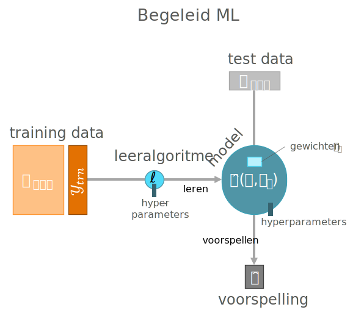
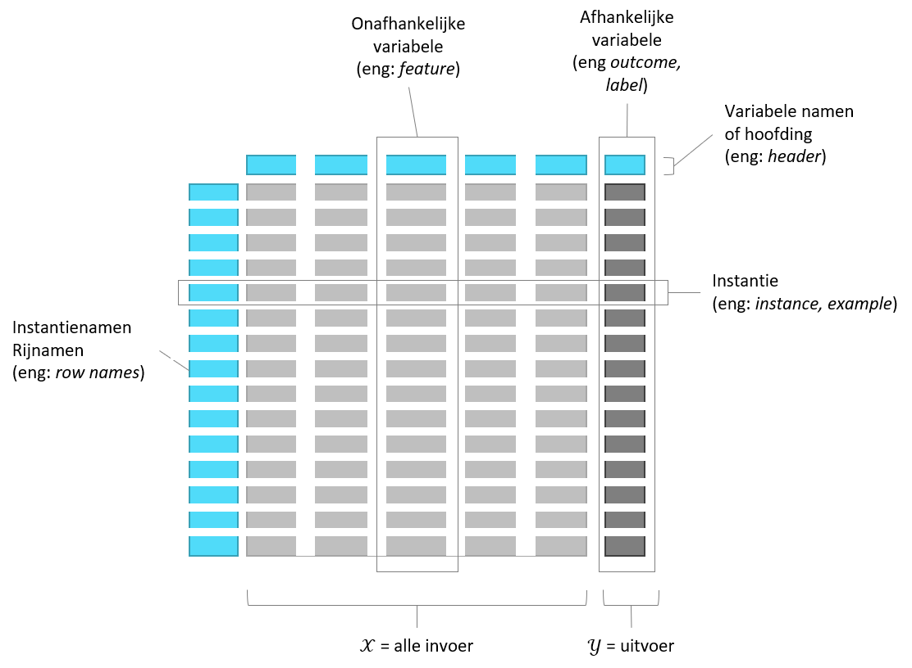
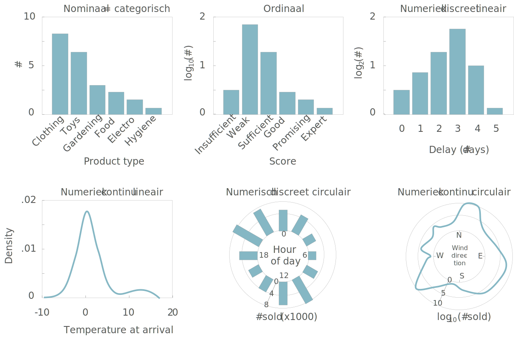
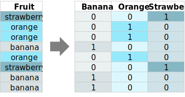

```{r include=FALSE}
library(knitr)
library(data.table)
library(reticulate)
library(magrittr)
library(e1071)

opts_chunk$set(echo = TRUE, cache = TRUE, message = FALSE, warning = FALSE)

dyad <- readRDS("r/Palette_5YR_5B_Dyad.RDS")
palette(dyad[c(9, 20, 66)])
```

# Data

```{r proces-focus-data, echo=FALSE}

```

## Data voor ML

Leeralgoritmen gebruiken data om er een model uit te destilleren. Als er iets fout gaat, heeft dit dat ook erg vaak te maken met de staat waarin de data zich bevinden of de manier waarop er met de data wordt omgesprongen.

```{definition}
When it comes to ML, garbage in, garbage out (GIGO).
```

De datawetenschapper streeft ernaar om de data die hij of zij te zien krijgt zo goed mogelijk te begrijpen. Wiskundig gezien is dat misschien niet zo belangrijk, maar het gaat hier over de ethiek. Als je van plan bent om uitspraken te doen op basis van data, ben je ook verantwoordelijk voor het opbouwen van een grondig begrip vam wat de data voor staat. 

```{r gossip, fig.cap="(ref:gossip)", echo=FALSE}

```

(ref:gossip) "The gossip" (ned. _De roddel_) van [Norman Rockwell](https://nl.wikipedia.org/wiki/Norman_Rockwell).

```{remark}
Als datawetenschapper heb je, indien de data betrouwbaar is en je voldoende integer bent om je van alle vooroordelen en taboes te ontdoen, toegang tot de ultieme waarheid. Ben je er klaar voor?
```

## Wat is data

Bij dit principe moeten we tegenwoordig niet erg lang stilstaan. Het is ondertussen voor de meeste mensen duidelijk dat overal waar je kijkt er data zijn. Alles wat je online doet maar ook alles wat je offline doet kan tot data worden omgevormd. Om als invoer te kunnen dienen voor een leeralgoritme, moeten de data in de eerste plaats natuurlijk beschikbaar zijn. En daar wringt het eerste schoentje al. Want 'beschikbaar' betekent niet alleen dat je er toegang tot hebt, maar ook dat de data zich in het juiste formaat bevinden om te kunnen gebruiken door het leeralgoritme.

## Soorten data

Ook hier moeten we niet te lang bij blijven stilstaan. We bekijken wel een aantal vaak gebruikte termen.

- _Interne data_: Private data die behoren tot een organisatie.
- _Externe data_: Publieke of private data van een andere organisatie
- _Ongestructureerde data_: Data die niet in een platte tabel-structuur kan worden weergegeven. Als het gekozen leeralgoritme hier niet mee overweg kan, moet je eerst features extraheren en zelf een platte tabel maken (eng: _melting data_)
- _Metadata_: Is data over data zoals tijdstip van opname, gebeurtenissen uit logboek, enz&hellip;

## Externe databronnen

Veel gegevens worden intern bij organisaties bewaard in afzonderlijke, speciaal daarvoor voorziene databanken, bestanden of (zeker als het om historische gegevens gaat) de fysische tegenhangers zoals rekenbladen, werkboeken, documenten, archieven, &hellip;. Vaak zijn er echter nog andere bronnen zoals audit-rapporten, usage-statistieken rond het gebruik van websites, logbestanden, videobeelden, &hellip; waar men niet onmiddellijk aan denkt. Binnen een bedrijfs-context is het net belangrijk om nieuwe databronnen aan te boren, bronnen waar de concurrentie niet eerder aan dacht.

Hieronder een collage van een aantal potentiële interessante bronnen van data op het internet (naast de meest vanzelfsprekende zoals sociale media e.d.). Het gaat hier om generieke bronnen met data over meerdere domeinen.

- [Academictorrents](https://academictorrents.com/browse.php)
- [Amazon Web Services public datasets](http://aws.amazon.com/datasets)
- [Brits open data platform](http://data.gov.uk/)
- [Canadese open data site](http://www.data.gc.ca/)
- [Common Crawl](https://registry.opendata.aws/commoncrawl/)
- [DataQuest](https://www.dataquest.io/blog/free-datasets-for-projects/)
- [Data World](https://data.world/)
- [Europese Open data portaal](http://open-data.europa.eu/en/data/)
- [FiveThirtyEight](https://data.fivethirtyeight.com/)
- [Forbes](https://www.forbes.com/sites/bernardmarr/2016/02/12/big-data-35-brilliant-and-free-data-sources-for-2016/#14cabf5bb54d)
- [Gapminder](https://www.gapminder.org/data/)
- Google [Trends](https://trends.google.nl/trends/?geo=BE), [Scholar](https://scholar.google.be/), [Patents](https://www.google.com/?tbm=pts), [Google Dataset Search lab](https://www.google.com/publicdata/directory), &hellip;
- [Kaggle](https://www.kaggle.com/datasets)
- [Reddit](https://www.reddit.com/r/datasets/)
- [Socrata](http://www.socrata.com/discover/)
- [Standaard datasets](https://vincentarelbundock.github.io/Rdatasets/datasets.html)
- [UCI Machine Learning Repository](http://mlr.cs.umass.edu/ml/)
- [US Census Bureau](http://www.census.gov/data.html)
- [US Open data portal](http://data.gov)
- [Quandl](https://www.quandl.com/search)
- [Quantopian](https://www.quantopian.com/)
- [Wunderground](https://www.wunderground.com/weather/api/)
- enzovoort&hellip;

Hierboven worden een aantal databronnen opgesomd, maar het vergt vaak wel wat meer speurwerk om de ideal dataset te vinden. We gaan hier even een fictief voorbeeld aanhalen van hoe zo een zoektocht zou kunnen verlopen.

```{example data-zoeken,}
__Op zoek naar data__ (_hypothetisch_): je bent op zoek naar een gratis beschikbare data die een voorspellende waarde heeft voor het transportsnelheid van goederen over de Westerschelde. Dit zou je zoektocht naar geschikte data bijvoorbeeld kunnen zijn:

1. Je zoekt eerst naar een website die historische windsterkte vrijgeeft, liefst via API
2. Je vind wel een aantal bronnen maar geen daarvan zijn én gratis én in staat om historische data op te halen
3. Dan lees je ergens dat golfslag misschien een betere voorspellende waarde heeft
4. Je zoekt op Google naar `Wave Measurement` en je komt [dit](https://www.researchgate.net/publication/324478225_Outlier_Detection_in_Ocean_Wave_Measurements_by_Using_Unsupervised_Data_Mining_Methods) wetenschappelijk artikel tegen
5. In dat artikel blijken ze exact te doen wat je naar op zoek bent
6. Daarom zoek je in dat artikel naar de 'Methods' sectie om te achterhalen waar de auteurs hun data vandaan hebben (een wetenschappelijk artikel moet per definitie reproduceerbaar zijn dus moet het zijn bronnen altijd vermelden)
7. Je vind dat ze de data van de organisatie NOAA hebben en je geeft het in op Google
8. Op de [website van de NOAA](https://www.ndbc.noaa.gov/data/) ontdek je dat ze de gegevens publiek ter beschikking stellen
9. Er zijn data voor België beschikbaar, maar de frequentie waarmee ze beschikbaar worden gemaakt is toch teleurstellend
10. Je realiseert je plots dat er misschien Belgische sites zijn die ook hun gegevens delen
11. Je komt op de website van het [Meetnet Vlaamse Banken](https://meetnetvlaamsebanken.be/Measurement) en daar vind je, na inloggen, exact de data die je nodig hebt&hellip;
  
``` 

## Data Genereren

Natuurlijk is er de optie om zelf data te genereren. In principe is dat iets dat typisch in het domein van de wetenschap valt omdat hierbij strikte deontologische regels te volgen zijn. De regels hebben er eigenlijk allemaal mee te maken dat de waarnemer zeker is (en dat ook kan aantonen) dat de waarnemingen betrouwbaar, accuraat, precies, ethisch verantwoord en relevant zijn. Dit is een niet te onderschatten taak en er is heel wat ervaring nodig om dit te kunnen bereiken. De correcte manier om dat te doen valt buiten het bereik van deze cursus maar geïnteresseerde lezers kunnen hiermee beginnen:

Carey, S. S. (2011). [A beginner's guide to scientific method](https://pdfs.semanticscholar.org/f438/02e46e7f1deadeb53f8f13d9cb78e55eb5ae.pdf). Cengage Learning.

## De analyse dataset

De data kan allerlei vormen aannemen maar de leeralgoritme kunnen niet zomaar overweg met al die verschillende vormen. Vaak wil de datawetenschapper de data eerst _integreren_ tot een enkel bestand of data-stroom met een 'platte' tabel-structuur, dit noem men de analyse dataset.

```{definition,}
Een leeralgoritme vereist meestal een analyse-dataset met een 'platte' structuur. Dit betekent één tabel met één instantie per rij en één variabele per kolom.
```

```{r dataset-onderdelen, fig.cap="(ref:dataset-onderdelen)", echo=FALSE}

```

(ref:dataset-onderdelen) De onderdelen van een dataset met 'platte' structuur.

## Soorten variabelen

Het gaat hier over de data type van de variabele, bijvoorbeeld of het gaat over een getal of over tekst. Dit lijkt sterk op de verschillende data types die men in een programmeertalen tegenkomt (integer, string, &hellip;). Maar die overeenkomst is maar oppervlakkig. Binnen de statistiek is men verplicht om meer data types te onderscheiden die niet hun gelijke kennen binnen de IT. Laten we beginnen met de meest voorkomende data types in een grafiek te zetten:

```{r data-types, fig.cap="(ref:data-types)", echo=FALSE}

```

(ref:data-types) Schematische visualisaties voor een aantal veel voorkomende data types  Let op de labels op elke grafieken. ze geven telkens een realistisch scenario weer.

Je kan deze enkelvoudige data types indelen volgens drie dimensies:

- __Numeriek vs ordinaal vs nominaal__: Met numerieke data kan je berekeningen maken, met ordinale gegevens kan je enkel [ongelijkheid](https://nl.wikipedia.org/wiki/Ongelijkheid_(wiskunde)) testen en met nominale gegevens kan je nog berekenen noch ongelijkheid testen
- __Continu vs discreet__: Bij een continue variabele kan je tussen twee willekeurig gekozen waarden oneindig veel andere waarden plaatsen. Bij een discrete variabele kan dat niet. Continue variabelen worden verder onderscheiden van op basis van de [meetschaal](https://nl.wikipedia.org/wiki/Meetschaal. Bij een _intervalschaal_ is er geen betekenisvol nulpunt (zoals bij temperatuur in graden Celcius) bij een getal met _ratioschaal_ is dat wél het geval.
- __Circulair vs lineair__: Bij circulaire data is de as op zichzelf teruggeplooid om een cirkel te vormen.

## Nominal-Scale Data

Whenever the data consist of __categories__, typically, we deal with so-called nominal-scale data. Examples are department, blood type, country, …. Whenever there are only two categories, we speak of __binary data__ (true/false, yes/no, success/failure, ….).

Whenever we encounter a categorical feature, we may have to consider to create a set of dummy variables out of a single categorical variable so as to support statistical analysis in general and ML using a specific learner in particular:



## Ordinal-Scale Data

In some cases, the categories in categorical data have some natural ordering such as is the case for ranking or scoring measures (e.g. "good", "medium", "bad"). Coding such a variable into a discrete numerical one is not very good from a statistical point of view (because then you assume a ratio scale which may not be realistic) but sometimes understandable from the practical point of view, especially if, for your particular problem, finding an appropriate learner can be hard. There is also the possibility to treat the ordinal-scale variable as a categorical one (and e.g. creating a set of dummy variables) but be aware that you lose information along the way. The same is true for other forms of discretizations, by the way.

> PRINCIPLE: One can always convert a variable with a _rich_ data type to one with _poor_ data type. This can benefit practicality be always means losing information.

## Circular-Scale

Whenever there is no maximum or minimum value for a scale, it is said to be __circular-scaled__.  Examples of such measurements are time of day, day of week, wind direction, bearing, …. This type of scaled can be super-imposed on other scale types and can be both discrete and continuous. For example, direction measured relative to e.g. the magnetic north is a interval-scaled continuous circular measure and the hour of the day follows a discrete circular scale. Mind that circular scale data is very hard to work as even simple operations such as a mean requires special attention:


## Censoring

Sometimes data is according to a truncated scale. For example, in clinical data sets you frequently encounter situations where as patient is said to survive for at least x years after the treatment, indicated as `>x` (e.g. `>12` years). For such a truncation we call the data __right-censored__. Similarly lab measurements are frequently reported to be below a certain limit without knowing the exact number such as `<1.03 mmol/L HDL`, this is called a __left-censored__ datum. In case we have censoring at both ends of the scale, we speak of __interval censoring__ (e.g. `2 < x < 5 births per day`). It remains important to try to understand the reason of the censoring. It could be that the measurement was not sufficiently accurate or maybe it was done accurately but afterwards categorized (placed into bins) during some preprocessing step.

In case you need to deal with censoring there is a limited number of statistical tools to your disposal. One is the use of __tobit regression__.

## Tijd en ruimte

Data is een spiegel voor allerlei informatie uit de reële wereld. Tocj zijn er twee grootheden die eruit steken. Het gaat om de twee dimensies tijd en ruimte. Andere variabelen zijn vaak secundair aan deze dimensies. Voorbeelden zijn het voorspellen van de toekomstige _verkoopcijfers_ of de verspreiding van een virus tijdens een pandemie. Laten we naar een bekende (maar gedateerde) dataset kijken van de farmareus Johnson & Johnson:

```{r}
plot (JohnsonJohnson, main = "Kwartaalcijfers J&J")
```

Het gaat om de kwartaalcijfers van 1960 to 1980. Deze dataset wordt vaak in educatieve werken rond tijdsreeks-analyses gebruikt om het effect van een multiplicatieve seizoens-afhankelijke trend (eng: _seasonality_) weer te geven. _Multiplicatief_ betekent hier gewoon dat het seizoenseffect afhangt van de grootte van de waarde. We voelen meteen aan dat deze tijdsreeksen van een heel andere soort data zijn dan de eerder aangehaalde data. Dat heeft te maken met het feit dat een punt op dit lijndiagram niet onafhankelijk is van een ander punt op dezelfde lijn. We spreken van _autocorrelatie_. In het algemeen, wanneer men onderzoek doet naar de evolutie van gegevens in de loop van de tijd, spreekt van van _trend analyse_.

Hetzelfde kunnen we nu doen voor ruimte. Onderstaande figuur laat zien hoe we bijvoorbeeld aantallen kunnen uitdrukken over een ruimtelijke dimensie (met toestemming van @Hermans).

```{r, fig.asp=1}
# From https://github.com/mhermans/thematic-maps-r
# Thanks to Maarten Hermans
library(BelgiumMaps.StatBel)
library(sf)
library(tmap)

data(BE_ADMIN_MUNTY)
munip_map <- st_as_sf(BE_ADMIN_MUNTY)

src <- paste0(
	"https://raw.githubusercontent.com/mhermans/",
	"thematic-maps-r/master/data/muni_typology.csv")
munip_data <- read.csv(src)

munip <- merge(munip_map, munip_data,
	by.x = "CD_MUNTY_REFNIS",
	by.y = "gemeente_nis_code")

qtm(munip, fill = "hoofdcluster_lbl", fill.title = "")
```

Ook bij ruimtelijke variabelen merken we dat ze een autocorrelatie, waarbij de waarde op één plaats niet onafhankelijk is van de waarde op een naburige plaats.

## Toegang tot data

Je moet natuurlijk zien toegang te krijgen tot de data. Als datawetenschapper moet je alvorens een opdracht te aanvaarden eerst __dé vraag__ stellen. Net als [Jerry Maguire](https://youtu.be/1-mOKMq19zU) moet je de vraag durven stellen:

<q>Show me the data!</q>

Soms zijn de data publiek toegankelijk en is het gewoon een kwestie om tijd te nemen om door de data te lopen, i.e. aan exploratie te doen. Soms moeten de data nog verzameld worden. Dan wil de datawetenschapper ook inspraak hebben in het verzamelen en de eventuele verwerking van de gegevens. Het kan natuurlijk voorkomen dat men enkel toegang verschaft nadat er een akkoord is om een ML project op te starten. Het advies is hier om er alles aan te doen om toch op zijn minst een glimp te kunnen opvangen van de data. Soms zijn de data te koop en krijg je geen data te zien alvorens je betaalt? Wel, indien je op voorhand geen toegang krijgt tot zelfs een klein representatief deel van de gegevensberg of -stroom, dan kan je nog altijd een samenvatting opvragen, het zogenaamd _codeboek_. Je kan de opdrachtgever belagen met vragen:

<q>Hoeveel tabellen zijn er?</q>
<q>Voor elke tabel, hoeveel rijen en kolommen zijn er?</q>
<q>Hoeveel data ontbreekt er?</q>
<q>Wat is het formaat van de gegevens?</q>

enz&hellip;

## Het codeboek

Het eerste contact met een dataset verloopt normaal gezien via het codeboek. Het codeboek bevat de sleutel tot het begrijpen van de data zonder de data zelf te moeten inkijken. Hier is een voorbeeld in [JSON formaat](https://nl.wikipedia.org/wiki/JSON):

```json
{
  "title": "Occupancy Detection Data Set",
  "description": "Experimental data used for binary classification (room
  	occupancy) from Temperature, Humidity, Light and CO2. Ground-truth
  	occupancy was obtained from time stamped pictures that were taken
  	every minute.",
  "data_set_type": ["Multivariate", "Time-Series"],
  "instances_count": 20560,
  "publication_date": "2016-02-29",
  "origin_contact_email": "Luis Candanedo <luismiguel.candanedoibarra@umons.ac.be>",
  "outcome": "Occupancy",
  "outcome_type": "Binary",
  "feature_type": "Real",
  "feature_count": 7,
  "variable_descriptions": {
    "Time": "Time of measurement",
    "Temperature": "Temperature in Celsius",
    "Humidity": "Relative air humidity in %",
    "Light": "Light intensity in Lux",
    "CO2": "CO2 concentration in ppm",
    "Humidity_Ratio": "Derived quantity from temperature and relative
    	humidity, in kg[water-vapor]/kg[air]",
    "Occupancy": "0 or 1, 0 for not occupied, 1 for occupied status"
  },
  "references": [
    "Candanedo, L. M., & Feldheim, V. (2016). Accurate occupancy detection
    	of an office room from light, temperature, humidity and CO2
    	measurements using statistical learning models. Energy and
    	Buildings, 112, 28-39."
  ]
}
```

Dit voorbeeld van een codeboek is oorspronkelijk afkomstig van de [UCI repository](https://archive.ics.uci.edu/ml/datasets/Occupancy+Detection+). Het is daarna nog hier en daar aangepast om als voorbeeld te kunnen dienen. Dat het in JSON formaat staat is niet onbelangrijk. Soms gaat het over complexe datasets met duizenden kolommen. Zo bestaat de _learning_ databank, onderliggend aan onze Digitap omgeving, uit 4992 kolommen! Als je dan op zoek moet naar de exacte eenheid waarin een variabele beschreven staat of wat een variabele nu weer precies betekent is dat niet werkbaar.

Uit de beschrijving lezen we dat het gaat over sensordata in een ruimte om te proberen voorspellen of er iemand in de ruimte aanwezig is of niet. We zien dat er 20 560 _instanties_ zijn, waarbij op elke instantie gegevens verzameld worden van de verscheidene sensoren. Dat is zeker niet slecht. Om aan statistiek te doen (ML behoort voor 100% tot de statistiek) moet je voldoende gegevens hebben en als de patronen in de gegevens maar amper 'boven de ruis' uitsteken, dan heb je méér data nodig.

Daaronder lezen we dat de data publiek zijn gemaakt op `2016-02-29`. Dit strookt met wat we later zouden ontdekken, namelijk dat de datums in de dataset vóór deze datum liggen (`2015-02-02 14:19`, &hellip;). Het wetenschappelijk artikel werd gepubliceerd in 2016, dus dat kan ook kloppen. Door op deze wijze een soort reconstructie te doen van de feiten kan een datawetenschapper soms achterhalen of de data nog wel hedendaags zijn of dat er bijvoorbeeld iets niet pluis is.

Dit kom je niet vaak tegen, maar idealiter is het goed om, zoals hier, over de _contactgegevens_ te beschikken voor in geval er toch nog vragen opduiken. Er wordt dus ook verwezen naar het wetenschappelijk artikel en daar vind je normaal gezien een detail-beschrijving van de methodologie. Zo vind je daar terug dat één van de gebruikte sensoren van het type `DHT22` is, iets wat van pas mocht als iets vreemd gaande is met de output van in dit geval de vochtigheid- en temperatuur-metingen.

Tenslotte vinden we natuurlijk in het codeboek ook een beschrijving van de variabelen. Deze beschrijving omvat idealiter de volgende elementen:

- een beschrijving van de variabele
- de eventuele eenheden waarmee de grootheden geassocieerd dienen te worden
- of de variabele het gevolg is van een rechtstreekst meting (bijv. output van een sensor) of achteraf berekend werd uit andere variabelen zoals hier het geval is voor `Humidity_Ratio`
- een overzicht van de _waarde ruimte_, de set van mogelijke waarden die de variabele _kan_ aannemen ($\mathbb{R}$, $\mathbb{Z}^+$, {0, 1}, datum-veld met resolutie van 1 minuut, &hellip;)
