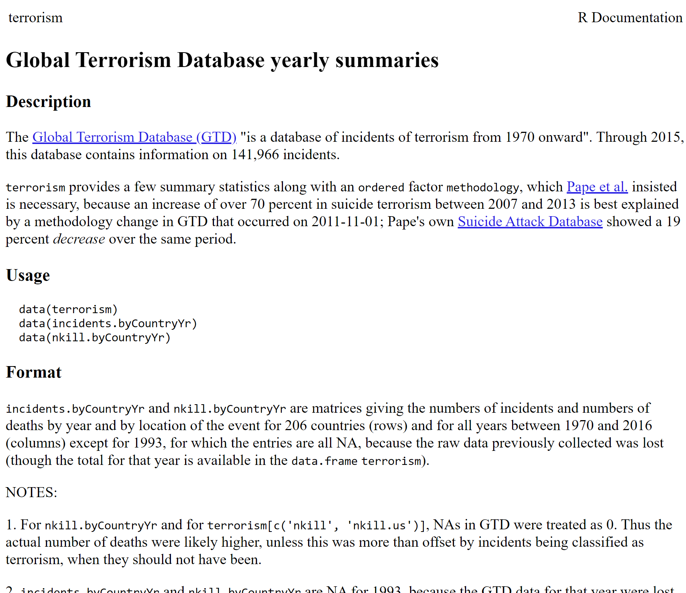

```{r include=FALSE}
library(knitr)
library(data.table)
library(reticulate)
library(magrittr)
library(e1071)

opts_chunk$set(echo = TRUE, cache = TRUE, message = FALSE, warning = FALSE)

dyad <- readRDS("r/Palette_5YR_5B_Dyad.RDS")
palette(dyad[c(9, 20, 66)])
```

# Data exploratie

## Principes van data exploratie

Exploratieve Data Analyse (eng: _Exploratory Data Analysis_; EDA) zal de datawetenschapper helpen om twee hoofddoelen te bereiken

```{definition}
De twee hoofddoelen die de datawetenschapper voor ogen heeft tijden het exploreren van data zijn

- __Begrijpen__ van de data én van processen die tot de data geleid hebben
- __Controleren__ dat de dataset in zijn geheel maar ook elke variabele afzonderlijk aan een aantal eisen voldoet
```

De datawetenschapper wil tijdens het controleren van een variabele de volgende eigenschappen onderzoeken:

<details><summary>__D__ uidelijkheid</summary>Indien de betekenis van de variabele niet achterhaald kan worden, is het vaak veiliger die niet te gebruiken (heeft onder meer met data lekkage te maken)</details>
	
<details><summary>__I__ nformatief</summary>Indien er wel data is maar deze een te lage informatie inhoud heeft</details>
	
<details><summary>__P__ rivacy</summary>Indien de betrokken variabele het risico loopt om de privacy van de eindgebruiker te schenden volgens de opgestelde Privacy Impact Assessment (PIA) of volgens de Vlaamse of Federale wetgeving, dan mag je deze variabele simpelweg niet ontsluiten</details>

<details><summary>__K__ waliteit</summary>Indien om technische redenen de data niet bruikbaar zou zijn. Voorbeeld: te moeilijk om de data te ontrekken (bij bijv. vrije tekst), onvoldoende resolutie (bij metingen of afbeeldingen), té complex data type (bijv. circulaire), &hellip;</details>

<details><summary>__E__ thiek</summary>Het onderwijs is niet immuun voor stereotypering op basis van geslacht, afkomst, leeftijd, enz&hellip;. Het trainen met tendentieuze data leidt tot een tendentieus algoritme. Om dit te voorkomen laat je best variabelen weg die mogelijk wel een zeker voorspellend vermogen hebben maar die de vooringenomenheid uit het verleden zou bevestigen. In dit geval rapporteer je waarom je die variabele niet wenst te gebruiken, zelfs als zou de wet het toelaten.</details>

<details><summary>__V__ oorradig</summary>Indien méér dan &plusmn;30% ontbreekt (NULL, NA, "", -1, &hellip;), kunnen vele leeralgortimen de data niet gebruiken</details>

<details><summary>__E__ chtheid</summary>Indien de data weinig betrouwbaar lijken in de zin dat ze vermoedelijk geen goede weerspiegeling zijn van de realiteit, i.e. ofwel vermoedelijk inaccurate data of niet representatief (bijv. slechts geldig voor beperkte subset)</details>
	
<details><summary>__R__ elevantie</summary>Indien gegeven de doelstelling van het onderzoek er geen goede verantwoording (technisch noch functioneel) gevonden kan worden waarom deze variabele zou worden opgenomen (naar alle belanghebben zoals opdrachtgever en eindgebruiker algoritme), dan kan je deze ook beter niet gebruiken</details>

```{r dipkever, echo=FALSE}

```

## Stappen in data exploratie

Elke exploratie is anders en iedereen heeft zo zijn eigen methode, maar als leidraad kan je deze stappen volgen:

1. Zorg eerst dat je zo veel mogelijk begrijpt van de data nog vóór je in detail in de variabelen begint te duiken. Lees het codeboek of andere omschrijvingen. Vraag indien mogelijk hulp van iemand die al wel op de hoogte is
2. Controleer of er tabellen, rijen of kolommen zijn die je niet nodig hebt voor jouw analyse en filter de overbodige data desgevallend weg zodat je hier ook geen tijd mee hoeft in te steken
3. Begrijp wat één instantie (rij) hier precies voor staat en controleer of het aantal rijen dan ook logisch is
4. Controleer nu pas de overblijvende data variabele-per-variabele
   a. Lees de omschrijving van de variabele en kijk naar een samenvatting of een willekeurige steekproef van de variabele
   b. Loop de DIPKEVER criteria één voor één af
   c. Beslis op basis hiervan of je de variabele wenst te houden (eng: _keep_) of te verwerpen (eng: _drop_)
   d. Maak korte notities
5. Kijk naar de paarsgewijze correlaties (eng: _pair-wise correlations_) onder de variabelen

## Voorbeeld data exploratie

We gaan dit doen aan de hand van een voorbeeld (in R). _Je kan de Markdown code van deze cursus downloaden en meevolgen door de codeblokken één voor één uit te voeren._

_Vraag_: Sommige mensen zeggen dat er steeds méér terrorisme is in de wereld. Andere zeggen dat er altijd al terrorisme heeft bestaan. Wie heeft er gelijk?

_Antwoord_: Via de [bovenstaande link](https://vincentarelbundock.github.io/Rdatasets/datasets.html) naar de standaard datasets vinden we twee datasets met het woordje "terrorism" in de titel. Ééntje heeft 206 rijen (`nkill.byCountryYr`), laten we die eens van naderbij bekijken:

```{r}
library(Ecdat)
library(magrittr)

?terrorism
```

Zorg er eerst voor dat je deze pakketten installeert (eenmalig) via `install.packages` of via de Packages-tab in RStudio. Als alles goed verlopen is, krijg je de documentatie te zien:

```{r terrorism-help, echo=FALSE}

```

We onderzoeken nu de documentatie en vinden dat de databank wel erg relevant en professioneel lijkt, maar niet zo up-to-date (1970 - 2015). Toch beslissen we om door te gaan met deze dataset. We lezen dat er eigenlijk drie datasets zijn, telkens met hun eigen structuur:

`terrorism`: Jaartal &times; {verscheidene aantallen per type aanslag, locatie (wereld versus VS) en type slachtoffers}

`incidents.byCountryYr`: Aantal aanslagen per {Land &times; Jaartal}

`nkill.byCountryYr`: Aantal slachtoffers per {Land &times; Jaartal}

Hierop lanceren we de vraag:

__Vraag terug__: met 'méér terrorisme', bedoel je méér aanslagen of méér slachtoffers

Stel dat de opdrachtgever het volgende antwoord geeft:

__Antwoord terug__: méér aanslagen

We kunnen nu zowel de eerste als de tweede gebruiken. We kiezen de eerste omdat daarin meer informatie vervat zit. We hebben die extra informatie nu niet nodig, maar misschien later wel. Één instantie (een rij) komt overeen met een jaartal. We zien onmiddellijk dat we de volgende variabelen nodig hebben uit de `terrorism` dataset:

- `year`: het jaar waarin de aanslag werd gepleegd, als natuurlijk getal, uniek voor elke rij
- `incidents`: het aantal aanslagen voor dat jaar wereldwijd

```{r}
dat <- terrorism %>%
	as.data.table %>%
	extract(, .(year, incidents))
```

We overlopen de DIPKEVER criteria. De data zijn duidelijk en informatief. Ze lijken de privacy van niemand te schenden omdat het om geaggregeerde gegevens gaat, wereldwijd en telkens samengevat voor een heel kalenderjaar.

Kwaliteit. We beginnen met de controle dat het jaartal en de incidenten als natuurlijke getallen worden behandeld.

```{r}
dat %>% apply(2, class)
```

`numeric` datatype in R stellen de reële getallen voor, niet natuurlijke getallen. Dat is geen ramp, natuurlijk, omdat $\mathbb{N}\subset\mathbb{R}$ maar kan soms problemen geven, laten we dit rechtzetten:

```{r}
dat[, year := year %>% as.integer]
dat[, incidents := incidents %>% as.integer]

dat %>% apply(2, class)
```

Nu controleren we of het jaartal inderdaad loopt van 1970 tot en met 2015:

```{r}
dat$year %>% summary
```

en we kunnen ook nakijken of het jaartal uniek is:

```{r}
dat$year %>% duplicated %>% any
```

De incidenten zijn ook natuurlijke getallen, maar van een andere soort dan het jaartal. De incidenten zijn namelijk ook aantallen en dit heeft heel wat statistische consequenties. Het betekent onder meer dat we voor deze variabele een histogram kunnen genereren:

```{r, out.width="318px", fig.asp=.8}
dat$incidents %>%
	hist(main = "Verdeling aantal aanslagen", xlab = "# aanslagen per jaar",
		ylab = "Frequentie")
```

Hierin zien we dat er in het totaal meer dan 30 jaren zijn met minder dan 5000 aanslagen per jaar wereldwijd en dat er 3 jaren zijn met meer dan 10 000 aanslagen.

Dit was de K van DIPKEVER, we zetten onze tocht voort. Over ethiek: voor velen is dit natuurlijk een gevoelig onderwerp maar het weergeven van de aantallen aanslagen kan moeilijk als aanstootgevend worden gezien. Bovendien worden hier nog geen voorspellingen gemaakt, dus dat lijkt in orde. Er ontbreken geen data (dus voorradig). Het consortium rond de Studie van Terrorisme en Responsen op Terrorisme (START) is verantwoordelijk voor de data en gezien hun staat van dienst en academische publicaties waaronder sommige in in gerenommeerde tijdschriften, lijken ze op het eerste gezicht betrouwbaar (cfr. Echtheid). Tenslotte zijn de data ongetwijfeld relevant en daarmee slagen ze voor de volledige DIPKEVER test. Het onderlinge correleren van beide variabelen biedt hier geen meerwaarde.

De exploratiefase is voorbij. Het volstaat ons nu om een grafiek op stellen waarbij het aantal aanslagen in de tijd wordt gevolgd:

```{r}
dat <- dat[order(year)]
void <- dat[, plot(incidents ~ year, type = "l",
	main = "Verloop aantal aanslagen wereldwijd",
	xlab = "Kalenderjaar", ylab = "Aantal aanslagen per jaar")]
```

_Conclusie_: Ja, het aantal gerapporteerde terroristische aanslagen lijkt volgens de START (@pape2014) toegenomen te zijn in de periode 2010 - 2015 ten opzichte van de periode 1970 - 2010.

## Univariate verdelingen

We zagen net hoe je met een eenvoudige opdracht een histogram kunt opstellen voor een variabele. Het histogram, geïntroduceerd in de paragraaf rond [Soorten variabelen](#soorten-variabelen), geeft de verdeling weer van de waarden van één variabele (_univariaat_, eng: _univariate_) langsheen de meetschaal van de variabele. Dat is cruciale informatie. Één blik op de verdeling geeft antwoord op de volgende vragen:

- Wat is het datatype?
- Lijkt het een gekende _theoretische verdeling_ te volgen?
- Heeft een duidelijke modus, meerdere modi?
- Lijkt het erop dat de data een natuurlijke oorsprong kennen of is de data mogelijk gemanipuleerd?
- Wat is de resolutie van de meting?
- Lijken er limieten te zijn waartussen de waarden zich bevinden

```{example}
Laten we de dataset rhDNase van naderbij onderzoeken met als doel om uitsluitend naar de verdelingen te kijken.
```

We beginnen met het laden van de dataset en het tonen van de interne structuur (`str`) van het object dat de data bevat

```{r}
library(survival)

data(rhDNase)

rhDNase %>% str
```

We gaan nu één voor één de variabelen af:

- `id`: _subject id_. Is de identiteit en het heeft geen nut om hier een verdeling van de trekken.
- `inst`: _enrolling institution_. Dit is  een `integer`, dus dat lijkt niet te kloppen, want we verwachten een organisatie hier. We behandelen het dan ook als categorische (nominale) variabele (`factor` in R) en maken een staafdiagram (eng: _bar plot_). Er is geen betekenisvolle sortering mogelijk bij categorische variabelen, maar het is een goed gewoonte om te toch even van frequent naar minder frequent te sorteren om een zicht te krijgen om de curve die zo ontstaat.

```{r}
rhDNase <- rhDNase %>% as.data.table
rhDNase[, inst := inst %>% factor]
rhDNase$inst %>% table %>% sort %>% rev %>% 
	barplot(xlab = "Enrolling institution", ylab = "# of instances",
		main = "Distribution of the institutions", cex.names = .6, las = 2)
```

   Er zijn wel een aantal dominantere instituten maar die dominantie lijkt niet te extreem er blijft een goede verdeling tussen de verschillende instituten van grofweg 10-15 instanties per instituut.
- `trt` _treatment arm: 0=placebo, 1= rhDNase_ Een arm betekent hier een vertakking van de beslissingsboom die gebruikt wordt om patiënten in een bepaalde categorie te plaatsen. Zulke een binaire kan je evengoed met een staafdiagram voorstellen, maar hier heb je duidelijk een controle experiment (de placebo-arm) en volstaat het om de verhouding behandeld/placebo mee te geven omdat alle informatie van de verdeling hierin vervat zit:

```{r}
rhDNase$trt %>% sum %>% divide_by(rhDNase %>% nrow) %>%
	multiply_by(100) %>% 
	sprintf("%.1f%%", .)
```

   Dit ligt héél dicht bij 50% en we kunnen dus zeggen dat de groepen mooi _gebalanceerd_ zijn zoals het hoort
- `entry.dt`: _date of entry into the study_. Uit de structuur zagen we al dat het formaat correct in ingesteld als datum. Een datum is _in theorie_ een continue variabele omdat er tussen twee willekeurig gekozen tijdstippen oneindig veel nieuwe tijdstippen liggen. Bovendien heeft een datum geen betekenisvol nulpunt. Voor een continue variabele is een densiteit-diagram beter geschikt dan een histogram:

```{r}
rhDNase[, entry.dt.num := entry.dt %>% as.numeric]

rhDNase$entry.dt.num %>% density %>%
	plot(xaxt = "n", main = "Distribution of start dates ", xlab = "")

axis(1, las = 2, cex = .8,
	at = rhDNase$entry.dt %>% pretty,
	labels = rhDNase$entry.dt %>% pretty)

rhDNase$entry.dt.num %>% rug
```

   Hier zien we dat de rekrutering van deelnemers voor de klinische studie na één maand op een laag pitje te hebben gestaan pas goed op gang is gekomen. De densiteit laat twee pieken zien (modi), we spreken van een _bimodale verdeling_.
- `end.dt`: _date of last follow-up_. Is sterk gelijkend op het vorige. Laten we deze feature gebruiken om de loopduur van elke instantie te berekenen en de distributie hiervan in grafiek te zetten (zie Oefening \@ref(exr:distributie-loopduur)).

```{exercise distributie-loopduur}
Probeer de distributie voor de loopduur per instantie in beeld te brengen en te  beschrijven wat je ziet.
```

```{solution echo=FALSE}
rhDNase[, end.dt - entry.dt] %>% as.numeric(unit = "days") %>% density %>% plot
```

- `ivstart` en `ivstop`_days from enrollment to the start of IV antibiotics_  en _days from enrollment to the cessation of IV antibiotics_ (IV staat voor intraveneus) Deze laatste twee variabelen zijn weer verschillend: het gaat om discrete aantallen ($\subset \mathbb{N}$), dus geen kommagetallen, maar, tegen de verwachting, wél negatief kunnen zijn. Bovendien zijn er erg veel ontbrekende waarden:

```{r}
rhDNase$ivstart %>% head(32)
```

```{r}
rhDNase$ivstart %>% is.na %>% table
```

   We kunnen zelfs zeggen dat er voor `ivstart` meer gaten zijn dan kaas. We kunnen alsnog de verdeling onderzoeken van de overblijvende waarden:

```{r}
rhDNase$ivstart %>% hist(
	main = "Verdeling wachttijd voor behandeling",
		xlab =  "wachttijd", ylab = "# instanties")
abline(v = 0, lwd = 2)
```

   We zien een verdeling die eerder uniform is dan wel normaal. Ook hier kunnen we nu de verdeling van de behandelingsduur in grafiek zetten:

```{r}
par(mfrow = 1:2)

rhDNase[, ivstop - ivstart] %>%
	hist (main = "Behandelingsduur")
rhDNase[, ivstop - ivstart] %>% log %>%
	hist(main = "ln(Behandelingsduur)")
```

   De eerste grafiek laat zien dat de behandelingsduur nogal  [rechtsscheef](https://nl.wikipedia.org/wiki/Scheefheid) verdeeld is. De transformatie door middel van de natuurlijke logaritme ($ln(x)=\,^elog(x)$) veranderd de verdeling in iets wat normaler lijkt. We zeggen dat de behandelingsduur _lognormaal_ verdeeld lijkt te zijn. Laten we de theoretische curve erbij zetten om de afwijkingen tussen werkelijk en theoretisch te visualiseren:

```{r}
bduur_log <- rhDNase[,  log(ivstop - ivstart)]
bduur_log <- bduur_log[!is.na(bduur_log) & !is.infinite(bduur_log)]

bduur_log %>% hist(main = "ln(Behandelingsduur)", freq = FALSE, n = 20)

x <- (1:60 / 10)
y <- x %>% dnorm(
	mean = bduur_log %>% mean,
	sd = bduur_log %>% sd)

lines(x, y , col = 1, lwd = 3)
```

We kunnen verdelingen ook met andere grafiek-types in beeld brengen. De meest populaire zijn de [boxplot](https://nl.wikipedia.org/wiki/Boxplot), de {dot plot}(https://en.wikipedia.org/wiki/Dot_plot_(statistics)), de [beeswarm plot](https://www.r-statistics.com/2011/03/beeswarm-boxplot-and-plotting-it-with-r/#:~:text=A%20bee%20swarm%20plot%20is,controlling%20the%20characters%20and%20colors.) en de [violin plot](https://en.wikipedia.org/wiki/Violin_plot).

```{exercise}
Tracht de verdeling van de logaritmisch geschaalde behandelingsduur te visualiseren door middel van de functies `base::dotchart`, `base::boxplot`, `beeswarm::beeswarm` en `vioplot::vioplot `. De oplossing moet er zo uit zien:


> Tip: Als je meer dan 300 characters nodig hebt, weet je dat je te ver aan het zoeken bent.

> Opgelet: de variabele `bduur_log` wordt voor deze oefening verwacht in scope te zijn.
```


```{r}
library(beeswarm)
library(vioplot)

par(mfrow = c(2, 2), pch = 19, mar = rep(1, 4), xaxt = "n")

bduur_log %>% dotchart(pch = 19, lcolor = NA)
bduur_log %>% boxplot(horizontal = TRUE)
bduur_log %>% beeswarm(horizontal = TRUE)
bduur_log %>% vioplot(horizontal = TRUE)
```

## Correlatie tussen twee variabelen

Om correlatie te begrijpen simuleren we een [bivariate verdeling](https://en.wikipedia.org/wiki/Joint_probability_distribution) met verschillende covariantie-matrices (zie figuur \@ref(fig:correl-demo)).

```{r correl-demo, fig.asp=1, fig.cap="(ref:correl-demo)"}
library(MASS)
library(latex2exp)

copula <- function(n, rho, mu1, mu2, sd1, sd2){
  mu <- c(mu1,mu2)
  sigma <- matrix(c(sd1 ^ 2, sd1 * sd2 * rho, sd1 * sd2 * rho, sd2 ^ 2),2)
  mvrnorm(n, mu, sigma) %>% as.data.table
}

par(mfrow = c(2, 2), mar = c(2, 3, 2, 1))

for(rho in c(.05, .33, .66, .95)){
	dat <- copula(1000, rho, 0, 0, 1, 1)
	dat %>% plot (xlab = "", ylab = "", pch = 19, cex = .7,
		xlim = c(-3, 3), ylim = c(-3, 3))
	text(-2.5, 2.7, TeX(sprintf("$\\rho = %.2f$", rho)))
	
	text(2, -2.7, TeX(sprintf("$\\hat{\\rho} = %.4f$",
		dat %>% cor %>% extract(1, 2))))
}
```

(ref:correl-demo) Demonstratie van de correlatie tussen twee variabelen. Merk op hoe de geschatte correlatie coëfficiënt de werkelijke benaderd. De covariantie matrix komt overeen met $$\begin{bmatrix}1 & \rho\\\rho & 1\end{bmatrix}$$

```{remark}
__Opgelet__: een correlatie tussen twee variabelen is geen garantie voor een causaal verband. Bekijk deze kennis-clip om te begrijpen hoe je wel een causaal verband kan onderzoeken:
	
<iframe width="566" height="318" src="https://www.youtube.com/embed/HUti6vGctQM" frameborder="0" allow="accelerometer; autoplay; encrypted-media; gyroscope; picture-in-picture" allowfullscreen></iframe>
```
