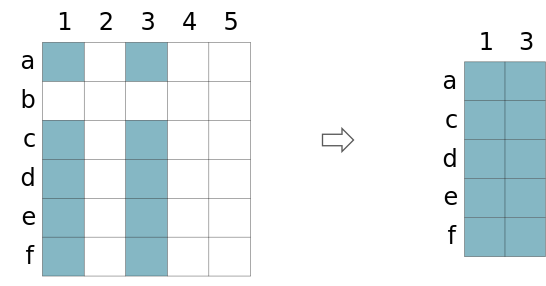
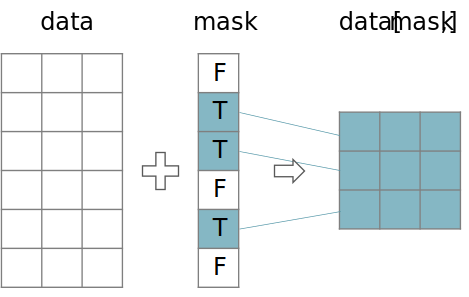

```{r include=FALSE}
library(knitr)
library(data.table)
library(reticulate)
library(magrittr)
library(e1071)

opts_chunk$set(echo = TRUE, cache = TRUE, message = FALSE, warning = FALSE)

dyad <- readRDS("r/Palette_5YR_5B_Dyad.RDS")
palette(dyad[c(9, 20, 66)])
```

# Manipuleren van data

```{lemma data-exploratie-2}
Past de juiste principes toe tijdens het exploreren, hanteren en opkuisen van data ([_EA_LD758_](#leerdoelen)).
```

Hieronder volgt een korte samenvatting van een aantal vaak gebruikte transformaties. Waarom zou je data willen transformeren. Hier staan een aantal redenen opgesomd:

- Om duidelijkheid te scheppen en de data leesbaarder te maken voor mensen
- Om de data voor te bereiden voor statische analyse
- Om nieuwe variabelen te creëren (eng: _feature engineering_)
- Om eenvoudiger [gedistribueerd en parallel](https://nl.wikipedia.org/wiki/Gedistribueerd_programmeren) te kunnen programmeren
- Om de data te standaardiseren volgens CDMs (_common data models_) van het bedrijf (zoals voor een EDM Enterprise Data Model) of van een discipline (zoals [CDISC standaarden](https://www.cdisc.org/standards) in de klinische wereld)
- Om de data te onderworpen aan de regels van een bepaalde type opslag software. Wil je bijvoorbeeld de analyse dataset bewaren in een relationele databank, dan zal je rekening moeten houden met de regels rond primary, surrogate en foreign keys.

## Kort overzicht van de manipulaties

### Filteren en versnijden (eng: _subsetting_, _slicing_)

Het versnijden is hier te interpreteren in de betekenis van _aan stukken van een bepaalde vorm snijden_ en niet bijvoorbeeld in de betekenis van _aanmengen met iets van mindere kwaliteit_. Het komt er op neer dat er een selectie van variabelen en instanties gemaakt wordt.

```{r versnijden, fig.cap="(ref:versnijden)", echo=FALSE}

```

(ref:versnijden) Schematisch overzicht van het versnijden van een dataset.

Denk eraan dat het selecteren van van variabelen een courante activiteit is, terwijl het selecteren van instanties eerder zeldzaam is.

```{definition outliers}
Het achterhouden of selecteren van variabelen, maar voornamelijke van instanties, kan vertrekkende gevolgen hebben. De datawetenschapper moet in het algemeen alle manipulaties maar filter-operaties in het bijzonder zoals het versnijden volledig en transparant rapporteren.
```

Dus voorzichtig heid geboden. Maar in sommige gevallen is het verantwoord om ook instanties uit de dataset te filteren:

- De data bevat uitlopers die verantwoord kunnen worden of die zonder twijfel veroorzaakt worden door een foutieve invoer
- De combinatie van sommige variabelen voor een bepaalde instantie is heel waarschijnlijk foutief en is niet het gevolg van structurele maar eerder van eenmalig fouten in de dataset of het invoer-proces
- Een instantie bevat een combinatie van variabele waarden die de privacy van één of meerdere personen in het gedrang brengt

```{example vb-versnijden, name="Versnijden van data"}
De wijn kwaliteit dataset bevat mogelijk outliers in de suikerwaarden, laten we dat eens nader bekijken.
```

```{r oef-versnijden-1}
rode_wijn <- fread("https://archive.ics.uci.edu/ml/machine-learning-databases/wine-quality/winequality-red.csv")

rode_wijn[, `residual sugar`] %>%
  density %>%
  plot (main="Residual sugar (g/L)")
```

Stel dat rode wijn met een suikergehalte boven de 10g/L wordt afgedaan als fruitsap, dan zou je er van uit mogen gaan dat er een aantal uitlopers zijn, zo halen we ze eruit:

```{r oef-versnijden-2}
aantal_uitlopers <- rode_wijn[`residual sugar` > 10, .N]

rode_wijn_echt <- rode_wijn[`residual sugar` < 10]

rode_wijn_echt$`residual sugar` %>%
  density %>%
  plot (main="Residual sugar (g/L)",
    sub = paste("Excluding", aantal_uitlopers,
      "'outliers' above 10g/L"))
```

### Booleaans masker

Een booleaans masker is gewoon een vector of lijst van booleaanse waarden die gebruikt kunnen worden om uit data frames en data tables die rijen te selecteren die overeenkomen met `TRUE` in het masker. 

```{r masker, echo=FALSE}

```

In het Voorbeeld \@ref(exm:oef-versnijden-2) werd er reeds van een masker gebruik gemaakt:

```{r masker-vb}
rode_wijn[,`residual sugar` < 10] %>% head(50)
```

### (Eng.) Grouping and Aggregation

Upon Grouping the data table according to one or more features, the other variables need to be aggregated en this can be done using:

- Selection (first, last, second value, &hellip;)
- Measures of central tendency (mean, median, &hellip;)
- Measures of dispersion (variance, range, standard deviation, IQR, &hellip;)
- Extremes (min, max)
- Counts (Count, unique count, sum, majority vote, counts of missing values, &hellip;)

### (Eng.) Transforming text

|Transformation|Example|Possible justification|
|-|-|-|
|Change Encoding|`UTF16` &rarr; `UTF8`|Avoid software incompatibilities|
|Change Casing|`"tfr523"` &rarr; `"TFR523"`|Avoid confusing and allow for proper comparison|
|Trim|`" TFR523"` &rarr; `" TFR523"`|Ensure proper identification & comparison|
|Add Leading zeroes|`"653"`, `"61"`, &hellip; &rarr; `"0653"`, `"0061"`, &hellip;|Avoid str/num confusion by humans and machines|
|Add prefix|`"0653"` &rarr; `"UHR0653"`|Avoid confusion with other IDs|

### (Eng.) Re-Scaling Numerical Values

Here are some of the countless different types of re-scaling:

- [Logarithm](https://www.medcalc.org/manual/_help/images/logtransformation.png)
- [Logit-transform](https://miro.medium.com/max/1244/1*vEiAxU_mVmFIOvf-xzTolw.png)
- Normalization to a fixed maximum value
- Standardization (to a mean of 0 and a variance of 1)
- Division by another field (e.g. `Quantity_By_Month / Days_Per_Month`, `Revenue_By_Store / Sold_By_Store`, `Quantity / Weight_Per_Unit`, &hellip;)
- Multiplication (e.g. `Quantity x Unit_Price`, `Quantity x Unit_Cost`)
- Subtraction (e.g. `Sales_value – Sales_cost`)

### (Eng.) Discretizations

Is going from continuous data to more discrete data. Here are some examples:

- Rounding ([2.25, 2.35] &rarr; [2.2, 2.4])
- Binning ([here](https://docs.tibco.com/pub/sfire-bauthor/7.5.0/doc/html/en-US/GUID-DE9E9072-F026-4E05-BB89-6AB803917351-display.png) and [here](https://blogs.sas.com/content/iml/files/2013/07/bin2d2.png))

Mind that discretization always leads to loss of information.

### (Eng.) Information Content

The information of a feature or an entire data set can be measured using indices such as the Shannon Entropy or the limiting density of discrete points.

### (Eng.) Reformatting, Type Conversion, Casting or Coercion

Examples:

- String to Integer or vice versa
- Reformatting date to ISO-8601 (`"07/04/2008` &rarr; `"2007-07-04" (YYYY-MM-DD)`)

### (Eng.) Changing numerical Values 

Far more invasive then re-scaling is when the data is changed based on some custom algorithm. An example hereof is the removal of a drift in the data (de-trending). Similarly, seasonal effects in time series data can be compensated away. Such changes can obviously impact the outcome of the analysis significantly and needs thorough justification.

## (Eng.) Changing Category Names

This is sometimes called **recoding** or **refactorization** and only affects nominal features. It serves to adhere to EDM, to the standards of the DWH and to ensure compatibility across data sets. Alternatively, it simply ensures that misspelled category names are being corrected and alternative spellings are being merged.

## (Eng.) Imputation

Imputation is the completion of missing data. Depending of the patterns the 'holes' in the data display or on prior knowledge, separate techniques exist to fill in the blanks.

## Onbehandeld

De volgende onderwerpen werden niet behandeld, ik hoor het graag als jullie individueel of als groep hier meer over willen leren:

- Anonimiseren en pseudonimiseren