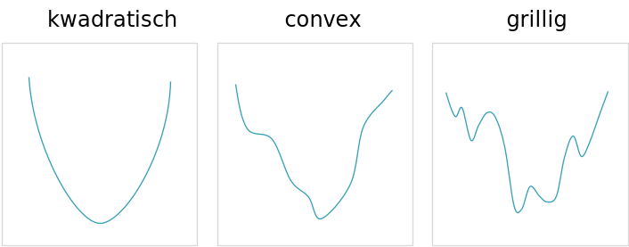

```{r include=FALSE}
library(knitr)
library(data.table)
library(reticulate)
library(magrittr)
library(e1071)
library(rgl)
library(rglwidget)

opts_chunk$set(echo = TRUE, cache = TRUE, message = FALSE, warning = FALSE)

dyad <- readRDS("r/Palette_5YR_5B_Dyad.RDS")
palette(dyad[c(9, 20, 66)])
knit_hooks$set(webgl = hook_webgl)
```

# Diagnose

## Leren leven met de onzekerheid

Misschien wel het belangrijkste aspect van ML is dat er nooit een garantie dat het gaat lukken. Vele mensen schijnen het hier erg moeilijk mee te hebben. Men zegt zegt al te vaak:

<q>We will be able to predict&hellip;</q>

Waar voorzichtigheid hier op zijn plaats is:

<q>We hope to able to predict&hellip;</q>

Dat betekent nog niet dat voorspellen onmogelijk is. We gaan ons best doen om, als er een patroon in de data verborgen zit, deze er ook uit te krijgen.

```{definition}
ML is geen toverkunst. Je kan __nooit__ garanderen dat je een correcte voorspelling kan maken van iets wat nog niet geweten is.
```

## Meten van de prestatie van een model

Omdat we nooit zeker zijn dat ons model goed zal voorspellen, moeten we dus ons best doen om de prestaties zo hoog mogelijk te houden. En dat begint daar weer bij het meten van de prestaties. Maar hoe meet men de prestatie van een model? Uit de paragraaf [Leren versus onthouden](#leren-versus-onthouden) leerden we wat overfit is en wat het verschil is tussen regressie en ML. Hieruit volgt de Stelling \@ref(def:prestatie-principe).

```{definition prestatie-principe}
De prestatie van een model wordt niet zomaar gemeten op basis van hoe goed het iets kan voorspellen. De prestatie van een model wordt in principe gemeten op basis van hoe goed het uitkomsten kan voorspellen gebruik maken van test-data, i.e. invoerdata waar noch het model, noch het leeralgoritme noch de datawetenschapper eerder mee in aanraking kwamen.
```

## Training-, validatie- en test-set

We begrijpen nu dat het trainen van een model en het testen van een model dient de gebeuren op afzonderlijke subsets van de data. Dus de oplossing is het opsplitsen van de data. De belangrijkste opsplitsing van data is die tussen de _training-set_ en de _test-set_. De training set is de set van _instanties_ (zie hoofdstuk over [data](#data) als je deze term niet kent) waarmee het leeralgoritme getraind zal worden. De test-set krijgt het leeralgoritme niet te zien tot op het laatste, wanneer de prestaties van het model getest worden. Ook de datawetenschapper mag de test-set in principe niet zien en in professionele omgevingen wordt dit ook letterlijk genomen en is er een tussenpersoon tussen data leverancier en datawetenschapper die voor de opsplitsing zorgt.

Er zijn verschillende manieren om de opsplitsing te verwezenlijken. Meestal krijgt men te maken met een _randomisatie_, dat is een opsplitsing op willekeurige basis, maar waarbij enkel de relatieve grootte van de training- en test-set worden meegegeven.

In R:

```{r eval=FALSE}
data(mtcars)

set.seed(42)
trn_msk <- runif(nrow(mtcars)) < .75

trn <- mtcars[trn_msk, ]
tst <- mtcars[!trn_msk, ]

cat("mtcars: ", mtcars %>% dim %>% paste0(collapse = " × "), "\n")
cat("trn: ", trn %>% dim %>% paste0(collapse = " × "), "\n")
cat("tst: ", tst %>% dim %>% paste0(collapse = " × "), "\n")
```

De variabele `trn_msk` heet zo omdat het om een Booleaanse _masker_ (eng: _mask_; zie &sect; [Booleaans masker](#booleaans-masker)) gaat. 

In Python worden de features en de uitkomst (cfr. [data](#data)) meestal gescheiden gehouden (om dan vaak terug samen te brengen met `zip` :-)) en wordt er een helper-functie uit de `sklearn` bibliotheek aangeroepen:

```{python}
from sklearn.model_selection import train_test_split
from sklearn.datasets import load_wine

X, y = load_wine(return_X_y=True)

X_trn, X_tst, y_trn, y_tst = train_test_split(
  X, y, test_size = 0.25, random_state = 42)

print(f"X: {X.shape}")
print(f"y: {y.shape}")
print(f"X_trn: {X_trn.shape}")
print(f"X_tst: {X_tst.shape}")
print(f"X_trn: {y_trn.shape}")
print(f"X_tst: {y_tst.shape}")
```

Het argument `random_state` in Python en de `set.seed` functie in R dienen om dit proces, dat inherent willekeurig is, toch reproduceerbaar te maken (zie &sect; rond [reproduceerbaarheid](#reproduceerbaarheid)). Zie dit [Wikipedia artikel](https://en.wikipedia.org/wiki/Random_seed) om hier meer over te leren.

```{definition}
Regels rond de test set:

- De test-set blijft _altijd_ verborgen voor het leeralgoritme
- De test-set blijft verborgen voor de datawetenschapper en het model tot helemaal op het einde wanneer de prestatie van het model word gemeten
- De test-set mag slechts één keer gebruikt worden, daarna is het gewoon data en mag het wel als training data gebruikt worden, maar mag het niet langer dienen om de prestatie van het model te meten
```

Voor tijdsreeksen en geografische data wordt er zelden van randomisatie gebruik gemaakt. Dat heeft te maken van de autocorrelatie (zie &sect; [Tijd en ruimte](#tijd-en-ruimte)). In plaats daarvan worden hier ofwel een bepaald gebied of bepaalde tijdspanne als test-set uitgekozen. Bijvoorbeeld, voor een tijdsreeks:

```{r forecast-usa-deaths, fig.cap="(ref:forecast-usa-deaths)", fig.asp=.8}
library(forecast)

USAccDeaths %>% ets %>% forecast(h = 48) %>%
  plot(ylab = "Monthly totals of accidental deaths in USA")
abline(v = 1979, lty = 2)
```

(ref:forecast-usa-deaths) Voorspelling van aantal Amerikaanse slachtoffers na 1979 (stippellijn). De grillige gekleurde lijn links van de stippellijn geeft het werkelijke aantal weer. De tegenhanger rechts van de stippellijn geeft de best mogelijke voorspelling weer na 1979. Het donkergrijze gebied geeft de 80%-predictie-interval weer en het lichtgrijze gebied de 90%-predictie interval. Dit type voorspelling-algoritmes (eng: _forecasting algorythms_) onderscheidt eerst de ruis (eng: _error_) van de trend en de periodiciteit (eng: _seasonality_), vandaar de naam ETS. (ANA) staat voor respectievelijk aan additieve ruis, geen trend (N van 'No') en een additieve periodiciteit.

Naast een training-set en een test set, bestaat er nog zoiets als een _validatie set_. In [één van de latere paragrafen binnen dit hoofdstuk](#hyperparameters) gaan we zien dat er zoiets als hyperparameters bestaan die het verloop van het ML proces mee helpen bepalen. Vaak moeten die hyperparaneters ook nog eerst geoptimaliseerd worden en hiervoor wordt soms een afzonderlijke set, namelijk de _validatie set_ aangewend. Een andere reden om de validatie-set te gebruiken in gewoon om dienst te doen als tijdelijke test-set (omdat we de echte test-set naturlijk maar één keer kunnen aanwenden). Let wel: die opsplitsing in verscheidene subsets zijn niet in steen gebeiteld en kunnen geval-per-geval bekeken worden op basis van de hoeveelheid beschikbare data, het type algoritme, enz&hellip;.

Het zelfde geldt trouwens voor hoeveel percent van de data naar welke subset moet gaan. Er wordt soms de 'gulden regel' &frac23;:&frac13; gebruikt voor de verdeling tussen training- en test-set, maar ook dit hoeft niet vast te liggen. Hoe meer data wordt vrijgehouden om te testen hoe dichter de gemeten prestatie bij de werkelijke prestatie (op een grotere groep nieuwe data, wanneer het algoritme in productie staat) zal aanleunen. Maar hoe meer test-data, hoe minder training-data en wat is het nut om super-precies te prestatie te kunnen meten van een barslecht model.

## Cross-validatie

Dit ideale scenario kan niet altijd gehanteerd worden en daarom laat men een aantal vormen van contact met de test data toe:

```{definition cross-validatie}
Alvorens de finale bekendmaking van de prestatie van het model kan men 'doen alsof' we met _ongeziene data_ werken door middel van [cross-validatie](#cross-validatie).
```

Het principe is eenvoudig, telkens laat je een deel van de training-set (_test-fold_) weg en train je een model op het overblijvend deel (_training fold_). Je kan nu de prestatie $\varepsilon_i$ meten om het weggelaten deel te voorspellen. Daarna voeg je de test-fold weer bij de rest en ga je voort met het volgende deel (\@ref(fig:cv-voorbeeld)). In het voorbeeld worden de scores van de folds uitgemiddeld, maar je kan hier ook kiezen om de beste te nemen (bijvoorbeeld met de kleinste fout) of nog een andere vorm van aggregatie toepassen.

```{r cv-voorbeeld), echo=FALSE, fig.cap="(ref:cv-voorbeeld)"}
include_graphics("img/cv_example.svg")
```

(ref:cv-voorbeeld) cross-validatie voorbeeld. Een dataset met dimensies $9\times3$ wordt eerst op gesplitst in een training set van $\frac23$ en een test set van $\frac13$. Van de training set wordt telkens $\frac16$ opzij gehouden als test fold. De resultaten van de validaties van elke fold $\varepsilon_i$ worden geaggregeerd in $\varepsilon_{cv}$ door het gemiddelde te nemen. Pas op het einde van dit proces wordt eenmalig de finale prestatie $\varepsilon_{final}$ berekend.


```{r cv-strategie), fig.cap="(ref:cv-strategie)", echo=FALSE, out.width="300px"}
include_graphics("img/cv_strategy.svg")
```

(ref:cv-strategie) Een model voorbeeld van hoe een cross-validatie strategie past binnen een begeleid ML proces.

## De beoordelingsfunctie

Met een beoordelingsfunctie ($\varepsilon$; eng: _objective function_) bereken je de prestatie van een model door de uitvoer van het model $\hat{y}$ te vergelijken met de werkelijke uitkomst $y$. Er zijn veel mogelijke verschillende verliesfuncties afhankelijk van het beoogde doel en type van de uitkomst-variabele. Een populaire keuze wanneer het gaat om reële getallen is de som van de kwadraten van de verschillen (eng: _sum of squared errors_ of kort SME). In feite gaat het over de helft van de som van de kwadraten en waarom dit is, heeft te maken met de differentieerbaarheid ervan (zie &sect; [backpropagation](#nackpropagation) voor meer uitleg hierrond).

\begin{equation}
  \varepsilon=E(y,\hat{y})=\frac{1}{2}\sum_{n=1}^{N}{(y_n-\hat{y}_n)^2}
  (\#eq:kwadratensom)
\end{equation}

Naarmate dat het voorspelde resultaat $\hat{y}$ steeds meer begint af te wijken van het werkelijk resultaat $y$, neemt de restterm $\varepsilon$ razendsnel toe (zie interactieve figuur hieronder) en het doel van het leeralgoritme is om de parameters $\mathbf{\theta}$ zodanig aan te passen dat de fout net zijn klein mogelijk wordt. Men zegt dat het doel is om de verliesfunctie te minimaliseren (eng: _minimize_).

```{r convex, eval=FALSE, echo=FALSE}
rgl.open()
options(rgl.useNULL = FALSE)

dst <- function(x, y, center = c(0,0)){
  ((x - center[1]) ^ 2 + (y - center[2]) ^ 2)
}

bg3d(color = "white")

plot3d(dst,xlim=c(-1, 1), ylim=c(-1, 1), type = "wire",
  col = colorRampPalette(1:2),
  xlab = expression(theta[1]),
  ylab = expression(theta[2]),
  zlab = expression(epsilon))

view3d( theta = 0, phi = -60, zoom = .8)

writeWebGL(filename = "img/convex.html" ,  width = 600, height = 600)
```

<iframe width="100%" height="650px" src="img/convex.html" sandbox="allow-same-origin allow-scripts allow-popups allow-forms" style="border:0px;"></iframe>

Een andere belangrijke verliesfunctie is de cross-entropie: Deze wordt gebruikt wanneer de uitkomst variabele een kansverdeling (eng: _probability distribution_) voorstel, i.e. wanneer de waarden voor de uitkomsten reële getallen getallen zijn in het bereiek $[0, 1]$ en wanneer alle waarden voor de categorieën in de uitvoerlaag van het netwerk optellen tot 1. Deze laatste wordt gewaarborgt door de zogenaamde softmax restrictie (zie [Types neuronen](#types-neuronen)).

\begin{equation}
  E(y, \hat{y})=-\frac1N\sum_{n=1}^{N}{\left[y_n\,log(\hat{y}_n) + (1-y) \,log(1-\hat{y})\right]}
  (\#eq:cross-entropie)
\end{equation}

Het is mooi om zulke verliesfunctie in beeld te brengen, maar in werkelijkheid spelen er meer dan twee parameters in het spel en zijn niet alle neuronen lineair. Als gevolg zal de verliesfunctie de vorm van een hypervlak in een meer-dimensionale ruimte gaan innemen en zal de vorm ook veel grilliger zijn dan hier voorgesteld.

## Gradiënt afdaling

De bedoeling is om het laagste punt van de hierboven gedemonstreerde verliesfunctie te vinden. Indien het werkelijk om kwadratische verlies-oppervlakten zou gaan, dan was er geen probleem omdat met het laagste punt dan analytisch zou kunnen vinden, i.e. met een relatief eenvoudige matrix bewerking. Maar in werkelijkheid zijn de verliesfuncties grillig en meerdimensionaal (\@ref(fig:complexe-verlies-landschappen)). Dan is er een soort trial-and-error manier nodig om het laagste punt te vinden.

```{r curve-vorm, fig.cap="(ref:curve-vorm)"}

```

(ref:curve-vorm) Onderscheid tussen kwadratische, convexe en grillige functies, hier voor de eenvoud voorgesteld als abstracte twee-dimensionale functies.

Het zoeken naar zulk een minimum van zulk een functie noemt men een _optimalisatie-probleem_ en een groot deel van het onderzoek naar ANNs situeert zich rond het vinden van een efficiënt optimalisatie algoritme. Deze optimalisatie is trouwens waarnaar in de paragraaf rond de perceptron verwezen werd als zijnde de administratie rondom de functies $f$ en $t$.

```{r complexe-verlies-landschappen, echo=FALSE, fig.cap="(ref:complexe-verlies-landschappen)"}
include_graphics(paste0("https://www.cs.umd.edu/~tomg/img/",
  "landscapes/noshort.png"))
```

(ref:complexe-verlies-landschappen) Voorbeeld van een realistische geprojecteerde verlies-functie bekomen door Ankur Mohan volgens de methode beschreven in @li2018. Kijk ook eens op [losslandscape.com](https://losslandscape.com/) voor artistieke rendering van 'verlies-landschappen'.

Maar goed, laten we, om de eenvoud te bewaren, toch nog even voortbouwen op een verliesfuncties met een eenvoudige convexe vorm. Bij het initialiseren van de parameters met willekeurige waarden stellen we ons een willekeurig punt voor in het $\theta_1\perp\theta_2$-vlak. Vanuit dit punt projecteren we ons op het verlies-oppervlakte, door parallel te lopen met de $\varepsilon$-as totdat we het oppervlakte kruisen. We bevinden ons nu ergens op dit oppervlak, in het punt $e$. Hoe vinden we nu het laagste punt op dit oppervlak? Simpel, volg de weg die het steilst naar beneden gaat en, in het geval van een convexe functie, kom je vanzelf uit op het laagste punt. De weg van de steilste afdaling (eng: _steepest ascent_) wordt wiskundig uitgedrukt als de [gradient](https://nl.wikipedia.org/wiki/Gradi%C3%ABnt_(wiskunde)) $\nabla\varepsilon$ in $e$. Een gradient kan gezien worden als een meerdimensionale afgeleide en kan in een 2-dimensionale context (2 parameters) voorgesteld worden als een raakvlak in het punt $e$. Vandaar de naam van een familie aan optimalisatie-algoritmen en ook de titel van deze paragraaf: gradiënt afdaling (eng: _gradient descent_).

We weten nu in welke richting we moeten gaan, het enige dat overblijft is de grootte van de stap die we in die richting nemen. De grootte van de stap wordt bepaald door de leersnelheid $r$ (eng: _learning rate_). Nemen we te grootte stappen, dan kunnen we het minimum missen doordat we er over springen. Nemen we te kleine stappen, dan duurt het mogelijk te lang en riskeren we bovendien om achter kleine heuveltjes van de ruis te komen vastzitten.

Wanneer we voldoende dicht komen bij het (lokaal) minimum van het verlies-oppervlakte, verwachten we dat de gradient in dat punt heel erg klein wordt. We zeggen dan dat het optimalisatie-algoritme __convergeert__. Wat 'voldoende dicht' precies moet zijn, wordt door de datawetenschapper bepaald en is meestal een arbitrair klein getal. Blijft tijdens het zoeken de gradient fluctueren, dan kan de datawetenschapper beslissen dat de zoektocht vroegtijdig gestaakt wordt alvorens er convergentie bereikt wordt. Er is immers niet altijd een garantie dat convergentie mogelijk is en zelfs als je optimalisatie-algoritme convergeert, heb je bij grillige oppervlakten nooit de garantie dat het lokaal minimum ook het globaal minimum is.

```{definition}
Bij complexe en grillige verlies-oppervlakten zal het vakk zo zijn dat er geen garanties gegeven kunnen worden dat het optimilsatie-algoritme convergeert of dat het gevonden minimum ook de best mogelijk oplossing is.
```

Wiskundig kunnen we de gradiënt-afdaling van het optimalisatie-algoritme als volgt samenvatten:

\begin{equation}
  \theta\leftarrow\theta-r\cdot\nabla\varepsilon(\theta)
  (\#eq:gradient-afdaling)
\end{equation}

De leersnelheid wordt vaak, zoals bij de familie aan optimalisatie-algoritmes die men [_simluated annealing_](https://nl.wikipedia.org/wiki/Simulated_annealing) noemt, bij elke epoch aangepast aan de zogenaamde _temperatuur_ die langzaam afneemt.

## Stochastische en Minibatch gradiënt afdaling

```{r, eval=FALSE, echo=FALSE}
eggholder <- function(x1, x2){
  -(x2 + 47) * sin(sqrt(abs(x2 + x1/2 + 47))) -
    (x1 * sin(sqrt(abs(x1 - (x2 + 47)))))
}

rgl.open()
options(rgl.useNULL = FALSE)


bg3d(color = "white")
lim <- c(-600, 600)
plot3d(eggholder, xlim = lim, ylim = lim, type = "wire",
  col = colorRampPalette(1:2),
  xlab = expression(theta[1]),
  ylab = expression(theta[2]),
  zlab = expression(epsilon))

view3d( theta = 0, phi = -60, zoom = 1.2)

writeWebGL(filename = "img/eggholder.html" ,  width = 600, height = 600)
```

<iframe width="100%" height="650px" src="img/eggholder.html" sandbox="allow-same-origin allow-scripts allow-popups allow-forms" style="border:0px;"></iframe>

De afdaling zoals beschreven in vorige paragraaf baseert zich op verlies-landschappen die berekend werden op de ganse dataset. In dat geval spreekt men van _batch gradiënt afdaling_ (eng: _batch gradiënt descent_). Zoals reeds aangehaald, deze strategie werkt niet goed wanneer het oppervlakte van het verlies-landschap grillig is zoals in het voorbeeld hier direct boven. Die grilligheid wordt veroorzaakt omdat net de verliesfuncties van alle instanties in de dataset samen worden beschouwd. In de _stochastische gradiënt-afdaling_ (eng:_stochastic gradient descent_) worden de verlies-hypervlakken berekend telkens voor slechts één instantie tegelijk. Deze benadering maakt dat de rekentijd bij grote datasets te hoog zou oplopen. Daarom is er een tussenvorm bedacht, de _minibatch gradiënt-afdaling_ (eng: _minibatch gradient descent_). HIer wordt telkens een subset (de minibatch) van de dataset gebruikt om het verlies-oppervlak te berekenen. De minibatch grootte is een hyperparameter van het leeralgoritme.

Je kan waarschijnlijk hele bibliotheken vullen met informatie over de verschillende optimalisatie-algoritmen, maar hier volstaat het om te weten dat er erg veel verschillende zijn en dat er nog actief onderzoek naar wordt gedaan.

## Uitwendige invloed

TODO: externe invloed op de beslissingen van een datawetenschapper met schema

