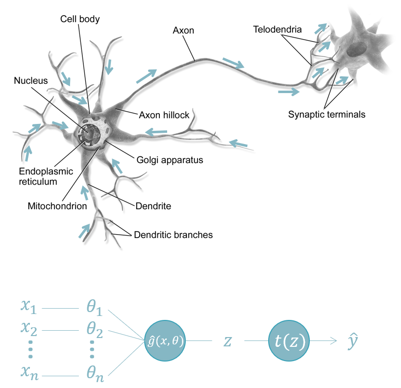

```{r include=FALSE}
library(knitr)
library(data.table)
library(reticulate)
library(magrittr)
library(e1071)

opts_chunk$set(echo = TRUE, cache = TRUE, message = FALSE, warning = FALSE)

dyad <- readRDS("r/Palette_5YR_5B_Dyad.RDS")
palette(dyad[c(9, 20, 66)])
```


# De percetron

## Historiek

De perceptron is gebaseerde op een wiskundige beschrijving van het dierlijk neuron. De uitvinding van de perceptron wordt toegekend aan [Frank Rosenblatt](https://en.wikipedia.org/wiki/Frank_Rosenblatt) die in 1957 een leeralgoritme programmeerde op een IBM 704 computer.


In de [New York Times van 8 Juli 1958](https://www.nytimes.com/1958/07/08/archives/new-navy-device-learns-by-doing-psychologist-shows-embryo-of.html) verscheen:

<q>The Navy revealed the embryo of an electronic computer today that it expects will be able to walk, talk, see, write, reproduce itself and be conscious of its existence.</q>

Al snel werd er hardware gemaakt om het algoritme efficiënt uit te voeren, de zogenaamde Mark I Perceptron machine


## De anatomie van de perceptron

```{r neuron, fig.cap="(ref:neuron)", echo=FALSE}

```

(ref:neuron) De anatomie van het neuron en de overeenkomstige node van een neuraal netwerk. In het dierlijke neuron (boven) krijgt het cellichaam (eng: _cell body_) allerlei invoer van verscheidene locaties. In dit cellichaam vindt de integratie plaats (sommatie) en transformatie waarna het signaal (in de vorm van een zogenaamde actiepotentiaal) langsheen het axon reist naar het axon-uiteinde (eng: _synaptic terminals_). In een neuraal netwerk zijn de axon-uiteinden verbonden met de dendrieten (eng: _dendrites_) van een ander neuron. In een perceptron (onder) wordt de invoer ($x$) gewogen en geïntegreerd tot één getal ($z$) dat getransformeerd kan worden alvorens het wordt als uitvoer ($y$) wordt vrijgegeven. Bron: @neuron.

Naar analogie met het biologisch neuron is de functie van een perceptron om complexe invoer om de ene of andere manier te reduceren tot één getal ($z$; zie Formule \@ref(eq:perceptron)).

\begin{equation}
	\mathbb{R}^n\rightarrow\mathbb{R}\\
  z=f(x, \theta)=\sum_{i=0}^{n}{\theta_ix_i}
  (\#eq:perceptron)
\end{equation} 

In een tweede functie wordt dit resultaat nog eens getransformeerd tot de voorspelling $\hat{y}$. Één voorbeeld van zulk een transformatie is [het signum](https://nl.wikipedia.org/wiki/Signum_(wiskunde)) (eng:_sign function_):

\begin{equation}
	\hat{y}=t(z)=
	\begin{cases}
	-1\,als\,z<0\\
	1\,als\,z\geq0
	\end{cases}
  (\#eq:perceptron-transformatie)
\end{equation}

Er zijn tal van andere transformaties mogelijk.zoals de [heaviside-functie](https://nl.wikipedia.org/wiki/Heaviside-functie) die nul geeft indien $z<0$ en 1 in alle andere gevallen.

## Casestudy: Onderscheiden van setosa

De beste manier vaak om iets te begrijpen is om de code te zien, toch? Op basis van een vereenvoudigd voorbeeld gebaseerd op de blog van Simone Alberto Peirone (@perceptron-scratch) gaan we een leeralgoritme uit het niets opbouwen. Dit kan hier alleen omdat het om een uiterst eenvoudig leeralgoritme gaat, de perceptron.

In de beroemde iris dataset worden een aantal eigenschappen van drie sterk gelijkende iris soorten verzameld. We kwamen deze dataset eerder al tegen in het hoofdstuk rond [model complexiteit](#model-coplexiteit).

```{r iris, echo = FALSE, fig.cap = "(ref:iris)", echo=FALSE}

```

(ref:iris) De drie soort van de iris dataset. Bron: @iris-setosa, @iris-versicolor, @iris-virginica.

Als we twee eigenschappen van de iris bloemen, namelijk de lengte ($l$) en breedte ($b$) van het kelkblad, tegenover elkaar uitzetten, dan kunnen we de setosa soort van de andere twee onderscheiden:

```{r iris-scheiden, fig.cap="(ref:iris-scheiden)"}
data(iris)

plot(Sepal.Length ~ Sepal.Width, data = iris, pch = 19, cex = .8,
	col = 1 + (Species == "setosa"),
	 xlab = expression("Kelkblad breedte "~italic(b)~" (mm)"),
	 ylab = expression("Kelkblad lengte "~italic(l)~" (mm)"),
	main = "Setosa vs {versicolor, virginica}")

legend("topright", c("{versicolor, virginica}", "setosa"),
  col = 1:2, pch = 19)
```

(ref:iris-scheiden) Twee eigenschappen van iris bloemen (kelkblad lengte en breedte) tegenover elkaar uitgezet om een onderscheid te maken tussen _Iris setosa_ en de twee andere soorten _Iris versicolor_ en _Iris virginica_.

In dit twee-dimensionaal geval zouden we dat evengoed manueel kunnen doen, maar dit geldt niet voor hogere dimensies (i.e. méér variabelen). Daarom gaan we alsnog gebruik maken van een perceptron. We doen dit omdat het perceptron natuurlijk de eenvoudigste vorm van een neuraal netwerk is, maar weet dat een perceptron slechts in een beperkt aantal gevallen geschikt is.

```{definition def-perceptron}
De perceptron is een leeralgoritme dat enkel geschikt is voor het onderscheiden van twee klassen (binaire outcome) en indien beide klassen lineair onderscheidbaar zijn (eng: _linearly separable_).
```

## De perceptron klasse

We gaan de perceptron in Python coderen, al zullen de resultaten in R worden onderzocht (zie ### om te begrijpen waarom).

```{python perceptron-klasse, eval=FALSE}
import numpy as np

class Perceptron:
  def __init__(self, learning_rate = 0.1, iteration_count = 50):
    self.learning_rate = learning_rate
    self.iteration_count = iteration_count
    self.theta_0 = 0.0
    self.theta = None
    self.errs = []
```

De `Perceptron` klasse wordt geïnitialiseerd met de hyperparameters `learning_rate` en `n-iter`. De `learning_rate` (nl: _leersnelheid_) is een correctiefactor waarmee de gewichten $\theta_i$ worden vermenigvuldigd indien de uitkomst van de instantie fout is. `iteration_count` geeft aan hoeveel cycli het leeralgoritme moet volbrengen. `theta_0` en `theta` zijn de _parameters_ en `theta_o` is een constante $\theta_0$ die aan de formule \@ref(eq:perceptron)) kan worden toegevoegd (zie Formule \@ref(eq:perceptron-constante) en komt in het tweedimensionaal geval neer op een asafsnede (eng: _intercept_). Deze constante wordt echter meestal weggelaten omdat het erop neerkomt dat een extra berekende variabele $x_0$ wordt toegevoegd, bestaande uit allemaal enen, waarvoor dan een overeenkomstige $\theta_0$ wordt voorzien.

\begin{equation}
  f(x,\theta)=\theta_0+\sum_{i=1}^{n}{\theta_ix_i}
  (\#eq:perceptron-constante)
\end{equation}

In de interne variabele `errs` worden het aantal fouten bewaard die bij elke cyclus gemaakt worden. Hiermee kunnen we het verloop van de performantie van het leeralgoritme opvolgen of achteraf reconstrueren.

Hoewel in bovenstaande code hier nog geen gebruik van wordt gemaakt, zorgt de geïmporteerde [`numpy` module](https://numpy.org/) (onder alias `np`) ervoor dat er vlot met vectoren en matrices gerekend kan worden.

## De perceptron functies

We zagen twee functies die de eigenlijke kern vormen van de perceptron: $f$ en $t$. Laten we deze als [methoden](https://stackoverflow.com/questions/155609/whats-the-difference-between-a-method-and-a-function) toevoegen:

```{python perceptron-functies, eval=FALSE}
class Perceptron:
  [...]

  def f(self, x: np.array) -> float:
    return np.dot(x, self.theta) + self.theta_0
  
  def t(self, z: float) -> int:
    return np.where(z >= 0.0, 1, -1)
```

Met de [`np.dot`](https://numpy.org/doc/stable/reference/generated/numpy.dot.html?highlight=dot#numpy.dot) functie berekenen we het [inwendig product](https://nl.wikipedia.org/wiki/Inwendig_product) tussen de matrix $x$ en de vector $\theta$. Zie [Appendix](#inwendig-product-van-twee-vectoren) voor meer uitleg hierover.

## Het leeralgoritme van de perceptron

De rest van de noodzakelijke code is a.h.w. van administratieve aard:

```{python perceptron-fit, eval=FALSE}
def fit(self, x: np.array, y: np.array):
    self.theta = np.zeros(x.shape[1])

    for iteration in range(self.iteration_count):
        err_iter = 0
        for xi, yi in zip(x, y):
            update = self.learning_rate * (yi - self.t(self.f(xi)))
            self.theta_0 += update
            self.theta += update * xi
            err_iter += int(update != 0.0)
        self.errs.append(err_iter)
```

Laten we de code even overlopen.

```{python perceptron-pars, eval=FALSE}
self.theta = np.zeros(x.shape[1])
```

Voor elke instantie in de invoer matrix $x$ wordt er een gewicht $\theta_i$ voorzien en op nul geïnitialiseerd. `shape` geeft de dimensies terug van een matrix en de eerste waarde geeft het aantal rijen.

```{python perceptron-iterate, eval=FALSE}
for iteration in range(self.iteration_count):
    err_iter = 0
    for xi, yi in zip(x, y):
        # Updaten van de gewichten en aantal fouten tellen
    self.errs.append(err_iter)
```

Tijdens elke cyclus wordt het aantal foute voorspellingen binnen de cyclus bijgehouden. De `zip` functie plakt telkens de werkelijke uitkomst aan een instantie. In ons geval zal $x_1$ bestaan uit de breedte van de kelkbladeren van de irissen en $x_2$ de lengte van de kelkbladeren bevatten. Dus, stel breedte = 3.5mm, lengte = 5.1mm en soort = _setosa_, dan verwachten we de eerste keer dat de compiler in de lus `python for xi, yi in zip(x, y):` terecht komt de volgende waarden:

```{python zip, eval=FALSE}
xi = [3.5, 5.1]
yi = 1
```

Binnen in deze lus, wordt er berekend met hoeveel de parameters moeten worden verminderd: 

```{python perceptron-update, eval=FALSE}
update = self.learning_rate * (yi - self.t(self.f(xi)))
```

Stel dat het leeralgoritme voor een bepaalde instantie `1` voorspelt, maar dat de werkelijke uitkomst `-1` is, dan worden de parameters _vermeerderd_ met de fractie

hetgeen overeenkomt met $0.1\cdot\left(-1\cdot-1\right)=-0.2$ voor een leersnelheid van $0.1$. Met andere woorden, de parameters worden _verminderd_ met één vijfde van hun waarde. Stel nu dat het leeralgoritme het juist had, dan wordt `update` gelijkgesteld aan $0.1\cdot\left(1\cdot-1\right)=0$ en blijven de parameters onveranderd.

En dit was het! Hier is de volledige werkende Python code:

```{python perceptron, cache=FALSE}
import numpy as np

class Perceptron:
  def __init__(self, learning_rate = 0.1, iteration_count = 10):
    self.learning_rate = learning_rate
    self.iteration_count = iteration_count
    self.theta_0 = 0.0
    self.theta = None
    self.errs = []

  def f(self, x: np.array) -> float:
    return np.dot(x, self.theta) + self.theta_0

  def t(self, z: float) -> int:
    return np.where(z >= 0.0, 1, -1)

  def fit(self, x: np.array, y: np.array):
    self.theta = np.zeros(x.shape[1])

    for iteration in range(self.iteration_count):
      err_iter = 0
      for xi, yi in zip(x, y):
        update = self.learning_rate * (yi - self.t(self.f(xi)))
        self.theta_0 += update
        self.theta += update * xi
        err_iter += int(update != 0.0)
      self.errs.append(err_iter)
```

## Trainen van de perceptron

De tijd is aangebroken om de perceptron te trainen met de data van de iris bloemen. Het enige wat we nog willen doen is de invoergegevens standaardiseren, i.e. de zogenaamde [Z-score](https://nl.wikipedia.org/wiki/Z-score) berekenen. Let wel deze Z _heeft niets te maken_ met de $z$ die we eerder zagen.

\begin{equation}
  Z=\frac{x_j-\mu_j}{\sigma_j}
  (\#eq:z-score)
\end{equation}

Elke variabele $x_j$ wordt in dit process eerst verminderd met het gemiddelde voor die variabele $\mu_j$ en daarna gedeeld door de standaardafwijking van die variabele $\sigma_j$. Wat de Z-score in feite doet is elke waarde transformeren naar het aantal standaardafwijkingen het verwijderd is van het gemiddelde.

De reden dat we de standaardisatie uitvoeren is omdat de lengte en de breedte van de kelkbladen een andere schaal hebben en daar kan dit eenvoudige leeralgoritme moeilijk mee overweg. Maar opgelet, het nemen van het gemiddelde en de standaardafwijking van een feature veronderstelt dat deze zich (toch ongeveer) normaal verdeeld. In de paragraaf over [Univariate verdelingen](#univariate-verdelingen) staat beschreven hoe we een verdeling snel visueel kunnen controleren:

```{r iris-normaal}
par(mfrow = 1:2)

iris$Sepal.Width %>% density %>% plot (main = "Kelkblad breedte")
iris$Sepal.Length %>% density %>% plot (main = "Kelkblad lengte")
```

Toegegeven, de verdelingen wijken enigszins af van de normaalverdeling, maar het belangrijkste is dat beide variabelen ten minste unimodaal zijn, i.e. één 'piek' bezitten in hun verdeling. Dus een standaardisatie lijkt gelegitimeerd. De onderstaande code verzamelt de invoer en de uitkomsten en voert de standaardisatie door in R met de functie `base::scale`:

```{r iris-prep}
x_all <- iris[, c("Sepal.Width", "Sepal.Length")] %>%
  as.matrix %>% scale

y_all <- (2 * (iris$Species == "setosa")) - 1

x_all %>% cbind(y_all) %>% head
```

Er rest nu alleen nog het algoritme te trainen. Hiervoor gaan we de invoer data randomiseren in een training- en een test-set in de verhouding $3:1$.

```{python perceptron-randomize, cache=FALSE}
from sklearn.model_selection import train_test_split

x_train, x_test, y_train, y_test = train_test_split(
  r.x_all, r.y_all, test_size = 0.25, random_state = 42)
```

De eigenlijke training gebeurt als volgt:

```{python perceptron-train, cache=FALSE}
model = Perceptron(learning_rate = 0.001)
model.fit(x_train, y_train)
```

Laten we eens kijken hoe het aantal mis-classificaties evolueerde over de verschillende cycli (deze cycli worden in ANN-wereld _epochs_ genoemd):

```{r misclassificaties}
py$model$errs %>% plot(type = "b", pch = 19, cex = .8,
  ylab = "# fouten per epoch", xlab  = "Epoch",
  main = "Evolutie misclassificaties")
```

Nu kunnen we de scheidingslijn in beeld brengen. Eerst maken we een raster. Voor elke punt in dit raster zullen we een voorspelling maken:

```{r perceptron-grid}
x1_lim <- x_all[, 1] %>% range
x2_lim <- x_all[, 2] %>% range

grid_x <- seq(x1_lim[1], x1_lim[2], l = 100)
grid_y <- seq(x2_lim[1], x2_lim[2], l = 100)

grid <- expand.grid(x = grid_x, y = grid_y) %>% as.matrix

grid_z <- py$model$t(py$model$f(grid))
```

Nu plotten we de (gestandaardiseerd) data met de scheidingslijn (eng: _boundary line_) en duiden we de gebieden aan die, volgens het model, tot _Iris setosa_ behoort of niet:

```{r iris-preds}
plot(x_all[, 2] ~ x_all[, 1], pch = 19, cex = .8,
  col = 1 + (iris$Species == "setosa"),
  xlab = "Kelkblad breedte (gestand.)",
  ylab = "Kelkblad lengte (gestand.)",
  main = "Setosa vs {versicolor, virginica}")

curve((py$model$theta[1] * x + py$model$theta_0) / -py$model$theta[2], add = TRUE)

points(grid[, 1], grid[, 2], pch = ".", col = 1 + (1 + grid_z) / 2)

legend("topright", c("{versicolor, virginica}", "setosa"),
  col = 1:2, pch = 19)
```

Merk nog eens op dat het resultaat van ML inderdaad een functie is. In dit geval moet je de twee functies $f$ en $t$ achtereenvolgens uitvoeren. In de praktijk worden beide meestal verpakt in een functie `predict`, maar hier is ervoor gekozen om de functies gescheiden te houden, kwestie om de relatie te behouden met de Formules \@ref(eq:perceptron) en \@ref(eq:perceptron-transformatie).

## Voorspellen van de iris soort

Laten we nu het model gebruiken om een voorspelling te maken op ongeziene data.

```{python perceptron-test, cache=FALSE}
from sklearn.metrics import accuracy_score

print(accuracy_score(model.t(model.f(x_test)), y_test))
```

Een perfect resultaat!
