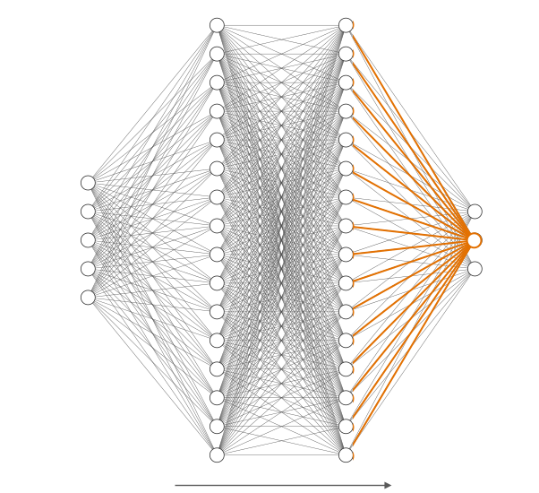
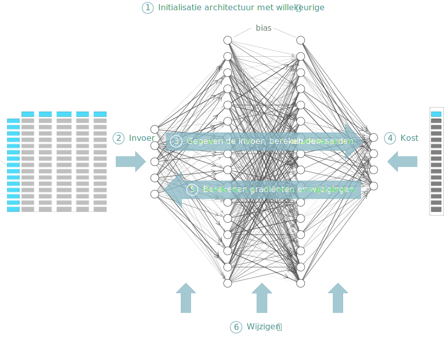
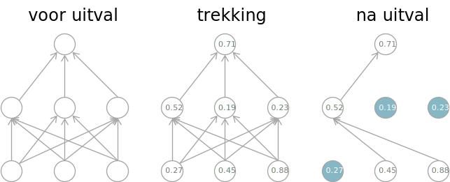

```{r include=FALSE}
library(knitr)
library(data.table)
library(reticulate)
library(magrittr)
library(e1071)
library(latex2exp)

opts_chunk$set(echo = TRUE, cache = TRUE, message = FALSE, warning = FALSE)
source("r/md_tools.r")
dyad <- readRDS("r/Palette_5YR_5B_Dyad.RDS")
palette(dyad[c(9, 20, 66)])
```

# Inleiding tot Artificiële Neurale Netwerken

```{lemma fundamenten-deep-learning}
Begrijpt de fundamenten achter deep learning ([_EA_LD753_](#leerdoelen)).
```

## Geschakelde perceptronen

Een artificieel neuraal netwerk (ANN) kan gezien worden als een samenstelling van individuele perceptronen zodat de uitvoer van de ene perceptron de invoer van een andere wordt. Maar de neuronen worden niet kris-kras door elkaar geplaatst, maar worden georganiseerd in zogenaamde lagen (eng: _layers_). In een feed-forward netwerk resulteert dit in een [gerichte acyclische graaf](https://en.wikipedia.org/wiki/Directed_acyclic_graph) (eng: _directed acyclic graph_) van noden of neuronen.

```{r nn-01, fig.cap="(ref:nn-01)", echo=FALSE}

```

(ref:nn-01) Een fictief ANN met vier lagen. Het netwerk is een acyclische directionele graaf die van links naar rechts loopt. De meest linkse laag is de invoer-laag, de meest rechtse de uitvoer-laag. Één perceptron binnen het ANN is aangeduid in kleur en bestaat uit meerdere inkomende connecties, een node en één uitgaande connectie (hier niet getoond). We gaan later leren dat er ook nog andere manieren zijn om een ANN te visualiseren.

Laten we een eenvoudig voorbeeld bekijken. In het hoofdstuk rond de perceptron konden we _Iris setosa_ bloemen onderscheiden van andere soorten op basis van twee eigenschappen, namelijk de lengte en breedte van de kelkbladeren. Als we nu eens proberen de drie soorten te onderscheiden. Met één perceptron lukt het niet, want herinner je dat een perceptron enkel lineair gescheiden punten-wolken kan onderscheiden en een lijn zal telkens maar leiden tot een uitkomst met twee mogelijke categorieën.

Doordat we nu meerdere uitkomsten hebben moeten we voor elke uitkomst een node (neuron, perceptron) voorzien. De invoer van deze 3 uitkomst-noden ("neuronen in de uitvoer laag", eng: _output-layer_) is verbonden met de uitvoer van de 2 invoer-laag neuronen (omdat er twee eigenschappen zijn). Zo ziet het nieuwe netwerk er uit:

```{r nn-iris-0, fig.cap="(ref:nn-iris-0)"}
library(neuralnet)

nn = neuralnet(Species ~ Sepal.Length + Sepal.Width,
  data = iris, hidden = 0, linear.output = TRUE) 
nn %>% plot(rep = "best")
```

(ref:nn-iris-0) Een ANN om op basis van twee eigenschappen van de kelkbladeren van iris-bloemen drie soorten (_setosa_, _vericolor_ en _virginica_) te onderscheiden. Dit netwerk heeft enkel een invoer- en een uitvoer-laag. De drie connecties naar de `setosa`-node plus deze node zelf komen overeen met de [perceptron casestudy](#casestudy-onderscheiden-van-setosa) uit vorig hoofdstuk. De 'Error' geeft de totale fout weer. Verder in de tekst wordt deze aangeduid met het symbool $\varepsilon$ (epsilon). 'Steps' het aantal doorlopen epochs.

Uit het bovenstaand netwerk kunnen we het volgende aflezen:

- Het bestaat uit twee lagen, een invoer-laag (eng: _input layer_) en een uitvoer-laag (eng: _output layer_)
- Het leeralgoritme heeft 2251 epochs nodig gehad om tot een stabiele oplossing te komen
- De totale fout die gemaakt wordt, is recht evenredig met $\approx 26.4\,mm^2$
- Of een bloem van de soort _Iris setosa_ is heeft te maken met zowel de lengte als de breedte van het kelkblad, zij het in omgekeerde verhouding
- Vooral de breedte van het kelkblad bepaald of de bloem een _versicolor_ is terwijl het eerder de lengte is dat bepaald of het een _virginica_ is.

De resultaten van bovenstaand netwerk kunnen als matrix $\mathbf{\theta}$ worden weergegeven. Laten we deze matrix voor de volledigheid eens bekijken:

```{r iris-o-results, results="asis", echo=FALSE}
nn$weights[[1]][[1]] %>% write_matex(prefix = "\\theta=")
```

De totale fout waarvan hierboven sprake is, is evenredig met de som van de kwadraten van de deviaties tussen $y$ en $\hat{y}$ en wordt berekend met de kost-functie $c$ (eng: _cost function_):

\begin{equation}
  \varepsilon=c(y,\hat{y})=\frac{1}{2}\sum_{n=1}^{N}{(y_n-\hat{y}_n)^2}
  (\#eq:kwadratensom)
\end{equation}

Behalve een invoer-laag en een uitvoer-laag, kan een netwerk ook worden opgebouwd uit tussenliggende _verborgen lagen_ (eng: _hidden layers_). Figuur \@ref(fig:nn-iris-1) laat zien wat er gebeurt indien we aan het Iris-netwerk een verborgen laag toevoegen met daarin 3 noden.

```{r nn-iris-1, fig.cap="(ref:nn-iris-1)"}
library(neuralnet)

nn = neuralnet(Species ~ Sepal.Length + Sepal.Width,
  data = iris, hidden = 3, linear.output = TRUE) 
nn %>% plot(rep = "best")
```

(ref:nn-iris-1) Idem als voor Figuur \@ref(fig:nn-iris-0), maar nu met toevoeging van een verborgen laag met 3 neuronen.

Merk op dat de totale fout $\varepsilon$ nu kleiner is geworden, maar dat betekent nog niet dat dit een goed idee is om de extra verborgen laag inderdaad toe te voegen.

```{exercise goed-idee-tussenlaag, name="Méér verborgen lagen"}
Het toevoegen van een extra verborgen laag in ons model zorgt ervoor dat de totale fout $\varepsilon$ op de Iris dataset verkleint. Maar dat betekent nog niet dat het een goed idee is om een laag toe te voegen. Waarom niet? Leg uit in eigen woorden.
```

## Feed-forward ANNs (FF-ANNs)

We gaan nu iets specifieker moeten zijn in wat de regels rond een ANN zijn en hoe een ANN aan zijn oplossing komt. Om te beginnen leggen we de regels vast voor de noden en connectoren (pijlen) een FF-ANN:

```{definition ff-ann-noden}
__Noden__:

- De _invoer-laag_ is verplicht en bevat één node voor elke feature
- De _uitvoer-laag_ is ook verplicht en bevat één node voor elke afhankelijke variabele (_regressie_) of één node voorelke categorie van de uitkomst (_classificatie_) ^[Een _regressie_ gebruik je wanneer de afhankelijke variabelen numeriek continue zijn. Een _classificatie_ gebruik wanneer de afhankelijke variabelen ordinaal, nominaal of numeriek discreet zijn.]
- Verborgen lagen zijn optioneel
- Het aantal noden in de verborgen lagen is bij realistische situaties met vele features meestal veel kleiner dan het aantal features zodat de invoer a.h.w. gecomprimeerd wordt
- Elke laag, behalve de uitvoer-laag, kan een speciale afwijking-node (eng: _bias-node_) bevatten met de constante waarde 1
```

```{definition ff-ann-connectoren}
__Connectoren__:

- In een FF-ANN mogen connectoren niet twee noden van dezelfde laag verbinden
- Bovendien moet de zin van de connectoren lopen van invoer-laag naar uitvoerlaag en nooit andersom
- Het is niet zo dat alle noden van de ene laag moeten verbonden zijn met alle noden van de volgende laag
```

Hoe werkt een FF-ANN nu eigenlijk? Wel, als je het perceptron begrijpt is er eigenlijk niet veel aan. De waarden van de noden binnen de  invoer-laag zijn uiteraard gekend. Voor elke andere laag in het netwerk bekom je de nieuwe waarden door de waarden uit de voorgaande laag te vermenigvuldigen (via inwendig product, zie Appendix) met de bijhorende gewichten:

\begin{equation}
  z_\Lambda=g(x_\Lambda)=\mathbf{x_\Lambda}\cdot\mathbf{\theta_\Lambda} \\
  \hat{y}_\Lambda=t(z_\Lambda) \\
  \Lambda\subset\{2, 3,..,\mathscr{L}\}
  (\#eq:layer-matrix-multiplication)
\end{equation}

, waarbij $\Lambda$ de index van de laag moet voorstellen.

Het leeralgoritme begint met willekeurige gewichten en neemt de eerste set van instanties (de zogenaamde _minibatch_) en vult de waarden in voor de noden van de invoer-laag. Daarna zal het leeralgoritme de inwendige producten berekenen en zo de waarden voor de volgende lagen binnen het netwerk invullen. Komt het FF-ANN leeralgoritme aan de laatste laag van het netwerk aan, dan wordt de geschatte uitkomst $\hat{y}$ vergeleken met de werkelijke uitkomst $y$. Op basis hiervan zal het leeralgoritme de gewichten aanpassen.

## Types neuronen

Tot hier toe hebben we uitsluitend lineaire neuronen besproken, maar om complexere problemen te kunnen afhandelen was er een manier nodig om een niet-lineaire respons in de neuronen in te bouwen. Dit doen we door van de transformatie functie $t(z)$ een niet-lineaire functie te maken. Het type transformatie-functie bepaald dan ook het type neuron. Er zijn vele types lineaire en niet-lineaire neuronen, maar enkel de meest courante worden hieronder visueel weergegeven.

```{r sigmoid-neuron, fig.asp=1, echo=FALSE, fig.cap="(ref:sigmoid-neuron)"}
par(mfrow = c(2, 2))
plot(0, type = "n", xlim = c(-10, 10), ylim = 0:1,
  xlab = TeX("$z$"), ylab = TeX("$\\hat{y}$"), main = "Sigmoid")
abline(v = 0)
axis(2, pos = 0, labels = FALSE)
curve(1/(1 + exp(-x)), add = TRUE, col = 1, lwd = 2)

plot(0, type = "n", xlim = c(-10, 10), ylim = c(-1, 1),
  xlab = TeX("$z$"), ylab = TeX("$\\hat{y}$"), main = "Tanh")
abline(v = 0, h = 0)
curve(tanh(x), add = TRUE, col = 1, lwd = 2)

plot(0, type = "n", xlim = c(-10, 10), ylim = c(0, 10),
  xlab = TeX("$z$"), ylab = TeX("$\\hat{y}$"), main = "ReLU")
abline(v = 0)
axis(2, pos = 0, labels = FALSE)
curve(pmax(0, x), add = TRUE, col = 1, lwd = 2)

plot(0, type = "n", xlim = c(-10, 10), ylim = 0:1,
  xlab = TeX("$z$"), ylab = TeX("$\\hat{y}$"), main = "Heaviside")
abline(v = 0, lty = 3)
segments(c(-10, 0), 0:1, c(0, 10), 0:1, col = 1, lwd = 2)
points(0, 0, pch = 21, col = 1, bg = "white", cex = 2, lwd = 2)
points(0, 1, pch = 21, col = 1, bg = 1, cex = 2)
```

(ref:sigmoid-neuron) Vier neuron-types gebaseerd op hun transformatie- functies $t(z)$. De functie voor de sigmoïd is $\frac{1}{1+e^{-z}}$, die van het _tanh_ neuron type is uiteraard $tanh(x)$ en die voor het Restricted Linear Unit neuron (ReLU) is $max(0, z)$.

Sommige restricties gelden voor alle neuronen binnen een laag. Zo is er de zogenaamde _softmax_-type uitvoer-laag. Hierbij stellen de neuronen binnen die laag een kansverdeling voor en moet bijgevolg de som van de neuronen op exact 1 uitkomen:

\begin{equation}
  \hat{y}_\Lambda=\frac{e^{z_\Lambda}}{\sum_{\Lambda}{e^{z_\Lambda}}}
  (\#eq:softmax)
\end{equation}

## Backpropagation

Hierboven stond er:

<q>Op basis hiervan zal het leeralgoritme de gewichten aanpassen.</q>

Tijdens het trainen van meerlagige ANNs maken we gebruik van het _backpropagation algoritme_ (zie @rumelhart1986) een voorbeeld van [dynamisch programmeren](https://en.wikipedia.org/wiki/Dynamic_programming) (eng: _dynamic programming_). Hieronder zijn de stappen uiteengezet:

1. _Initialisatie_: De architectuur van het netwerk en de beginwaarden van de parameters worden toegekend
2. _Invoer_:  Ingeven van de waarden van de invoer laag
3. _Forward pass_: De lagen één voor één doorlopen, te beginnen bij de eerste laag na de invoerlaag en bij elke laag berekenen we $x_{\Lambda+1}=t_\Lambda(g(x_\Lambda)), \Lambda\subset\{1,..,\mathscr{L}-1\}$
4. _Bereken de kost_: Met de waarden in de uitvoerlaag, berekenen we de restterm $\varepsilon$.
5. _Backpropagation_: Nu berekenen we voor elke laag, van laatste naar tweede, de afgeleiden $\frac{\partial{E_n}}{\partial\theta_{n-1}}$ (eng: _error  derivatives_) die aangeven hoeveel de restterm van een laag verandert naarmate de parameters van de neuronen uit de vorige laag veranderen
6. _Wijzigen parameters_: We vullen nu de leersnelheid in en lossen de zogenaamde modificatie-formule (eng: _modification formula_) op om de nieuwe parameter waarden (= _gewichten_) te berekenen en we kunnen voort naar de volgende epoch

```{r backpropagation, fig.cap="(ref:backpropagation)", echo=FALSE}

```

(ref:backpropagation) Schematische weergave van het backpropagation algoritme uitgewerkt in een begeleid ML context. Links staat de dataset met de onafhankelijke variabelen, rechts de uitkomsten. Centraal de weergave van een ANN waarvan de dikte van de connectoren overeenstemmen met de waarden voor $\theta$.

Zie de [blog](img/backpropagation-Jay-Prakash.html) (link lokale kopij met aantekeningen) van Jay Prakash voor een uitgewerkt voorbeeld en de precies berekening van de afgeleiden (@Prakash2017).

## De verliesfunctie en kost-functies

Met een verliesfunctie ($v$; eng: _loss function_) bereken je, binnen een epoch, de prestatie van een model door de uitvoer voor die epoch het model $\hat{y}$ te vergelijken met de werkelijke uitkomst $y$. Heb je meerdere epochs doorlopen, dan kan je de voorspellingen van de ganse training set vergelijken met de reële waarden.

```{definition verliesfunctie, name="Verliesfunctie vs kost-functie"}
Een __verliesfunctie__ werkt binnen een epoch op een enkele instantie of op een minibatch. Een kost-functie is een soort beoordelingsfunctie (eng: _objective function_) die werkt op een volledige episode waarbij de ganse training set in rekening wordt gebracht en waarbij vaak ook regularisatietermen beschouwd worden (zie later).
```

Er zijn veel mogelijke verschillende verlies- en kost-functies afhankelijk van het beoogde doel en type van de uitkomst-variabele. Een populaire keuze wanneer het gaat om reële getallen is de som van de kwadraten van de verschillen (eng: _sum of squared errors_ of kort SSE) of het gemiddelde daarvan (eng: _mean sum of squares_ of MSE). Bij SSE en ANN gebruikt men meestal over de helft van de som van de kwadraten omdat deze vorm differentieerbaarder is.

\begin{equation}
  \varepsilon=c(y,\hat{y})=\frac{1}{2}\sum_{n=1}^{N}{(y_n-\hat{y}_n)^2}
  (\#eq:kwadratensom2)
\end{equation}

Naarmate dat het voorspelde resultaat $\hat{y}$ steeds meer begint af te wijken van het werkelijk resultaat $y$, neemt de restterm $\varepsilon$ razendsnel toe (zie interactieve figuur hieronder) en het doel van het leeralgoritme is om de parameters $\mathbf{\theta}$ zodanig aan te passen dat de fout net zijn klein mogelijk wordt. Men zegt dat het doel is om de verlies- en kost-functies te minimaliseren (eng: _minimize_).

```{r convex, eval=FALSE, echo=FALSE}
rgl.open()
options(rgl.useNULL = FALSE)

dst <- function(x, y, center = c(0,0)){
  ((x - center[1]) ^ 2 + (y - center[2]) ^ 2)
}

bg3d(color = "white")

plot3d(dst,xlim=c(-1, 1), ylim=c(-1, 1), type = "wire",
  col = colorRampPalette(1:2),
  xlab = expression(theta[1]),
  ylab = expression(theta[2]),
  zlab = expression(epsilon))

view3d( theta = 0, phi = -60, zoom = .8)

writeWebGL(filename = "img/convex.html" ,  width = 600, height = 600)
```

<iframe width="100%" height="650px" src="img/convex.html" sandbox="allow-same-origin allow-scripts allow-popups allow-forms" style="border:0px;"></iframe>

Een andere belangrijke verliesfunctie is de cross-entropie: Deze wordt gebruikt wanneer de uitkomst variabele een kansverdeling (eng: _probability distribution_) voorstelt, i.e. wanneer de waarden voor de uitkomsten reële getallen getallen zijn in het bereik $[0, 1]$ en wanneer alle waarden voor de categorieën in de uitvoerlaag van het netwerk optellen tot 1. Deze laatste wordt gewaarborgd door de zogenaamde softmax restrictie (zie [Types neuronen](#types-neuronen)).

\begin{equation}
  c(y, \hat{y})=-\frac1N\sum_{n=1}^{N}{\left[y_n\,log(\hat{y}_n) + (1-y) \,log(1-\hat{y})\right]}
  (\#eq:cross-entropie)
\end{equation}

Het is mooi om zulke verliesfunctie in beeld te brengen, maar in werkelijkheid spelen er meer dan twee parameters in het spel en zijn niet alle neuronen lineair. Als gevolg zal de verliesfunctie de vorm van een hypervlak in een meer-dimensionale ruimte gaan innemen en zal de vorm ook veel grilliger zijn dan hier voorgesteld.

## Gradiënt afdaling

De bedoeling is om het laagste punt van de hierboven gedemonstreerde verliesfunctie te vinden. Indien het werkelijk om kwadratische verlies-oppervlakten zou gaan, dan was er geen probleem omdat met het laagste punt dan analytisch zou kunnen vinden, i.e. met een relatief eenvoudige matrix bewerking. Maar in werkelijkheid zijn de verliesfuncties grillig en meerdimensionaal (\@ref(fig:complexe-verlies-landschappen)). Dan is er een soort trial-and-error manier nodig om het laagste punt te vinden.

```{r curve-vorm, fig.cap="(ref:curve-vorm)", echo=FALSE}
include_graphics("img/curve-vorm.svg")
```

(ref:curve-vorm) Onderscheid tussen kwadratische, convexe en grillige functies, hier voor de eenvoud voorgesteld als abstracte twee-dimensionale functies.

Het zoeken naar zulk een minimum van zulk een functie noemt men een _optimalisatie-probleem_ en een groot deel van het onderzoek naar ANNs situeert zich rond het vinden van een efficiënt optimalisatie algoritme. Deze optimalisatie is trouwens waarnaar in de paragraaf rond de perceptron verwezen werd als zijnde de administratie rondom de functies $g$ en $t$.

```{r complexe-verlies-landschappen, echo=FALSE, fig.cap="(ref:complexe-verlies-landschappen)"}
include_graphics(paste0("https://www.cs.umd.edu/~tomg/img/",
  "landscapes/noshort.png"))
```

(ref:complexe-verlies-landschappen) Voorbeeld van een realistische geprojecteerde verlies-functie bekomen door Ankur Mohan volgens de methode beschreven in @li2018. Kijk ook eens op [losslandscape.com](https://losslandscape.com/) voor artistieke rendering van 'verlies-landschappen'.

Maar goed, laten we, om de eenvoud te bewaren, toch nog even voortbouwen op een verliesfuncties met een eenvoudige convexe vorm. Bij het initialiseren van de parameters met willekeurige waarden stellen we ons een willekeurig punt voor in het $\theta_1\perp\theta_2$-vlak. Vanuit dit punt projecteren we ons op het verlies-oppervlakte, door parallel te lopen met de $\varepsilon$-as totdat we het oppervlakte kruisen. We bevinden ons nu ergens op dit oppervlak, in het punt $e$. Hoe vinden we nu het laagste punt op dit oppervlak? Simpel, volg de weg die het steilst naar beneden gaat en, in het geval van een convexe functie, kom je vanzelf uit op het laagste punt. De weg van de steilste afdaling (eng: _steepest ascent_) wordt wiskundig uitgedrukt als de [gradient](https://nl.wikipedia.org/wiki/Gradi%C3%ABnt_(wiskunde)) $\nabla\varepsilon$ in $e$. Een gradient kan gezien worden als een meerdimensionale afgeleide en kan in een 2-dimensionale context (2 parameters) voorgesteld worden als een raakvlak in het punt $e$. Vandaar de naam van een familie aan optimalisatie-algoritmen en ook de titel van deze paragraaf: gradiënt afdaling (eng: _gradient descent_).

We weten nu in welke richting we moeten gaan, het enige dat overblijft is de grootte van de stap die we in die richting nemen. De grootte van de stap wordt bepaald door de leersnelheid $r$ (eng: _learning rate_). Nemen we te grootte stappen, dan kunnen we het minimum missen doordat we er over springen. Nemen we te kleine stappen, dan duurt het mogelijk te lang en riskeren we bovendien om achter kleine heuveltjes van de ruis te komen vastzitten.

Wanneer we voldoende dicht komen bij het (lokaal) minimum van het verlies-oppervlakte, verwachten we dat de gradient in dat punt heel erg klein wordt. We zeggen dan dat het optimalisatie-algoritme __convergeert__. Wat 'voldoende dicht' precies moet zijn, wordt door de datawetenschapper bepaald en is meestal een arbitrair klein getal. Blijft tijdens het zoeken de gradient fluctueren, dan kan de datawetenschapper beslissen dat de zoektocht vroegtijdig gestaakt wordt alvorens er convergentie bereikt wordt. Er is immers niet altijd een garantie dat convergentie mogelijk is en zelfs als je optimalisatie-algoritme convergeert, heb je bij grillige oppervlakten nooit de garantie dat het lokaal minimum ook het globaal minimum is.

```{definition}
Bij complexe en grillige verlies-oppervlakten zal het vakk zo zijn dat er geen garanties gegeven kunnen worden dat het optimilsatie-algoritme convergeert of dat het gevonden minimum ook de best mogelijk oplossing is.
```

Wiskundig kunnen we de gradiënt-afdaling van het optimalisatie-algoritme als volgt samenvatten:

\begin{equation}
  \theta\leftarrow\theta-r\cdot\nabla\varepsilon(\theta)
  (\#eq:gradient-afdaling)
\end{equation}

De leersnelheid wordt vaak, zoals bij de familie aan optimalisatie-algoritmes die men [_simluated annealing_](https://nl.wikipedia.org/wiki/Simulated_annealing) noemt, bij elke epoch aangepast aan de zogenaamde _temperatuur_ die langzaam afneemt.

## Stochastische en Minibatch gradiënt afdaling

```{r, eval=FALSE, echo=FALSE}
eggholder <- function(x1, x2){
  -(x2 + 47) * sin(sqrt(abs(x2 + x1/2 + 47))) -
    (x1 * sin(sqrt(abs(x1 - (x2 + 47)))))
}

rgl.open()
options(rgl.useNULL = FALSE)


bg3d(color = "white")
lim <- c(-600, 600)
plot3d(eggholder, xlim = lim, ylim = lim, type = "wire",
  col = colorRampPalette(1:2),
  xlab = expression(theta[1]),
  ylab = expression(theta[2]),
  zlab = expression(epsilon))

view3d( theta = 0, phi = -60, zoom = 1.2)

writeWebGL(filename = "img/eggholder.html" ,  width = 600, height = 600)
```

<iframe width="100%" height="650px" src="img/eggholder.html" sandbox="allow-same-origin allow-scripts allow-popups allow-forms" style="border:0px;"></iframe>

De afdaling zoals beschreven in vorige paragraaf baseert zich op verlies-landschappen die berekend werden op de ganse dataset. In dat geval spreekt men van _batch gradiënt afdaling_ (eng: _batch gradiënt descent_). Zoals reeds aangehaald, deze strategie werkt niet goed wanneer het oppervlakte van het verlies-landschap grillig is zoals in het voorbeeld hier direct boven. Die grilligheid wordt veroorzaakt omdat net de verliesfuncties van alle instanties in de dataset samen worden beschouwd. In de _stochastische gradiënt-afdaling_ (eng:_stochastic gradient descent_) worden de verlies-hypervlakken berekend telkens voor slechts één instantie tegelijk. Deze benadering maakt dat de rekentijd bij grote datasets te hoog zou oplopen. Daarom is er een tussenvorm bedacht, de _minibatch gradiënt-afdaling_ (eng: _minibatch gradient descent_). HIer wordt telkens een subset (de minibatch) van de dataset gebruikt om het verlies-oppervlak te berekenen. De minibatch grootte is een hyperparameter van het leeralgoritme.

Je kan waarschijnlijk hele bibliotheken vullen met informatie over de verschillende optimalisatie-algoritmen, maar hier volstaat het om te weten dat er erg veel verschillende zijn en dat er nog actief onderzoek naar wordt gedaan.

## Regularisatie

[Regularisatie](https://en.wikipedia.org/wiki/Regularization_(mathematics)) (eng: _regularization_) is een manier om het overfitten tegen te gaan. Het wordt algemeen gebruikt in ML en is niet bepaald specifiek voor neurale netwerken. Het is een heel eenvoudig principe. Het komt erop neer dat er aan de kost-functie een term wordt toegevoegd dat ervoor zorgt té complexe modellen worden afgestraft.

Specifiek voor ANNs gaat het om een term die te grote gewichten $\mathbf{\theta}$ afstraft.

\begin{equation}
  \varepsilon'=\varepsilon+\lambda \cdot r(\theta)
  (\#eq:regularisatie)
\end{equation}

In de formule \@ref(eq:regularisatie) dient $r(\theta)$ om de vorm aan te geven van de functie die toeneemt naarmate $||\theta||$ toeneemt en is $\lambda$ een hyperparameter die de sterkte aangeeft waarmee te grote parameters moeten worden afgestraft. Met $\lambda=0$ nemen we geen maatregelen tegen overfitting met alle gevolgen van dien. Een te grote $\lambda$-waarde is ook nefast omdat het leerproces dan te fel gehinderd wordt.

Er zijn meerdere regularisatie termen mogelijk. Een gangbare regularisatie is de zogenaamde L2 regularisatie. Dit is dus een regularisatie op basis van L2, de euclidische norm (Formule \@ref(eq:euclidische-norm)).

\begin{equation}
  r(\theta)=||\mathbf{\theta}||^2=\sqrt{\theta_1 ^ 2+\theta_2 ^ 2+..+\theta_n ^ 2}
  (\#eq:euclidische-norm)
\end{equation}

Omdat echter the vierkantswortel een vorm van schaling veroorzaakt en omdat $\lambda$ deze functie al overneemt gebruikt men meestal de volgende regularisatie-functie:

\begin{equation}
  r(\theta)=\frac12\lambda\sum{\theta^2}
  (\#eq:l2-regularisatie)
\end{equation}

Bij elke epoch verkleinen de waarden van de parameters lineair naar nul. Daarom wordt er naar deze regularisatie verwezen met de term _weight decay_. Het gevolg is dat alle parameters a.h.w. de kans krijgen om een bijdrage te leveren in het maken van de voorspellingen.

Een andere regularisatie term is de L~1~ norm:

\begin{equation}
  r(\theta)=\lambda\sum{|\theta|}
  (\#eq:l1-regularisatie)
\end{equation}

Deze regularisatie werkt dus in op de absolute waarde van de parameters. Als gevolg zullen er vele parameters tijdens de optimalisatie quasi nul worden (vergeet niet dat computers beperkt zijn in het weergeven van erg kleine getallen). Bijgevolg worden de parameters eruit gefilterd die onvoldoende bijdragen aan de voorspelling.

Omdat men in de praktijk de voordelen van zowel de L~1~ als de L~2~ wil benutten bestaat er een tussenvorm: _elastisch net regularisatie_ (eng: _elastic net regularization_). Beide termen worden in dit geval aan de beoordelingsfunctie toegevoegd, de ene met een factor $\alpha \subset [0, 1]$, de andere met een factor $1-\alpha$, alweer een hyperparameter.

Nog een regularisatie is de _max norm beperking_ (eng: _max norm constraint_). Hier wordt er een plafond ingesteld op de magnitude van de inkomende parameter vector van een neuron. Wordt $||\theta||_2 > c$ dan wordt de co-vector verkleind met de hoeveelheid dat het groter dan $c$ was.

De laatste vorm van regularisatie die hier besproken wordt, noemt men _dropout_ (nl: uitval of uitvaller). Dit is een erg populaire regularisatie. Tijdens het trainen mogen neuronen actief blijven met een bepaalde waarschijnlijkheid $p_{act}$. Bij elke epoch is er dus als het ware een loterij. Elk neuron trekt een lotje $p_k$. Als de waarde van $p_k<P_{act}$, dan mag het neuron niet meespelen in de volgende ronde, anders wel. Op deze manier voorkomt men dat een neuraal netwerk té afhankelijk wordt gemaakt van bepaalde input 

```{r dropout, fig.cap="(ref:dropout)", echo=FALSE}

```

(ref:dropout) Het proces van dropout regularisatie. De getallen zijn de probabiliteiten die het gevolg zijn van de loterij waarvan sprake is in de tekst. Aangepast van figuur 2-16 van @buduma.

Om het testen mogelijk te maken tijdens zulke regularisatie, wordt de uitvoer van neuronen die niet of non-actief werden geplaatst gedeeld met de waarde $p_{act}$. Deze aanpassing noemt men _omgekeerde uitval_ (eng: _inverted dropout_).
