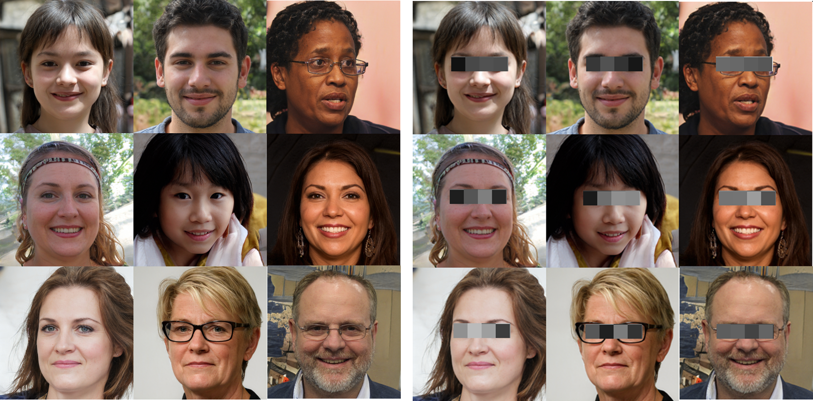
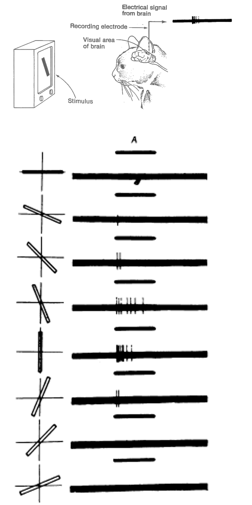
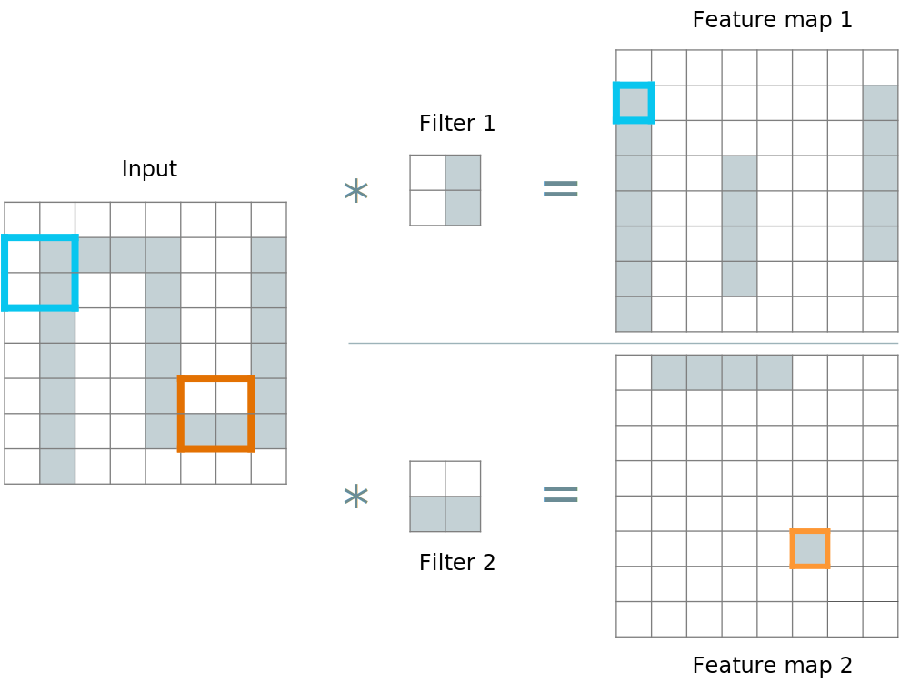
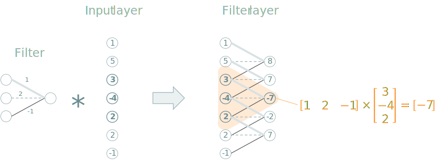
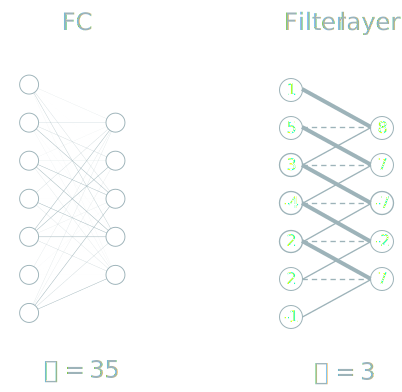
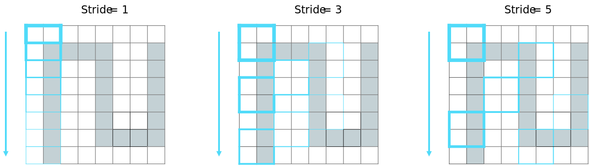
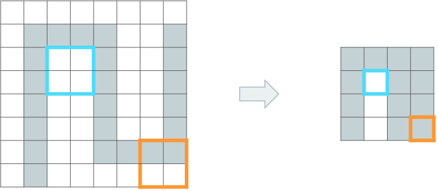

```{r include=FALSE}
library(knitr)
library(data.table)
library(reticulate)
library(magrittr)
library(e1071)
library(latex2exp)

opts_chunk$set(echo = TRUE, cache = TRUE, message = FALSE, warning = FALSE)
source("r/md_tools.r")
dyad <- readRDS("r/Palette_5YR_5B_Dyad.RDS")
palette(dyad[c(9, 20, 66)])
```

# Convolutionele Neurale Netwerken (CNN)

## Het onstaan van Computer Vision

Computer vision is een oude discipline die zich bezighoudt met het automatisch interpreteren van onder andere stilstaande beelden en videobeelden. Oorspronkelijk was het doel van deze discipline om digitale beelden te bewerken (eng: _image processing_) zodat er kenmerken (eng: _features_) geëxtraheerd konden worden. Een voorbeeld is het ontwikkelen van algoritmen voor het ontdekken van contrasterende randen (eng: _edge detection_). Voor gezichtsherkenning, bijvoorbeeld, was het idee dat je de ogen van een gezicht kan herkennen aan twee donkere gebieden met daartussen een lichter gebied (van de neus). Hoewel dat inderdaad een logische benadering lijkt te zijn, blijkt dit in de praktijk toch ontoereikend (zie Figuur \@ref(fig:feature-selection)).

```{r feature-selection, fig.cap="(ref:feature-selection)", echo = FALSE}

```

(ref:feature-selection) Negen gezichten. Men kan veronderstellen dat ogen altijd donkerder zijn dan de neus en dus een gemakkelijke manier om het kenmerk 'ogen' te onderscheiden. Hier wordt dit idee getest. Met het minimalistisch software-pakket IrfanView werd er ter hoogte van de ogen een selectie van 35 &times; 434 pixels gemaakt, omgezet naar grijswaarde en getransformeerd met het pixelize-algoritme met parameter 19. Bij een aantal gevallen zie je inderdaad het patroon donker-licht-licht-donker. Aan de meeste andere gezichten, misschien ten gevolge van het dragen van een bril of het bezitten van een andere huidskleur, zie je meteen dat deze procedure ontoereikend is. Deze gezichten werden gegenereerd door het [algoritme](https://thispersondoesnotexist.com/) van Tero Karras @karras2020analyzing. Voor alle duidelijkheid: het gaat hier dus niet om bestaande mensen.

Ondertussen behoort computer vision bijna volledig toe aan de discipline van ML. Inderdaad, met de opkomst van neurale netwerken was er een manier gevonden om de feature selectie-procedure volledig te automatiseren. Een van de belangrijkste vooruitgang in de ontwikkeling van convolutionele NN werd verwezenlijkt door Alex Krizhevsky @krizhevsky2012imagenet. De details van zijn ontdekkingen gaan we in de volgende paragrafen bespreken, maar het is interessant te weten dat de ontdekkingen er gekomen zijn door de natuur na te bootsen, meer bepaald het gezichtsvermogen bij zoogdieren (zie Figuur \@ref(fig:cat-vision)).

```{theorem alex-krizhevsky, name="Alex Krizhevsky"}


_Alex Krizhevsky_ won op spectaculaire wijze de [ImageNet competitie](http://image-net.org/challenges/LSVRC/) van 2012 door een algoritme te ontwikkelen dat de bestaande accuraatheid van 73.9% (en waar elke honderste van een percent nog het verschil maakte) plots overtrof met een accuraatheid van 84%.
```

```{r cat-vision, fig.cap="(ref:cat-vision)", echo=FALSE, out.width="100%"}

```

(ref:cat-vision) Spraakmakend experiment waarbij werd aangetoond dat sommige neuronen in de visuele cortex van huiskatten (maar dit geldt als model voor ander zoogdieren, waaronder de mens) enkel afgevuurd worden bij het zien van verticale lijnen @hubel1959receptive.

## Waarom vanilla SGD netwerken ontoereikend zijn

Waarom zouden er voor beeldherkenning nieuwe algoritmen ontwikkeld moeten worden. We zagen eerder in deze cursus dat de cijfers van de MNIST dataset herkend kunnen worden door gebruik te maken van een standaard NN met standaard optimalisatie algoritmen (eng: _vanilla SGD_, _vanilla stochastic gradient descent_). Het probleem is de schaalbaarheid. De afbeeldingen van de MNIST dataset bestonden uit 28 pixels &times; 28 pixels in grijswaarden. De invoerlaag wordt dan al meteen 784 noden groot en het model bestond uit méér dan 100&nbsp;000 parameters. Bedenk dan hoe groot het netwerk zou moeten worden voor de analyse van 4K video met 3840&times;2160 pixels aan 60 beelden per seconde.

Het komt erop neer dat de volledige geconnecteerde lagen (eng: _fully-connected layers_) snel té zwaar worden voor onze huidige computers, een gevaar vormen voor overfitting en algemeen elektron-verspillend zijn. Het aantal parameters moet dus drastisch verlagen om het gebruik van NN voor real-time beeldherkenning mogelijk te maken. Een dropout regularisatie biedt hier onvoldoende soelaas omdat je hiermee te veel informatie negeert en belangrijke patronen mist die zich op kleine schaal manifesteren.

## De CNN Filter

Een van de elementen die convolutionele NN mogelijk maakte was het gebruik van filters. Een filter is een patroon waarmee een input wordt gescand. Laten we Figuur \@ref(fig:cnn-filter) grondig onderzoeken. Links wordt een eenvoudige afbeelding voorgesteld met afmetingen 8 pixels &times; 8 pixels &times; {0, 1}. Filter 1 stelt een verticale patroon voor, Filter 2 een horizontaal patroon. Tijdens de convolutie-operatie (voorgesteld met de symbolen 	&lowast; of, indien het om circulaire data gaat, $\circledast$) worden de filters a.h.w. over de afbeelding geschoven en telkens gecontroleerd in hoeverre de afbeelding op die locatie het patroon vertoont. In deze binaire filter is het resultaat van de convolutie een 1 telkens wanneer het patroon exact overeenkomt en een 0 als het niet perfect overeenkomt.

```{r cnn-filter, fig.cap="(ref:cnn-filter)", echo=FALSE}

```

(ref:cnn-filter) De demonstratie van een CNN filter. In dit vereenvoudigd voorbeeld gaat het om een 'binaire' 2D filter in de zin dat het resultaat van een scan-operatie binaire is en dat de invoer 2-dimensionaal is. Zie tekst voor details. Deze figuur werd aangepast van figuur 5-6 uit @buduma.

In onderstaande video zien we de filter in actie. Merk op dat het resultaat van deze filter al iets complexer is zoals voorgesteld met de groene (meer positieve match) en rode kleuren (meer negatieve match; i.e. omgekeerd patroon). Na het toepassen van de filter wordt er een ReLU activatie functie toegepast en later een Pooling (zie later).

<iframe width="566" height="318" src="https://www.youtube.com/embed/f0t-OCG79-U" frameborder="0" allow="accelerometer; autoplay; clipboard-write; encrypted-media; gyroscope; picture-in-picture" allowfullscreen></iframe>

<small>Dit is fragment uit de <a href="https://www.youtube.com/watch?v=Oqm9vsf_hvU">presentatie</a> van Otavio Good tijdens de TheAIConf in 2017</small>

## De filter binnen een NN

Hoe vertaalt dit zich nu naar een neuraal netwerk? In een NN stemt de filter operatie overeen met het meervoudig uitvoeren van inwendige producten tussen invoerlaag en filter-matrix. Het is belangrijk te begrijpen dat de filter gemeenschappelijk is voor de ganse filter-laag. Dat wilt zeggen dat elk neuron van de invoerlaag met dezelfde filter wordt vermenigvuldigd. De convolutie in dit verhaal vertaalt zich als een soort herhalingslus. ^[De densiteit waarvan sprake is in het hoofdstuk rond [Data exploratie](#data-exploratie) is trouwens gelijkaardig aan deze filtering-operatie. In het Engels spreekt men van _Kernel Density Estimation_ en de Kernel stemt overeen met de filter van het CNN. Voor meer informatie over de convolutie, verwijs ik naar [Wikipedia](https://nl.wikipedia.org/wiki/Convolutie)]

```{r cnn-filter2, fig.cap="(ref:cnn-filter2)", echo=FALSE}

```

(ref:cnn-filter2) In een NN stemt de filter operatie overeen met het meervoudig uitvoeren van inwendige producten tussen invoerlaag en filter-matrix.

## Filter als compressor

Omdat binnen een laag dezelfde filter wordt gebruikt voor alle inkomende connecties, beperkt men zeer sterk het aantal parameters:

```{r cnn-filter3, fig.cap="(ref:cnn-filter3)", echo=FALSE}

```

(ref:cnn-filter3) Een enkele filter heeft slechts een beperkt aantal parameters nodig. In werkelijkheid zal het iets meer dan 3 zijn, in dit voorbeeld, zie later in de tekst.

Natuurlijk komt men niet toe met slechts één filter. Het is niet voldoende om enkel horizontale of verticale patronen te herkennen, misschien willen we ook krommen, schuine lijnen en dergelijke&hellip;. Het aantal filters neemt dan wel toe, maar niet langer exponentieel met toenemende grootte van de afbeeldingen.

## De _stride_ niet opgeven

Er zijn (hyper)parameters die een filter kenmerken. De eerste die we hier bespreken is de _stride_ (nl: letterlijk de _pas_; _stapgrootte_). Het geeft eenvoudigweg aan met welke frequentie de filter operatie moet uitgevoerd worden. Dit is weer een andere manier waarmee een filter het aantal neuronen weet te beperken, maar opgelet. Een stride > 1 betekent dat je onvermijdelijk patronen gaat missen.


```{r stride, fig.cap="(ref:stride)", echo=FALSE}

```

(ref:stride) De demonstratie van de _stride_ hyperparameter van een filter.

De tweede hyperparameter is de padding. Dit is de 'dikte' van de rand met nul-waarden die rond de 'afbeelding' van de input laag wordt aangebracht om ervoor te zorgen dat de filter operatie de dimensies niet wijzigt zoals het geval is in Figuur \@ref(fig:cnn-filter2). 

## De volledige filter-laag

De filter-operatie vervangt de traditionele matrix-operatie die eerder aangeduid werd met functie $g$. De output is echter niet een getal maar een zogenaamde _feature map_. Dat betekent dat er na de filter operatie nog steeds een activatiefunctie volgt. Dat is vaak een ReLU functie omdat deze de meest eenvoudige niet-lineaire functie is.

## Meerdere filters per laag

Als we meerdere filters kunnen hebben en elke filter genereert een feature map met gelijkaardige dimensies als de vorige laag in het netwerk, dan betekent dit dat de feature maps dus een extra dimensie hebben, i.e. in plaats van lagen (matrices), krijgen we blokken (3-dimensionele arrays).

Bovendien, de filter die hierboven werd voorgesteld, was twee-dimensionaal. Dat is voldoende voor afbeeldingen in grijswaarden zoals de MNIST dataset. Werk je echter met RGB waarden, dan kan je iets bijzonder doen. Je kan een 3D filter definiëren van bijv. 4 pixels &times; 4 pixels &times; 3 kleurwaarden en de convolutie doorvoeren als voorheen, alleen nu in de derde dimensie.

```{r 2Dconv, fig.cap="(ref:2Dconv)", echo=FALSE}
include_graphics("https://miro.medium.com/max/1750/1*K_OsaLGJ7I8cGlPvvWYJdg.png")
```

(ref:2Dconv) 2D-convolutie met 3D filter. Bron: @Kunlun.

We kunnen nu 2D beelden vervangen door 3D beelden (zoals MRI scans of dergelijke) of videobeelden (tijd is dan de derde dimensie) en dan kan de convolutie plaatsvinden 3-dimensies in plaats van 2, men spreekt dan ook van 3D convoluties. 

```{r 3Dconv, fig.cap="(ref:3Dconv)", echo=FALSE}
include_graphics("https://miro.medium.com/max/1750/1*wUVVgZnzBwYKgQyTBK_5sg.png")
```

(ref:3Dconv) 3D-convolutie met 3D filter. Bron: @Kunlun.

## Max Pooling

Hier kunnen we heel kort zijn, dit is letterlijk een soort beeld-compressie, behalve dan dat je telkens de maximum 'pixel-waarde' neemt i.p.v. een gemiddelde. Er bestaan dan ook _anti-aliasing_ varianten.

```{r max-pooling, fig.cap="(ref:max-pooling)", echo=FALSE}

```

(ref:max-pooling) Demonstratie van Max pooling.

Deze operatie wordt, indien beschouwd als onderdeel van een laag, altijd toegevoegd ná de activatiefunctie, We krijgen dus ($m$ = max pool):

$$x_{out} = m(t(g(x_{in})))$$

Soms wordt deze echter als afzonderlijke laag beschouwd.

## Samenstellen van CNNs

We kunnen nu meerdere lagen samenbrengen in een heus netwerk. Als we begrijpen dat een filter-operatie de informatie probeert te capteren, dat een ReLU-operatie (of andere activatie-functie) de informatie combineert en de max pool-operatie de informatie comprimeert, dan zijn de volgende regels niet al te onlogisch:

- De filter + activatie-functie vormen samen een zogenaamde convolutie laag
- De max-pool laag is niet verplicht
- De max-pool laag kan afzonderlijk voorkomen, zonder voorafgaande convolutie
- De max-pool-laag zal vaak voorkomen na een convolutie laag
- De combinatie van convolutie-laag en max-pool-laag wordt vaak meerdere keren na elkaar herhaald om telkens patronen met toenemende complexiteit te capteren 

<iframe width="100%" height="650px" src="https://alexlenail.me/NN-SVG/AlexNet.html" sandbox="allow-same-origin allow-scripts allow-popups allow-forms" style="border:0px;"></iframe>

Nog wat links:

- [Visualisatie van CNN lagen](https://towardsdatascience.com/how-to-visualize-convolutional-features-in-40-lines-of-code-70b7d87b0030)
- [Interactief voorbeeld](https://poloclub.github.io/cnn-explainer/#article-relu)
- [Verdiepeing in verschillende soort CNNs](https://towardsdatascience.com/a-comprehensive-introduction-to-different-types-of-convolutions-in-deep-learning-669281e58215)

```{exercise exploratie-cnn, name="Exploratie CNN"}
Zoek één nieuwe toepassing van CNN op het internet. Geef hier een korte uitleg over wat je gevonden hebt + link naar de website.
```
