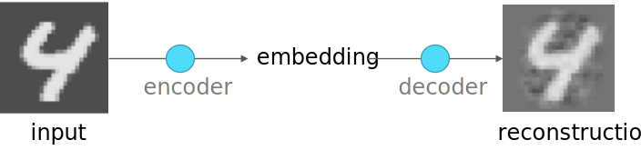
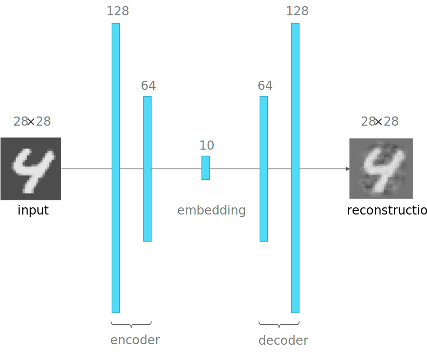

```{r include=FALSE}
library(knitr)
library(data.table)
library(reticulate)
library(magrittr)
library(e1071)
library(latex2exp)
library(DiagrammeR)

opts_chunk$set(echo = TRUE, cache = TRUE, message = FALSE, warning = FALSE)
source("r/md_tools.r")
dyad <- readRDS("r/Palette_5YR_5B_Dyad.RDS")
palette(dyad[c(16, 59)])
```

# Autoencoders

## Probleemstelling rond Dimensionaliteit en Complexiteit

Complexe problemen dienen opgelost te worden met complexe NN. Maar complexe NN vereisen meer data (eng: _are more data hungry_). Indien complexe modellen onvoldoende data te verwerken krijgen is er een grotere kans op overfitting.

Een mogelijke oplossing voor bovenstaand probleem is het reduceren van het aantal dimensies van de invoer-data. We nemen alweer de MNIST dataset als voorbeeld. Deze invoer data bestaat uit 784 pixels en in platte tabel vorm hebben we voor elke instantie 784 waarden verdeeld over evenveel kolommen. Wat als we zouden proberen het aantal variabelen terug te brengen tot een kleiner aantal? Je zou kunnen redeneren: waarom niet de beelden van de cijfers te comprimeren van 28 &times; 28 pixels naar bijvoorbeeld 5 &times; 5 pixels. Deze benadering is mogelijk maar niet erg efficiënt, omdat niet elke pixels van de afbeelding evenveel bijdraagt tot de classificatie. Er is een betere benadering, noem het een 'slim compressie-algoritme', die we de _autoencoder_ noemen.

## Dimensionaliteit reduceren

De doelstelling van een autoencoder is om eenvoudigere modellen te maken in situaties waarbij:

1. er slechts een beperkte hoeveelheid data beschikbaar is
2. de data nogal complex is (veel variabelen)
3. de onderliggende patronen vermoedelijk relatief eenvoudig zijn

De autoencoder is een functie die dus zal trachten om de dimensionaliteit van de invoer data te reduceren (eng: _dimensionality reduction_) hetgeen er dus op neer komt om het aantal variabelen te verminderen zonder al te veel informatie te verliezen.

```{definition, slimme-compressie, name="Eigenschappen van een goede autoencoder"}


- __Data-type specifiek__: Een autoencoder werkt niet zoals een beeld-compressie algoritme of als een ZIP-functie op eender welk type data, in plaats daarvan werkt de autoencoder op basis van de inhoud. Dat betekent dat een autoencoder getraind op auto's niet geschikt is voor het comprimeren van afbeeldingen van huiskatten.
- __Niet perfect__: (eng: _lossy_) Na een decompressie bekoemt nooit nooit exct de oorpronkelijke data. Met autoencoder verlies je altijd data.
- __Zelflerend__: (eng: _self-supervised_) een autoencoder heeft geen input nodig van buitenaf buiten een beperkt aantal hyperparameters
```

## PCA om dimensionaliteit te reduceren

PCA is familie aan onbegeleide leeralgoritmen die bekend staat om de dimensionaliteit van de data te kunnen verlagen, i.e. door het aantal variabelen te verminderen zonder al te veel van de onderliggende patronen (of 'informatie') te verliezen. We genereren nog eens een puntenwolk waarbij twee hypothetische variabelen met een sterke correlatie ($\rho = 0,7$) worden uitgebeeld:

```{r pca-demo-copula}
library (MASS)
set.seed(42)

copula <- function(n, rho, mu1, mu2, sd1, sd2, names){
  mu <- c(mu1,mu2)
  sigma <- matrix(c(sd1 ^ 2, sd1 * sd2 * rho, sd1 * sd2 * rho, sd2 ^ 2),2)
  mvrnorm(n, mu, sigma) %>% as.data.table %>% set_names(names)
}

dat <- copula(100, .7, 0, 0, .3, .5, c("X1", "X2"))
dat %>% plot(pch = 19, asp = 1, col = 1)
abline(h = 0, v = 0)
```

We voeren nu de PCA uit en kijken naar het resultaat:

```{r pca-demo-run}
dat_pca <- dat %>% prcomp
rot <- dat_pca$rotation

dat_pca$x %>% plot(pch = 19, asp = 1, col = 1)
abline(h = 0, v = 0)
```

Wat is er gebeurd? Eerst zoekt het PCA-algoritme eigen-vector die in de richting wijst van de sterkste variantie. PCA gaat er namelijk van uit dat de hoeveelheid variantie een goede maat is voor de hoeveelheid informatie. Deze eerste vector worden de eerste _principale component_. In ons voorbeeld wordt deze opgebouwd als `r rot[1, 1] %>% sprintf("%.3f", .)` &middot; X1 + `r rot[2, 1] %>% sprintf("%.3f", .)` &middot; X2.

```{r}
dat %>% plot(pch = 19, asp = 1, col = 1)
abline(h = 0, v = 0)
arrows(0, 0, rot[1, 1], rot[2, 1], lwd = 3, col = 4)
text(rot[1, 1], rot[2, 1], "PC1", col = 4, adj = c(1, 1), font = 2)
```

Voor de tweede component zoekt het algoritme een richting loodrecht op de eerste waarin zich de meeste variantie bevindt.

```{r}
dat %>% plot(pch = 19, asp = 1, col = 1)
abline(h = 0, v = 0)
arrows(0, 0, rot[1, 1], rot[2, 1], lwd = 2, col = 4)
arrows(0, 0, rot[1, 2], rot[2, 2], lwd = 3, col = 4)

text(rot[1, 1], rot[2, 1], "PC1", col = 4, adj = c(1, 1), font = 2)
text(rot[1, 2], rot[2, 2], "PC2", col = 4, adj = c(0, 1), font = 2)
```

We zijn vertrokken van twee variabelen, dus is er hier maar één andere richting mogelijk. In realistische situaties met meer variabelen, zijn er evenveel loodrechte richtingen mogelijk, hoewel dit in een meerdimensionale ruimte moeilijk voor te stellen is, natuurlijk.

De gecumuleerde hoeveelheid variantie voor deze twee principale componenten ziet er als volgt uit:

```{r}
dat_pca %>% summary %$% importance %>% extract(3, ) %>%
  barplot(col = 1, ylab = "Geacummuleerde variantie verklaard")
```

De eerste component draagt in zich reeds meer dan 90% van de totale variantie. Stel nu dat dit voldoende is en dat een verlies van zo'n 9% van de informatie aanvaardbaar is. In dat geval kan men beslissen om de eerste component te gebruiken als een gecomprimeerde voorstelling van de oorspronkelijke dataset. Het komt erop naar dat we de 'geroteerde' versie van de dataset 'projecteren' op de eerste component:

```{r}
dat_pca$x[, 1] %>% cbind(rep(0, nrow(dat_pca$x))) %>%
  plot(pch = 19, asp = 1, col = 1, yaxt = "n", xlab = "PC1")
abline(h = 0)
```

## PCA op de MNIST dataset

Nu dat we het principe van PCA beter begrijpen, kunnen we het proberen toepassen op de MNIST dataset. We beginnen met het definiëren van een aantal helper-functies.

```{r mnist-pca-helpers}
rotate <- function(x) t(apply(x, 2, rev))

normalize <- function(x) {
  x_min <- min(x, na.rm = TRUE)
  x_max <- max(x, na.rm = TRUE)
  
  (x - x_min) / (x_max - x_min)
}

plot_digit <- function(digit, title = ""){
  par(mar = rep(0, 4))
  
  digit %>%
    unlist %>%
    normalize %>% 
    matrix(ncol = 28, byrow = TRUE) %>%
    rotate %>% 
    image(1:28, 1:28, ., asp = 1, col = gray.colors(256),
      axes = FALSE)
  
  text(1, 26, title, adj = c(0, 1), col = "white")
}
```

De `rotate` functie dient om de matrix een kwartslag te draaien zodat de `image` functie de afbeelding correct weergeeft. `normalize` dient om te normaliseren. Voor het verschil tussen normalisatie en standaardisatie verwijs ik naar de [Appendix](#normaliseren-versus-standaardiseren). Tenslotte, de `plot_digit` functie zal de set van grijswaarden als afbeelding weergeven.

In de volgende stap lezen we 100 eerste afbeeldingen uit de MNIST dataset in, zoals die vrijgegeven werd op de [blog van Joseph Chet Redmon](https://pjreddie.com/).

```{r mnist-pca-read, fig.asp=1}
set.seed(42)

mnist <- fread("dat/mnist_train.csv")
mnist <- mnist[, 2:785]
```

Net als bij het PCA voorbeeld op de puntenwolk, gaan we nu de PCA uitvoeren en een projectie maken van de `k` eerste (i.e. meest informatieve) principale componenten ($k:{1, 5, 10, 25, 50}$):

```{r mnist-pca, fig.asp=5/4, fig.cap="(ref:mnist-pca)"}
predict_pca <- function(x, n) {
  x$x[, 1:n] %*% t(x$rotation[, 1:n]) %>%
    scale(center = -x$center, scale = FALSE)
}

par(mfrow = c(6, 5))

for (i in 1:5){
  mnist [i, ] %>% plot_digit("Orig.")
}

for(k in c(1, 5, 10, 25, 50)){
  mnist_recon <- mnist %>%
      prcomp %>%
      predict_pca(k)
  
  for (i in 1:5){
    mnist_recon [i, ] %>% plot_digit(k)
  }
}
```

(ref:mnist-pca) PCA-reconstructie van 5 cijfers uit een willekeurige subset van 100 cijfers uit de MNIST dataset. Het kleine gedrukte cijfer linksboven in elke afbeelding geeft het aantal principale componenten waarmee de afbeelding werd gereconstrueerd.

naarmate er meer componenten gebruikt worden voor de reconstructie, des te beter wordt de gelijkenis met het origineel (bovenste rij in Figuur \@ref(fig:mnist-pca)). PCA is dus in staat om een gigantische compressie door te voeren, want vergeet niet dat de originele bestanden 784 variabelen telt. Door dit terug te brengen naar 50 (compressie factor van `r round(784/50, 2)`) of zelfs minder, slaagt PCA erin de cijfers herkenbaar terug te reconstrueren.

## Beperkingen van PCA

PCA is een lineair systeem, en werkt niet goed wanneer er niet-lineaire verbanden bestaan onder de originele variabelen. Bedank bijvoorbeeld een afbeelding met concentrische cirkels. In dat geval bestaan er kwadratische verbanden tussen de variabelen en zal PCA niet goed presteren. We kunnen dan wel een polaire transformatie uitvoeren om de cirkels om te zetten naar lijnen, maar in een realistische situatie, met een complexe mix van lineaire en niet-lineaire verbanden, brengt een transformatie geen zode aan de dijk. We moeten op zoek naar een niet-lineaire compressie-techniek.

## De Architectuur van de Autoencoder

De architectuur van de autoencoder doet ons heel erg denken aan datgene de procedure die we hierboven volgden met het PCA algoritme. Alleen worden hier specifieke terminologie gebruikt. De _encoder_ stelt het NN voor dat gebruikt zal worden om de oorspronkelijke data te comprimeren tot een klein aantal variabelen en de _decoder_ is een NN netwerk dat net het omgekeerde zal doen. De encoder en decoder zijn in feite hetzelfde NN, t.t.z. met gespiegelde architectuur.

```{r autoencoder-architecture, fig.cap="(ref:autoencoder-architecture)", echo = FALSE}

```

(ref:autoencoder-architecture) De architectuur van de autoencoder. De encoder vertaald de invoer naar de embedding, een vereenvoudigde, gecomprimeerde voorstelling van de invoer-data. De decoder dient in feite om het oorspronkelijk beeld te kunnen reproduceren.

De reproductie van het oorspronkelijk beeld heeft verschillende doeleinden:

- Het laat toe aan het NN om _zelf-lerend_ te zijn. De verliesfunctie zal namelijk bestaan uit het 'verschil' tussen invoer en reconstructie.
- Het laat ook toe om achteraf diagnostische statistieken te trekken zodat je bijvoorbeeld kan bepalen wat het maximum toelaatbaar verlies is in de reconstructie, wat de minimale grootte is van de embedding en bijgevolg wat de maximum haalbare graad van compressie is. Na het trainen is het echter de embedding en niet de reconstructie die je gebruikt om de analyse-pipeline mee voort te zetten.

## Autoencoder op de MNIST dataset

Op basis van de [blog van Layan Alabdullatef](https://blog.keras.io/building-autoencoders-in-keras.html) kunnen we nu proberen om de bovenstaande oefening met PCA op de MNIST dataset te herhalen met een autoencoder. We beginnen met het laden van de MNIST dataset:

```{python ae-load-mnist}
import numpy as np
import keras
from keras import layers
from keras.callbacks import TensorBoard
from keras.datasets import mnist

(x_train, _), (x_test, _) = mnist.load_data()

x_train = x_train.astype('float32') / 255.
x_test = x_test.astype('float32') / 255.

x_train = x_train.reshape((len(x_train), np.prod(x_train.shape[1:])))
x_test = x_test.reshape((len(x_test), np.prod(x_test.shape[1:])))
```

De afbeeldingen van 28 &times; 28 zullen rechtstreeks als input dienen:

```{python ae-input}
input_img = keras.Input(shape = (784, ))
```

We moeten nu de grootte bepalen van de embedding. Laten we hier kiezen voor 10. Dit wil zeggen dat we de dimensionaliteit van 784 variabelen gaan terugbrengen naar 10 variabelen. Om niet te bruusk te maken en effectiever te kunnen trainen, passeren we via twee lagen, eentje van 128 nodes en de andere van 64 nodes.



```{python ae-encoder}
embedding_dim = 10

embedding = layers.Dense(128, activation = "relu")(input_img)
embedding = layers.Dense(64, activation = "relu")(embedding)
embedding = layers.Dense(embedding_dim, activation = "relu")(embedding)
```

De heropbouw van de embedding naar de gereconstrueerde afbeelding door de decoder weerspiegelt de architectuur van de encoder:

```{python ae-decoder}
reconstruction = layers.Dense(64, activation= "relu")(embedding)
reconstruction = layers.Dense(128, activation= "relu")(reconstruction)
reconstruction = layers.Dense(784, activation = "sigmoid")(reconstruction)
```

Het NN kan nu worden samengesteld. We maken ook afzonderlijke modellen voor zowel de encoder als de decoder:

```{python ae-model}
autoencoder = keras.Model(input_img, reconstruction)

encoder = keras.Model(input_img, embedding)

encoded_input = keras.Input(shape = (embedding_dim,))
decoder = keras.Model(encoded_input, autoencoder.layers[-1](autoencoder.layers[-2](autoencoder.layers[-3](
  encoded_input))))
```

We configureren het leeralgoritme met het _Adam_ optimalisatie algoritme en met de _binaire cross entropy_ als verliesfunctie.

```{python ae-hyper}
autoencoder.compile(optimizer='adam', loss='binary_crossentropy')
```

```{corollary Adam}
Het Adam optimalisatie algoritme is een combinatie van het momentum algoritme en het RMSProp algoritme. De naam Adam is afgeleid van _adaptive moment estimation_.

Het momentum algoritme is dan weer afgeleid van een bal die op het grillige vlak van de verliesfunctie naar beneden rolt en daarbij een momentum heeft. Het versnelt bij steile stukken en stopt niet zomaar met rollen als het laagste punt bereikt is. Het doet dit door een [voortschrijdend gemiddelde](https://nl.wikipedia.org/wiki/Voortschrijdend_gemiddelde) te berekenen van de gradiënten.

RMSProp komt van _Root Mean Square Propagation_. In dit laatste algoritme past de leersnelheid zich aan aan de kwadraten van de recente gradiënten.

Behalve de leersnelheid ($\alpha$) hangt Adam ook af van de hyperparameters $\beta_1$ en $\beta_2$, de verval-constanten voor de L1 en L2 momenten van de gradiënten, en $\epsilon$ (niet te verwarren met $\varepsilon$): een klein getal om deling door nul te voorkomen.
```

Rest ons om het NN te trainen 

```{python ae-training, include = FALSE}
autoencoder.fit(x_train, x_train,
                epochs = 50,
                batch_size = 256,
                shuffle = True,
                validation_data = (x_test, x_test))
 
encoded_imgs = encoder.predict(x_test)
decoded_imgs = decoder.predict(encoded_imgs)
```

Het resultaat is verbluffend, met slechts 10 variabelen (compressie-factor van `r round(100 * (1 - 10/784), 2)`%) kunnen de cijfers goed gereproduceerd worden:

```{r ae-result}
par(mfrow = c(2, 5))

py$x_test[1:5, ] %>% apply(1, plot_digit) -> bin
py$decoded_imgs[1:5, ] %>% apply(1, plot_digit) -> bin
```

## Autoencoder met CNN

Niets houd ons tegen om nu met andere type encoders en decoders te werken en omdat het in het MNIST voorbeeld om afbeeldingen gaat, kan je evengoed een convolutioneel NN gebruiken:

```{python eval=FALSE}
input_img = keras.Input(shape=(28, 28, 1))

emb = layers.Conv2D(16, (3, 3), activation='relu', padding='same')(input_img)
emb = layers.MaxPooling2D((2, 2), padding='same')(emb)
emb = layers.Conv2D(8, (3, 3), activation='relu', padding='same')(emb)
emb = layers.MaxPooling2D((2, 2), padding='same')(emb)
emb = layers.Conv2D(8, (3, 3), activation='relu', padding='same')(emb)
emb = layers.MaxPooling2D((2, 2), padding='same')(emb)

# at this point the representation is (4, 4, 8) i.e. 128-dimensional

rec = layers.Conv2D(8, (3, 3), activation='relu', padding='same')(emb)
rec = layers.UpSampling2D((2, 2))(rec)
rec = layers.Conv2D(8, (3, 3), activation='relu', padding='same')(rec)
rec = layers.UpSampling2D((2, 2))(rec)
rec = layers.Conv2D(16, (3, 3), activation='relu')(rec)
rec = layers.UpSampling2D((2, 2))(rec)
rec = layers.Conv2D(1, (3, 3), activation='sigmoid', padding='same')(rec)

autoencoder = keras.Model(input_img, rec)
autoencoder.compile(optimizer='adam', loss='binary_crossentropy')
```

## Autoencoder als ruis-verwijderaar

Autoencoders kunnen naast het reduceren van de dimensionaliteit ook gebruikt worden om ruis te verwijderen (eng: _denoising_). Om dit te demonstreren transformeren we eerst de input zodat er kunstmatige ruis toegevoegd wordt:

```{python}
noise_factor = 0.5

x_train_noisy = x_train * \
  np.random.uniform(high = noise_factor, size = x_train.shape) 
x_test_noisy = x_test * \
  np.random.uniform(high = noise_factor, size = x_test.shape)
```

Daarna laten we hetzelfde model nog eens lopen:

```{python ae-noisy, include = FALSE}
autoencoder.fit(x_train_noisy, x_train,
                epochs = 50,
                batch_size = 32,
                shuffle = True,
                validation_data = (x_test_noisy, x_test),
                callbacks = [TensorBoard(log_dir = "tf")])

encoded_imgs = encoder.predict(x_test_noisy)
decoded_imgs = decoder.predict(encoded_imgs)
```

En we zien hoe de autoencoder in staat is om de ruis teniet te doen:

```{r ae-noisy-result}
par(mfrow = c(2, 5))

py$x_test_noisy[1:5, ] %>% apply(1, plot_digit) -> bin
py$decoded_imgs[1:5, ] %>% apply(1, plot_digit) -> bin
```


