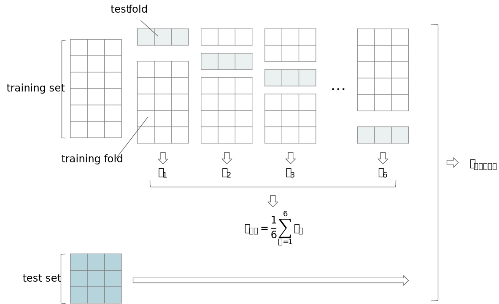
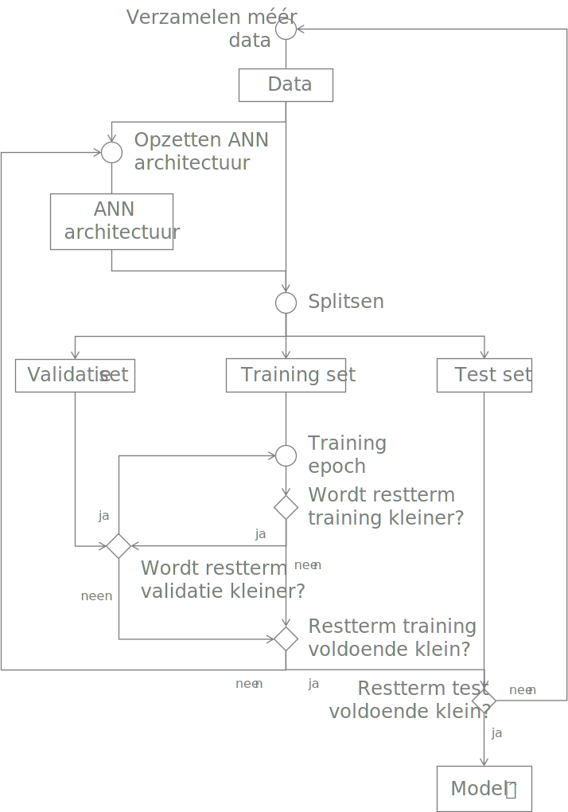

```{r include=FALSE}
library(knitr)
library(data.table)
library(reticulate)
library(magrittr)
library(e1071)
library(rgl)
library(rglwidget)

opts_chunk$set(echo = TRUE, cache = TRUE, message = FALSE, warning = FALSE)

dyad <- readRDS("r/Palette_5YR_5B_Dyad.RDS")
palette(dyad[c(9, 20, 66)])
knit_hooks$set(webgl = hook_webgl)
```

# Trainen en testen

```{lemma cross-validatie-lemma}
Onderkent de basisprincipes van data training & Cross-validatie ([_EA_LD754_](#leerdoelen)).
```

```{lemma risicos}
Herkent de risico’s van onvolledige en inaccurate data ([_EA_LD759_](#leerdoelen)).
```

```{lemma diagnose}
Gebruikt een diagnostische toolset om de performantie van ML modellen te meten ([_EA_LD760_](#leerdoelen)).
```

```{lemma performantie}
Evalueert op gepaste wijze de performantie van een algoritme. ([_EA_LD762_](#leerdoelen)).
```

## Leren leven met de onzekerheid

Misschien wel het belangrijkste aspect van ML is dat er nooit een garantie dat het gaat lukken. Vele mensen schijnen het hier erg moeilijk mee te hebben. Men zegt zegt al te vaak:

<q>We will be able to predict&hellip;</q>

Waar voorzichtigheid hier op zijn plaats is:

<q>We hope to able to predict&hellip;</q>

Dat betekent nog niet dat voorspellen onmogelijk is. We gaan ons best doen om, als er een patroon in de data verborgen zit, deze er ook uit te krijgen.

```{definition}
ML is geen toverkunst. Je kan __nooit__ garanderen dat je een correcte voorspelling kan maken van iets wat nog niet geweten is.
```

## Meten van de prestatie van een model

Omdat we nooit zeker zijn dat ons model goed zal voorspellen, moeten we dus ons best doen om de prestaties zo hoog mogelijk te houden. En dat begint daar weer bij het meten van de prestaties. Maar hoe meet men de prestatie van een model? Uit de paragraaf [Leren versus onthouden](#leren-versus-onthouden) leerden we wat overfit is en wat het verschil is tussen regressie en ML. Hieruit volgt de Stelling \@ref(def:prestatie-principe).

```{definition prestatie-principe}
De prestatie van een model wordt niet zomaar gemeten op basis van hoe goed het iets kan voorspellen. De prestatie van een model wordt in principe gemeten op basis van hoe goed het uitkomsten kan voorspellen gebruik maken van test-data, i.e. invoerdata waar noch het model, noch het leeralgoritme noch de datawetenschapper eerder mee in aanraking kwamen.
```

## Training-, validatie- en test-set

We begrijpen nu dat het trainen van een model en het testen van een model dient de gebeuren op afzonderlijke subsets van de data. Dus de oplossing is het opsplitsen van de data. De belangrijkste opsplitsing van data is die tussen de _training-set_ en de _test-set_. De training set is de set van _instanties_ (zie hoofdstuk over [data](#data) als je deze term niet kent) waarmee het leeralgoritme getraind zal worden. De test-set krijgt het leeralgoritme niet te zien tot op het laatste, wanneer de prestaties van het model getest worden. Ook de datawetenschapper mag de test-set in principe niet zien en in professionele omgevingen wordt dit ook letterlijk genomen en is er een tussenpersoon tussen data leverancier en datawetenschapper die voor de opsplitsing zorgt.

Er zijn verschillende manieren om de opsplitsing te verwezenlijken. Meestal krijgt men te maken met een _randomisatie_, dat is een opsplitsing op willekeurige basis, maar waarbij enkel de relatieve grootte van de training- en test-set worden meegegeven.

In R:

```{r eval=FALSE}
data(mtcars)

set.seed(42)
trn_msk <- runif(nrow(mtcars)) < .75

trn <- mtcars[trn_msk, ]
tst <- mtcars[!trn_msk, ]

cat("mtcars: ", mtcars %>% dim %>% paste0(collapse = " × "), "\n")
cat("trn: ", trn %>% dim %>% paste0(collapse = " × "), "\n")
cat("tst: ", tst %>% dim %>% paste0(collapse = " × "), "\n")
```

De variabele `trn_msk` heet zo omdat het om een Booleaanse _masker_ (eng: _mask_; zie &sect; [Booleaans masker](#booleaans-masker)) gaat. 

In Python worden de features en de uitkomst (cfr. [data](#data)) meestal gescheiden gehouden (om dan vaak terug samen te brengen met `zip` :-)) en wordt er een helper-functie uit de `sklearn` bibliotheek aangeroepen:

```{python}
from sklearn.model_selection import train_test_split
from sklearn.datasets import load_wine

X, y = load_wine(return_X_y=True)

X_trn, X_tst, y_trn, y_tst = train_test_split(
  X, y, test_size = 0.25, random_state = 42)

print(f"X: {X.shape}")
print(f"y: {y.shape}")
print(f"X_trn: {X_trn.shape}")
print(f"X_tst: {X_tst.shape}")
print(f"X_trn: {y_trn.shape}")
print(f"X_tst: {y_tst.shape}")
```

Het argument `random_state` in Python en de `set.seed` functie in R dienen om dit proces, dat inherent willekeurig is, toch reproduceerbaar te maken (zie &sect; rond [reproduceerbaarheid](#reproduceerbaarheid)). Zie dit [Wikipedia artikel](https://en.wikipedia.org/wiki/Random_seed) om hier meer over te leren.

```{definition}
Regels rond de test set:

- De test-set blijft _altijd_ verborgen voor het leeralgoritme
- De test-set blijft verborgen voor de datawetenschapper en het model tot helemaal op het einde wanneer de prestatie van het model word gemeten
- De test-set mag slechts één keer gebruikt worden, daarna is het gewoon data en mag het wel als training data gebruikt worden, maar mag het niet langer dienen om de prestatie van het model te meten
```

Voor tijdsreeksen en geografische data wordt er zelden van randomisatie gebruik gemaakt. Dat heeft te maken van de autocorrelatie (zie &sect; [Tijd en ruimte](#tijd-en-ruimte)). In plaats daarvan worden hier ofwel een bepaald gebied of bepaalde tijdspanne als test-set uitgekozen. Bijvoorbeeld, voor een tijdsreeks:

```{r forecast-usa-deaths, fig.cap="(ref:forecast-usa-deaths)", fig.asp=.8}
library(forecast)

USAccDeaths %>% ets %>% forecast(h = 48) %>%
  plot(ylab = "Monthly totals of accidental deaths in USA")
abline(v = 1979, lty = 2)
```

(ref:forecast-usa-deaths) Voorspelling van aantal Amerikaanse slachtoffers na 1979 (stippellijn). De grillige gekleurde lijn links van de stippellijn geeft het werkelijke aantal weer. De tegenhanger rechts van de stippellijn geeft de best mogelijke voorspelling weer na 1979. Het donkergrijze gebied geeft de 80%-predictie-interval weer en het lichtgrijze gebied de 90%-predictie interval. Dit type voorspelling-algoritmes (eng: _forecasting algorythms_) onderscheidt eerst de ruis (eng: _error_) van de trend en de periodiciteit (eng: _seasonality_), vandaar de naam ETS. (ANA) staat voor respectievelijk aan additieve ruis, geen trend (N van 'No') en een additieve periodiciteit.

Naast een training-set en een test set, bestaat er nog zoiets als een _validatie set_. In [één van de latere paragrafen binnen dit hoofdstuk](#hyperparameters) gaan we zien dat er zoiets als hyperparameters bestaan die het verloop van het ML proces mee helpen bepalen. Vaak moeten die hyperparaneters ook nog eerst geoptimaliseerd worden en hiervoor wordt soms een afzonderlijke set, namelijk de _validatie set_ aangewend. Een andere reden om de validatie-set te gebruiken in gewoon om dienst te doen als tijdelijke test-set (omdat we de echte test-set naturlijk maar één keer kunnen aanwenden). Let wel: die opsplitsing in verscheidene subsets zijn niet in steen gebeiteld en kunnen geval-per-geval bekeken worden op basis van de hoeveelheid beschikbare data, het type algoritme, enz&hellip;.

Het zelfde geldt trouwens voor hoeveel percent van de data naar welke subset moet gaan. Er wordt soms de 'gulden regel' &frac23;:&frac13; gebruikt voor de verdeling tussen training- en test-set, maar ook dit hoeft niet vast te liggen. Hoe meer data wordt vrijgehouden om te testen hoe dichter de gemeten prestatie bij de werkelijke prestatie (op een grotere groep nieuwe data, wanneer het algoritme in productie staat) zal aanleunen. Maar hoe meer test-data, hoe minder training-data en wat is het nut om super-precies te prestatie te kunnen meten van een barslecht model.

## Cross-validatie

Dit ideale scenario kan niet altijd gehanteerd worden en daarom laat men een aantal vormen van contact met de test data toe:

```{definition cross-validatie}
Alvorens de finale bekendmaking van de prestatie van het model kan men 'doen alsof' we met _ongeziene data_ werken door middel van [cross-validatie](#cross-validatie).
```

Het principe is eenvoudig, telkens laat je een deel van de training-set (_test-fold_) weg en train je een model op het overblijvend deel (_training fold_). Je kan nu de prestatie $\varepsilon_i$ meten om het weggelaten deel te voorspellen. Daarna voeg je de test-fold weer bij de rest en ga je voort met het volgende deel (\@ref(fig:cv-voorbeeld)). In het voorbeeld worden de scores van de folds uitgemiddeld, maar je kan hier ook kiezen om de beste te nemen (bijvoorbeeld met de kleinste fout) of nog een andere vorm van aggregatie toepassen.

```{r cv-voorbeeld), echo=FALSE, fig.cap="(ref:cv-voorbeeld)"}

```

(ref:cv-voorbeeld) cross-validatie voorbeeld. Een dataset met dimensies $9\times3$ wordt eerst op gesplitst in een training set van $\frac23$ en een test set van $\frac13$. Van de training set wordt telkens $\frac16$ opzij gehouden als test fold. De resultaten van de validaties van elke fold $\varepsilon_i$ worden geaggregeerd in $\varepsilon_{cv}$ door het gemiddelde te nemen. Pas op het einde van dit proces wordt eenmalig de finale prestatie $\varepsilon_{final}$ berekend.


```{r cv-strategie), fig.cap="(ref:cv-strategie)", echo=FALSE, out.width="300px"}
include_graphics("img/cv_strategy.svg")
```

(ref:cv-strategie) Een model voorbeeld van hoe een cross-validatie strategie past binnen een begeleid ML proces.

## Werkstroom deep learning

Figuur \@ref(fig:deep-learning-workflow) vat samen hoe de werkstroom van een ANN eruit ziet. Het is een complex schema maar desalniettemin erg belangrijk. Dankzij deze werkstroom weten we hoe lang we moeten blijven trainen, i.e. hoeveel epoch we moeten doorlopen alvorens we kunnen stoppen.

Het begint met het verzamelen van gegevens. Op basis van de _structuur van de gegevens_ ontwerpen we de architectuur van ons neuraal netwerk. De data wordt ondertussen gesplitst in een training-, validatie- en test-set (zie [betrokken paragraaf](#training--validatie-en-test-set) voor meer info). We gaan eerst aan de slag met met de training-set. Na de eerste epoch eindigen we met een tijdelijke versie van het ANN model. Indien de restterm verkleint controleren we of dit tijdelijk model ook beter presteert op de validatie-set. Indien zo is, gaan we naar de volgende epoch. Deze lus houden we aan totdat de prestatie van het tijdelijk model niet meer verbetert.

Er gaat een punt komen waarop de prestatie nog wél verbetert voor de training-set, maar niet voor de validatie-set. Dat is het punt waarop het tijdelijk model begint te _overfitten_. Als dat gebeurt, moet de architectuur van het ANN worden aangepast om de overfitting tegen te werken. Dit kan onder andere gebeuren door een aantal minder belangrijke verbindingen tussen de neuronen te verbreken (zie later).

Op een gegeven ogenblik zal natuurlijk ook de fit op de training set niet verbeterd kunnen worden, je kan natuurlijk niet oneindig lang verbeteren. Dit is het punt waarop men niet enkel naar de relatieve prestatie moet kijken (beter versus slechter), maar ook naar de absolute prestatie van het tijdelijk model. Pas wanneer het tijdelijk model op de training-set slaagt voor een aantal voorgedefinieerde criteria, mag er finaal (en dus slechts eenmalig) getest worden op de test-set.

In normale omstandigheden worden de criteria op de test-set (mede-)gestuurd door uitwendige factoren (zie paragraaf rond [Uitwendige invloed](#uitwendige-invloed)). Slaagt het model niet, dan zit er niets anders op om nieuwe data te zoeken. De test-set is nu a.h.w. gecompromitteerd (eng: _compromised_) en mag niet meer in die hoedanigheid functioneren.

```{r deep-learning-workflow, fig.cap="(ref:deep-learning-workflow)", echo=FALSE}

```

(ref:deep-learning-workflow) De typische werkstroom voor het afhandelen van deep-learning ANN. Meer uitleg in de tekst. Gebaseerd op de werkstroom in figuur 2-14 van @buduma.

## Data lekkage

In de paragraaf [Leren versus onthouden en inferentie](#leren-versus-onthouden-en-inferentie) zagen we dat leren per definitie betekent dat er _iets nieuw_ wordt aangeleerd. Een van de vele gevaren van ML is dan ook dat er iets wordt aangeleerd wat je al wist. Data lekkage (eng: _data leackage_) is een ernstig probleem dat soms ongezien zijn weg baant in een ML algoritme en dat voor onrealistisch hoge performantie leidt.

```{definition}
Data lekkage wordt veroorzaakt wanneer informatie afkomstig van de test data gebruikt wordt om het leeralgoritme mee te trainen.
```

We gaan het probleem onderzoeken aan de hand van twee voorbeelden:

```{example}
__Voorspellen van slaagcijfers__: stel dat je gevraagd wordt om, op basis van onderstaande data, de slaagcijfers van de studenten te voorspellen. Welke variabelen mag je dan, gegeven bovenstaande definitie, wel gebruiken voor de voorspelling te doen en welke niet.
```


|Student|Year|Semester|Course|Study_Time_Std|Exam_Feedback_Length|Exam_Score|
|-|-|-|-|-|-|-|
|A|2018|1|Statistics|.342|213|10|
|A|2018|2|Informatics|.612|76|14|
|B|2018|1|Statistics|.771|0|5|
|&hellip;|&hellip;|&hellip;|&hellip;|&hellip;|&hellip;|


