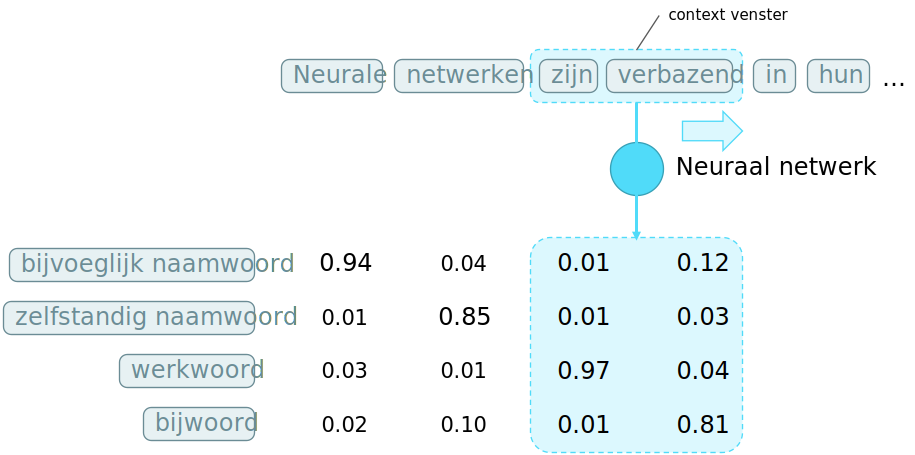
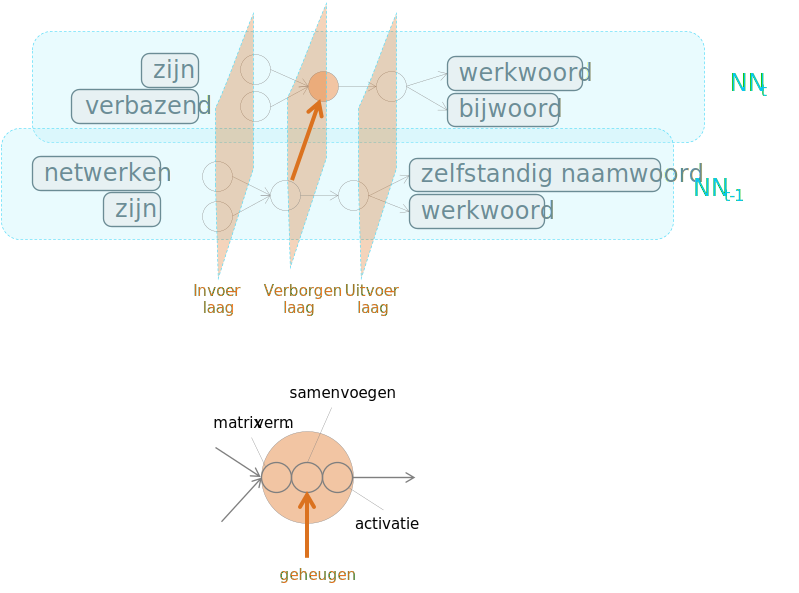
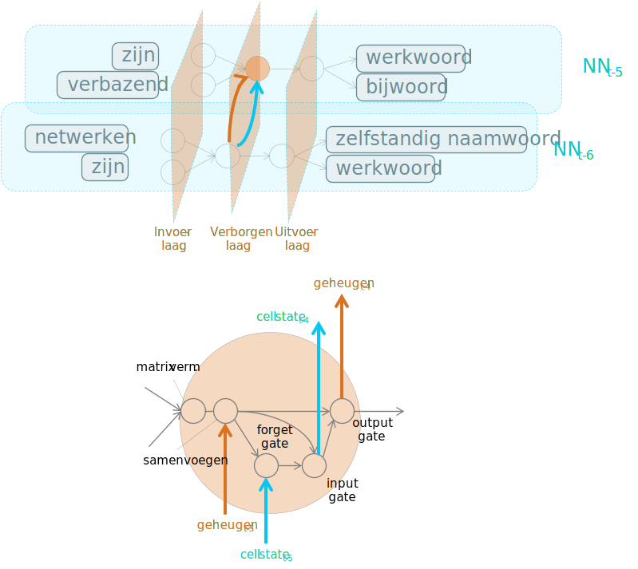
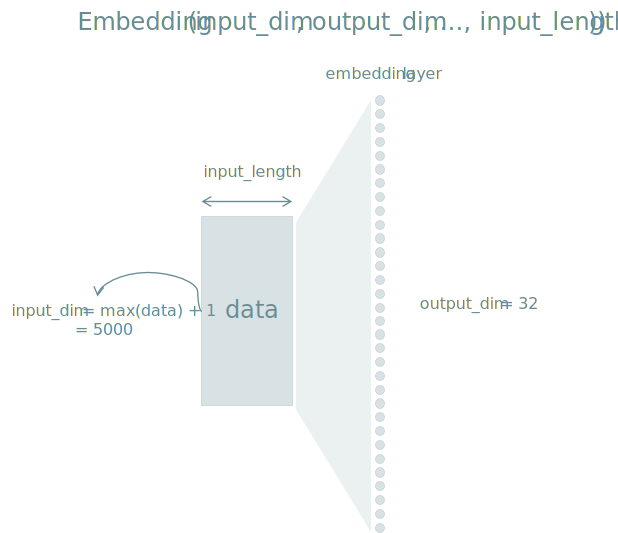
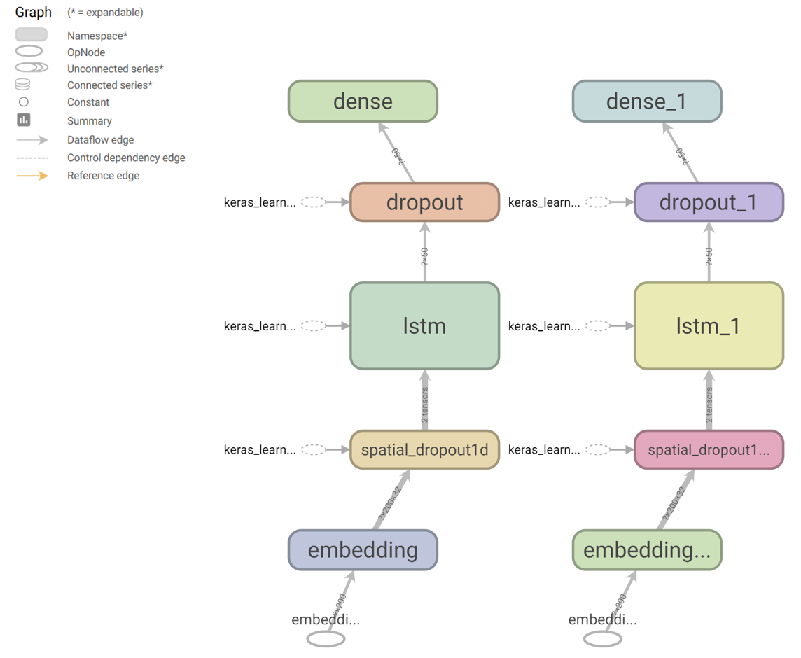
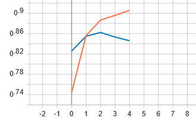
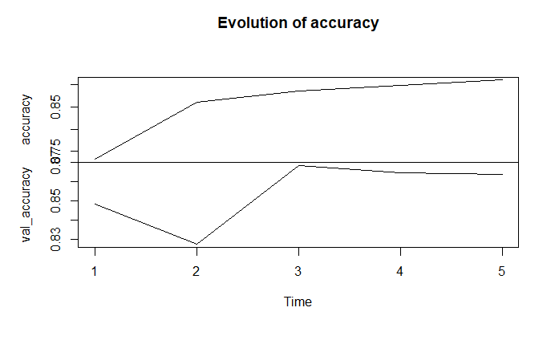

```{r include=FALSE}
library(knitr)
library(data.table)
library(reticulate)
library(magrittr)
library(e1071)
library(latex2exp)
library(DiagrammeR)

opts_chunk$set(echo = TRUE, cache = TRUE, message = FALSE, warning = FALSE)
source("r/md_tools.r")
dyad <- readRDS("r/Palette_5YR_5B_Dyad.RDS")
palette(dyad[c(16, 59)])
```

# Sequentie Analyse

## Inleiding

Neurale netwerken stellen ons in staat om in plaats van statische gegevens ook sequenties en data-stromen te verwerken. Voorbeelden van sequenties zijn muziek, een tekst, een presentatie, de beurs-cijfers, etc&hellip;. Dit is vooral nuttig wanneer er tussen de elementen van de sequentie een zekere autocorrelatie heerst, i.e. wanneer de sequentie ook een reeks vormt.

## Sequence-To-Sequence

Een voorbeeld waarbij zowel de in- als de uitvoer van een NN de vorm van een sequentie heeft (eng: _sequence-to-sequence_ of _seq2seq_), is bij ge-automatiseerde taalkundige zinsontleding. Hierbij probeert men dus een NN te maken dat voor elke woord de woordsoort (eng: _part-of-speech_ of _POS_) bepaalt (onderwerp, lijdend voorwerp, lidwoord, bijvoeglijk naamwoord, werkwoord, etc&hellip;). Andere seq2seq voorbeelden zijn transcriptie (audio &rarr; tekst) en geautomatiseerde vertaling of samenvatting.

Nu is de vraag: hoe werkt dit? Hoe kan je een NN voeden met een sequentie en een sequentie terugkrijgen. Heel simpel, door telkens subsets van $n$ elementen te nemen, als een buffer. Men spreekt dan van een context venster (eng: _context window_). In het voorbeeld van de zinsontleding spreekt men van [$n$-grammen](https://en.wikipedia.org/wiki/N-gram). Het principe is uitgebeeld in Figuur \@ref(fig:neurale-n-grammen).

```{r neurale-n-grammen, fig.cap="(ref:neurale-n-grammen)", echo = FALSE}

```

(ref:neurale-n-grammen) Principe van neurale $2$-grammen als voorbeeld van een seq2seq strategie. Opgelet, de term $n$-gram slaagt op een sequentie van opeenvolgende elementen, maar de elementen kunnen van alles zijn: woorden, letters, lettergrepen, fonemen, basenparen, &hellip;

Het werken met een context venster is echter niet voldoende. Vooral wanneer de invoer-sequentie niet exact dezelfde lengte heeft als de uitvoer-sequentie, komt men vast te zitten. Wat er ontbreekt is een _werkgeheugen_ (eng: _working memory_ of _state_). De eerder besproken NN types hadden geen geheugen en toch werkte ze. Waarom zou men dan nu een geheugen nodig hebben? Bij het gebruik van sequenties is er vaak sprake van autocorrelatie (zie &sect rond [Tijd en Ruimte](#tijd-en-ruimte)) en moeten deze verbanden ook in beschouwing worden genomen. Vandaar dat voor sequentie-analyse een geheugen cruciaal is.

## Recurrente NN

We introduceren nu recurrente NN (eng: _recurrent NN_ of kortweg _RNN_), een NN dat een geheugen bevat. Voor het introduceren van dit geheugen moeten we een eerder gestelde regel doorbreken, namelijk dat noden binnen een laag niet met elkaar verbonden mogen worden (zie Stelling \@ref(def:ff-ann-noden)). We krijgen nu een netwerk zoals voorgesteld in Figuur \@ref(fig:rnn-01). Het komt er in feite op neer dat een stuk van het netwerk wordt ontdubbeld om het effect van de autocorrelatie op te vangen. Men spreekt van _unrolling through time_.

```{r rnn-01, fig.cap="(ref:rnn-01)", echo = FALSE}

```

(ref:rnn-01) Architectuur voor een eenvoudig RNN. Men spreek in de literatuur van _unrolling through time_ (nl: _uitgerold in de tijd_) om aan te geven dat neuronen met een verbinding naar zichzelf (woordsoort &rarr; woordsoort) worden ontdubbeld (woordsoort~$t-1$~ &rarr; woordsoort~$t$~). De dikke oranje pijl geeft aan dat er een verbinding wordt gelegd tussen de overeenkomstige neuronen van de verborgen laag. De vergroting van de ontvangende neuron binnen de verborgen laag (onderaan) laat zien dat er een extra functie nodig is om het samenvoegen (eng: _concatenation_) van de huidige met de eerdere invoer mogelijk te maken.

Het _backpropagation_ algoritme moet nu worden aangepast omdat de gewichten van de recurrente verbinden voor een bepaalde invoer dezelfde moeten zijn. De nieuwe versie van dit algoritme heet _back-propagation through time (BPTT)_ en werkt door de afgeleiden uit te middelen en te berekenen van nieuw naar oud (details hier niet belangrijk).

## Verdwijnende gradiënten

De manier hoe het _backpropagation_ algoritme werkt veroorzaakt een onaangenaam neveneffect, namelijk dat naarmate men teruggaat naar eerdere lagen, hoe kleiner de afgeleiden (zie [Backpropagation](#backpropagation)) worden. Dit effect noemt men _vanishing gradiënts_ (nl: _verdwijnen gradiënten_). Bij FF-ANN bepaalt de diepte van het NN de mate van verdwijning, terwijl bij RNN we dit effect in 'de breedte' (van $t-n \rightarrow t$) kan worden waargenomen.

## Long short-term memory (LSTM) 

LSTM is uitgevonden om het probleem van verdwijnende gradiënten op te vangen bij recurrente netwerken. Er zijn andere gelijkaardige oplossingen, maar LSTM is de meest populaire. Naast de huidige invoer en input van het geheugen, wordt er ook een _cell state_ ^[Komt overeen met wat we in tal van programmeertalen met de term _context_ zouden aangeven] onderhouden en doorgegeven waarin belangrijke lange-termijn informatie bewaard kan worden. Om de cell state te onderhouden, worden er drie nieuwe componenten toegevoegd:

- De _forget gate_: bepaalt welke lange termijn informatie vergeten moet worden, i.e. verwijderd uit de cell state
- De _input gate_: bepaalt welke nieuwe informatie moet worden toegevoegd aan de cell state
- De _output gate_: bevat logica om te bepalen welke informatie uit het werkgeheugen wordt doorgegeven

```{r rnn-02, fig.cap="(ref:rnn-02)", echo = FALSE}

```

(ref:rnn-02) Architectuur voor een LSTM. De blauwe pijlen geven de overdracht van de _cell state_ weer langsheen de temporele as.

De term gate slaagt op het feit dat deze functies als sigmoid activatiefuncties als, ze converteren continue numerieke waarde naar een 0 of een 1. Geeft bij voorbeeld de forget-gate een 1, dan betekent dit dat de input vergeten mag worden. Voor een meer gedetailleerde beschrijving (valt buiten de scope van deze cursus) verwijs ik graag naar de [blog van Christopher Olah](http://colah.github.io/posts/2015-08-Understanding-LSTMs/), zie @Olah. 

## Sentiment analyse

Sentiment analyse is het extraheren van een emotie uit een opgegeven stuk tekst. Bedrijven kunnen bijvoorbeeld erg benieuwd naar de tevredenheid van hun klanten. Of je kan nieuwsgierig zijn naar de reactie van de bevolking op een bepaalde gebeurtenis of naar de reputatie van een bepaald merk of bepaalde persoon. Dergelijke vragen los je op door middel van een sentiment analyse.

Bij een sentiment analyse bestaat de invoer gewoonlijk uit een paragraaf of een tekst terwijl de uitvoer met slechts één enkele variabele kan worden uitgebeeld. Laten we op zoek gaan een dataset met gelabelde teksten, i.e. teksten waarbij het sentiment reeds manueel bepaald werd zodat we hiermee een algoritme kunnen trainen. Op [Kaggle](https://www.kaggle.com/), dé plek voor iedere datawetenschapper die openstaat voor een uitdaging, vinden we een [oefen-dataset](https://www.kaggle.com/ashukr/rnnsentiment-data) die bestaat uit 25000 film-reviews met overeenkomstige emotie, gecodeerd als `negative` of `positive`.

Het laden van de data doen we hier in R:

```{r sent-load}
set.seed(42)
sent <- "dat/sentiment.zip" %>% 
  unzip %>%
  fread(colClasses = c(Sentiment = "factor"))

sent <- sent[sample(1:.N)]
sent %>% extract(sample(1:nrow(.), 5)) %>% kable

x <- sent$Review
y <- 1 * (sent$Sentiment == "positive")

rm(sent)
invisible(gc())
```

Tijdens het uitlezen van de data geven we mee dat het sentiment een factor is. Dat is in principe niet zo heel erg belangrijk voor deze specifieke toepassing, maar over het algemeen is het wel belangrijk dat elke variabele op de juiste wijze wordt geïnterpreteerd. Vooral in R zijn de meeste methoden er immers op voorzien op dit type uit te lezen. Omdat we echter de data toch naar Python zullen doorsturen, zijn we verplicht om {`negative`, `positive`} te hercoderen naar {0, 1}. De `rm` functie op de laatste lijn zorgt ervoor dat de oorspronkelijke variabele wordt verwijderd om plaats te maken in het geheugen. `gc` staat dan weer voor _garbage collection_, iets wat elke ontwikkelaar mee vertrouwd zou moeten zijn.

Misschien toch kort een overzicht van de twee variabelen. Voor wat betreft de emotie, zien we dat er net evenveel positieve als negatieve film-reviews in de dataset set, we zeggen dat de dataset voor deze variabele gebalanceerd is:

```{r sent-emo}
y %>% table %>% barplot(col = 1, ylab = "#", main = "Distribution outcome")
```

We kunnen ook eens kijken naar de verdeling van de lengte van de reviews, uitgedrukt zowel als aantal karakters als in aantal woorden:

```{r sent-review-length, fig.width=5, fig.height=6}
library(stringr)
par(mfrow = 2:1)

x %>% nchar %>% density %>% plot(main = "Density of review length",
  xlab = "Review length\nnumber of characters", col = 1)
x %>% str_count("\\w+") %>% density %>% plot(main = "Density of review length",
  xlab = "Review length\nnumber of words", col = 2)

abline(v = 200, lty = 2)
```

We gaan nu over naar Python, alwaar we de reviews gaan voorbereiden voor verder onderzoek. Eén van de eerste stappen binnen een NLP analyse is bijna altijd het indexeren van de onderdelen waarin men geïnteresseerd is (eng: _tokenize_, waarbij elke onderdeel als _token_ wordt bestempeld). In dit geval zullen we de reviews in afzonderlijke woorden opsplitsen terwijl we ons ontdoen van leestekens (eng: _punctuation_) net omdat de woorden vermoedelijk een voorspellende waarde hebben naar emotie toe. Verder zullen we elke film-review omzetten naar een sequentie van woorden met een exacte lengte van 200 (zie ook stippellijn in bovenstaande grafiek). Is de review langer, dan wordt deze bruusk afgekapt op 200 woorden. Uiteraard zijn hier betere manieren denkbaar om deze stap informatie-bewuster te maken. Is de film-review korter dan 200 woorden, dan wordt de sequentie aangevuld nulwaarden.

```{python sent-prep}
from tensorflow.keras.preprocessing.text import Tokenizer
from tensorflow.keras.preprocessing.sequence import pad_sequences

most_freq_top = 5000
review_max_len = 200

tokenizer = Tokenizer(num_words = most_freq_top)
tokenizer.fit_on_texts(r.x)
encoded_docs = tokenizer.texts_to_sequences(r.x) 
padded_sequence = pad_sequences(encoded_docs, maxlen = review_max_len) 
```

Laten we alvast controleren dat de tokenizer het verwachte resultaat oplevert. Eerst bekijken we de eerste review, na indexering:

```{r sent-encoded}
py$encoded_docs[[1]] 
```

Via de 'woordenboek' zouden we deze review moeten kunnen reproduceren:

```{r sent-recontr}
py$tokenizer$word_index[py$encoded_docs[[1]]] %>% names %>%
  paste(collapse = " ") 
```

De oorspronkelijke tekst was als volgt:
 
```{r sent-recontr-orig}
x[1] 
```

Merk op dat leestekens inderdaad verdwenen zijn, dat alles in kleine letters staat (maar dat was ook al zo in het origineel) en dat er woorden ontbreken, namelijk de woorden die niet in de top 5000 van de meest voorkomende woorden staan. Merk ook op dat in het origineel stukken tekst lijken te ontbreken. Heb je enig idee waarom dit het geval zou zijn?

De `padded_sequence` variabele bevat alle afgekapte reviews in één grote 2-dimensionale matrix:

```{python padded}
padded_sequence.shape
padded_sequence[0, ] 
```

We kunnen nu beginnen aan de opbouw van de architectuur van het LSTM netwerk:

```{python embedding-layer, eval=FALSE}
from tensorflow.keras.models import Sequential
from tensorflow.keras.layers import LSTM,Dense, Dropout, SpatialDropout1D
from tensorflow.keras.layers import Embedding

embedding_vector_length = 32

model = Sequential()
model.add(Embedding(most_freq_top, embedding_vector_length, input_length = 200))
```

De eerste laag is een _embedding_ laag. De term kwamen we eerder al tegen bij het beschrijven van de autoencoder, maar nu breiden we de betekenis een beetje uit:

```{definition embedding-def, name="Embedding"}
Een _embedding_ is als een functie die een discrete numerieke variabele (i.e. {308, 6, 3, &hellip;}), die al-dan-niet dienst doet als voorstelling van een categorische variabele (i.e. {"high", "is", "a", &hellip;}), omzet naar vectoren (een beetje als de componenten van PCA) zoals voorgesteld door een reeks continue numerieke variabelen Binnen de context van NN zijn embeddings meestal laag-dimensionaal (i.e. beperkt aantal noden in de laag) en dienen ze om de dimensionaliteit te reduceren.
```

In de [documentatie van Keras](https://keras.io/api/layers/core_layers/embedding/) staat duidelijk beschreven dat een embedding laag als eerste laag moet gebruikt worden binnen het netwerk. Ook lees je daar de omschrijving van de verwachte parameters, waarvan de belangrijkste de dimensies zijn van de invoer en uitvoer (zie Figuur hieronder).

```{r embedding, fig.cap="(ref:embedding)", echo=FALSE}

```

(ref:embedding) Embedding laag met visuele voorstelling van de parameters.

De volgende laag die we toevoegen is een speciale vorm van de Dropout laag, die later in het netwerk trouwens ook toegevoegd zal worden. Bij `SpatialDropout1D` wordt in feite een ganse feature map verwijderd in plaats van specifieke nodes. Het komt erop neer dat gemiddeld `r .25 * 32` van de 32 vectoren van de embedding-laag worden meegenomen terwijl de rest genegeerd wordt. Bij elke epoch wordt er opnieuw gerandomiseerd.

```{python sent-spatial-dropout1d, eval=FALSE}
model.add(SpatialDropout1D(0.25))
```

De eigenlijke implementatie van LSTM gebeurt d.m.v. de gelijknamige functie binnen Keras.

```{python sent-lstm-layer, eval=FALSE}
model.add(LSTM(units = 50, dropout = 0.5, recurrent_dropout = 0.5))
```

`Units` geeft het aantal neuronen weer zonder rekening te houden met het geheugen, `dropout` en `recurrent_dropout` geven de fractie van de invoer resp. van de vorige geheugencel weer (binnen deze laag) die zal worden genegeerd. Standaard is de activatie-functies _tanh_ en _sigmoid_ (voor recurrente stap). Merk op dat alles wat te maken heeft met de cell-state volautomatisch gebeurt.

Rest ons om nog een (gewone) dropout toe te voegen en af te sluiten met de enige node in de output laag van ons netwerk (omdat we gewoon `positive` = 1 of `negative` = 0 willen voorspellen). 

```{python sent-last-layers, eval=FALSE}
model.add(Dropout(0.2))
model.add(Dense(1, activation = "sigmoid")) 
```

Het netwerk zoals gevisualiseerd door Tensorboard (na uitvoeren van onderstaande code) ziet er als volgt uit:



We compileren het model zoals voorheen:

```{python sent-compile, eval=FALSE}
model.compile(
  loss = "binary_crossentropy",
  optimizer = "adam",
  metrics = ["accuracy"])
```

Rest ons nu om het model uit te voeren. We vertrekken vanaf de `padded_sequence` zodat de input een vast formaat heeft. We geven mee dat 20% van de data gebruikt mag worden voor de validatie dataset. We houden 5000 reviews en overeenkomstige emoties opzij als test dataset. Dit kan door gewoon de eerste 20000 te selecteren omdat we eerder de set van reviews ge-shuffled hebben.

```{python sent-fit-1, eval=FALSE}
from keras.callbacks import TensorBoard
from keras.callbacks import ModelCheckpoint
import numpy as np

checkpoint = ModelCheckpoint(
  "tf/sent_best.hdf5", monitor = "val_loss", verbose = 1,
  save_best_only = True, mode = "auto", period = 1)
    
accuracy = model.fit(
  padded_sequence[0:20000,],
  np.array(r.y)[0:20000],
  validation_split = 0.2,
  verbose = 0,
  epochs = 5,
  batch_size = 32,
  callbacks = [TensorBoard(log_dir = "tf"), checkpoint])
```

Hier is de evolutie van de accuraatheid op de training set (oranje) en de validatie set (blauw) zoals TensorBoard het aangeeft:



In R kunnen we dezelfde grafieken reproduceren:

```{r sent-accuracy-val, eval=FALSE}
py$accuracy$history %>%
  as.data.table %>%
  extract(, .(accuracy, val_accuracy)) %>%
  ts %>% 
  plot (main = "Evolution of accuracy")
```



Op basis van de bovenstaande grafiek, kunnen we besluiten dat het voldoende is om slechts 2 epochs de trainen. De finale accuraatheid bekomen we door een voorspelling te doen op de test dataset.

```{python sent-tst, eval=FALSE}
model.load_weights(checkpoint_path)
  
prediction = model.evaluate(
  padded_sequence[20000:25000,],
  np.array(r.y)[20000:25000])
```

Het finaal resultaat op ongeziene test dataset is als volgt:

```{r sent-acc-evol, eval=FALSE}
py$prediction$history %>%
  as.data.table %>%
  extract(, .(accuracy, val_accuracy)) %>%
  ts %>% 
  plot (main = "Evolution of accuracy")
```

Laten we nu zelf eens nieuwe reviews verzinnen en kijken wat het model teruggeeft:

```{r sent-new, eval=FALSE}
new_review <- c(
   "I am not sure I understand all aspects of the movie,
       but overall I loved the atmosphere",
   "This was crap, from beginning to end.",
   "This movie was so bad that I almost started to love it")
```

```{python sent-test-new, eval=FALSE}
new_review_prepped = pad_sequences(tokenizer.texts_to_sequences(r.new_review), \
  maxlen = 200)
```

```{r sent-test-new-r, eval=FALSE}
py$new_review_prepped %>% (py$model$predict) %>% extract(, 1) %>% 
  multiply_by(100) %>% sprintf("%.2f%%", .)
```
```
[1] "96.09%" "35.46%" "49.16%"
 ```

Zeer goed resultaat, maar zoals verwacht heeft het model het nog moeilijk met cynisme.
