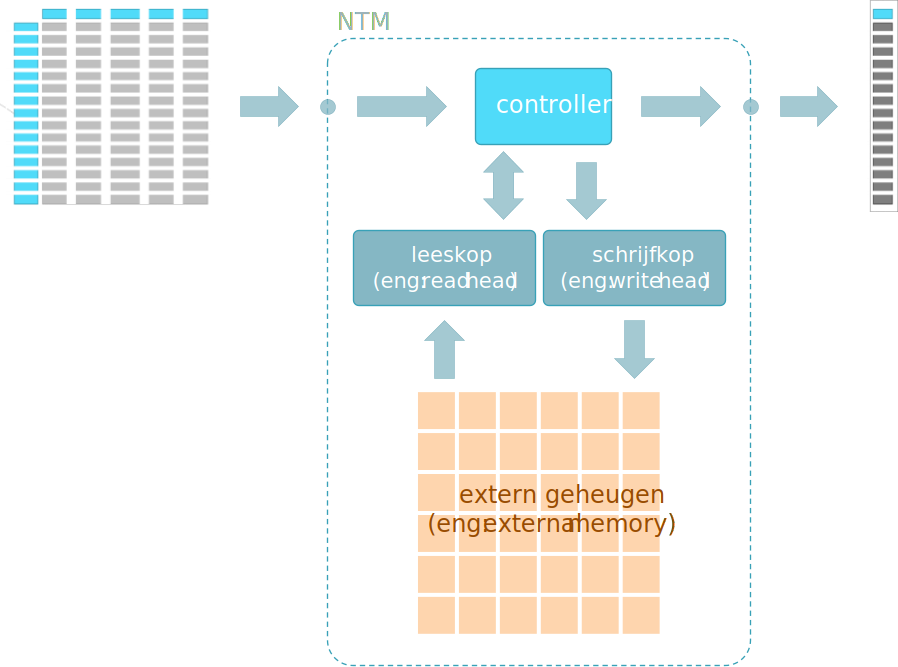
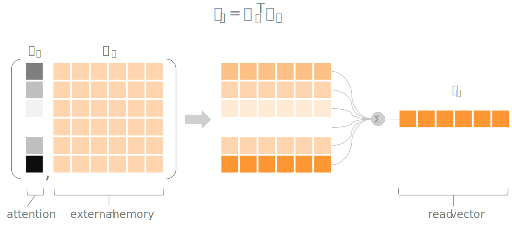
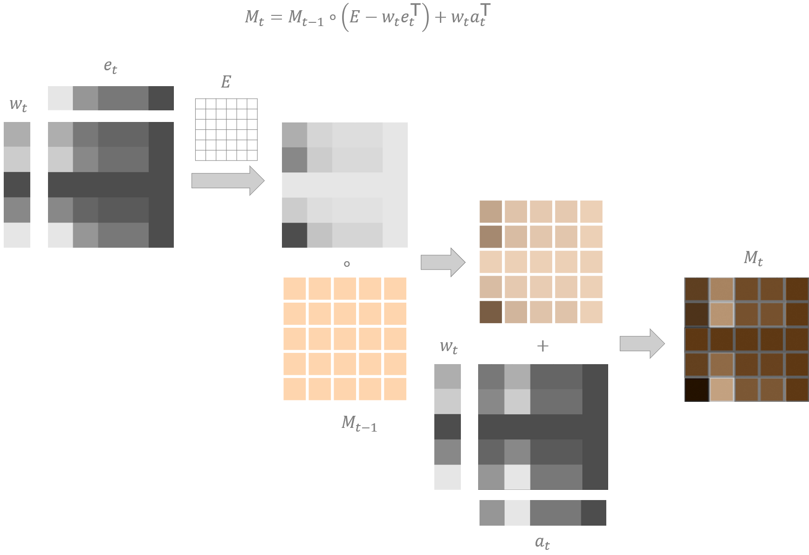
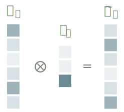
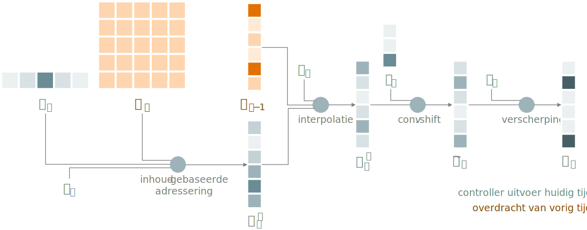

```{r include=FALSE}
library(knitr)
library(data.table)
library(reticulate)
library(magrittr)
library(e1071)
library(latex2exp)
library(DiagrammeR)

opts_chunk$set(echo = TRUE, cache = TRUE, message = FALSE, warning = FALSE)
source("r/md_tools.r")
dyad <- readRDS("r/Palette_5YR_5B_Dyad.RDS")
palette(dyad[c(16, 59)])
```

# Neurale Netwerken met Extern Geheugen

## Inleiding

Als uitbreiding op de seq-2-seq-type neurale netweken, RNNs en LSTMs is men een aantal jaren geleden beginnen experimenteren met het toevoegen van een soort extern geheugen aan ANNs. Bij de eerder besproken LSTMs netwerken was er reeds sprake van een soort _werkgeheugen_, maar de bedoeling is hier om het computationeel gedeelde van het ANN beter te scheiden van het geheugen gedeelte. Het gevolg is dat we bijvoorbeeld de grootte van het geheugen kunnen aanpassen zonder de grootte en complexiteit van het netwerk te wijzigen.

Het resultaat van een zelfstandig extern geheugen is de productie van een zelfstandige 'computer' die uit voorbeelden kan leren. We bespreken hier twee types netwerken: Neurale Turing Machines (eng: _Neural Turing  Machines_ of _NTM_) en Differentiële Neurale Netwerken (eng: _Differential Neural Networks_ of _DNC_).


<small>Bron afbeelding: <a href="https://commons.wikimedia.org/wiki/File:Seagate_ST33232A_hard_disk_head_and_platters_detail.jpg">Eric Gaba</a> onder een <i>Creative Commons Attribution-Share Alike 3.0 Unported</i> licentie</small>

## Neurale Turing Machines

Neural Turing Machines (NTMs) werden bedacht door Google's  DeepMind team (zie @graves). Net als bij LSTM is het doel van NTMs om de lange-termijn afhankelijkheden te capteren. NTMs verschillen echter van eerdere RNN in dat ze zogenaamde aandacht mechanismen (eng: _attention mechanisms_) gebruiken om het lezen en schrijven naar het extern geheugen efficiënter te laten verlopen. De abstrahering van de architectuur van een NTM vind je in Figuur \@ref(fig:ntm).

```{r ntm, fig.cap="(ref:ntm)", echo=FALSE}

```

(ref:ntm) Architectuur van een Neurale Turing Machine (NTM). Een controller vormt het eigenlijk ANN (bijvoorbeeld een RNN) terwijl de schrijfkop en leeskop (naar analogie met fysieke gegevensdragers) instaan vormt de informatie-overdracht naar het extern werkgeheugen.

Het komt erop neer dat en RNN wordt uitgebreid met het extern geheugen en dit geheugen bestaat uit niets meer dan een tabel of matrix met één _herinnering_ per rij. Een extern geheugen is natuurlijk pas nuttig als je er gegevens uit kunt lezen en nieuwe gegevens kunt in plaatsen.

## Lezen uit en schrijven naar een NTM geheugen

Het ophalen en het manipuleren van het geheugen gebeurt op een probabilistische wijze door gebruik van gewichten. Het principe is als volgt. Stel dat een (voor de eenvoud één-dimensionaal) extern geheugen bestaat uit de rij $M := (12, 87, 45, 65, 49)$. Ontwikkelaars zijn gewoon om een element uit zulk een rij op te halen door middel van een index, i.e. deterministische wijze: $M_3 = 45$. In plaats daarvan, gaan we $M$ als een vector beschouwen en deze vermenigvuldigen met een co-vector $w := (0, 0.1, 0.7, 0.2, 0)$ die we de aandachtsvector noemen (eng: _attention vector_), waarbij $\sum_{i}w_i=1$ (zie Appendix voor uitleg over vectoren, co-vectoren en tensoren). Deze vermenigvuldiging komt overeen met wat je zou kunnen noemen een 'probabilistische selectie' of [gewogen gemiddelde](https://nl.wikipedia.org/wiki/Gewogen_gemiddelde) met de 'aandacht' op het derde element uit de rij:

$$
M_w=M^\intercal w\\ =0\cdot12+0.1\cdot87+0.7\cdot45+0.2\cdot65+0\cdot4 \\
=53.2
$$

Waarom zo moeilijk doen?

```{definition why-probabilistic-selection, name="Waarom geen discrete selectie van geheugen elementen"}
De traditionele manier om elementen uit een rij of matrix te selecteren, zoals bij $M_3$, maakt gebruik van discrete indices ($M_i$ met $i \subset {1, 2, ...}$). Tijdens het leerproces zal de NTM de ideale indices trachten te voorspellen. Willen we echter gebruik maken van het Backpropagation algoritme en van de gradiënt-afdaling waarvan eerder sprake, dan moet deze indices differentieerbaar zijn. Discrete waarden zijn dat _niet_. Het is immers absurd om zoiets als het volgende te onderzoeken: wat is het effect van een kleine wijziging in de index (bijvoorbeeld van 3 naar 3.0001) op de accuraatheid van de voorspelling. Vandaar de noodzaak om een continue indexering te gebruiken i.p.v. een discrete indexering.

> Belangrijke noot: de gradieënt-afdaling is geen verplichting, het maakt een ANN mogelijk eenvoudiger, maar er zijn evenzeer specialisten die vinden dat het blijven vasthouden aan de gradiënt-afdaling eerder een belemmering is en stellen de noodzaak ervan in vraag.
```

Op het bovenstaande principe zijn de lees- en schrijf operaties ten aanzien van het extern geheugen van een NTM gebaseerd. Het lezen gebeurt a.d.h.v. een aandachtsvector (eng: _attention vector_) die op een continue wijze een geheugenplaats selecteert (zie Figuur \@ref(fig:ntm-read)).

```{r ntm-read, fig.cap="(ref:ntm-read)", echo=FALSE}

```

(ref:ntm-read) De lees-operatie uit een extern NTM geheugen-matrix. In dit geval is er een 'focus' op de 6^e^ geheugenplaats. 

Het schrijven is iets complexer. Het bestaat uit twee afzonderlijke operaties. De eerste operatie dient om te vergeten, i.e. om bestaande gegevens uit het extern NTM geheugen te wissen. De tweede operatie dient om nieuwe gegevens te 'onthouden'. Deze beide operaties zijn veel fijngevoeliger dan de lees-operatie en kunnen op individuele geheugenplaatsen inwerken. Dit gebeurt door een combinatie van een aandachtsvector enerzijds en een wis-vector (eng: _erase vector_) of schrijf-vector (eng: _write vector_) anderzijds. Figuur \@ref(fig:ntm-write) laat zien hoe de schrijf-operatie in zijn werk gaat.

```{r ntm-write, fig.cap="(ref:ntm-write)", echo=FALSE}

```

(ref:ntm-write) De werking van een schrijf-operatie te aanzien van een extern NTM geheugen. $E$ is een eenheidsmatrix met gepaste dimensies (een matrix gevuld met enen), $\circ$ is het [Hadamardproduct](https://nl.wikipedia.org/wiki/Hadamardproduct). Als in de grijswaarde matrices lichte vlakken hogere waarden voorstellen, dan komt de weergegeven schrijf-operatie overeen met het wissen van de waarde in cel (5, 1) en het verhogen van de waarde in cel (5, 2). Tinten van oranje zijn hier eerder indicatief en niet als exact te interpreteren.

## Adressering van NTM geheugens

Het adresseren van een NTM geheugen kan op twee manieren plaatsvinden.

- _Op basis van locatie_: Dit is de methode waarop in vorige paragraaf werd gealludeerd, namelijk het selecteren van een geheugenplaats op basis van een index.
- _Op basis van inhoud_: Er is echter nog een tweede manier nog om een Turing machine te ontwerpen, namelijk het selecteren van een geheugenplaats op basis van zijn inhoud.

## Inhoud-gebaseerde adressering

De controller van een NTM kan aanleren om een geheugenplaats (een rij binnen de geheugen matrix) terug te vinden dat zo geooed mogelijk overeenstemt met een vooropgestelde sleutelvector $\mathbf{k_t}$ (eng: _key vector_). Hiervoor wordt de aandachtsvector als volgt berekend:

$$
w_t^c=\frac{\exp\left(\beta_t\mathscr{D}\left(M_t,\mathbf{k_t}\right)\right)}{\sum_{i=0}^{N}\exp\left(\beta_t\mathscr{D}\left(M_t,\mathbf{k_t}\right)\right)}
$$

, waarbij $\beta$ hier voor een vermenigvuldigingsfactor staat (eng: _key strength_) en waarbij $\mathscr{D}$ voor een afstand-functie staat (eng: _similarity function_). Voor $\mathscr{D}$ wordt meestal de [cosinusgelijkenis](https://nl.wikipedia.org/wiki/Cosinusgelijkenis) genomen. Je zal merken dat bovenstaande vergelijking erg lijkt op de softmax en inderdaad, het komt neer op een genormaliseerde versie van de softmax. De parameter $\beta$ is geen hyperparameter. Het wordt door de controller aangeleverd en aangeleerd. Een hogere waarde voor $\beta$ zal ervoor zorgen dat een onbesliste sleutel-vector (in het extreme geval een eenheidsvector) toch een duidelijk gefocusseerde aandachtsvector oplevert.

## Locatie-gebaseerde adressering

Deze adressering moet toelaten dat de controller aanleert om bepaalde geheugenplaatsen op te roepen en om te navigeren naar een naburige geheugenplaats. Dit gebeurt door op de aandachtsvector een rottionele convolutie uit te voeren (i.e. filter operatie) met een zogenaamde _shift weighting_ $\mathbf{s_t}$:


```{r ntm_conv_shift, fig.cap="(ref:ntm_conv_shift)", echo=FALSE}

```

(ref:ntm_conv_shift) Voorbeeld van een convolutionele shift-operatie om de focus één plaats naar onder te verschuiven. Merk op dat dit een cyclisch gebeuren is in de zin dat de cel van de aandachtsvector $w_t$ die a.h.w. van de vector valt bovenaan wordt gerecycleerd (i.e. $\widetilde{w}_{t,1} = w_{t, 6}$).

## Adresseringsmechanisme

Hier volgt een beschrijving van het volledig adresseringsmechanisme.

```{r ntm-address, fig.cap="(ref:ntm-address)", echo=FALSE}

```

1. Zoek een geheugenplaats op basis van de sleutelvector $\mathbf{k_t}$ en de vermenigvuldigingsfactor $beta$
1. Interpoleer de resulterende aandachtsvector $w_t^c$ met de aandachtsvector $w_{t-1}$ van het vorige tijdstip:
   
   $$
   w_t^g=g_t w_t^c + (1-g_t)w_{t-1}
   $$
   
   , waarbij $g_t$ en $w_t^g$ de _interpolation gate_ en de _gated weighting_ zijn
1. In deze stap kan de controller aanleren om zich te verplaatsen in het geheugen (i.e. locatie gebaseerde adressering)
1. Om te voorkomen dat als gevolg van voorgaande filter operatie er een vervagingseffect optreedt (eng: _blurring effect_), wordt er een verscherping-operatie uitgevoerd door de aangeleerde verscherpingsfactor $\gamma_t$ die ook door de controller wordt beheerd. De formule voor de verscherping is als volgt:
   
   $$
   w_t=\frac{\tilde{w}_t^{\gamma_t}}{\sum_{i=0}^{N}\tilde{w}_{t, i}^{\gamma_t}}
   $$

## De nadelen van NTMs

De uitvinding van NTMs was zonder meer revolutionair, maar toch bleken er al snel een aantal gebreken te bestaan.

1. Omdat het hele mechanisme om informatie weg te schrijven naar het extern geheugen differentieerbaar moest zijn treedt er ook vaak interferentie op waarbij de weggeschreven informatie enigszins overlapt met eerder weggeschreven informatie. Zeker wanneer de aandachtsvector onvoldoende gefocusseerd is, treedt dit fenomeen op.
1. Er is ook een probleem met het overschrijven van data. Typisch zal de controller aanleren om nieuwe data te plaatsen in een vrije locatie van het extern geheugen terwijl soms het overschrijven van bestaande informatie een voordeel biedt
1. De controller zou moeten kunnen aanleren om een sprong te maken in het extern geheugen, daar een bepaalde operatie uit te voeren en daarna terug te springen naar de oorspronkelijke locatie. De controller mist deze vaardigheid omdat hij geen kruimelspoor bijhoudt.

Deze beperkingen werden door dezelfde auteurs onderzocht waarop ze met een verbeterde versie kwamen voor de NTM: de differentiële neurale computer (eng: _Differentiable Neural Computer_ of _DNC_; zie @graves2).

## De differentiële neurale computer 


Bron afbeelding: Adam Cain, een artist bij het DeepMind team.

We gaan ons hier niet verder verdiepen in de architectuur van een DNC, maar ik geef toch even mee wat de verschillen zijn t.o.v. een NTM:

```{definition dnc-def, name="DNC versus NTM"}
- De DNC heeft meerdere leeskoppen
- De DNC werkt met een _interface vector_ waarin a.h.w. de query vervat zit om de lees- en schrijf-opdrachten uit te voeren
- De DNC maakt gebruik van een _link matrix_, een _voorrangsvector_ (eng: _precendence vector_) en een gebruiksvector (eng: _usage vector_).
```

Samengevat komt het er enerzijds op neer dat er bij het combineren van lees- en schrijf-operaties en voldoende geheugen-beheer moet plaatsvinden om problemen rond overlap te voorkomen. Anderzijds was het ook de bedoeling dat DNCs in staat zijn om te onthouden in welke volgorde eerder informatie werd weggeschreven naar het geheugen.

```{r dnc, fig.cap="(ref:dnc)", echo=FALSE}
include_graphics("img/dnc.svg")
```

(ref:dnc) Overzicht van de architectuur van aan DNC.

De link matrix en de gebruiksvector vormen een onderdeel van een zogenaamde [vrije lijst](https://en.wikipedia.org/wiki/Free_list#:~:text=A%20free%20list%20is%20a,a%20pointer%20to%20the%20next.) (eng: _free list_) data structuur die de controller instaat stelt om zelf te beslissen om een bepaalde geheugenplaats toegekend moet worden of niet.

## Implementatie DNC

Hiervoor kijken me naar een video-clip van DeepMind zelf. Het laat zien hoe een DNC ons in staat stelt om eerdere onoplosbare vraagstukken te laten oplossen:

<iframe width="566" height="318" src="https://www.youtube.com/embed/B9U8sI7TcMY" frameborder="0" allow="accelerometer; autoplay; clipboard-write; encrypted-media; gyroscope; picture-in-picture" allowfullscreen></iframe>

DNC zijn instaat om allerlei vragen te beantwoorden over een graaf-gestructureerde gegevens zoals sociale netwerken, parse-trees, knowledge graphs en dergelijke zelfs als de gegevens in een lineaire vormen worden gevoed aan het algoritme.

In een ander voorbeeld, dat gerelateerd is met het aanleren van concepten (denk aan het concept 'boom' uit de eerste les), wil men bijvoorbeeld een ANN het volgende 'raadsel' proberen oplossen:

<q>Alice gaat naar de keuken, alwaar ze een glas milk neemt. Onderweg naar de living neemt ze een appel uit de fruitmand.<br><br>Vraag: Hoeveel objecten heeft Alice bij zich?</q>

Het lijkt verschrikkelijke overkill om hiervoor zulk een complex netwerk op te zetten. Maar wat als je niet op voorhand weet welke vraag er gesteld gaat worden? 
