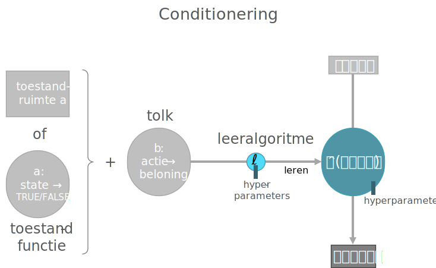
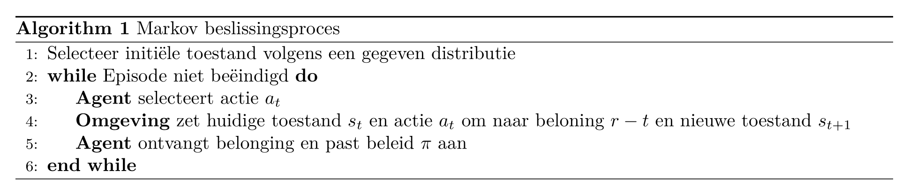
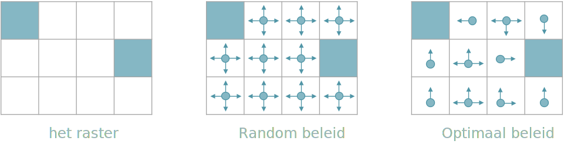
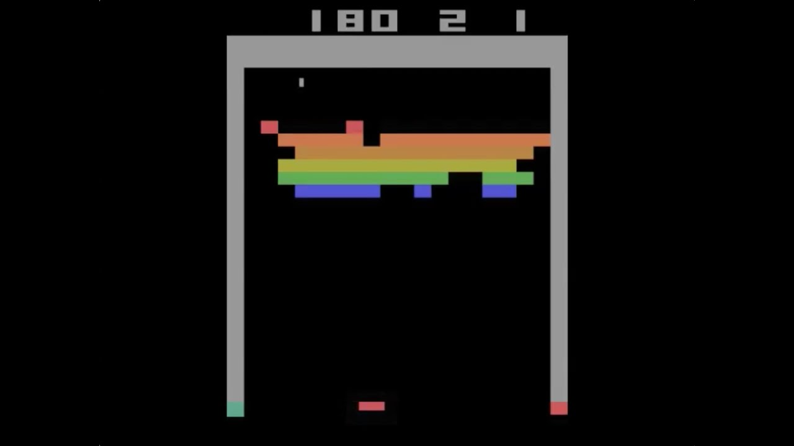
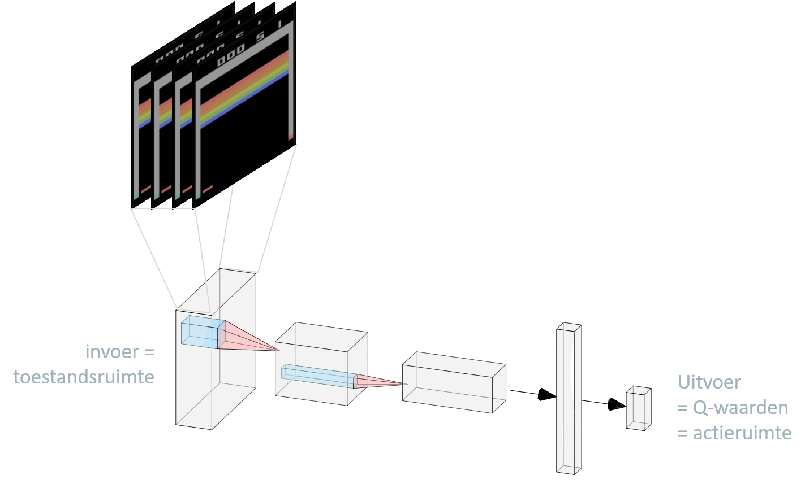
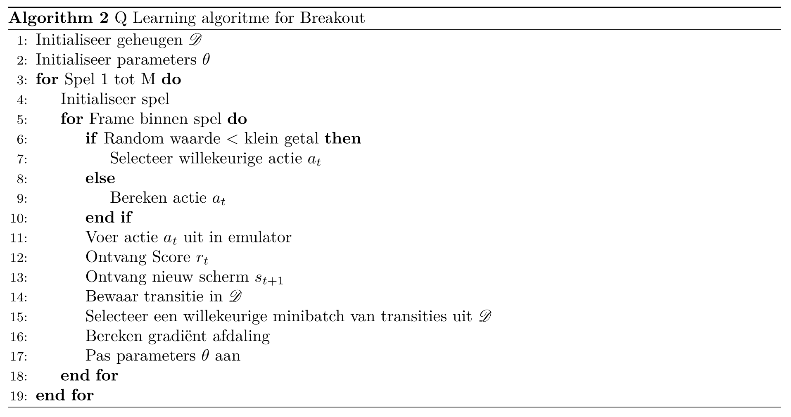

```{r include=FALSE}
library(knitr)
library(data.table)
library(reticulate)
library(magrittr)
library(e1071)
library(latex2exp)
library(DiagrammeR)

opts_chunk$set(echo = TRUE, cache = TRUE, message = FALSE, warning = FALSE)
source("r/md_tools.r")
dyad <- readRDS("r/Palette_5YR_5B_Dyad.RDS")
palette(dyad[c(16, 59)])
```

# Deep Reinforcement Learning

## Inleiding

Je kan _Deep Reinforcement Learning_ bekijken als Reinforcement learning (nl: conditionering) gecombineerd met neurale netwerken. Conditionering kwamen we eerder al tegen in de [gelijknamige paragraaf van het eerste hoofdstuk](#conditionering). Uit deze paragraaf kwam deze figuur:

```{r conditionering2, fig.cap="(ref:conditionering2)", echo=FALSE}

```

(ref:conditionering2) Overzicht proces voor conditionering. Een agent onderneemt een actie. Deze actie heeft gevolgen voor de omgeving, waar een nieuwe toestand wordt gecreëerd. Van deze nieuwe toestand gaat een deel naar de agent via observaties die de agent doet. Tijdens het trainen van de agent worden de observaties plus de beloning die het gevolg is van vorige actie aan het leeralgoritme gegeven die tracht het best mogen beleid te bekomen. Tijdens de inferentie fase zal de agent op basis van nieuwe observaties trachten de best mogelijk actie te voorspellen. 

Het komt erop neer dat een _agent_ leert om het beste _beleid_ (eng: _policy_) te hanteren, waarbij het beleid in feite overeenkomt met het model. De invoer van het beleid (want net als het model moet je dit beschouwen als een functie) is een een subset van de toestand (eng: _state_) van de omgeving (eng: _environment_) waarin de agent zich bevindt. De uitvoer is een bepaalde _actie_ (eng: _action_). Tijdens de trainingsfase, probeert het beleid met andere woorden om de best mogelijke actie te ondernemen gegeven de _observaties_ (eng: _observations_) die de agent maakt van de omgeving ^[In sommige gevallen kan een agent de hele toestand van de omgeving observeren, men spreekt dan van een _volledig-geobserveerde omgeving_ (eng: _fully observed_), anders van een partieel-geobserveerde omgeving (eng: _partially observed_)]. De omgeving ontvangt een actie en vertaalt deze actie in een toestand-wijziging. Bovendien is de omgeving ook verantwoordelijk om op basis van de nieuwe toestand een _beloning_ (eng: _reward_ of _return_) aan te koppelen ^[Deze taken worden soms ook toegeschreven aan een zogenaamde _tolk_ (eng:_interpreter_), zie [Wikipedia](https://en.wikipedia.org/wiki/Reinforcement_learning)]. Met andere woorden, de omgeving zal moeten oordelen of de nieuwe toestand beter is dan de vorige toestand of niet. Deze cyclus tussen omgeving en agent blijft lopen totdat de omgeving om de ene of andere reden 'het spel' beëindigt. Men spreekt van een _episode_ (emg: _episode_). Redenen om de episode te beëindigen kunnen zijn dat het doel bereikt is of dat er te veel pogingen ondernomen zijn geworden en de zaak hopeloos is.

Conditionering vinden we terug in alle situaties waar men zich op een bepaald ogenblik de vraag moet stellen: "Wat moet ik (of de agent) nu doen?" of nog beter: "Gegeven de huidige situatie, welke actie kan ik (of de agent) het beste ondernemen".

In vele referenties zul je vinden dat conditionering totaal iets anders is dan begeleid en onbegeleid ML. Door het traditioneel schema te doorbreken waarin conditionering wordt voorgesteld als een simpele  interactie tussen agent en omgeving (zie bijvoorbeeld [Wikipedia](https://en.wikipedia.org/wiki/Reinforcement_learning)) en eerder te focussen op het schema in Figuur \@ref(fig:conditionering2) wil ik aangeven dat conditionering in feite niet zodanig verschilt van begeleid leren. In plaats van historische data is er een data-generator (de omgeving) 

In 2014 werd Deep Reinforcement Learning toegepast door het DeepMind team om een computer aan te leren om [Arcadespelletjes](https://nl.wikipedia.org/wiki/Arcadespel) te spelen, en dit onder de naam _Deep-Q-Network_ of _DQN_. Voor het eerst werden neurale netwerken ingezet in het voorspellen van de ideale actie (uitvoer) gegeven een bepaalde situatie (invoer).

## Voorbeelden van deep reinforcement learning

Hieronder staan een aantal voorbeelden van DLR. Behalve voor het eerste filmpje zie je telkens een tabel met daarin het doel van de agent, de toestand waarin de agent zich kan bevinden, de acties die de agent kan ondernemen en het beloningssysteem.

### Introductie DeepMind Team

<iframe width="566" height="318" src="https://www.youtube.com/embed/7L2sUGcOgh0" frameborder="0" allow="accelerometer; autoplay; clipboard-write; encrypted-media; gyroscope; picture-in-picture" allowfullscreen></iframe>

### DeepMind's Deep-Q learning

<iframe width="566" height="318" src="https://www.youtube.com/embed/V1eYniJ0Rnk" frameborder="0" allow="accelerometer; autoplay; clipboard-write; encrypted-media; gyroscope; picture-in-picture" allowfullscreen></iframe>

|Doel|Spel winnen|
|-|-|
|Toestandsruimte|Scherm uitvoer als pixel-matrix|
|Actieruimte|Toetsaanslagen pijltjes links, rechts, onder en boven|
|Beloning|Score|

### Robot tasks

<iframe width="566" height="318" src="https://www.youtube.com/embed/Q4bMcUk6pcw" frameborder="0" allow="accelerometer; autoplay; clipboard-write; encrypted-media; gyroscope; picture-in-picture" allowfullscreen></iframe>

|Doel|Robot voert taak uit|
|-|-|
|Toestandsruimte|Houding van de robot-arm en camera input|
|Actieruimte|Uitvoering van krachten door arm-motoren aan te sturen|
|Beloning|Bij het correct uitvoeren van de taak|

### Atlas

<iframe width="566" height="318" src="https://www.youtube.com/embed/fRj34o4hN4I" frameborder="0" allow="accelerometer; autoplay; clipboard-write; encrypted-media; gyroscope; picture-in-picture" allowfullscreen></iframe>

|Doel|Robot legt vooraf afgesproken parcours af|
|-|-|
|Toestandsruimte|Houding van de robot, i.e. positie ledematen en romp, alsook camera input|
|Actieruimte|Uitvoering van krachten door motoren te besturen|
|Beloning|Bij het correct afleggen van (een deel van) het parcours|

### Cart-Pole

<iframe width="566" height="318" src="https://www.youtube.com/embed/Lt-KLtkDlh8" frameborder="0" allow="accelerometer; autoplay; clipboard-write; encrypted-media; gyroscope; picture-in-picture" allowfullscreen></iframe>

|Doel|Een pendel recht opstaand laten balanceren op een karretje|
|-|-|
|Toestandsruimte|Hoek en draaisnelheid pendel en positie en snelheid karretje|
|Actieruimte|Horizontale kracht (grootte + zin) op het karretje|
|Beloning|Elk ogenblik dat de pendel rechtop staat|

## Markov beslissingsproces

Een _Markov beslissingsproces_ (eng: _Markov Decision Proces_ of kortweg _MDP_) is een oude statische constructie die aan de grondslag ligt van conditionering en die de nodige wiskundige beschrijving voor DRL aanlevert. In een Markov proces heb je toestanden en kansen van de ene naar de andere toestand te migreren. Men spreekt van de _transitie_ (eng: _transition_) van de ene toestand naar de andere met een zekere probabiliteit. Men kan zulk een Markov proces omschrijven door het tupel:

$$\left(\mathscr{S}.\mathscr{A}, \mathscr{R}, \mathscr{P}, \gamma\right)$$

,waarbij:

- $\mathscr{S}$ de toestand ruimte is (i.e. de set van alle toestand waarin een agent zich kan bevinden)
- $\mathscr{A}$ de actieruimte is
- $\mathscr{R}$ de verdeling van de beloning voor een gegeven (toestand, actie)-paar
- $\mathscr{P}$ de transitie waarschijnlijkheid is van de ene naar een andere toestand en

Het algoritme ziet er zo uit:

```{r alg-mdp, echo=FALSE}

```

Het doel is dus om een optimaal beleid te bekomen door aan te leren welke acties voor de meeste beloning zorgen (of de minste afstraffing). Omdat dit proces zo belangrijk is, gaan we daar even op door met een voorbeeldje, namelijk _grid world_.

```{r mdp-grid, fig.cap="(ref:mdp-grid)", echo=FALSE}

```

(ref:mdp-grid) Het spel _grid world_. De verschillende cellen van deze tabel stellen de toestanden voor (rechts). Het spel begint met de speler (de agent dus) die zich op een willekeurige cel bevindt. Het doel is dat de speler is om zo snel mogelijk op een gemarkeerde cel te komen. In het begin is er nog een willekeurig beleid (midden). De agent kan in elke cel nog alle kanten uit. Na het trainen van de agent (links) bekomt men een optimaal beleid waarbij de Agent de kortste weg naar een gemarkeerde cel gewezen wordt.

Het doel van MDP is om de toekomstige beloning te maximaliseren. Formeel kunnen we stellen dat:

$$
\pi^* = \operatorname*{arg\,max}_\pi \mathbb{E}\left[\sum_{t\geq 0}r_t|\pi\right]
$$

, waarbij $\mathbb{E}$ de [verwachting](https://nl.wikipedia.org/wiki/Verwachting_(wiskunde)) voorstelt. Soms heeft een bepaalde actie een kortetermijneffect, soms heeft het een langetermijneffect. Het kortetermijneffect kan dan bijvoorbeeld negatief zijn terwijl het langetermijneffect gunstig is, en dit maakt de situatie wel veel complexer.

Vandaar dus dat we een agent willen optimaliseren naar toekomstige geaccumuleerde beloning. Net zoals bij een spel schaken betekent dit dat de computer moet inschatten wat het effect is van zijn toekomstige zetten, nog vóór hij de zetten effectief plaatst. Als voorbeeld uit het breakdown spel: Het is nuttig om specifiek een tunnel links of rechts van de bakstenen muur te creëren zodat de bakstenen langs achter worden vernietigd:

```{r breakout-tunnel, echo=FALSE}

```

Zo een tunnel uitgraven heeft geen onmiddellijke meerwaarde. Pas als de tunnel compleet is kan je de vruchten rapen. Maar een beloning in een verre toekomst moet toch een lager gewicht krijgen dan een gelijkaardige beloning in de nabije toekomst. Anders zou de agent, bij het spelen van breakout, geen gevoel hebben voor urgentie en 'quick wins' kunnen mislopen.

Om gelijkaardige problemen te verhelpen werk men met het principe van een  _ingeperkte toekomstige beloning_ (eng: _discounted future reward_) $\gamma^t, \gamma \subset [0, 1]$ die telkens vermenigvuldigd wordt met $r_t$ en waarbij dus deze $\gamma$-waarden afnemen met een toenemende horizon ^[Bijvoorbeeld een $\gamma$ van .98 geeft de opeenvolgende $\gamma^t$ van `r (0.98 ^ (1:5)) %>% sprintf("%.4f", .)` voor $t \subset [1, 5]$].

The Q-waarde functie (eng: _Q-value function_ of _action-value function_), waar een DQN zijn naam van ontleent, houdt rekening met de bovenvermelde inperking van de toekomstige beloningen. Deze functie tracht een antwoord te bieden op de vraag:

<q>Hoeveel beloning veroorzaakt een bepaalde actie $a$ in een bepaalde situatie (i.e. bij een bepaalde toestand $s$)?</q>

$$
Q^\pi(s, a) = \operatorname*{arg\,max}_\pi \mathbb{E}\left[\sum_{t\geq 0}\gamma^tr_t|s, a, \pi\right]
$$

,waarbij $\pi^*$ het optimaal beleid is en $r_t$ de beloning op tijdstip $t$. Hier staat dus: Het optimaal beleid $\pi^*$ kan bekomen worden door voor alle tijdstippen een maximale geaccumuleerde beloning te verkrijgen, rekening houdend met $\gamma^t$, het horizon-specifieke gewicht.^[de term horizon komt voort uit tijdsreeks analyse en betekent gewoon hoe ver in de toekomst men wil kijken, dus $\Delta t = t - t_0$, waarbij $t_0$ het huidig tijdstip is en $t$ een tijdstip in de toekomst]

In traditionele conditionering, is het deze functie, samen met de zogenaamde _Bellman vergelijking_ die voor de recursieve update zorgt, dat we het optimale beleid kunnen bekomen. Het probleem is dat deze methode veronderstelt dat Q berekend moet worden voor elke $s, a$ combinatie en dat maakt dat het niet erg schaalbaar is. Vanaf dat de toestandsruimte realistische proporties begint aan te nemen (denk bijvoorbeeld aan de video-invoer in bovenstaande voorbeelden), is het niet langer haalbaar om deze berekening uit te voeren.

## Deep Reinformcement Learning

Het is doel is nu om de Q-waarde functie te proberen benaderen door middel van een neuraal netwerk. Men spreekt van dit ogenblik van _Deep-Q learning_.

$$
Q(s,a;\theta) \approx Q^*(s, a)
$$

, waarbij $\theta$ hier, net als voorheen, de parameters van ons neuraal netwerk zijn (de gewichten van de connecties tussen de noden van het netwerk).

Het netwerk zelf is niet nieuw (zie Figuur \@ref(fig:q-learning-arcade)). In het geval van onze Arcadespellen kunnen we de pixels van het spel rechtstreeks als invoer gebruiken en één of meerdere convolutie-lagen toevoegen om de dimensionaliteit te reduceren. De uitvoerlaag bestaat dan, zoals we kunnen verwachten, uit de set van de verschillende acties die we kunnen uitvoeren. Omdat een menselijke speler tegelijkertijd op meerdere toetsen kan drukken krijg elke mogelijke actie hier een node in de uitvoerlaag en 

```{r q-learning-arcade, fig.cap="(ref:q-learning-arcade)", echo=FALSE}

```

(ref:q-learning-arcade) De architectuur van het Q-netwerk om de computer zelfs het Arcadespel [_Breakout_](https://elgoog.im/breakout/?q=SearchByImage&tbs=boee:1&ved=0) te laten spelen. Een lading (eng: _stack_) van vier opeenvolgende beelden van de spel, waarbij de kleuren naar een enkelvoudige zijn omgezet, worden eerst door 2 convolutie lagen gehaald alvorens ze naar een fully connected laag met 256 noden worden doorgegeven om daarna te eindigen van een laag met 2 Q-waarden. Deze 2 waarden coderen voor de de acties die een speler kan nemen. De eerste waarde kan bijvoorbeeld de beweging van de peddel coderen: -1 ($\leftarrow$, zet één stap naar links), 0 (blijf staan) en +1 ($\rightarrow$zet een stap naar rechts). De tweede waarde bepaalt de peddel snelheid: -1 ($\downarrow$, peddel een beetje trager), 0 (geen wijziging in peddel snelheid) en +1 ($\uparrow$) peddel een beetje sneller).

<iframe width="566" height="318" src="https://www.youtube.com/embed/cjpEIotvwFY" frameborder="0" allow="accelerometer; autoplay; clipboard-write; encrypted-media; gyroscope; picture-in-picture" allowfullscreen></iframe>

Het neuraal netwerk kan uitbreid worden met met een geheugen (eng: specifiek een _replay memory_) met daarin de transities van de ene toestand ($s_t$) naar de volgende toestand ($S_{t+1}$) samen met de genomen actie ($a_t$) en overeenkomstige beloning ($r_t$) en waaruit mini-batches genomen kunnen worden in plaats van de de eigenlijke data. Het complete algoritme ziet er nu als volgt uit:

```{r alg-q-learning, echo=FALSE}

```

## Varianten van (Deep) RL

Het algoritme zoals hierboven getoond is te beschouwen als een soort gemiddeld algoritme. Net als bij de andere NN types is er ook hier een breed gamma aan mogelijke implementaties (Figuur \@ref(fig:varianten-deep-rl)). De eerste afsplitsing heeft te maken met het zogenaamd _model-based_ zijn van een RL algoritme. Een _model-gebaseerd_ algoritme heeft toegang tot een wiskundig model van de omgeving om daarin simulaties uit te voeren van toekomstige scenario's^[Zulk een scenario is dus een opeenvolging van toestanden en noemt men ook wel een _traject_, eng: _trajectory_]. Met andere woorden, een model-gebaseerd algoritme kan anticiperen en vele stappen vooruitzetten zoals het geval is voor het schaakalgoritme AlphaZero.

```{r varianten-deep-rl, fig.cap="(ref:varianten-deep-rl)", echo=FALSE}
include_graphics("https://spinningup.openai.com/en/latest/_images/rl_algorithms_9_15.svg")
```

(ref:varianten-deep-rl) Overzicht van de meest bekende vormen van (deep) RL. Figuur afkomstig van @Part2Kin18 waarin een gedetailleerde bronvermelding wordt toegevoegd.

Meestal is er geen wiskundig model van de omgeving beschikbaar, niet noodzakelijk omdat een wiskundig model onmogelijk is, maar vaak ook gewoon omdat het niet praktisch is om een wiskundig model op te stellen. In dat geval spreekt men van _model-vrij_ (eng: _model-free_) algoritmen. Ten opzichte van een model-gebaseerd algoritme zal een model-vrij meestal veel trager trainen.

Binnen de model-vrije algoritmen is er een tweede opsplitsing naar wat er precies wordt aangeleerd. In een _beleidsoptimalisatie_ algoritme (eng: _policy optimisation_) worden de netwerk parameters $\theta$ tijdens de optimalisatie geüpdatet op basis van data verzameld onder het vorig beleid (eng: _on-policy optimisation_). Bij asynchronous advantage actor-critic (_A3C_) wordt het beleid rechtstreeks getraind via gradiënt opklimming (eng: _gradient ascent_; zie @mnih2016asynchronous). Bij _PPO_ algoritmen wordt het beleid onrechtstreeks getraind door gebruik te van een tweede doelfunctie die de oorspronkelijk doelfunctie benaderd (zie @schulman2017proximal).

Daarnaast bestaan er zogenaamde _off-policy_ systemen waarbij een benadering van de Q-waarde functie wordt geoptimaliseerd en deze komen overeen met de Q-learning systemen waarvan eerder sprake was. Deze algoritmen zijn instaat om de parameters van het netwerk te updaten op basis van data verzameld onder eender welke historisch beleid.

On-policy algoritmen zijn, net omdat je hier rechtstreeks de doelfunctie optimaliseert, over het algemeen meer betrouwbaar en stabiel. Het voordeel van Q-learning is dat ze minder data vereisen (eng: more _sample efficient_) en dus inzetbaar zijn in situaties waarbij on-policy algoritmen het moeilijk krijgen. Dit heeft te maken met het feit dat ze beter in staat zijn om situaties uit het verleden op te halen en a.h.w. de data kunnen 'herkauwen'. Maar de twee benaderingswijzen sluiten elkaar niet uit en er bestaan dan ook algoritmen (_DDPG_, _TD3_ en _SAC_) die het beste van de twee werelden proberen combineren. Een bekend algoritme uit deze groep is de _soft actor critic_ algoritme waarbij de agent de gecumuleerde beloning tracht te maximaliseren terwijl tegelijkertijd ook de entropie wordt gemaximaliseerd. Met andere woorden, de agent moet zijn taak proberen uitvoeren op een zo willekeurig mogelijke wijze.

<!--
Lab suggestions:

https://github.com/AdrianHsu/breakout-Deep-Q-Network
https://github.com/dongminlee94/deep_rl

-->
