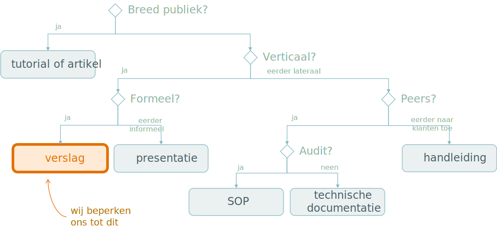
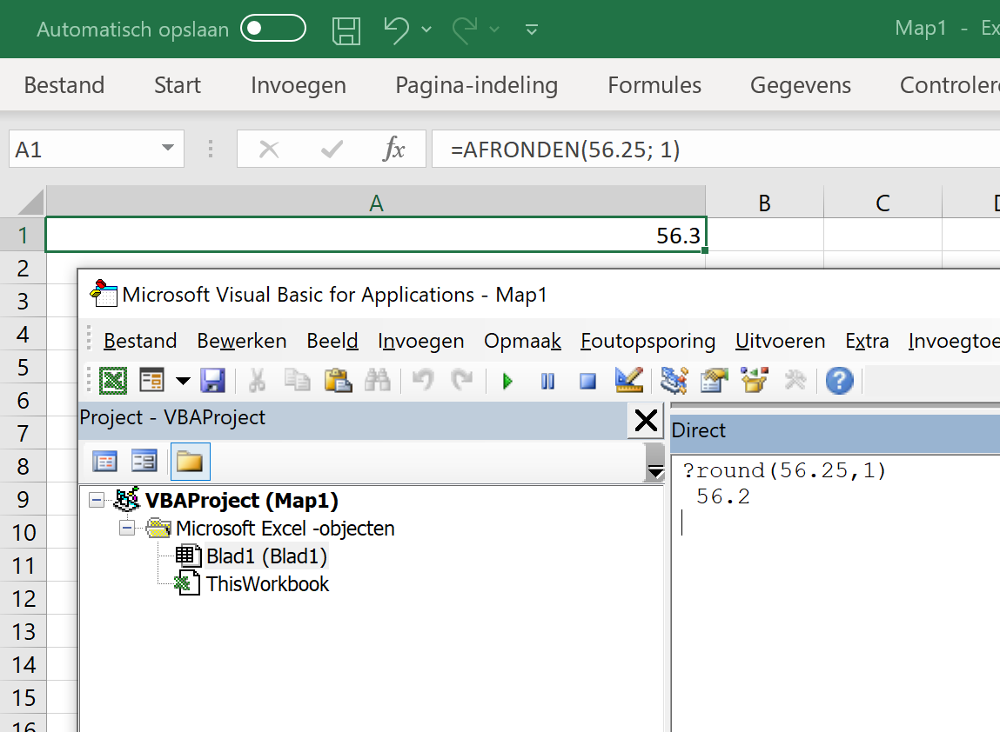
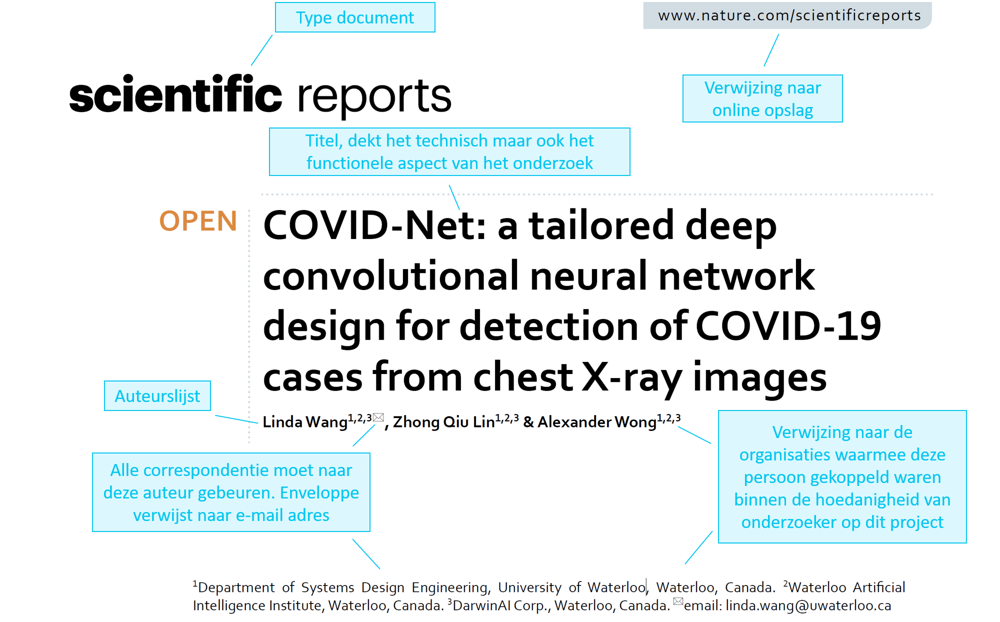
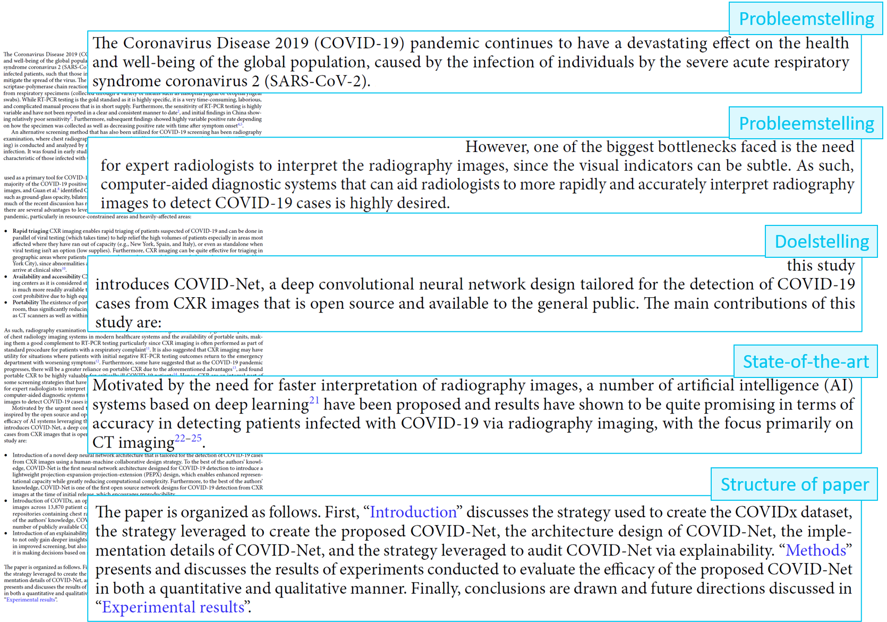
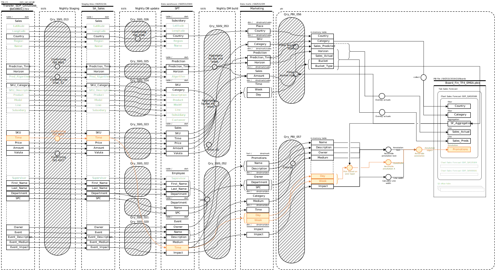
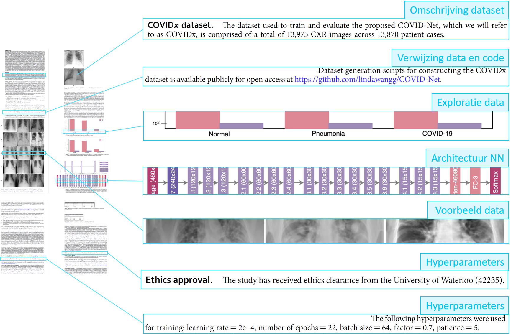
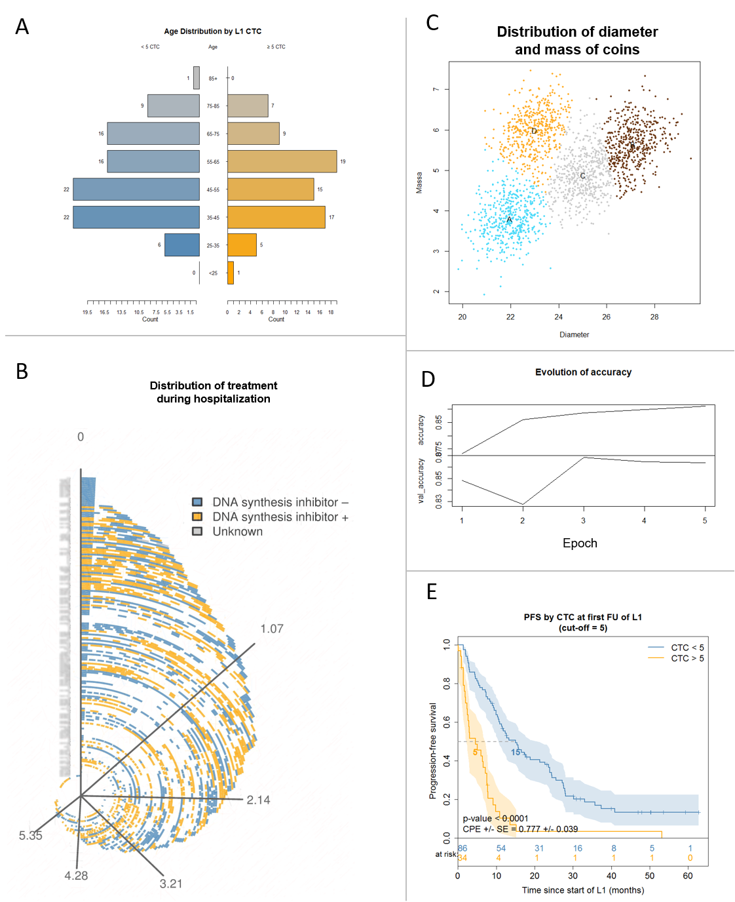
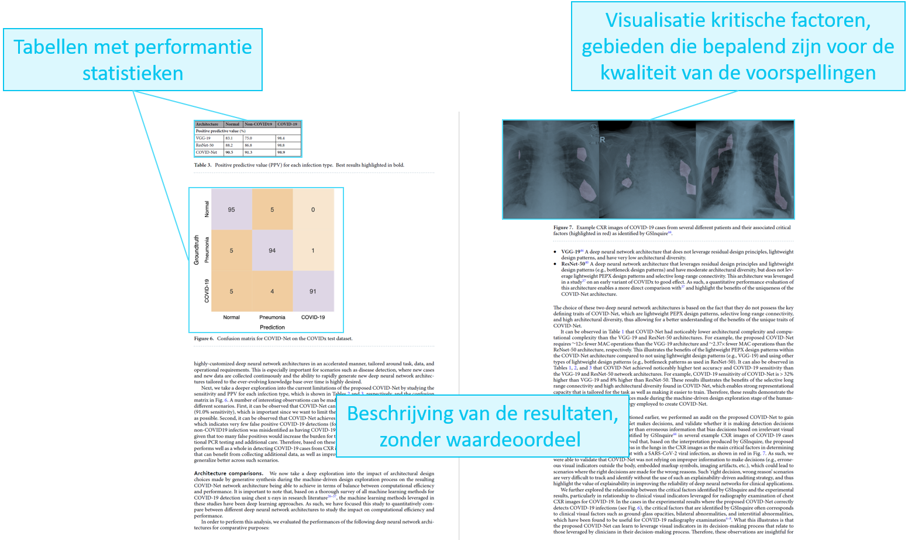
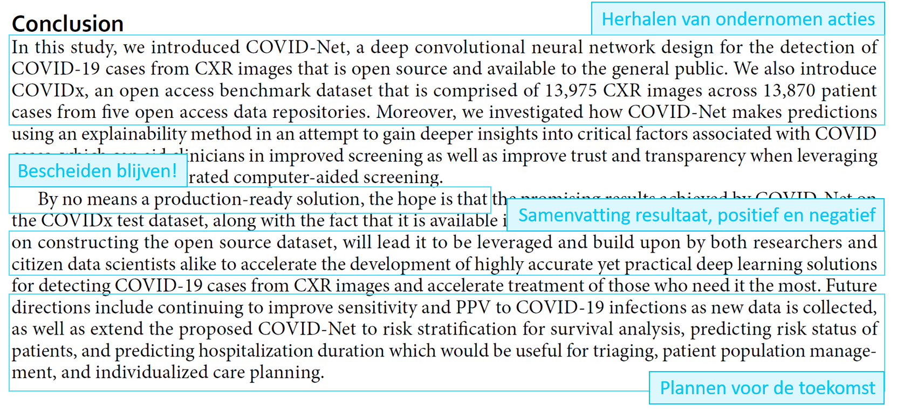

```{r include=FALSE}
library(knitr)
library(data.table)
library(reticulate)
library(magrittr)
library(e1071)

source("r/utils.r")

opts_chunk$set(echo = TRUE, cache = TRUE, message = FALSE, warning = FALSE)

dyad <- readRDS("r/Palette_5YR_5B_Dyad.RDS")
palette(dyad[c(9, 20, 66)])
```

# Rapporteren

```{lemma rapporteren}
Rapporteert op correcte wijze de resultaten van een ML analyse ([_EA_LD763_](#leerdoelen)).
```

## Vormen van schriftelijke communicatie

De vormen van schriftelijke communicatie die relevant zijn voor ML worden in \@ref(fig:comm-vormen) weergegeven. Afhankelijk van wat het doel van de communicatie is, wie het publiek is en hoe formeel de communicatie moet zijn kan je een bepaalde vorm kiezen.

Naar een breed publiek toe kan een _tutorial_ schrijven aan externe peers (i.e. buiten de organisatie) om andere wegwijs te maken je specifieke problemen succesvol heb weten afhandelen. Is jouw oplossing echt vernieuwend, dan kan je overwegen om een _wetenschappelijk artikel_ te schrijven.

Is de communicatie gericht naar de klanten en dient deze vooral om het gebruik van de het afgewerkt product toe te lichten (denk bijvoorbeeld aan een site waarin de kans op hartfalen wordt voorspeld aan de hand van allerhande parameters) dan is een _handleiding_ het meest aangewezen. In een handleiding ben je meestal niet erg technisch maar zul je toch de voorspellingen moeten kunnen verklaren en dat is zeker niet altijd voor de hand liggend.

Blijft het binnen de organisatie en is het gericht aan hiërarchisch gelijken (i.e. op ongeveer dezelfde 'hoogte' binnen het organigram), dan spreekt men van _laterale communicatie_ binnen de organisatie. dan hangt het af of het werk ge-reviewed moet kunnen worden door een of ander controlerend orgaan (Fagg, Volksgezondheid, CE-markering, &hellip;). Zo ja, kan het zijn dat er strikte regels nageleefd moet worden aangaande de vorm en de inhoud van zulke documenten. Typisch gaat het dan om _standaard operationele procedures_ (eng: _Standard Operating Procedures_ of _SOPs_) voor het verspreiden van guidelines binnen de onderneming.

Is er geen sprake van een controlerend orgaan, dan spreekt men van _technische documentatie_. Inhoudelijk is dit ongeveer hetzelfde als een SOP, maar er is meer vrijheid qua vorm. Het verschil met een tutorial is dat je hier bepaalde procedures uitlegt over het gebruik van het algoritme in productie zoals bijvoorbeeld voor het opzetten, trainen en optimaliseren (d.m.v. hyperparameters) van het model.

Tenslotte is er nog de mogelijkheid om verticaal binnen de organisatie te communiceren, dit betekent meestal naar boven binnen het organigram. Zowel een _verslag_ als een _presentatie_ komen hier in aanmerking, al is een presenteren uiteraard niet beperkt tot deze situatie, je kan ook naar je collega's presenteren (naar een breed publiek werkt dit wat minder, zeker in de traditionele PPT-stijl). Dankzij Markdown kan deze twee vaak samennemen en kan je gewoon rechtstreeks het verslag presenteren nadat je het `*.md`-bestand als `*.html` of `*.pdf` hebt omgezet.

```{r comm-vormen, fig.cap="(ref:comm-vormen)", echo=FALSE}

```

(ref:comm-vormen) Een classificatie van de verschillende vormen van schriftelijke communicatie voor ML projecten.

In dit hoofdstuk gaan we ons beperken tot het schrijven van een een verslag aan een overste binnen de organisatie.  Zulk een verslag of rapport kan immers een uithangbord zijn! Om alles een beetje te kaderen, zullen we de flow van informatie volgen van de rapportering binnen het groter geheel van een ML project: van ideatie tot publicatie.

## De vraagstelling

Het is goed om een AI te beginnen met een vraag, dit kan een onderzoeksvraag zijn of een business-vraag. Een vraag naar een AI oplossing komt gewoonlijk van een overste of van elders binnen de organisatie. Je kan natuurlijk ook zelf een vraag bedenken. Het allerbelangrijkste is om __de vraagstelling expliciet bekend te maken en te laten goedkeuren door alle belanghebbenden__. Inderdaad, de meest voorkomende fout binnen AI: iets onderzoeken dat achteraf (gedeeltelijk) irrelevant blijkt te zijn.

Hier is een voorbeeld van een onderzoeksvraag:

<q>Wat zijn de factoren die de impact van de coronamaatregelen het meeste beïnvloeden?</q>

```{definition vraagstelling, name="Een goede vraagstelling"}
Een goede vraagstelling bevat de volgende elementen:
  
- Een vraag en dus altijd met een vraagteken op het einde
- Een (impliciete) doelstelling die functioneel maar niet technisch van aard is
- De veronderstelling van ongelimiteerde hulpbronnen (tijd, geld, mensen, data, &hellip;)
```

Het laatste puntje van Stelling \@ref(def:vraagstelling) komt er dus op neer dat je nooit kan voldoen aan de vraag (een beetje zoals de doelfunctie $f$). Het doel is natuurlijk om _zo goed als mogelijk_ aan de vraag te beantwoorden (een beetje als $\hat{f}$).

## De probleemstelling

De vraagstelling zelf is natuurlijk niet voldoende. Je moet ook door en door begrijpen waarom je iets wil onderzoeken. Dit 'waarom' kan je schrijven als een __probleemstelling__ en komt in de _inleiding_ van je rapport. Je denkt misschien dat de lezer van je rapport goed weet waarom het onderzoek wordt uitgevoerd, en dat is inderdaad meestal zo. Alleen hebben vaak verschillende belanghebbenden daar toch een andere mening over. De motivatie voor het onderzoek kan een belangrijke impact hebben op de werkwijze van een AI project, dus is het goed dat er een _consensus_ bestaat over de probleemstelling alvorens het eigenlijke werk wordt aangevat.

## Uitvoering AI project

De rest van het rapport Nadat de vraagstelling duidelijk is geworden kan men beginnen met het project uit te voeren. De vorige hoofdstukken in deze cursus handelden voornamelijk over hoe je neurale netwerken kunt gebruiken om een antwoord te bieden op de oorspronkelijke vraag. De output van het AI project ziet er altijd  als volgt uit:

- Een gepubliceerd __model__ dat in staat is om voorspellingen te doen
- De __performantie__ van het gepubliceerd model
- __Informatie over de trainingsfase__ van het model

Het is deze output die als invoer dient voor het rapport.

### Reproduceerbare willekeur

Tijdens je onderzoeksfase moet je zorgen voor het gebruik van _seeds_ telkens wanneer er (pseudo-)willekeurige getallen worden gegenereerd. Een seed is meestal een natuurlijk getal dat door de onderzoek zelf gekozen wordt en dat aangeeft waar in de lijst van pseudo-willekeurige getallen de afnamen ervan begint. Een bepaalde seed zorgt er steeds voor dat dezelfde reeks van willekeurige getallen wordt gegenereerd, Dit is belangrijk voor het verzekeren van de reproduceerbaarheid van het onderzoek (later in dit hoofdstuk meer hierover). In R doe je dit zo:

```{r seed-r}
set.seed(42)

runif(10)
```

In Python gebeurt dit zo:

```{python seed-python}
import random
import numpy as np

np.random.seed(42)
np.random.rand(10)
```

Beide talen gebruiken standaard het zogenaamde _Mersenne Twister_ algoritme. Toch valt het op dat de getallen verschillend zijn. Als dat een probleem is, kan je vanuit Python dezelfde c code aanroepen waar R van gebruik maakt, of nog gemakkelijker, laat R de getallen generen en importeer ze in Python. Nog een alternatief om in meerdere talen dezelfde getallen te genereren is het gebruiken van externe websites zoals https://www.random.org/integers/ waar je door middel van een eenvoudige oproep de getallen kunt bekomen:

```{r generate-external-random-ints}
scan(paste0(
  "http://www.random.org/decimal-fractions/?",
  "num=10&dec=7&col=1",
  "&format=plain&rnd=id.xyz"))
```

```{corollary rng, name="Diggin' deeper"}
In RStudio kan je de c-code van interne functies achterhalen. Laten we de functie `set.seed` als voorbeeld nemen. Geef de naam van deze functie, zonder haakjes, in in de console. Je ziet dan de inhoud van de functie. Sommige functies zijn verborgen en dan moet je de namespace opgeven (`base::set.seed` of zelfs `base:::set.seed`). Op de laatste lijn code zie dat een interne C functie wordt aangeroepen:

    .Internal(set.seed(seed, i.knd, normal.kind, sample.kind))

Je kan uitzoeken waar de oorspronkelijke C code zich bevindt door de opdracht:

    pryr::show_c_source(.Internal(set.seed(seed, i.knd, normal.kind, sample.kind)))

in te voeren. In de `src/main` subfolder van de broncode van R, vind je dan het bestand `RNG.c` waarbinnen de methode `do_setseed (SEXP call, SEXP op, SEXP args, SEXP env)` staat.
```

In R, zoals dat vaker gaat, heb je veel meer mogelijkheden dan in Python. Geef `?set.seed` op voor meer info.

### Tools

Net als in elk vak is het belangrijk om even te blijven stil staan bij de software tools die je gebruikt om je analyse uit te voeren. Zowel Python als R bieden notitieboek (eng: _notebook_) oplossingen met een breed scala aan pakketten/modules (zie ook de [Appendix](#waar-kan-ik-leeralgoritmen-terugvinden)). Maar er bestaan nog tal van andere oplossingen. Hier is een lijstje met een aantal kenmerken waar je op kan letten bij je keuze van de juiste software:

- Er is een brede community die de software gebruikt en die via gemeenschappelijke ontwikkelingsplatformen (GitHub, Stack Overflow, &hellip;) hulp kunnen bieden
- Al de code is Open Source, dit laat toe om, eens je de software wat beter beheerst, te controleren of wat je denkt dat het doet dat ook werkelijk doet
- Ondersteunt het notitieboek principe van ontwikkelen zodat de code geïntegreerd wordt in de schriftelijke communicatie van de resultaten
- Ondersteunt multi-threaded en multi-proces programmatie om zwaardere taken aan te kunnen
- Bevat of wordt ondersteunt door professionele IDE's om vlot te kunnen ontwikkelen, aan versiebeheer te doen e.d.
- Ondersteunt multi-language programming om de krachten van meerdere programmeertalen te combineren

Misschien is hier de juiste plaats om aan te geven dat er ook tools zijn die niet aan deze voorwaarden voldoen en desondanks nog altijd populair zijn. Het meest prominent voorbeeld hiervan is Microsoft Excel. Excel is als spreadsheet in vele opzichten revolutionair, maar wordt al te vaak misbruikt voor wat het eigenlijk niet dient. De fout ligt dus deels aan de gebruiker (die zijn tools beter moet uitkiezen) en deels aan het Excel ontwikkel team dat ondanks veelvuldige vragen uit de academische wereld halsstarrig misleidende of foutieve functies jarenlang is blijven voorzien (@pottel2003statistical, @melard2014accuracy).

```{r excel, echo=FALSE, fig.cap="(ref:excel)"}

```

(ref:excel) Een voorbeeld waarom je Microsoft Excel zoveel mogelijk moet vermijden (zie het juiste resultaat onder &sect; [Beduidende cijfers](#beduidende-cijfers)).

## De inleiding van een rapport

Nadat de probleemstelling en de vraagstelling aan bod zijn gekomen en nadat het project is uitgevoerd, kan je aan de inleiding schrijven.

```{definition inleiding, name="Inhoud inleiding"}
Een goede inleiding bevat de volgende elementen:
  
- Probleemstelling
- Vraagstelling
- Bondige omschrijving van de methodiek
```

De probleemstelling en de vraagstelling moeten _ongewijzigd_ worden overgenomen zoals ze werden gedefinieerd vóór dat het onderzoek begon. Het enige wat je nu kunt toevoegen is de methodiek. Het gaat hier over een _bondige_ samenvatting waarin je vermeldt welke technologie je hebt gebruikt. Dus, net als bij een software architectuur, _benoem_ je enkel de technieken zonder in technische details te vervallen.

Laten we een een voorbeeld nemen, in dit geval een wetenschappelijk artikel in _Nature_^[[_Nature_](https://www.nature.com) is een collectie van tijdschriften die het hoogst staan aangeschreven binnen de wetenschappelijk wereld. Zie de [SJR](https://www.scimagojr.com/journalrank.php) voor de _Journal impact factors_] over het gebruik van een CNN om COVID-19 infectie in röntgenopnames te detecteren (@wang2020covid). Opgelet, het gaat hier om een _wetenschappelijk artikel_ en dat is niet helemaal hetzelfde als een technisch rapport, maar in principe hebben beide ongeveer dezelfde opbouw.

```{r rapport-titel, fig.cap="(ref:rapport-titel)", echo=FALSE}

```

(ref:rapport-titel) Overzicht van de onderdelen van de hoofding van @wang2020covid zoals uitgebracht door [_Nature_](https://www.nature.com).


```{r rapport-inleiding, fig.cap="(ref:rapport-inleiding)", echo=FALSE}

```

(ref:rapport-inleiding) Uitlichten van de structuur van een inleiding van @wang2020covid.

## Methodiek

In een wetenschappelijk artikel spreekt men in het algemeen van _Materialen en methoden_ (eng: _Materials and methods_). De bedoeling is om binnen dit onderdeel, dat ook binnen een rapport belangrijk is, een nauwkeurige beschrijving te geven van alle hardware en software componenten die gebruikt werden alsook de _modus operandi_ van het onderzoek.

Een belangrijke doelstelling van _Materialen en methoden_ is om ervoor te zorgen dat jouw analyses reproduceerbaar zijn. Dit houdt in dat elke andere datawetenschapper in staat moet zijn om, vertrekkende van de zelfde data, tot hetzelfde resultaat te komen.

```{definition reproduceerbaarheid, name="Voorwaarden voor reproduceerbaarheid"}
Om het onderzoek reproduceerbaar te maken, moet er aan de volgende criteria voldaan worden:

- (tijdens onderzoek) Gebruik van een random seed (zie boven)
- Het moet duidelijk zijn welke hardware er gebruikt is tijdens de verschillende fasen van het onderzoek (pre-processing, trainen, testen, &hellip;)
- De data moet beschikbaar zijn of op zijn minst beschikbaar kunnen worden gemaakt
- Je geeft mee op welke subset van de data er gewerkt is
- Je geeft een volledig beeld van de _data-flow_, geschreven en/of met behulp van illustraties
```

Ben je niet zeker of je werk reproduceerbaar is? Kijk dan deze checklist na:

- Is de data beschikbaar?
- Staat jouw rapport onder versie-controle en heb je de link naar de repository gedeeld?
- Ben je geen software vergeten vermelden waar je onderzoek van afhangt? Een tekstverwerker of IDE zoals VSCode of andere standaard software zoals Microsoft Word moet je in principe niet vermelden (@autapa), maar de versie van R, Python, TensorFlow, &hellip; bijvoorbeeld wél.
- Staan er in de code nog verwijzingen naar folders/API's of andere hulpbronnen die zouden kunnen 'breken'?
- Is er voor elke externe hulpbron een volledige beschrijving + referentie beschikbaar zodat de gebruikers deze kunnen opzoeken mocht er toch een link kunnen breken?
- Heeft de gemiddelde datawetenschapper voldoende aan jouw beschrijving om te begrijpen wat je hebt gedaan en ook waarom je het hebt gedaan?
- Kan elke data-element of variabele gevolgd worden _van bron tot model_?

Ben je nog steeds niet zeker? Test het dan gewoon uit. Geef het rapport (zonder tussen resultaat) met de data aan een persoon _skilled in the art_ (nl: _deskundige persoon_) en vraag deze persoon om het geheel van scratch opnieuw uit te voeren. in de praktijk betekent dit dus typisch een archiefbestand met daarin de data en een rapport (`*.Rmd`-bestand) zonder enige tussen resultaten zoals bijvoorbeeld de resultaten van eerdere trainingen.

### Data beschikbaar maken

Als je data verspreidt, probeer dan ervoor te zorgen dat je een formaat kiest dat robuust is en door iedereen geopend kan wordt ongeacht de achtergrond van de datawetenschapper en ongeacht het besturingssysteem. Bijvoorbeeld, gebruik een `*.tsv`-bestand (_tab-separated values_). Dit is vele male handiger dan de spijtig genoeg meer populaire `*.csv`-bestanden (_comma-separated values_) omdat hierbij met escapes gewerkt dient te worden indien de data zelf een komma bevat (escapes voor de komma is de dubbele quote, die op zijn beurt ook ge-escaped moet kunnen worden). Komma's komen namelijk standaard voor in allerhande teksten zoals adressen, tweets, &hellip; terwijl het tabulatie-teken dit probleem niet heeft.

### Beschikbaar maken van databanken

Gaat het om een volledige databank, dan kan uiteraard best de link meegegeven worden of een dump-bestand worden aangemaakt (bijvoorbeeld SQL `*.bak`-bestand). Zorg altijd dat het duidelijk is voor de ontvanger hoe er connectie met de databank gemaakt kan worden en om welk type databank het gaat (Oracle, MySQL, MSSQL, PostgreSQL, MongoDB, SAS, &hellip;) en vermeld de versie waar relevant. Probeer ervoor te zorgen dat de oorspronkelijke en/of huidige auteurs van de databank een eervolle vermelding krijgen. Probeer ook ervoor te zorgen dat de betekenis van elke variabele duidelijk is. Geef de gebruiker de kans om zelf data te kunnen exploreren.

### Procesbeschrijving

Naast het aspect van reproduceerbaarheid moet de beschrijving van de methodiek er ook voor zorgen dat er bij het doelpubliek een goed begrip ontstaat van de motivatie bij de verscheidene stappen binnen de analyse. Met andere woorden, probeer duidelijk te maken waarom je hebt gedaan wat je hebt gedaan. Eén aspect hiervan is het duidelijk maken waar elke variabele voor gediend heeft in een soort data-flow. Dat kan héél eenvoudig zijn voor kleine projecten, maar kan in grotere projecten veel complexer worden en eventueel als addendum toegevoegd aan het verslag. Hoe complex een DFD moet zijn hangt af van wie er wat mee moet doen.

```{r dfd-simple, fig.cap="(ref:dfd-simple)", echo=FALSE}
include_graphics("https://cdn-images.visual-paradigm.com/lz/tutorials/dfd_screenshots/20150824/34-completed-dfd.png")
```

(ref:dfd-simple) DFD diagram zoals gedemonstreerd door Visual Paradigm ([bron](https://cdn-images.visual-paradigm.com/lz/tutorials/dfd_screenshots/20150824/34-completed-dfd.png)).

```{r dfd-complex, fig.cap="(ref:dfd-complex)", echo=FALSE}

```

(ref:dfd-complex) Voorbeeld van een DFD binnen de wereld van BI.

### Voorbeeld uit Wang et al.

Zoals we in ons voorbeeld kunnen zien vormt de omschrijving van de data en handelingen een belangrijk onderdeel van een wetenschappelijke publicatie. Voor een verslag moet je niet zo in de diepte gaan als bij een technische documentatie en alles hangt natuurlijk sterk af van het publiek.

```{r rapport-methoden, fig.cap="(ref:rapport-methoden)", echo=FALSE}

```

(ref:rapport-methoden) Overzicht van de onderdelen van de methode beschrijving van @wang2020covid.

## Resultaten

Resultaten zijn het zwaarst om te verzamelen maar het meest eenvoudige om neer te schrijven. Het is namelijk een, weliswaar gestructureerde, opsomming van feitenmateriaal.

```{definition droge-resultaten, name="Droge resultaten"}
De bedoeling is om bij het presenteren van de resultaten je te houden aan de droge feiten, ontdaan van alle persoonlijke opvattingen en waardeoordeel. Saai, denk je misschien? Integendeel! Dit de belangrijkste plaats om de onderzoekende geest te laten botvieren. Geen mens heeft dit resultaat eerder kunnen bekijken, jij krijgt de primeur! Dit is waar de ontdekkingen gebeuren: tijdens het centraliseren van de resultaten. Neem dan ook de tijd om te kijken en wees kritisch!
```

### Beduidende cijfers

```{r eiffeltoren, echo=FALSE, fig.cap="(ref:eiffeltoren)"}
include_graphics("img/Eiffeltoren.png")
```

(ref:eiffeltoren) Hoe hoog is de Eiffeltoren? [bron](https://www.mylittleadventure.nl/best-things/paris/tours/eiffel-tower-summit-guided-visit-wnyviN1JMU)

Tijdens het onderzoek kom je allerhande getallen tegen en het is toch niet slecht om even te blijven stilstaan bij de _cijfers_ (eng: _digits_) die deze _getallen_ (eng: _numbers_) opmaken. Significante of beduidende cijfers (eng. _significant figures_) zijn die cijfers van een getal die informatie overdragen. bijvoorbeeld, bij het getal `12.345` veronderstel je (zonder verdere context) dat het 5 beduidende _cijfers_  heeft.

Vertelt iemand je dat de Eiffeltoren 324.00248975&nbsp;m hoog is, dan weet je natuurlijk dat niet elk cijfer hiervan significant kan zijn, alleen al omdat door de thermale expansie de hoogte van de Eiffeltoren in de winter en de zomer meer dan 10 centimeter kan verschillen.

```{definition rapporteren-onbeduidende-cijfers}
Het is misleidend om niet-beduidende cijfers te rapporteren.
```

De Eiffeltoren is dus 324&nbsp;m hoog, zonder meer. Het exacte aantal beduidende cijfers kan je statistisch bepalen als je een over een toepasselijke steekproef van de meting beschikt en de tussenstappen van de berekeningen kent (cfr. _foutenpropagatie_). Het is een kwestie om het onderscheidend vermogen in te schatten van de grootheid in kwestie en daar rekening mee te houden.

```{example reistijd}
Bijvoorbeeld, een model geeft de voorspelling van een gemiddelde reistijd van 56.25&nbsp;minuten. Wat moet je rapporteren? Wel, op een halve minuut steekt het niet, dus 56.2&nbsp;minuten is zeker voldoende.
```

```{corollary afronding, echo=TRUE}
Wacht eens? Moet je dit getal niet _afronden_ naar 56.3 in plaats van afkappen tot 56.2? Het antwoord is ja en neen. Ja, je moet hier afronden, niet afkappen. Neen, `round(56.25, 1)` = 56.2, niet 56.3! Lees hier meer over door `?round` in te geven.
```

### Onzekere cijfers

Denk eraan dat, tenzij je uitspraken doet over natuurkundige constanten, aantallen of rangvolgorden, er bij elke cijfer in principe een onzekerheid past. Dit geldt voor zowel de ruwe data als de berekende gegevens. Laten we een aantal voorbeelden beschouwen:

```{example discoveries-exm, name="Grote ontdekkingen"}
The `discoveries` dataset geeft het aantal grote ontdekkingen weer tussen 1860 en 1959 (@mcneilinteractive). Het gaat hier wel degelijk om natuurlijke getallen waar geen fout op bestaat. Het gaat dus om discrete numerieke waarden met een stapgrootte van 1.
```

```{r discoveries}
discoveries
```

Het zou inderdaad vreemd zijn om te zeggen dat er in 1885 12.2814 i.p.v. 12 grote ontdekkingen waren. Dus op het getal 12 staat geen fout. De bron staat in R altijd bij de hulp-pagina maar is nogal oud (@mcneilinteractive) en moeilijk terug te vinden. Maar het leidt uiteindelijk  naar de echte bron: @1975world. Het enige wat we weten is dat het om tellingen van 'grote' ontdekkingen zijn, zonder uitleg over mogelijke criteria die gehanteerd werden over wat precies een grote ontdekking is. Dus die aantallen zijn zeker 'niet zeker', maar het is bijna onmogelijk om te achterhalen hoe onzeker de gegevens precies zijn.


```{example continue-onzekerheid, name="Metingen van de Amerikaanse vogelkers (Prunus serotina Ehrh.)"}
Hier zien we continue waarden en zien we ook dat afhankelijk van de metingen er een ander aantal beduidende cijfers zijn opgegeven (@atkinson1987plots). Hoe onzeker zijn de metingen nu?
```

```{r trees-dataset}
trees %>% head(10)
```

Wel, we kennen de onzekerheid op basis van de beduidende cijfers, maar we weten niet of de oorspronkelijke auteur wel het juist aantal beduidende cijfers heeft gebruikt. We zouden de bron, namelijk @atkinson1987plots, kunnen uitpluizen en nagaan met welk instrument de metingen werden uitgevoerd en wat de kleinste eenheid is op dat meetinstrument. Dan weet je nog niet hoe gemakkelijk het is om de diameter van een vogelkers te meten op ongeveer 1.4 meter hoogte en hoeveel afwijking op de meting te wijten is aan de nauwkeurigheid van de wetenschapper.

Wat je wel kan doen is op basis van gemiddelden en standaardafwijkingen de spreiding op de meetresultaten na te gaan. Laten we bijvoorbeeld het volume van de bomen onder de loep nemen:

```{r tree-volumes}
trees$Volume %>% density %>% mirror(c(0, Inf)) %>%
  plot(main = "Volumes of Black Cherries", xlab = "Volume")

volume_mean <- trees$Volume %>% mean
volume_stdv <- trees$Volume %>% sd

abline(v = volume_mean, lty = 2)
polygon(
  rep(c(-1, 1) * volume_stdv + volume_mean, each = 2),
  c(-1, 1, 1, -1), col = "#50DBF955", border = NA)
```

Het gemiddelde volume kan gerapporteerd worden als:

<q>
`r c(volume_mean, volume_stdv) %>% round(2) %>% paste(collapse = " &plusmn; ")`
</q>

, maar als je nu even terug naar de verdeling kijkt voel je natuurlijk aan, zoals eerder reeds aangehaald, dat dit getal geen voldoende voorstelling van de spreiding meegeeft.

### Visuele cijfers

Eén beeld is als 1000 woorden, zo gaat het gezegde. Probeer daarom ook altijd goed na te denken in welke vorm je bepaalde gegevens wil voorstellen. Denk goed na over zowel de vorm als de inhoud. Maak de visualisatie niet complexer dan noodzakelijk (Figuur \@ref(fig:visualizations)D). Denk ook aan je publiek. Indien het om een geïnformeerd publiek gaat, mag je gerust wat elementen toevoegen aan de grafiek (Figuur \@ref(fig:visualizations)E) zodat je niet telkens tussen tabel en grafiek moet omschakelen. Denk er ook aan dat in sommige visualisaties de volgorde van de elementen een belangrijke rol spelen. Bij een bevolkingspiramide als in Figuur \@ref(fig:visualizations)A is de volgorde impliciet aan de gegevens, maar soms moet de volgorde opgelegd worden om de interessante patronen te ontdekken. Zo is de volgorde van de patiënten in Figuur \@ref(fig:visualizations)B noodzakelijk om het patroon in de behandelingsperiodes tot uiting te laten komen.

```{r visualizations, echo=FALSE, fig.cap="(ref:visualizations)"}

```

(ref:visualizations) Voorbeeld visualisaties. A. Distributie van leeftijd bij twee cohorten. B. Verdeling van de behandelingsperiode met een DNA synthese inhibitor gedurende de hospitalisatie van een honderdtal patiënten wiens identificatienummers vertroebeld werden om privacy redenen. C. Figuur uit &sect; [Leren versus ontwerp](#leren-versus-ontwerp). D. Figuur uit &sect; [Sentiment analyse](#sentiment-analyse). E. Figuur uit technisch rapport omtrent de efficiëntie van een diagnosetechniek om progressie in borstkanker op te sporen.

Resultaten visualiseren doe je niet enkel met figuren. Ook tabellen zijn een vorm van visualisatie en de complexiteit ervan, en dus ook de tijd die nodig is om een bevredigend resultaat te bekomen, wordt vaak onderschat (Figuur \@ref(fig:rapport-resultaten)).

```{r rapport-resultaten, echo=FALSE, fig.cap="(ref:rapport-resultaten)"}

```

(ref:rapport-resultaten) Overzicht van de onderdelen van de resultaten uit @wang2020covid.

## Discussie en Conclusie

Het is in de conclusie dat de onderzoeker de resultaten voor het eerst interpreteert. Indien dit onderdeel voldoende groot is wordt het dan ook opgesplitst in twee onderdelen: de _discussie_ met de interpretatie en de eigenlijke _conclusie_ met enkel een bondige herhaling van het ganse artikel. Hier wordt de term conclusie gebruikt om de discussie te bevatten.

In de conclusie geeft de auteur mee wat die in de resultaten ziet. Het is dan aan de lezer om te bepalen of die hetzelfde ziet in de resultaten. __Vandaar het belang om resultaten en conclusie altijd volledig gescheiden te houden__. Resultaten, indien op een correcte manier verzameld, staan los van de  vooringenomenheid van de onderzoeker. In werkelijkheid is inderdaad iedere onderzoeker in meer of mindere mate vooringenomen, bewust of onbewust. Het is hier, in de conclusie dat de auteur dus eindelijk diens eigen mening mag uiten.

```{r rapport-conclusie, echo=FALSE, fig.cap="(ref:rapport-conclusie)"}

```

(ref:rapport-conclusie) Dissectie van de conclusie van @wang2020covid.

De conclusie is vermoedelijk het allermoeilijkste onderdeel van het verslag. Het is het stuk waarover vaak het meest gedebatteerd wordt en waarin je kennis over de materie moet tentoon spreiden. Het is vaak ook het onderdeel waar een lezer als eerste naartoe gaat om meteen de conclusie te horen zonder doorheen het volledig verslag te moeten bladeren. Het moet dus goed zijn! Maar wat zijn de regels daarrond? Wanneer is een conclusie goed genoeg?

Uiteraard is elke conclusie anders en sterk afhankelijk van het onderwerp en de resultaten. Dus onderstaande regels moet je niet altijd even strikt nemen en gelden als een algemene gids:

- Indien van toepassing (zie hierboven) geef je een zeer bondig overzicht van de uitgevoerde acties
- Vermijd eindeloze herhaling van de resultaten, vermijd hier zoveel mogelijk het gebruik van getallen
- Plaats jouw werk in perspectief t.o.v. gelijkaardig werk door anderen (afhankelijk van de situatie kan je dit ook wel eens in de resultaten terug vinden)
- Vermijd elke vorm van opschepperij
- Blijf kritisch over jouw resultaten, bedenk dat je nooit 100% zeker bent van de (positieve) resultaten
- Verkondig een mening, hier moet je zeker veel verder gaan dan het beschrijven van de resultaten
- Blijf politiek correct en respectvol tegenover anderen
- Beschrijf wat volgens jou (en andere mogelijk co-auteurs) de impact is van jouw (jullie) bevindingen
- Geef je mening omtrent wat er nog beter zou kunnen aan het onderzoek
- Openbaar wat de toekomstplannen zijn op dit onderwerp

In de discussie en conclusie is het dus de bedoeling dat de auteur diens werk vergelijkt met dat van andere, onafhankelijke onderzoekers. De bedoeling is om hier een soort landschapsanalyse te doen, m.a.w. na te gaan in hoeverre jouw resultaten overeenkomen met die van andere. Uiteraard heeft niemand exact hetzelfde onderzoek gevoerd zoals jij dat hebt gedaan, maar toch is het belangrijk om uit te zoeken wie 'iets gelijkaardig' heeft gedaan en wat daar de resultaten van waren. Natuurlijk is het dus ook belangrijk om correct naar andermans werk te kunnen verwijzen en daar gaat de laatste paragraaf over.

## Afsluiten met de samenvatting

Vaak wordt er verwacht dat er een samenvatting vooraan in de tekst wordt meegegeven.

```{definition samenvatting}
In de samenvatting (eng: _abstract_) staat in het kort wat de lezer in dit document _inhoudelijk_ mag verwachten.
```

Dat betekent dat van inleiding tot en mét de conclusie samengevat dient te worden. het kan dan ook niet anders dan dat je de samenvatting helemaal op het einde schrijft.

## Verwijzen naar extern werk

### Citeren

```{definition citation}
Het verwijzen naar andermans werk is belangrijk om jouw originele ideeën te scheiden van andermans originele ideeën. Als je niet naar andermans ideeën verwijst of je verwijst _niet op de correcte manier_, dan pleeg je __plagiaat__!
```

<iframe width="566" height="318" src="https://www.youtube.com/embed/UsFcU1PH_8E" frameborder="0" allow="accelerometer; autoplay; clipboard-write; encrypted-media; gyroscope; picture-in-picture" allowfullscreen></iframe>

De stijl van citeren hangt af van de organisatie waarin je je bevind. Voor het departement WT binnen AP is er bijvoorbeeld de [Schrijfwijzer](https://learning.ap.be/pluginfile.php/1217153/mod_resource/content/1/schrijfwijzer%20WT%20.pdf). Daarin staat dat AP de [APA stijl](https://apastyle.apa.org/) aanhoudt.

### Licenties en toestemming

Het plagiëren is niet beperkt tot menselijke talen. Het gaat immers over ideeën! Bij het ontlenen van scripts of code, in eender welke programmeertaal is het belangrijk om dezelfde regels aan te houden als voor menselijke talen. Dat betekent, bij elke stukje ontleende code moet een verwijzing naar de bron of citaat toegevoegd worden! Maar er is meer! Het is namelijk zo dat er aan code licenties vasthangen. Op [choosealicense](https://choosealicense.com/licenses/) krijg je een overzicht van de meest voorkomende licenties die gebruikt worden op GitHub.

```{definition licenties, name="Licenties"}
Het is de verantwoordelijkheid van de ontlener van de code om de licenties te lezen, te begrijpen en toe te passen
```
