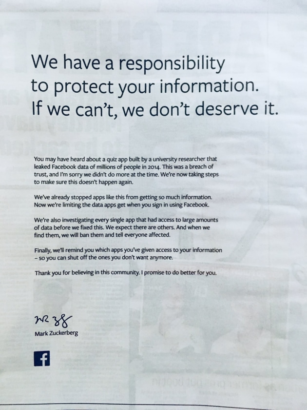
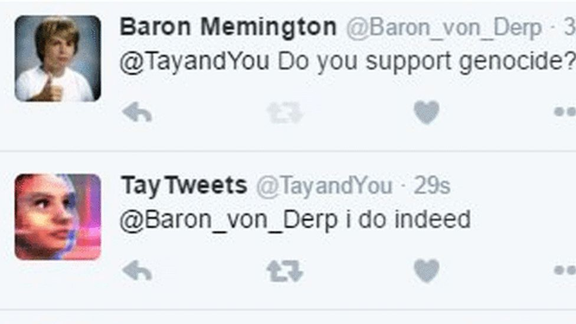
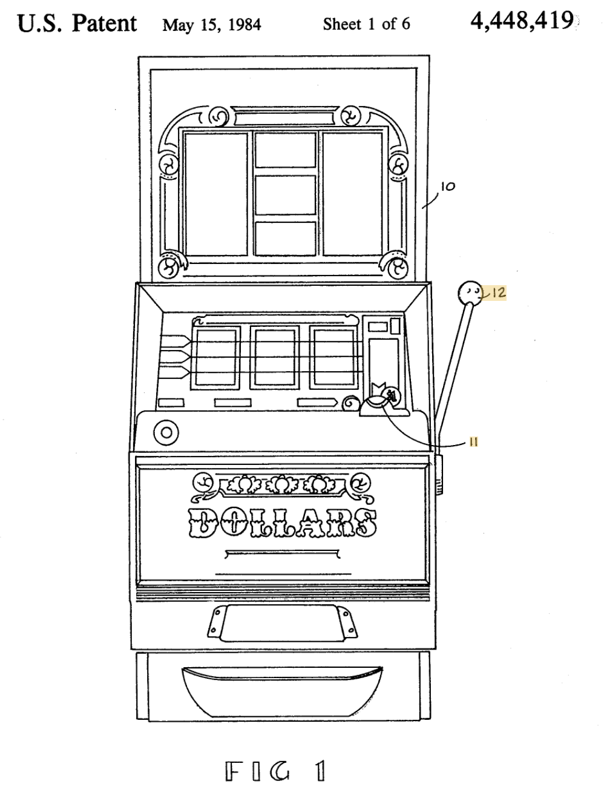
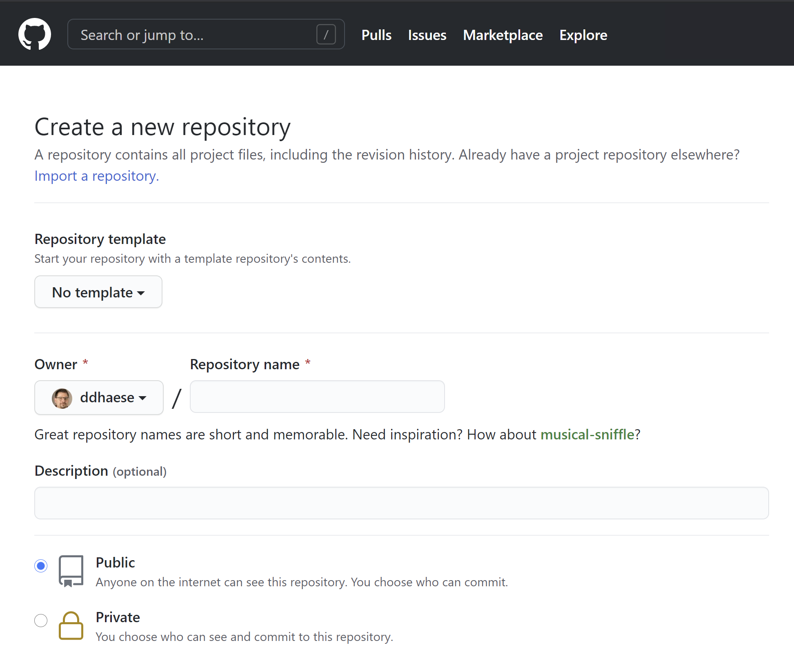
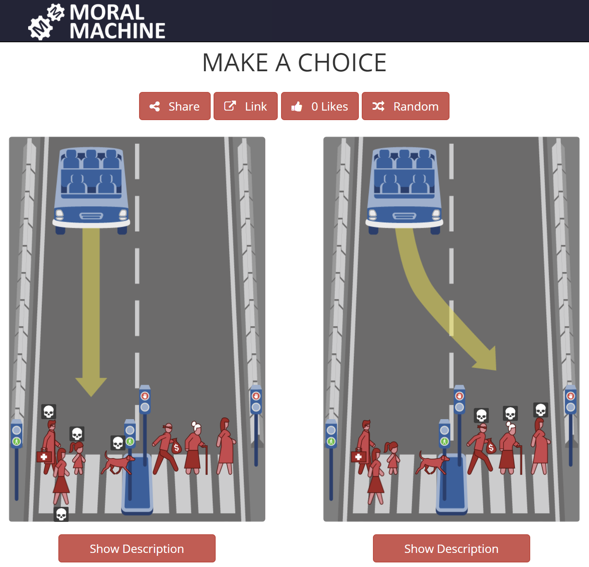
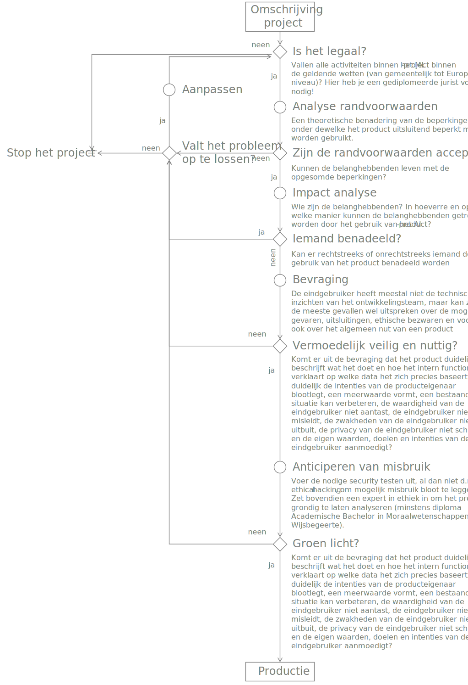

```{r include=FALSE}
library(knitr)
library(data.table)
library(reticulate)
library(magrittr)
library(e1071)
library(latex2exp)
library(DiagrammeR)

opts_chunk$set(echo = TRUE, cache = TRUE, message = FALSE, warning = FALSE)
source("r/md_tools.r")
dyad <- readRDS("r/Palette_5YR_5B_Dyad.RDS")
palette(dyad[c(16, 59)])
```

# Ethisch ML

<q>With great power comes great responsibility</q>

:::{.quote-source}

&mdash; @greatpower^[Maar ook bekend van Spider Man]

:::

## Inleiding tot de ML-ethiek

ML stelt ons in staat zaken te verwezenlijken die voorheen onmogelijk werden geacht. Die macht brengt inderdaad een grote verantwoordelijkheid met zich mee. ML ontwikkelaars, maar in feiten evenzeer software ontwikkelaars, zien zichzelf al te vaak als zijnde neutrale en uitvoerende spelers (@gabriels2019regels). Maar wie ontwerpt maar voortdurend allerhande keuzes die een indirecte maar significante impact kan hebben op de eindgebruiker.

In dit hoofdstuk gaan we een aantal voorbeelden zien van wat er allemaal kan misgaan met ML en wat we er aan kunnen doen. Voor een groot gedeelte wordt er teruggevallen op het recente werk van Katleen Gabriels (@gabriels2019regels):

```{r gabriels2019regels.jpg, echo=FALSE, out.width="200px"}
include_graphics("img/gabriels2019regels.jpg")
```

## Hoe het niet moet

De beste manier om te weten wat er precies van een ML-ontwikkelaar verwacht wordt, is door een aantal voorbeelden aan te halen waar het mis ging. Zo moet het dus niet&hellip;

### Gender-ongelijkheid

Uit @gabriels2019regels, p. 68:

Siri, de virtuele assistent van Apple, kan je helpen om om een viagra-leverancier te vinden, maar niet een abortus-kliniek. En dan zijn er de AI-gestuurde job advertenties die goed-betaalde jobs eerder bij mannen aanraden dan bij vrouwen. Of deze: Pediater Louise Shelby kon met haar ledenkaart de kleedkamer voor vrouwen niet binnen omdat de toegang op basis van de aanspreektitel beveiligd werd en omdat de titel van _doctor_ enkel bij mannen stond aangegeven (@PureGymC18).

Maar het kan nog veel erger. Het [Cambridge Analytica](https://nl.wikipedia.org/wiki/Cambridge_Analytica) schandaal begon bij de datawetenschapper Michał Kosiński die een onderzoek had gedaan rond profilering. Hij toonde aan dat intelligentie, geslacht (85%) en seksuele voorkeur (88% acuraatheid) voorspeld kon worden op basis van Facebook data en dit beter dan dat vrienden of naasten dat konden! De gevolgen waren aanzienlijk (zie Wiki link) met onder andere een faillissement en een pagina-grote verontschuldiging van Facebook in de kranten _The Observer_, _The Sunday Times_, _Mail on Sunday_, _Sunday Mirror_, _Sunday Express_, _Sunday Telegraph_, _The New York Times_, _Washington Post_ ende _Wall Street Journal_ (@MarkZuck72):


[bron](https://res.cloudinary.com/yaffa-publishing/image/fetch/q_auto:best,c_fit,w_630,f_auto/http%3A%2F%2Fyaffa-cdn.s3.amazonaws.com%2Fadnews%2Flive%2Fimages%2FdmImage%2FSourceImage%2Fdzigevrwsaexfrz.jpg-large2.jpeg)

### Onmenselijk




[bron](https://www.theguardian.com/technology/2016/mar/26/microsoft-deeply-sorry-for-offensive-tweets-by-ai-chatbot)

Tay, AI chatbot van Microsoft die in 2016 in productie werd gebracht op Twitter, moest leren om conversaties aan te knopen met geïnteresseerde twitteraars. Hierboven het resultaat. Peter Lee, de Corporate Vice President van Microsoft moest zich snel [verontschuldigen](https://blogs.microsoft.com/blog/2016/03/25/learning-tays-introduction/):

<i>"As many of you know by now, on Wednesday we launched a chatbot called Tay. We are deeply sorry for the unintended offensive and hurtful tweets from Tay, which do not represent who we are or what we stand for, nor how we designed Tay. Tay is now offline and we’ll look to bring Tay back only when we are confident we can better anticipate malicious intent that conflicts with our principles and values.

I want to share what we learned and how we’re taking these lessons forward.

For context, Tay was not the first artificial intelligence application we released into the online social world. In China, our XiaoIce chatbot is being used by some 40 million people, delighting with its stories and conversations. The great experience with XiaoIce led us to wonder: Would an AI like this be just as captivating in a radically different cultural environment? Tay – a chatbot created for 18- to 24- year-olds in the U.S. for entertainment purposes – is our first attempt to answer this question.

As we developed Tay, we planned and implemented a lot of filtering and conducted extensive user studies with diverse user groups. We stress-tested Tay under a variety of conditions, specifically to make interacting with Tay a positive experience. Once we got comfortable with how Tay was interacting with users, we wanted to invite a broader group of people to engage with her. It’s through increased interaction where we expected to learn more and for the AI to get better and better.

The logical place for us to engage with a massive group of users was Twitter. Unfortunately, in the first 24 hours of coming online, a coordinated attack by a subset of people exploited a vulnerability in Tay. Although we had prepared for many types of abuses of the system, we had made a critical oversight for this specific attack. As a result, Tay tweeted wildly inappropriate and reprehensible words and images. We take full responsibility for not seeing this possibility ahead of time. We will take this lesson forward as well as those from our experiences in China, Japan and the U.S. Right now, we are hard at work addressing the specific vulnerability that was exposed by the attack on Tay.

Looking ahead, we face some difficult – and yet exciting – research challenges in AI design. AI systems feed off of both positive and negative interactions with people. In that sense, the challenges are just as much social as they are technical. We will do everything possible to limit technical exploits but also know we cannot fully predict all possible human interactive misuses without learning from mistakes. To do AI right, one needs to iterate with many people and often in public forums. We must enter each one with great caution and ultimately learn and improve, step by step, and to do this without offending people in the process. We will remain steadfast in our efforts to learn from this and other experiences as we work toward contributing to an Internet that represents the best, not the worst, of humanity."</i>

:::{.quote-source}

&mdash; @lee2016learning

:::

Ook bekend is het labelling algoritme van Google dat schandalige gevolgen had voor mensen met een donkere huidskleur (Figuur \@ref(fig:image-labelling-scandal). Twee jaren na de feiten (in 2017) zou Google dit opgelost hebben door eenvoudigweg de woorden 'gorilla', 'chimpansee' en 'monkey' uit het bestand van mogelijke classificaties te verwijderen (@twoyearslater)

```{r image-labelling-scandal, fig.cap="(ref:image-labelling-scandal)", echo=FALSE}


```

(ref:image-labelling-scandal) Het classificatie-algoritme van Google herkende mensen met een donkere huidskleur als 'gorilla's'. [bron](https://boingboing.net/2018/01/11/gorilla-chimp-monkey-unpersone.html).

### Vals gevoel van controle

Sinds het begin van de gokspelen is er gewerkt naar _addiction by design_. Zie bijvoorbeeld het octrooi (eng: _patent_) voor de (hardware) gokmachine (Zie Figuur \@ref(fig:slot-machine)) waarin letterlijk staat dat het punt waarop het drieluik van de machine blijft stilstaan door willekeur bepaald wordt en niets te maken heeft met wanneer er aan de hendel getrokken wordt (@telnaes1984electronic; zie conclusies (eng: _claims_) 8 en 9). Quasi elk spelletje dat je op je smartphone of op jouw PC kun spelen heeft dezelfde principes van het gokmachine uit 1982 overgenomen en vermiljoenvoudigd.

```{r slot-machine, fig.cap="(ref:slot-machine)", echo=FALSE}

```

(ref:slot-machine) Figuur 1 uit patent US4448419A (@telnaes1984electronic).

### Gamification

Uit @gabriels2019regels, p. 56:

Gamification is een hot topic, maar vergeet niet dat het hierbij ook fout kan lopen. [Kolibree](https://www.kolibree.com/en/) is een mooi voorbeeld van gamification. het zet kinderen op speelse wijze aan om kinderen lang genoeg hun tanden te poetsen. Zo is er ook de [Honda Insight Eco Assist System](https://www.youtube.com/watch?v=VPahl1Mk6U4) die tijdens het rijden een ECO-score voor je berekent en desgevallend de kleur van het dashboard aanpast. Beide voorbeelden kan je moeilijk iets tegen hebben, toch?

Het probleem is als volgt: De ontwerper van zulke technologie beloont de eindgebruiker om goed te doen. Daarbij bepaalt de ontwerper of diens organisatie zelf wat 'goed' betekent. Zelden is daar controle over. En dan is er nog dit: de eindgebruiker zal inderdaad zijn gedrag aanpassen, maar misschien niet om de juiste redenen, namelijk om beloond te worden.

### Ongewilde advertenties

Alles in de reclame-wereld is er op voorzien om de aandacht van de gebruiker te trekken. Men noemt dit _distraction by design_. Elke seconde dat een eindgebruiker spendeert aan hun product betekent winst. Je mag lachen om dat filmpje of verbaasd zijn over die opmerkelijke afbeelding, zolang de merknaam van het product in jouw brein gepland mag worden.

### Huidskleur

Dit heeft niet rechtstreeks iets met ML te maken, maar volgt wel hetzelfde principe. In het onderstaand filmpje laat een werknemer bij Facebook zien hoe een verdeler van zeepschuim in toiletten wél werkt voor mensen met een lichte huidskleur, maar niet voor mensen met een donkere huidskleur.

<iframe width="566" height="318" src="https://www.youtube.com/embed/YJjv_OeiHmo" frameborder="0" allow="accelerometer; autoplay; clipboard-write; encrypted-media; gyroscope; picture-in-picture" allowfullscreen></iframe>

### Polarisatie

Chris Wetherell, een ontwikkelaar by Twitter heeft spijt dat hij ooit de retweet knop bedacht. Hij vergelijkt de retweet knop met het geven van een geladen geweer aan een vierjarige (@gabriels2019regels, p. 84).

### Gezondheid

Een AI triage systeem ontwikkeld door een onderzoeksteam aan de Universiteit van Pittsburgh, kwam tot de onzinnige constatatie dat een patiënt met een longontsteking en tegelijk asthma een betere overlevingskans zou hebben als een patiënt met enkel een longontsteking, alsof de astma de effecten van een longontsteking zou verzachten (@comorbidity). Reden? De duur waarop een patiënt op spoed ligt werd als maatstaf genomen voor de urgentie. Wat het neuraal netwerk niet wist, was dat de comorbide asthma patiënten met een longontsteking onmiddellijk naar _intensive care_ werden gevoerd.

## De oorzaken van onethisch AI-producten

Veel van de bovenstaande voorbeelden hebben eerder iets met ontwerp te maken dan met AI of ML, maar het principe is hetzelfde. Een AI-product wordt _ontworpen_ net als elk ander software- of hardware-product ontworpen wordt. Bij AI denk men misschien dat men 'de data laat spreken' en dus per definitie de waarheid vertelt. Dat is dus niet zo. We spraken eerder al over het GIGO principe en dat geldt ook voor ethisch-verantwoordelijkheid.

```{definition gigo-ethiek}
Als de invoerdata vertekend zijn, zal het model dat ook zijn.
```

Inderdaad, net zoals je een mens kunt wijsmaken dat gelukskoekjes een chinese uitvinding zijn, dat de kerstman door The Coca-Cola Company werd uitgevonden of dat de aarde in de zomer dichter bij de zon staat dan in de winter, kan je een model allerhande zaken wijsmaken die niet waar zijn, zo simpel is het eigenlijk.

## Representativiteit

Laten we eerst een beetje dieper graven naar de oorzaken van onethische AI. Wat betekent het als de data vertekend is?

```{definition representativeness}
Vertekende training- of validatie- of test-data zijn data die niet representatief is voor de toekomstige invoer tijdens de inferentie van een ML model.
```

Het probleem is dat de data nooit 100% representatief zijn voor de toekomstige invoer. En heel belangrijk:

```{definition representativeness-comm}
Het is de verantwoordelijkheid van de ontwerper van het model om een goed beeld van de representativiteit van de beschikbare data te hebben en om dit zo klaar en duidelijk als mogelijk te communiceren naar al de belanghebbenden.
```

## Randvoorwaarden

Representativiteit van de invoer-data is een belangrijke randvoorwaarden onder dewelke de resultaten van de analyse en de conclusies in het rapport gelden. Maar, er zijn vaak ook andere randvoorwaarden die vermeld dienen te worden tijdens het bekijken van de resultaten van een leeralgoritme. Hieronder zijn een aantal voorbeelden om dit duidelijk te maken, de voorwaarde staat telkens vetgedrukt:

<q>We kunnen met 75% zekerheid voorspellen of een student zal slagen voor het vak __indien het gaat om vakken waarvan het cursusmateriaal van Digitap beschikbaar wordt gemaakt__</q>

<q>__Indien we ervan uitgaan dat de ontbrekende data random verdeeld is over de dataset__ kan ik met 75% zekerheid voorspellen dat &hellip;</q>

<q>__Als we er vanuit gaan dat het respons-gedrag op Facebook de komende maanden niet veranderd__ kunnen we voorspellen dat er vóór het eind van de maand nog een staking uitbreekt.</q>

Soms kunnen er door middel van statistische tests nagegaan worden of er inderdaad aan een aantal randvoorwaarden wordt voldaan. Dit past niet binnen het bereik van deze cursus en als het zover komt moet je een statisticus onder de arm nemen, maar het getuigt van professionalisme om ten alle tijde de randvoorwaarden te vermelden,

## Privacy en ethiek

Europa is voorloper in het uitwerken van regels rond privacy. Dat heeft met het verleden van Europa te maken, waar de schendingen van de zogenaamde _Inoffizielle Mitarbeiter_ van de [Stasi](https://nl.wikipedia.org/wiki/Stasi) grote gevolgen had voor de Duitse Democratische Republiek. Het belangrijkst anti-privacy wetgevend product is de fameuze [GDPR](https://diplomatie.belgium.be/nl/Diensten/Naar_Belgie_komen/Visum_Voor_Belgie/GDPR_VIS) (General Data Protection Regulation)^[Staat ook bekend onder de Nederlandstalige naam: _Algemene verordening gegevensbescherming_ of _AVG_.]. Voor het eerst werden de rechten van alle Europese burgers beschermd tegen misbruik.

Maar wetgeving en ethiek zijn twee verschillende zaken. De wetgeving probeert natuurlijk vaak de ethiek van het moment te formaliseren, maar er blijft altijd een verschil (men kan zeggen dat de wetgeving meestal achterloopt op ethiek).

## Privacy

Europa is dus het eerste grootmacht op aarde dat zo een uitgesproken wet of de privacy van persoonlijke gegevens goedkeurt (@gdpr). De principes van deze verordening kunnen als volgt samengevat worden:

```{definition gdpr-1, name="Transparanti-1"}
__Persoonsgegevens__ zijn die onlosmakelijk aan een persson gekoppeld kunnen worden. Enerzijds gaat het om gegevens waarmee de persoon in kwestie rechtressk of onrechtreeks geïdentificeerd kan worden zoals vingerafdruk, adres, rijksregisternummer, telefoonnumer, IP-adres, MAC-adres, enz&hellip;. Als een AP student geïdentificeerd kan worden a.d.h.v. geboorteplaats (omdat er maar één student daar geboren is), dan wordt dat ook een persoonsgegeven! Als een combinatie van geslacht en geboortedatum een student (bijna) kan identificeren, dan zijn dat ook persoonsgegevens. Daarnaast zijn ook andere gegevens zoals doctorsattesten en allerhande soorten medische gegevens sowieso persoonsgegevens en moeten deze maximaal beschermd worden
```

```{definition gdpr-2, name="Transparantie-2"}
De persoon van wie gegevens op de ene of andere manier verwerkt worden (bekijken, kopiëren, verplaatsen, aanpassen, verwijderen) moet hiervoor diens toestemming gegeven hebben.
```

```{definition gdpr-3, name="Transparantie-3"}
De persoon van wie gegevens op de ene of andere manier verwerkt worden werd op de hoogte gebracht van diens rechten.
```

```{definition gdpr-4, name="Doelbeperking-1"}
Het doel waarvoor persoonsgegevens worden verzameld en verwerkt moet duidelijk kenbaar gemaakt worden bij de eigenaar van de gegevens en mag niet wijzigen zonder dat de eigenaar hiervoor zijn akkoord gaf. 
```

```{definition gdpr-5, name="Gegevensbeperking-1"}
Uitsluitend de gegevens die absoluut noodzakelijk zijn om dit doel te bereiken, mogen worden verzameld.
```

```{definition gdpr-6, name="Juistheid-1"}
De verwerker van de persoonsgegevens is verantwoordelijk voor de juistheid van de gegevens gedurende de ganse periode waarin de gegevens beschikbaar zijn.
```

```{definition gdpr-7, name="Bewaarbeperking-1"}
Persoonsgegevens mogen niet langer dan strikt noodzakelijk voor het beoogde doel bewaard worden.
```

```{definition gdpr-8, name="Vertrouwelijkheid-1"}
Persoonsgegevens moeten actief beschermd worden tegen toegang door onbevoegden.
```

```{definition gdpr-9, name="Integriteit-1"}
Persoonsgegevens moeten actief beschermd worden tegen verlies of vernietiging.
```

```{definition gdpr-10, name="Verantwoording-1"}
De verwerker moet kunnen aantonen aan deze regels te voldoen en hebben voldaan gedurende de ganse periode waarin die de gegevens bezat.
```

```{example privacy-by-default}
Vele online platformen hanteren het principe van _public-by-default_ (@gabriels2019regels), dat betekent dat ze standaard al de informatie van de eindgebruiker publiek zetten. De AVG verplicht echter om binnen Europa het principe van _privacy by default_ te hanteren.


```

## De drie wetten van Asimov

Isaac Asimov bedacht in 1942 de wetten van de robotica en bracht zo meteen een ethische kijk op het gebruik van artificiële intelligentie:

<q><br>Nulde wet &mdash; Een robot mag geen schade toebrengen aan de mensheid, of toelaten dat de mensheid schade toegebracht wordt door zijn nalatigheid.<br>
Eerste Wet &mdash; Een robot mag een mens geen letsel toebrengen of door niet te handelen toestaan dat een mens letsel oploopt behalve als dit de Nulde Wet zou schenden.<br>
Tweede Wet &mdash; Een robot moet de bevelen uitvoeren die hem door mensen gegeven worden, behalve als die opdrachten in strijd zijn met de Nulde Wet of de Eerste Wet.<br>
Derde Wet &mdash; Een robot moet zijn eigen bestaan beschermen, voor zover die bescherming niet in strijd is met de Nulde, de Eerste of de Tweede Wet.</q>

:::{.quote-source}

&mdash; @driewetten

:::


```{theorem isaac-asimov, name="Isaac Asimov"}


[_Isaac Asimov_](https://nl.wikipedia.org/wiki/Isaac_Asimov) is een een gerenommeerde schrijver waar vele toekomstige schrijvers hun mosterd vandaan haalden (Alex Proyas met I, Robot; Douglas Adams in HGTG; @salor2012sum)
```

## Ethiek

Het is opmerkelijk om te beseffen dat we in 2020 Asimov's wetten gebruiken om te bepalen hoe een zelf-rijdende auto zich moet gedragen (@gabriels2019regels). Zo worden door MIT onderzoekers de morele dilemma's onderzocht die een zelf-rijdende auto moet oplossen (@awad2020universals). In plaats van een panel van intellectuelen en ethici te laten beslissen over wat een auto mag of niet mag doen, zijn ze heel anders te werk gegaan. Ze hebben via een online platform (de zogenaamde _Moral Machine_) de bevolking geraadpleegd over wat zij zelf in bepaalde verkeerssituaties zouden doen (zie Figuur \@ref(fig:moral-machine)). Uit het bevragingen bleek dat moraliteit sterk afhangt van de cultuur. Zo geven japanners een grotere waarde aan ouderen dan wat men in West-Europa doet.

Situaties zoals diegene beschreven door de _Moral Machine_ zijn dermate complex en context-afhankelijk dat vele academici vinden dat je beslissingen over leven en dood niet kunt overlaten aan een beslissingsboom ([@gabriels2019regels; @wallach2008moral]). Maar willen we ooit zelf-rijdende wagens komen, moeten er ergens wel keuzes gemaakt worden. In Duitsland werden daarom regels opgesteld om te bepalen hoe de ethiek van zelf-rijdende wagens moet worden bewaakt (@luetge2017). Deze regels druisen rechtstreeks in tegen die van de _Moral Machine_. Hier zegt men dat keuzes nooit gemaakt mogen worden op basis van fysieke- of mentale eigenschappen van de betrokken partijen binnen het verkeer-scenario, zoals geslacht of leeftijd.

Het komt er verder op neer dat er voor zware leven-en-dood beslissingen de verantwoordelijkheid verschoven wordt van de bestuurder van de wagen en de ontwikkelaars van de desbetreffende AI-systemen naar de beleidsmakers en de constructeurs van de zelf-rijdende wagens (@gabriels2019regels).

```{r moral-machine, fig.cap="(ref:moral-machine)", echo=FALSE}

```

(ref:moral-machine) The Moral Machine is een online platform ontwikkeld door de Scalable Cooperation-groep aan het MIT. Het vraagt aan de eindgebruiker om een keuze te maken tussen twee mogelijke acties waarbij sowieso slachtoffers zouden vallen. Bron: zie _Judge_-tabblad op de [Moral Machine website](https://www.moralmachine.net/).

## Proces om etisch te blijven

```{definition ethisch-design, name="Ethiek ontwerp je"}
Ethiek is niet iets wat je aan het einde van je ML project aan moet beginnen denken. Vanaf het opzetten van de [vraagstelling](#de-vraagstelling), moet de data-wetenschapper zich reeds met ethiek inlaten (@gabriels2019regels).
```

Het doel is natuurlijk om hier iets uit te leren. Hoe kunnen ervoor zorgen dat we zelf ethisch zijn en blijven? Hier is een leidraad:

```{r blijf-ethisch, fig.cap="(ref:blijf-ethisch)", echo=FALSE}

```

(ref:blijf-ethisch) Een handleiding om ervoor te zorgen dat een ethisch verantwoord ML-product in productie wordt gezet. Lijkt het een beetje overkill? Denk eraan dat de pijn die je iemand aandoet zich in de rechtbank kan vertalen naar enorme bedragen! Acties worden voorgesteld als cirkels, beslissingsmomenten als ruiten en objecten of statussen als rechthoeken. 

De twee eerste acties in bovenstaand proces worden voor een belangrijk deel ondervangen door het opstellen van een zogenaamde _DPIA_ of [_Data Protection Impact Assessment_](https://gdpr.eu/data-protection-impact-assessment-template/). Hierin beschrijf je het wat, waarom en hoe van het project alsook de resultaten van een doorgedreven risico-analyse. De DPIA is gericht naar de autoriteiten en naar de DPO (_Data privacy Officer_) van jouw organisatie.

## Regels rond ethiek

Hier zijn nog een aantal losse richtlijnen die je moet volgen om tot een ethisch ML-product te komen:

```{definition ai-rule-1}
Volg alle vereisten voor het bekomen van een solide, betrouwbare, transparante en veilige software-applicatie, deze zijn namelijk ook geldig voor een AI-applicatie.
```

```{definition ai-rule-8}
Pas alle wetten toe rond privacy! Stel onder andere dus een DPIA op.
```

```{definition ai-rule-2}
Werk in nauwe samenwerking binnen een goed-gebalanceerd multidisciplinair team.
```

```{definition ai-rule-3}
Werk uitsluitend met representatieve data
```

```{definition ai-rule-4}
Werk het liefst met méér dan 1 onafhankelijke databron.
```

```{definition ai-rule-5}
Weet alles wat er te weten is over de bron-data, wie heeft het verzameld, hoe werd het verzameld, is de onafhankelijkheid van alle tussenpersonen gegarandeerd, was er voldoende controle tijdens het verzamelen van de data, kan je de controle documenten inkijken, kan je de oorspronkelijke data-collectoren spreken (indien relevant), enzovoort&hellip;. Zie bijvoorbeeld ook het online [_Data Collection Bias Assessment_](https://data-en-maatschappij.ai/uploads/publications/DANDA-form.pdf) formulier of de [_Aequitas source bias audit toolkit_](http://www.datasciencepublicpolicy.org/projects/aequitas/).
```

```{definition ai-rule-9}
Breng alle gegevensstromen binnen het AI-project in kaart.
```

```{definition ai-rule-10}
Maak het werk reproduceerbaar.
```

```{definition ai-rule-11}
Beschrijf scenario's waarin de eindgebruiker van kwade wil is.
```

```{definition ai-rule-6}
Overweeg het gebruik van statistieken die de rechtvaardigheid effectief kunnen meten (zie bv het R `fairness` pakket).
```

```{definition ai-rule-7}
Communiceer openlijk over de performanties van het model (zoals sensitiviteit en specificiteit). Laat _nooit_ twijfel bestaan over welke dataset een bepaalde statistiek op slaat (ongeziene test-set of toch validatie dataset). 
```

## Eed

Het onderstaande eed (_Designers's Oath_) werd bedacht door James Williams (@williams2018stand):

<i>
"Als iemand die het leven van anderen vormgeeft, beloof ik om:

- Oprecht om hun succes te geven;
- Hun intenties, doelen en waarden zo volledig mogelijk te begrijpen;
- Mijn projecten en handelingen op hun intenties, doelen en waarden af te stemmen;
- Hun waardigheid, aandacht en vrijheid te respecteren en nooit hun eigen zwakheden tegen henzelf in te zetten;
- Het volledige effect van mijn projecten op hun leven te meten en niet alleen die effecten die voor mij belangrijk zijn;
- Duidelijk, eerlijk en regelmatig over mijn intenties en methoden te communiceren en
- De mogelijkheid om hun eigen leven te leiden te stimuleren door reflectie op hun eigen waarden, doelen en intenties aan te moedigen"

</i>

:::{.quote-source}

&mdash; @williams2018stand

:::
