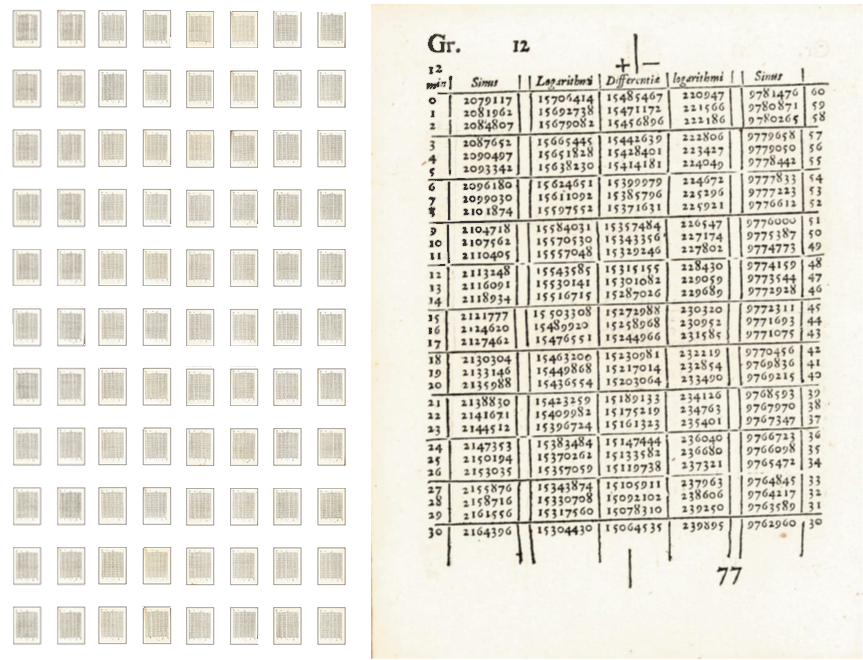
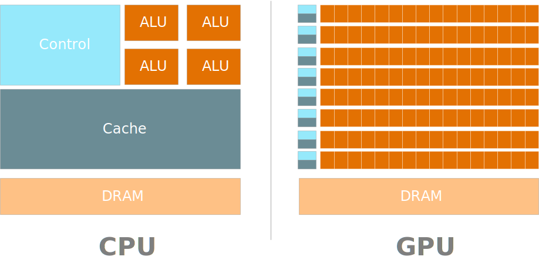
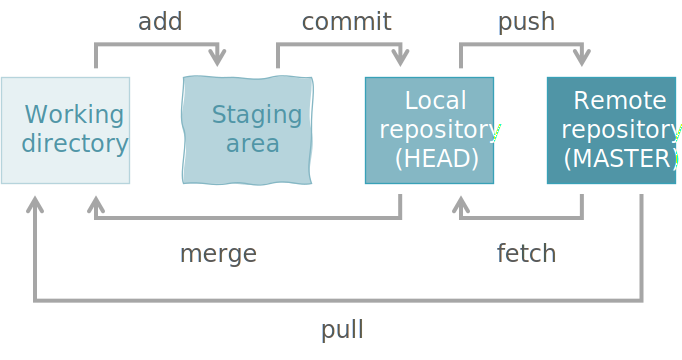
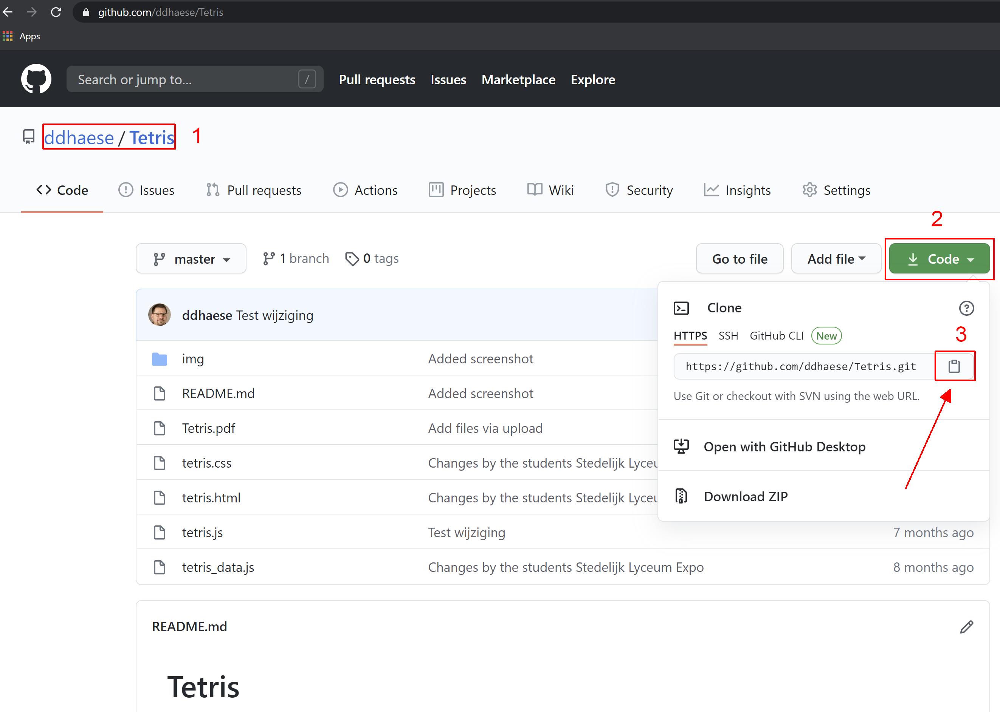

```{r include=FALSE}
library(knitr)
library(data.table)
library(magrittr)
library(rgl)

# knit_hooks$set(webgl = hook_webgl)
opts_chunk$set(echo = TRUE, cache = TRUE, message = FALSE, warning = FALSE)
# options(rgl.printRglwidget = TRUE)

source("r/md_tools.r")
dyad <- readRDS("r/Palette_5YR_5B_Dyad.RDS")
palette(dyad[c(9, 20, 66)])

knit_engines$set(cmd = function(options){
  code <- options$code %>%
    paste(collapse = "\n")
  
  if(options$eval){
    out <- code %>% shell(intern = TRUE)
  } else{
    out <- NULL
  }
  
  engine_output(options, paste0("> ", gsub("\n", "\n> ", code)), out)
})
```

# (APPENDIX) Appendix {-}

# De Logaritme

De logaritme is een functie en die als het omgekeerde van een exponentiële functie beschouwd kan worden:

$$
y = ^g\!log(x) \\
g^y=x
$$

waarbij $g$ het grondtal is. Indien het niet meegegeven wordt, veronderstelt men dat $g$ gelijk is aan $e = 2.718281828..$ en komt de logaritme overeen met de _natuurlijk logaritme_ dat in _België en sommige andere delen van de wereld_ aangeduid wordt met $ln(x)$.

Een belangrijke reden om een variabele te transformeren met de logaritme is omdat de verdeling ervan een grote scheefheid vertoond waardoor:

1. de verdeling moeilijker te interpreteren is en
2. de verdeling te sterk afwijkt van normaliteit, een assumptie waar erg veel statistieken van afhangen

In het R pakket `MASS` vinden we een heel simpele dataset `mammals` met gemiddelde lichaamsgewichten en hersenen-massa's. Deze data laat het probleem alsook het effect van de log-transformatie visueel zien:

```{r logaritme, fig.cap="(ref:logaritme)", fig.width=7, fig.height=8, echo=FALSE}
library(MASS)
data(mammals)

par(mfrow = c(2, 2), mar = c(8, 4, 5, 1), oma = c(0, 0, 2, 0))
mammals <- as.data.table(mammals)

mammals$body %>%
  density %>%
  plot(
    main = "Linear scale",
    xlab = "Body mass",
    xlim = c(-1000, 7000))

m <- mammals$body %>% mean
s <- mammals$body %>% sd

polygon(
  c(m - s, m - s, m + s, m + s),
  c(-.1, 1, 1, -.1),
  col = paste0(dyad[12], "44"),
  border = NA)
abline(v = m + (-1:1) * s, lty = c(2, 1, 2), col = dyad[12])

mammals$body %>%
  log %>% 
  density %>%
  plot(
    main = "Logarithmic scale",
    xlab = "Body mass")

m <- mammals$body %>% log %>% mean
s <- mammals$body %>% log %>% sd

polygon(
  c(m - s, m - s, m + s, m + s),
  c(-.1, 1, 1, -.1),
  col = paste0(dyad[12], "44"),
  border = NA)
abline(v = m + (-1:1) * s, lty = c(2, 1, 2), col = dyad[12])

mammals[, plot(brain ~ body, pch = 19,
  main = "Linear scale",
  xlab = "Body mass", ylab = "Brain mass")] -> dummy

mammals[, plot(log(brain) ~ log(body), pch = 19,
  main = "Logarithmic scale",
  xlab = "Body mass", ylab = "Brain mass")] -> dummy

title("Distribution body mass of mammals", line = 0, outer = TRUE)
title("Brain mass versus body mass", line = -23, outer = TRUE)
```

(ref:logaritme) Lichaamsgewichten alleenstaand als verdelingen (boven) of tegenover hersenen-massa's (onder) in de lineaire schaal (links) of de logaritmische schaal (links). De blauwe balken geven het gemiddelde (volle blauwe lijn) weer &plusmn; standaardafwijking (blauwe stippellijnen).

Bedenk wel dat enkel [strikt positieve](https://nl.wikipedia.org/wiki/Positief_getal#:~:text=Getallen%20groter%20dan%20nul%20worden,dus%20noch%20positief%2C%20noch%20negatief.) lineair-numerieke meetwaarden ($\mathbb{R}^+$) voor een log-transformatie in aanmerking komen.

```{r warning=FALSE}
curve(log(x), xlim = c(-5, 10), col = dyad[16], lwd = 2)
polygon(c(-7, -7, 0, 0), c(-3, 3, 3, -3),
  angle = 45, density = 10, col = dyad[16])
```

Op internet kan je trucjes vinden om log-transformaties te doen op data die 0 waarden bevatten. Een voorbeeld van zo een trucje is om bij elke waarde &frac12; bij op te tellen. Zulke procedures kunnen helpen voor de visualisatie maar hebben vaak geen statistische grondslag, dus opgelet hiermee.

We staan er niet meer bij stil hoe fantastisch het eigenlijk is om in een machine `log(2.34651)` te kunnen opgeven. Wil je weten hoe men vroeger logs berekende? Net als voor andere functies (`sin`, `tanh`, &hellip;) gebeurde dit aan de hand van tabellen:

```{r log-tabellen, fig.cap="(ref:log-tabellen)", echo=FALSE}

```

(ref:log-tabellen) Zo ging men vroeger te werk voor het berekenen van een logaritme!

```{exercise log-test, name="Probeer het uit"}
Maak nu zelf eens een vector van negen waarden gaande van `1E-4` tot `1E4` en neem de logaritme van deze vector.
```

```{exercise anti-log, name="Anti-log"}
Deze paragraaf begon met de stelling dat de logaritme als het omgekeerde van een exponentiële functie kan beschouwd worden. Toon dat eens voor jezelf aan. Probeer eens zeer kleine en zeer grote waarden uit voor $x$ en probeer eens verschillende grondtallen uit.
```

# Inwendig product, matrix-vermenigvuldiging, vectoren en tensoren

De perceptron is een leeralgoritme dat de 'gewichten' $\theta$ probeert te vinden die na vermenigvuldiging met de invoer $x$ de uitkomst $y$ tracht te benaderen met $\hat{y}$.

\begin{equation}
  f(x, \theta)=\sum_{i=0}^{n}{\theta_ix_i}
  (\#eq:perceptron-appendix)
\end{equation} 

Deze bewerking komt overeen met het [inwendig product](https://nl.wikipedia.org/wiki/Inwendig_product) van de matrix $\mathbf{x}$ met de vector $\mathbf{\theta}$:

\begin{equation}
  \mathbf{x}\cdot\mathbf{\theta}
  (\#eq:inwendig-product)
\end{equation} 

Nemen we `iris` dataset uit een vorige [casestudy](#casestudy-onderscheiden-van-setosa), dan ziet de invoer van een neuraal netwerk $\mathbf{x}$ er als volgt uit:

```{r iris-x-matrix}
x <- iris[, 1:2] %>% cbind("Bias" = c(1, 1), .) %>% as.matrix
```

```{r iris-x-matrix-plot, results="asis", echo=FALSE}
x %>% head %>% rbind(9999) %>% write_matex(prefix = "\\mathbf{x}=", dec = 1)
```

De eerste kolom is de nep-variabele waarvan sprake zal zijn tijdens het bespreken van Feed-forward ANNs. Nemen we hier nu de eerste rij uit, dan krijgen we een geannoteerde [_vector_](https://nl.wikipedia.org/wiki/Vector_(wiskunde). In R doen we dit:

```{r iris-x-matrix-rij}
x[1,]
```

Wiskundigen gaan een vector echter meestal voorstellen als een kolomvector. Datawetenschappers houden er dan weer van om een vector als _rijvector_ voor te stellen. Dat heeft te maken met het feit dat het aantal variabelen vaak veel kleiner is dan het aantal instanties en, zoals hierboven voor $\mathbf{x}$ gedaan werd, de matrix gemakkelijker weer te geven is. Hier gaan we de wiskundige weergave volgen, maar het resultaat moet hetzelfde zijn. We bekomen een kolomvector door deze eerste rij te [_transponeren_](https://nl.wikipedia.org/wiki/Getransponeerde_matrix), i.e. we maken van de rijen kolommen:

```{r iris-x-matrix-rij-math, echo=FALSE, results="asis"}
x[1,, drop = FALSE] %>% as.matrix %>% t %>%
  write_matex(prefix = "\\mathbf{x^T_1}=", dec = 1)
```

We kunnen deze vector interpreteren als een pijl in een 3-dimensionaal assenstelsel vertrekkende van de oorsprong en met de punt ter hoogte van 1 op de as `Bias`, 5.1 richting as `Sepal.Length` en 3.5 richting `Sepal.Width`:


```{r iris-vector-creation, eval=FALSE, echo=FALSE}
open3d()
plot3d(x)
arrow3d(c(0, 0, 0), x[1,], s = .1, width = .3, add = TRUE)
writeWebGL( filename="img/vector.html" ,  width=600, height=600)
```

<iframe width="100%" height="650px" src="img/vector.html" sandbox="allow-same-origin allow-scripts allow-popups allow-forms" style="border:0px;"></iframe>

Maar opgelet:

```{definition vector}
Het typeert een vector dat het uit waarden bestaat die elke op hun eigen dimensie in een $p$-dimensionale ruimte geprojecteerd kunnen worden en dat het niet afhangt van de set van eenheidsvectoren of van coördinatenstelsel.
```

Nu gaan we over naar de parameters. Uit het resultaat van het eenvoudigste artificieel neuraal netwerk uit de &sect; [Inleiding tot ANN's](#inleiding-tot-anns) halen we de parameters die nodig zijn voor het berekenen van de uitvoer-node voor de uitkomst _setosa_:

$$\mathbf{\theta_{setosa}^T}=\begin{bmatrix}
0.773&-0.374&0.571 \\
\end{bmatrix}$$

Dit noemen we een covector of [lineaire functionaal](https://nl.wikipedia.org/wiki/Lineaire_functionaal).

```{definition covector}
Het typeert een covector om niet uitgedrukt te kunnen worden in bepaalde eenheden.  Covectoren zijn dus eenheidsloos en dienen als lineaire afbeelding (eng: _linear map_) om een vector te transformeren naar een andere vector. Het is de veralgemening van deze in elkaar transformeerbare vectoren die met _tensoren_ noemt en de term "tensorflow" komt voort uit het het herhaaldelijk moeten uitvoeren van deze transformaties.
```

Er rest ons nu alleen maar de matrix-vermenigvuldiging uit te voeren. Dit doen volgens het schema in Figuur \@ref(fig:matrix-vermenigvuldiging). Deze figuur laat meteen de veralgemeende situatie zien waarbij meerdere parameter vectoren en meerdere instanties betrokken zijn. Inderdaad, alle waarden voor $z$ binnen eenzelfde laag kunnen doormiddel van één bewerking tegelijk berekend worden. 

```{r matrix-vermenigvuldiging, echo=FALSE, fig.cap="(ref:matrix-vermenigvuldiging)"}
include_graphics("img/matrix-vermenigvuldiging.svg")
```

(ref:matrix-vermenigvuldiging) Matrix-vermenigvuldiging van. De vermenigvuldiging van twee matrices kan kan dus enkel indien het aantal kolommen van de eerste matrix overeenkomt met het aantal rijen van de tweede. (gebaseerd op [deze afbeeldingr](https://nl.wikipedia.org/wiki/Matrixvermenigvuldiging#/media/Bestand:Matrix_multiplication_diagram.PNG))

Nu kunnen we terug de wiskundige wereld verlaten en de datawetenschapper wereld betreden, en kunnen de dat kantelen (transponeren) van de matrices vergeten. In R voer je een matrix-vermenigvuldiging uit door middel van de `%*%` operator:

```{r matrix-vermenigvuldiging-r, eval=FALSE}
set.seed(42)
x <- rnorm(15, 10, 3) %>% matrix(5, 3)
theta <- runif(6) %>% matrix(3, 2)
z <- x %*% theta
```

```{r matrix-vermenigvuldiging-r-plot, echo=FALSE, eval=FALSE}
x%>% write_matex( dec = 1)
```

$$z=\mathbf{x}\cdot\mathbf{\theta}=\begin{bmatrix}
14.1&9.7&13.9 \\
8.3&14.5&16.9 \\
11.1&9.7&5.8 \\
11.9&16.1&9.2 \\
11.2&9.8&9.6 \\
\end{bmatrix}\cdot\begin{bmatrix}
0.7&0.7 \\
0.8&0.0 \\
0.4&0.8 \\
\end{bmatrix}=\begin{bmatrix}
1.4&2.0 \\
1.7&1.5 \\
-0.3&-0.9 \\
2.0&0.2 \\
0.2&0.2 \\
\end{bmatrix}$$

```{exercise}
Probeer nu zelf voor het eerste neuraal netwerk uit &sect; [Inleiding tot ANN's](#inleiding-tot-anns) de resultaten in `nn$net.result` te bekomen door de invoergegevens te vermenigvuldigen met de parameters in `nn$weights`.
```

# Computations using GPU

Computations using machines are typically being carried out using some kind of physical processing units. On many systems there are at least two types of processing units that can perform computations: CPUs (central processing units) and GPUs (graphics processing unit), the latter being originally employed for manipulation of images and for game development. While their constituent parts are similar, their architectures differ greatly:

```{r cpu-gpu, fig.cap="(ref:cpu-gpu)", echo=FALSE}

```

(ref:cpu-gpu) The high-level differences between CPUs and GPUs.

In a CPU, the control and the cache are governed centrally in the number of arithmetic logic units (ALUs) is limited. In a GPU, control and cache are more distributed and there are many more ALUs. As a consequence, CPUs are more versatile, 'smarter' and faster and work best for singular but complex computations. GPUs, on the other hand, are better equipped to handle massive parallel tasks consisting of repetitive but simple computations.

# Installation

## Installing CUDA (optional)

In 2007 NVIDIA released CUDA® ([Compute Unified Device Architecture](https://nl.wikipedia.org/wiki/CUDA)). CUDA is a parallel computing platform and programming model that enables dramatic increases in computing performance by harnessing the power of the GPU. You can download the platform from [here](https://developer.nvidia.com/cuda-downloads), but before you install it, check that your system is compatible and read the disclaimers provided. For Windows operating systems you can find additional information [here](https://docs.nvidia.com/cuda/cuda-installation-guide-microsoft-windows/index.html). Mind that the above is optional. You can run all the material provided in this course without the GPU computation option. If you plan to install CUDA anyway, make sure to check out the detailed [installation steps that worked for the author](#installation-steps-that-worked-for-the-author) first.

## The R language

[R](https://www.r-project.org/) is a [turing-complete](https://en.wikipedia.org/wiki/Turing_completeness) programming language focusing on specifically on data analysis. It is the most popular among statisticians and data scientists and in comparison to Python it is often said to be the brains whereas Python is said to be the muscles (see @RvsPython):

```{r r-versus-python, fig.cap="(ref:r-versus-python)", out.width="250px", echo=FALSE}
include_graphics(paste0("https://i0.wp.com/ucanalytics.com/blogs/wp-content/",
  "uploads/2015/10/Superman-Vs-Batman.jpg?w=582"))
```

(ref:r-versus-python) In an article on his channel called _YOU CANalytics_, Roopam Upadhyay has compared R with Batman and Python with Superman. Such a comparison is deemed to be opinionated, and I believe that some of the differences explained in the article are not unconditionally valid, but at least it debunks some of the long held beliefs about the R language.

For Windows systems, you can download the latest stable R version from [here](https://cran.r-project.org/bin/windows/base/). It comes with a number of very useful functions already in the`base` namespace Again, make sure to continue reading first to check the [installation steps that worked for the author](#installation-steps-that-worked-for-the-author) below.

## Python

Python is a general-purpose programming language developed by Guido Van Rossum. The previous paragraph already discusses the differences between R and Python. In addition, some resources or platforms will rely only on one of these two languages. For these reasons, it pays of for a prospective data-scientist to manage both.

```{theorem, rossum, name="Guido Van Rossum", echo = TRUE}
<br/>

_Guido Van Rossum_ is the father of Python. He developed the language in 1989 as a Dutch IT-specialist associated with the Mathematisch Centrum in Amsterdam, Netherlands. Originally meant as a low-threshold language for beginning programmers, it now trumps all other. See for yourself on [Google trends](https://trends.google.nl/trends/explore?cat=32&date=today%205-y&q=java,javascript,.NET,Python).
```

## RStudio

Rstudio was found by far to be the most valuable and student-friendly IDE (integrated development environment) for working professionally with data, not just in R, but also in Python, Julia and other (scripting) languages such as SQL and Stan. In addition, it is the easiest IDE for people who have limited computer experience. Installing RStudio is free for academic use. See https://rstudio.com for more information, installation generally takes only a few minutes. Once installed, get acquainted with the IDE. See the book of Campbell for details on the IDE (@campbell2019rstudio).

## Installing Tensorflow

Around 2005, Google released [Tensorflow®](https://www.tensorflow.org/). TensorFlow is an open-source Python library to aid with the development, training, building and releasing of machine learning models, particularly deep learning models. To install TensorFlow for Rstudio, visit https://tensorflow.rstudio.com/ and read the instructions there. Check the installation steps used by the author below before you start.

## Installation steps that worked for the author

Every system is different, so the steps below might not work for you. With these and with the links provided above, you should be able to get up and running in no time. Here is the set of instructions that worked for me, starting from scratch on a Dell XPS 15 7590 with a Windows 10 Pro operating system. For Windows users, remember check the 'set Path' option during installation, if available, or set the path manually using the [command line]](https://www.windows-commandline.com/set-path-command-line/). Also, test each step before you go to the next.

1. (optional) Install [CUDA](https://docs.nvidia.com/cuda/cuda-installation-guide-microsoft-windows/index.htm) version 10.2.89_441.22 for Windows and test with `nvcc -V` anywhere at the command line prompt
1. Install [R](https://www.r-project.org/) and test by running the command `R --version` anywhere at the command line prompt
1. Install [Python 3](https://www.python.org/downloads/) and test by running the command `python --version` anywhere at the command line prompt
1. Install [Rstudio](https://rstudio.com) and check that the correct version of R is being linked to
1. Install [Miniconda](https://docs.conda.io/en/latest/miniconda.html) in a directory that contains _no spaces_ (not automatically adding to Windows PATH variable as advised, but manually)  and test by running the command `conda --version` anywhere at the command line prompt
1. Add a python environment, here called `tf` (in the `Scripts` sub-folder of Miniconda installation folder), read and follow the advise given (if any) and test afterwards with the command `conda info --envs` or `conda env list`:
	
```{bash create-python-env, eval=FALSE}
conda create -n tf
```

<pre>
Collecting package metadata (current_repodata.json): done
Solving environment: done

==> WARNING: A newer version of conda exists. <==
  current version: 4.8.3
  latest version: 4.8.4

Please update conda by running

    $ conda update -n base -c defaults conda

  Package Plan ##
  environment location: […]\envs\tf

Proceed ([y]/n)? y

Preparing transaction: done
Verifying transaction: done
Executing transaction: done
 
  To activate this environment, use
 
      $ conda activate tf
 
  To deactivate an active environment, use
 
      $ conda deactivate
</pre>

7. Open RStudio and, using the console, install the helper package `tensorflow` that guides the installation:
	
```{r install-tensorflow-rstudio, eval=FALSE}
install.packages("tensorflow")
```

<pre>
Installing package into […]
(as ‘lib’ is unspecified)
also installing the dependencies ‘rappdirs’, ‘config’, ‘reticulate’, ‘tfruns’

trying URL 'https://cran.rstudio.com/bin/windows/contrib/3.6/rappdirs_0.3.1.zip'
Content type 'application/zip' length 87285 bytes (85 KB)
downloaded 85 KB

trying URL 'https://cran.rstudio.com/bin/windows/contrib/3.6/config_0.3.zip'
Content type 'application/zip' length 27334 bytes (26 KB)
downloaded 26 KB

trying URL 'https://cran.rstudio.com/bin/windows/contrib/3.6/reticulate_1.16.zip'
Content type 'application/zip' length 1742735 bytes (1.7 MB)
downloaded 1.7 MB

trying URL 'https://cran.rstudio.com/bin/windows/contrib/3.6/tfruns_1.4.zip'
Content type 'application/zip' length 1479931 bytes (1.4 MB)
downloaded 1.4 MB

trying URL 'https://cran.rstudio.com/bin/windows/contrib/3.6/tensorflow_2.2.0.zip'
Content type 'application/zip' length 145036 bytes (141 KB)
downloaded 141 KB

package ‘rappdirs’ successfully unpacked and MD5 sums checked
package ‘config’ successfully unpacked and MD5 sums checked
package ‘reticulate’ successfully unpacked and MD5 sums checked
package ‘tfruns’ successfully unpacked and MD5 sums checked
package ‘tensorflow’ successfully unpacked and MD5 sums checked

The downloaded binary packages are in […]
</pre>

8. Still in RStudios console window, load the `tensorflow` package in memory (change `tf` if use you another environment name):

```{r install-tensorflow-rstudio-2, eval=FALSE}
install_tensorflow(version = "nightly-gpu", envname = "tf")
```

<pre>Collecting package metadata (current_repodata.json): ...working... done<br>
Solving environment: ...working... done

  Package Plan ##

  environment location: […]\envs\tf

  added / updated specs:
    - python=3.6


The following packages will be downloaded:

    package                    |            build
    ---------------------------|-----------------
    certifi-2020.6.20          |   py36h9f0ad1d_0         152 KB  conda-forge
    pip-20.2.2                 |             py_0         1.1 MB  conda-forge
    python-3.6.11              |h6f26aa1_2_cpython        18.9 MB  conda-forge
    python_abi-3.6             |          1_cp36m           4 KB  conda-forge
    setuptools-49.6.0          |   py36h9f0ad1d_0         919 KB  conda-forge
    vc-14.1                    |       h869be7e_1           6 KB  conda-forge
    vs2015_runtime-14.16.27012 |       h30e32a0_2         2.2 MB  conda-forge
    wheel-0.35.1               |     pyh9f0ad1d_0          29 KB  conda-forge
    wincertstore-0.2           |        py36_1003          13 KB  conda-forge
    ------------------------------------------------------------
                                           Total:        23.3 MB

The following NEW packages will be INSTALLED:

  certifi            conda-forge/win-64::certifi-2020.6.20-py36h9f0ad1d_0
  pip                conda-forge/noarch::pip-20.2.2-py_0
  python             conda-forge/win-64::python-3.6.11-h6f26aa1_2_cpython
  python_abi         conda-forge/win-64::python_abi-3.6-1_cp36m
  setuptools         conda-forge/win-64::setuptools-49.6.0-py36h9f0ad1d_0
  vc                 conda-forge/win-64::vc-14.1-h869be7e_1
  vs2015_runtime     conda-forge/win-64::vs2015_runtime-14.16.27012-h30e32a0_2
  wheel              conda-forge/noarch::wheel-0.35.1-pyh9f0ad1d_0
  wincertstore       conda-forge/win-64::wincertstore-0.2-py36_1003

[…]

Collecting tf-nightly-gpu
  Downloading tf_nightly_gpu-2.4.0.dev20200822-cp36-cp36m-win_amd64.whl (282.9 MB)

[…]

Installation complete.

Warning messages:
1: In normalizePath(path.expand(path), winslash, mustWork) :
  path[1]="[…]\Miniconda\envs\tf/python.exe": Het systeem kan het opgegeven bestand niet vinden
2: In normalizePath(path.expand(path), winslash, mustWork) :
  path[1]="[…]\Miniconda\envs\tf/python.exe": Het systeem kan het opgegeven bestand niet vinden

Restarting R session...

NVIDIA’s platforms and application frameworks enable developers to build a wide array of AI applications. Consider potential algorithmic bias when choosing or creating the models being deployed. Work with the model’s developer to ensure that it meets the requirements for the relevant industry and use case; that the necessary instruction and documentation are provided to understand error rates, confidence intervals, and results; and that the model is being used under the conditions and in the manner intended.
</pre>

9. Test tensorflow using the command below

```{python tensorflow-test, eval=FALSE}
import numpy as np
import tensorflow as tf

tf.random.set_seed(1)

model = tf.keras.Sequential([tf.keras.layers.Dense( \
  units = 1, input_shape = [1])], )

print(tf.reduce_sum(tf.random.normal([1000, 1000])))
```

<pre>
2020-09-17 15:06:29.340924: I tensorflow/stream_executor/platform/default/dso_loader.cc:48] Successfully opened dynamic library nvcuda.dll
2020-09-17 15:06:29.365342: I tensorflow/core/common_runtime/gpu/gpu_device.cc:1716] Found device 0 with properties: 
pciBusID: 0000:01:00.0 name: GeForce GTX 1650 computeCapability: 7.5
coreClock: 1.56GHz coreCount: 16 deviceMemorySize: 4.00GiB deviceMemoryBandwidth: 119.24GiB/s
2020-09-17 15:06:29.365627: I tensorflow/stream_executor/platform/default/dso_loader.cc:48] Successfully opened dynamic library cudart64_101.dll
2020-09-17 15:06:29.368816: I tensorflow/stream_executor/platform/default/dso_loader.cc:48] Successfully opened dynamic library cublas64_10.dll
2020-09-17 15:06:29.371298: I tensorflow/stream_executor/platform/default/dso_loader.cc:48] Successfully opened dynamic library cufft64_10.dll
2020-09-17 15:06:29.372145: I tensorflow/stream_executor/platform/default/dso_loader.cc:48] Successfully opened dynamic library curand64_10.dll
2020-09-17 15:06:29.375605: I tensorflow/stream_executor/platform/default/dso_loader.cc:48] Successfully opened dynamic library cusolver64_10.dll
2020-09-17 15:06:29.377715: I tensorflow/stream_executor/platform/default/dso_loader.cc:48] Successfully opened dynamic library cusparse64_10.dll
2020-09-17 15:06:29.385621: I tensorflow/stream_executor/platform/default/dso_loader.cc:48] Successfully opened dynamic library cudnn64_7.dll
2020-09-17 15:06:29.385907: I tensorflow/core/common_runtime/gpu/gpu_device.cc:1858] Adding visible gpu devices: 0
2020-09-17 15:06:29.386607: I tensorflow/core/platform/cpu_feature_guard.cc:142] This TensorFlow binary is optimized with oneAPI Deep Neural Network Library (oneDNN)to use the following CPU instructions in performance-critical operations:  AVX2
To enable them in other operations, rebuild TensorFlow with the appropriate compiler flags.
2020-09-17 15:06:29.489348: I tensorflow/compiler/xla/service/service.cc:168] XLA service 0x20dd8509930 initialized for platform Host (this does not guarantee that XLA will be used). Devices:
2020-09-17 15:06:29.489640: I tensorflow/compiler/xla/service/service.cc:176]   StreamExecutor device (0): Host, Default Version
2020-09-17 15:06:29.490043: I tensorflow/core/common_runtime/gpu/gpu_device.cc:1716] Found device 0 with properties: 
pciBusID: 0000:01:00.0 name: GeForce GTX 1650 computeCapability: 7.5
coreClock: 1.56GHz coreCount: 16 deviceMemorySize: 4.00GiB deviceMemoryBandwidth: 119.24GiB/s
2020-09-17 15:06:29.490402: I tensorflow/stream_executor/platform/default/dso_loader.cc:48] Successfully opened dynamic library cudart64_101.dll
2020-09-17 15:06:29.490567: I tensorflow/stream_executor/platform/default/dso_loader.cc:48] Successfully opened dynamic library cublas64_10.dll
2020-09-17 15:06:29.490775: I tensorflow/stream_executor/platform/default/dso_loader.cc:48] Successfully opened dynamic library cufft64_10.dll
2020-09-17 15:06:29.491080: I tensorflow/stream_executor/platform/default/dso_loader.cc:48] Successfully opened dynamic library curand64_10.dll
2020-09-17 15:06:29.491298: I tensorflow/stream_executor/platform/default/dso_loader.cc:48] Successfully opened dynamic library cusolver64_10.dll
2020-09-17 15:06:29.491542: I tensorflow/stream_executor/platform/default/dso_loader.cc:48] Successfully opened dynamic library cusparse64_10.dll
2020-09-17 15:06:29.491784: I tensorflow/stream_executor/platform/default/dso_loader.cc:48] Successfully opened dynamic library cudnn64_7.dll
2020-09-17 15:06:29.492628: I tensorflow/core/common_runtime/gpu/gpu_device.cc:1858] Adding visible gpu devices: 0
2020-09-17 15:06:30.261351: I tensorflow/core/common_runtime/gpu/gpu_device.cc:1257] Device interconnect StreamExecutor with strength 1 edge matrix:
2020-09-17 15:06:30.261492: I tensorflow/core/common_runtime/gpu/gpu_device.cc:1263]      0 
2020-09-17 15:06:30.261571: I tensorflow/core/common_runtime/gpu/gpu_device.cc:1276] 0:   N 
2020-09-17 15:06:30.261943: I tensorflow/core/common_runtime/gpu/gpu_device.cc:1402] Created TensorFlow device (/job:localhost/replica:0/task:0/device:GPU:0 with 2907 MB memory) -> physical GPU (device: 0, name: GeForce GTX 1650, pci bus id: 0000:01:00.0, compute capability: 7.5)
2020-09-17 15:06:30.289124: I tensorflow/compiler/xla/service/service.cc:168] XLA service 0x20e0e74be40 initialized for platform CUDA (this does not guarantee that XLA will be used). Devices:
2020-09-17 15:06:30.289298: I tensorflow/compiler/xla/service/service.cc:176]   StreamExecutor device (0): GeForce GTX 1650, Compute Capability 7.5

tf.Tensor(22.580101, shape=(), dtype=float32)
</pre>

## Waar vind ik hulp

Als je een bepaalde actie wil uitvoeren in R, maar je kent de naam van het pakket niet, dan zijn [R Bloggers](https://www.r-bloggers.com/) en [Stack Overflow](https://stackoverflow.com/) vermoedelijk de beste plaatsen om te zoeken. Gaat over de RStudio IDE, dan is de [RStudio Community](https://community.rstudio.com/) misschien wel iets. Zoek je toch op Google, voeg dan de term `package` toe aan de lijst van zoektermen om betere resultaten te bekomen. Heb je de naam van een R pakket of een functie en werk je met RStudio, dan moet je meestal de IDE niet te verlaten. Wil je meer weten over een bepaald pakket, dan zijn er vignettes (soort handleiding) en documentatie. Vignettes roep je aan d.m.v. de `vignette()` functie, documentatie met `?` of `help()`. Verder heeft R ook demo's en kan je rechtstreeks de voorbeelden uit de technische documentatie uitvoeren zonder de code te moeten kopiëren.

```{r hulp-in-r, eval=FALSE}
# Start
help.start()

# Documentatie
?magrittr
?magrittr::extract

# Zoeken naar hulp op basis van term
help.search("pipes")

# Informatie/handleiding specifiek pakket
vignette('magrittr')

# Lijst pakketten van gekoppelde bibliotheken
vignette(all = FALSE)

# Lijst pakketten geïnstalleerde bibliotheken
vignette(all = TRUE)

# Lijst alle vignettes
browseVignettes()

# Demonstratie
demo(image)

# Voorbeeld-code uit documentatie
example("stl")

# Pakket info (auteur, versie, ...)
library(help = "magrittr")

# R site
RSiteSearch("magrittr")

# CRAN repository pakketten
browseURL("https://cran.r-project.org/web/packages/available_packages_by_name.html")

# CRAN repo specifiek pakket
browseURL("https://cran.r-project.org/web/packages/magrittr/index.html")

# CRAN task views
browseURL("https://cran.r-project.org/web/views/")

# CRAN speciefieke task view
browseURL("https://cran.r-project.org/web/views/Hydrology.html")
```

Voor Python en andere talen verwijs ik naar [Stack Overflow](https://stackoverflow.com/). Zie ook volgende paragraaf voor wat meer info over rond Python.

## Waar vind ik leeralgoritmen terugvinden

Laten we beginnen met waar je de verscheidene leeralgoritmen kunt terugvinden. In sommige gevallen, zoals voor een enkelvoudig _perceptron_, kan je het zelf gewoon coderen maar meestal worden de algoritmen gelukkig ter beschikking gesteld. Omdat wiskundigen eerder R gebruiken zullen de nieuwere leeralgoritmen gewoonlijk eerst in R verschijnen en pas later in Python. Bij het publiceren van nieuwe methoden wordt er immers vaak van de auteurs verwacht dat ze het algoritme als een peer-reviewed R pakket (eng: _package_) registreren en publiek ter beschikking stellen. Het Comprehensive R Archive Network ([CRAN](https://cran.r-project.org/)), dat de R pakketten beheert en erop toeziet dat de pakketten zowel wiskundig als programmatorisch aan bepaalde standaarden voldoet, stelt zogenaamde _task views_ op met telkens een overzicht van de pakketten die kunnen helpen bij een welbepaalde taak. Zoeken we naar "machine learning", komen we op honderden pakketten uit van `ahaz` tot `xgboost` [^1] en vele van deze pakketten geven toegang tot tientallen verschillende typen leeralgoritmen. Maar dat is niet alles. Op de webpagina met het [overzicht van alle task views](https://cran.r-project.org/web/views/), vinden we bijvoorbeeld het onderwerp natuurlijke taalverwerking (eng: _natural language processing_; NLP) met nog eens tientallen pakketten specifiek rond dit thema.

Voor Python ontwikkeling verwijzen we voor leeralgoritmen eerst en vooral naar [scikit-learn](https://scikit-learn.org/stable/). Deze bibliotheek biedt een ruime gereedschapskist aan voor beginnende datawetenschappers. De naam komt trouwens van Science-kit $\rightarrow$ scikit $\rightarrow$ sk. Dan is er [Tensorflow](https://www.tensorflow.org/) waar in de cursus dieper op wordt ingegaan. Ook hier vind je een rijke schat aan informatie. Python biedt een aantal voordelen voor ML en het belangrijkste voordeel is misschien wel dat Python een algemene programmeertaal is waarmee je gemakkelijker volwaardige applicaties kunt maken of met hardware interfacen. De bewering dat Python 'krachtiger' of 'performanter' zou zijn dan R neem ik eerder met een korreltje zout. Op de weinige momenten waarop beide platformen op eerlijke wijze vergeleken worden is het verschil onbeduidend en bovendien moet je voornamelijk rekening houden met ontwikkeltijd en daar biedt Python zeker geen voordeel. Tenslotte vermeld ik hier nog even [Julia](https://julialang.org/), een opkomende taal waarin ML eenvoudiger moet worden.

# Git

[Git](https://nl.wikipedia.org/wiki/Git_(software)) is een populair maar spijtig genoeg niet al te gebruiksvriendelijk versiebeheersysteem en tool om het werken in team-verband te stimuleren. In combinatie met github komt het hierop neer:

```{r git, fig.cap="(ref:git)"}

```

(ref:git) De voornaamste (tijdelijke) opslag plaatsen zoals gedefinieerd door het git versiebeheersysteem met de belangrijkste acties die uitgevoerd kunnen en die te maken hebben met het verplaatsen van data van de ene naar de andere (tijdelijke) opslag. Typisch zal de remote master [GitHub](https://github.com/) zijn.

Je kan git vanuit de opdracht-prompt aansturen of vanuit een gebruikersinterface (UI), zie bijv. [deze link](https://acodez.in/git-gui-clients/) hiervoor. Git is ook ingebakken in RStudio, dus een extra UI is in feite niet nodig. De voorbeelden hieronder zijn voor de opdracht-prompt. Van daaruit is het gewoonlijk maar een kleine stap om in een UI de gelijkaardige commando's terug te vinden. Denk eraan dat de folder waarin je de opdrachten uitvoert moet overeenkomen met de werk-folder.

- Controle installatie

```{cmd git-controle, eval=FALSE}
git --version  
```

<pre>
git version 2.28.0.windows.1
</pre>

- Authenticatie

```{cmd git-authenticatie, eval=FALSE}
git config --global user.name "usernamehere"
git config --global user.email "email@provider.com" 
```

<pre>
user.name=usernamehere
user.email=email@provider.com
credential.helper=store
</pre>

- Van bestaande lokale folder, al dan niet met bestanden in, een lokale repository maken die je _misschien_ later nog naar een remote repo kunt opladen.

```{cmd git-init, eval=FALSE}
cd de_bestaande_lokale_folder
git init
git add .
git status # Controle
git commit -m "Eerste commit" 
```

<pre>
Initialized empty Git repository in de_bestaande_lokale_folder/.git/

On branch master

No commits yet

Changes to be committed:
  (use "git rm --cached <file>..." to unstage)
        new file:   tmp.txt

[master (root-commit) 845dafd] Eerste commit
 1 file changed, 1 insertion(+)
 create mode 100644 tmp.txt
</pre>

- Van een GitHub remote repository een lokale repository maken met lokale werk-folder. Eerst ga je naar GitHub, zoek je de repository en kopieer je de bijhorende link:

```{r git-clone-github}
 
```

en daarna geef je de volgende opdrachten in (vervang de repo naam). Let erop dat de remote repo als subfolder wordt aangemaakt van de folder waarin je de opdracht geeft!:

```{cmd git-clone, eval=FALSE}
git clone https://github.com/ddhaese/Tetris.git
cd tetris
git remote -v 
```

<pre>
Cloning into 'Tetris'...
remote: Enumerating objects: 18, done.
remote: Counting objects: 100% (18/18), done.
remote: Compressing objects: 100% (16/16), done.
remote: Total 30 (delta 4), reused 16 (delta 2), pack-reused 12
Unpacking objects: 100% (30/30), 1.13 MiB | 1.78 MiB/s, done.

origin  https://github.com/ddhaese/Tetris.git (fetch)
origin  https://github.com/ddhaese/Tetris.git (push)
</pre>

- Een bestaande lokale repo koppelen aan een remote GitHub repo

```{cmd git-remote-koppelen, eval=FALSE}
git remote add origin remote_repository_URL 
```

- Wijzigingen doorvoeren, eerst naar lokale repo, dan naar remote repo. Nadat de wijzigingen zijn aangebracht lokaal:.

```{cmd git-wijzigingen, eval=FALSE}
git status
git add tmp.txt
git status
git commit -m "wijziging"
git push -u origin master 
```

<pre>
On branch master
Changes not staged for commit:
  (use "git add <file>..." to update what will be committed)
  (use "git restore <file>..." to discard changes in working directory)
        modified:   tmp.txt

no changes added to commit (use "git add" and/or "git commit -a")
On branch master
Changes not staged for commit:
  (use "git add <file>..." to update what will be committed)
  (use "git restore <file>..." to discard changes in working directory)
        modified:   tmp.txt

no changes added to commit (use "git add" and/or "git commit -a")

[master c17bbe1] wijziging
 1 file changed, 1 insertion(+), 1 deletion(-)

Enumerating objects: 5, done.
Counting objects: 100% (5/5), done.
Delta compression using up to 16 threads
Compressing objects: 100% (3/3), done.
Writing objects: 100% (3/3), 303 bytes | 303.00 KiB/s, done.
Total 3 (delta 2), reused 0 (delta 0), pack-reused 0
remote: Resolving deltas: 100% (2/2), completed with 2 local objects.
To remote_repository_URL
   cc654bf..ee026e2  master -> master
Branch 'master' set up to track remote branch 'master' from 'origin'.
</pre>

Voor andere opdrachten verwijs ik naar Udacity's [Version Control with Git](https://www.udacity.com/course/version-control-with-git--ud123).

[^1]: zie https://cran.r-project.org/web/views/MachineLearning.html.

# Antwoorden {display="none"}

## Hoofdstuk 4

> Oefening \@ref(exr:grafieftypes).

```{r}
library(beeswarm)
library(vioplot)

rhDNase <- rhDNase %>% as.data.table
bduur_log <- rhDNase[,  log(ivstop - ivstart)]
bduur_log <- bduur_log[!is.na(bduur_log) & !is.infinite(bduur_log)]

par(mfrow = c(2, 2), pch = 19, mar = rep(1, 4), xaxt = "n")

bduur_log %>% dotchart(pch = 19, lcolor = NA)
bduur_log %>% boxplot(horizontal = TRUE)
bduur_log %>% beeswarm(horizontal = TRUE)
bduur_log %>% vioplot(horizontal = TRUE)
```